# PLANWAM: PLANNING-SHAPED FUTURE REPRESEN-TATIONS FOR END-TO-END AUTONOMOUS DRIVING

Jinchang Xu1,†, Hongda Yu2,†, Fengwei Dong1, Wenhui Huang3, Xi Wei2,‡, Yongzhi Liu1, Sunan Zhang1, Jirao Wang4, Chen Lv3, Bingbing Li1, Guodong Yin1, Weichao Zhuang1,\*

1 Southeast University, 2 NIO, 3 Nanyang Technological University, 4 Tongji University

Project Page: https://jinchan9.github.io/PlanWAM\_project\_page

## ABSTRACT

World models in end-to-end autonomous driving predict future scene evolution to provide foresight for trajectory planning. Existing methods mainly study how to predict the future and how to use it, but less often ask which future representation is actually most useful for planning. To this end, we propose PlanWAM, a Planning-Shaped World Action Model. The key idea is to let the planning task shape the future-state representation, so that it retains the information most useful for planning. A latent world model then predicts this planning-shaped future latent representation from historical observations and uses it for planning, enabling foresighted planning. Specifically, we first use a Temporal Register Pyramid to compress multi-frame historical information in a recency-aware manner, learning a compact history representation oriented toward future reasoning and planning. We then introduce a privileged future posterior branch that observes ground-truth future frames, and shape its future latent representation with trajectory-planning objectives to obtain a planning-shaped future latent representation. Hindsight-to-Foresight Distillation trains a prior branch that depends only on history to predict this future latent representation. The predicted future latent representation serves as planning context and guides trajectory generation and selection. PlanWAM achieves 93.8 PDMS / 90.9 EPDMS on NAVSIM-v1/v2 navtest and reaches 38.7 HD-Score on closed-loop HUGSIM in a zero-shot setting, demonstrating leading planning performance across both open-loop and closed-loop evaluations. Extensive experiments further demonstrate that planning-shaped future representations provide an effective and deployable form of foresight for world-action models.

## 1 INTRODUCTION

End-to-end autonomous driving uses a unified model to plan future trajectories directly from raw sensor observations, so that scene representations can be learned for the final planning objective Codevilla et al. (2018); Hu et al. (2023); Jiang et al. (2023); Liao et al. (2025). Reliable driving, however, depends on more than the current observation. A planner must also use history to identify motion trends and interactions among traffic participants, and to infer possible future scene evolution. World models have therefore become an important research direction for end-to-end autonomous driving Wang et al. (2024a); Zheng et al. (2024); Zhou et al. (2025a). By modeling how the scene evolves over time and with vehicle behavior, they supply future information to the planner, shifting trajectory planning from reacting to the current scene toward foresighted planning.

Existing driving world models have gradually evolved in how they represent and use future information, moving from pixel reconstruction to latent prediction and then to future-conditioned planning (Fig. 1). Early methods, such as Epona Zhang et al. (2025) and PWM Zhao et al. (2025), learn environment dynamics by generating future images, videos, or dense scene states, but they often have to model substantial visual detail that is only weakly related to planning, at a high generation cost. Later methods, such as LAW Li et al. (2025a) and Latent-WAM Wang et al. (2026b), turn to latent world modeling and predict future states in a compact feature space. Their future representations mainly serve as prediction targets or auxiliary supervision, so the effect on planning remains indirect. Recent methods, such as DriveFuture Hong et al. (2026) and WorldDrive Gui et al. (2026), further introduce the predicted future latent explicitly into the trajectory planner, so that future information can participate in planning directly. Even so, most existing methods focus on how to predict the future and how to use it, and less often study a more basic question: whichfuture representation is most useful for planning? Existing future representations are usually defined through pixel-level reconstruction or image latent prediction, such as DINO, JEPA, or BEV feature, and may therefore be mismatched with the downstream planning objective: a future representation that can reconstruct the scene does not necessarily retain the key information that affects trajectory decisions.

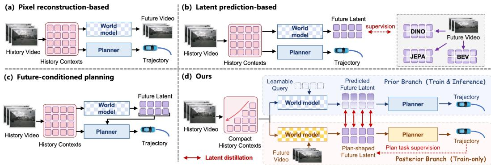  
Figure 1: Four future-modeling paradigms in driving World Action Models (WAMs). (a) Pixel reconstruction. (b) Latent prediction. (c) Future-conditioned planning. (d) PlanWAM (ours).

We reformulate future modeling in end-to-end driving as a planning-oriented predictive representation learning problem: a world model must not only predict the future, but also learn which future information is worth predicting. For autonomous driving, an effective representation need not fully retain historical observations or reconstruct the future scene, but should focus on informa tion relevant to trajectory planning. The history representation should capture dynamic cues from multi-frame, multi-view observations that are essential for future reasoning and planning, while the future representation should be shaped directly by trajectory planning objectives to prioritize decision-relevant future information. Furthermore, a future representation intended for planning should be predictable from historical observations and serve as foresight for trajectory planning. From this perspective, we unify historical modeling, future prediction, and trajectory planning into a planning-shaped predictive representation learning framework, where planning defines what future information matters, future prediction guides which historical information is retained, and the resulting future representation in turn improves planning.

Building on this perspective, we propose PlanWAM, a Planning-Shaped World Action Model, as illustrated in Fig. 1(d). First, we compress multi-frame, multi-view historical observations in a recency-aware manner and learn a compact history representation under joint future-prediction and planning supervision, preserving key dynamic cues for future reasoning. We then introduce a training-only privileged future posterior branch that leverages ground-truth future observations to construct a future latent representation, whose representation space is shaped by trajectory planning objectives to obtain a planning-shaped future latent representation. Since future observations are unavailable at deployment, Hindsight-to-Foresight Distillation trains a prior branch conditioned only on history to predict this representation, thereby converting privileged hindsight during training into deployable foresight at inference time. The predicted future representation is fused with the history representation as a foresight planning context to guide trajectory generation and selection, enabling Foresight-Conditioned Planning. Our main contributions are as follows:

• We reformulate future modeling in end-to-end driving as a planning-oriented predictive representation learning problem, where the future representation is shaped directly by trajectory planning objectives rather than predefined reconstruction or generic prediction objectives, so that it preferentially encodes decision-relevant future information.

• We propose PlanWAM, which extracts a compact history representation for future reasoning, learns planning-shaped future latents from ground-truth future observations and planning objectives, and uses Hindsight-to-Foresight Distillation to predict this representation from history as foresight for trajectory generation and selection.

• PlanWAM achieves 93.8 PDMS / 90.9 EPDMS on NAVSIM-v1/v2 navtest and 38.7 HD-Score in zero-shot closed-loop evaluation on HUGSIM. Further analyses show that planning-shaped future representations improve trajectory generation and selection while reducing safety-critical failures, including collisions and low-TTC events.

## 2 RELATED WORK

## 2.1 END-TO-END AUTONOMOUS DRIVING

End-to-end autonomous driving uses a unified model to plan future trajectories directly from raw sensor observations, thereby reducing information loss and cascading errors in traditional modular systems. Early methods, such as UniAD Hu et al. (2023), VAD Jiang et al. (2023), SparseDrive Sun et al. (2025), and TransFuser Chitta et al. (2023), used structured scene representations and multi task learning to jointly model perception, prediction, and planning. Subsequent methods, such as iPad Guo et al. (2026), DrivoR Kirby et al. (2026), DiffusionDrive Liao et al. (2025), and GoalFlow Xing et al. (2025), adopt multimodal and generative trajectory planning to capture diverse and uncertain driving behaviors. More recent methods, such as ReCogDrive Li et al. (2026c), AutoVLA Zhou et al. (2025b), Orion Fu et al. (2025), and Qwen-Drive-1.0 Zhou et al. (2026b), introduce vision-language and vision-language-action models to strengthen semantic understanding and reasoning. Although these methods keep improving scene representation and trajectory planning, they still decide mainly from current or historical observations and make limited use of future scene evolution. In contrast, PlanWAM uses a world model to predict a future representation usefu for planning, and guides trajectory generation and evaluation with that foresight.

## 2.2 WORLD MODELS FOR AUTONOMOUS DRIVING

World models provide foresight for end-to-end driving by modeling how the scene evolves over time and under vehicle behavior. Existing driving world models fall into two lines. One line, such as DriveDreamer Wang et al. (2024a), Drive-WM Wang et al. (2024b), Vista Gao et al. (2024), Epona Zhang et al. (2025), and PWM Zhao et al. (2025), focuses on generating and simulating the future real world. These methods learn traffic evolution by predicting images, videos, or structured scene states such as BEV, and mainly study generation quality, temporal consistency, action controllability, and long-horizon prediction. The other line, such as LAW Li et al. (2025a), Latent-WAM Wang et al. (2026b), World4Drive Zheng et al. (2025), DriveFuture Hong et al. (2026), and WorldDrive Gui et al. (2026), focuses on the role of world modeling in the driving task itself, learning dynamic scene representations by predicting future features or latent states and further assisting or directly participating in trajectory planning. These studies show that future modeling can provide a useful dynamic prior for end-to-end driving. Existing work, however, mainly studies how to predict future features more effectively and how future information is used, and less often asks, from the planning objective itself, what the future representation should encode. In contrast, PlanWAM studies which future representation is most useful for planning and shapes the future latent representation directly with planning objectives, so that the latent preferentially extracts the key future information relevant to planning decisions.

## 3 METHOD

## 3.1 PROBLEM FORMULATION AND FRAMEWORK OVERVIEW

Let $v _ { t - n : t }$ denote the historical multi-view camera observations, $c _ { t - n : t }$ the corresponding ego states and navigation information, and $\tau _ { 1 : T }$ the future ego trajectory to be planned. A conventional endto-end planner directly models:

$$
p ( \tau _ { 1 : T } \mid v _ { t - n : t } , c _ { t - n : t } ) .
$$

To use future scene evolution explicitly, future-conditioned WAMs (Fig. 1(c)) introduce a futurestate representation $z _ { t } ^ { + }$ between historical observations and trajectory planning, and factorize the

process as:

$$
p ( \tau _ { 1 : T } , z _ { t } ^ { + } \mid v _ { t - n : t } , c _ { t - n : t } ) = p ( z _ { t } ^ { + } \mid v _ { t - n : t } , c _ { t - n : t } ) p ( \tau _ { 1 : T } \mid v _ { t - n : t } , c _ { t - n : t } , z _ { t } ^ { + } ) .\tag{1}
$$

This factorization lets future information participate in planning, but it also raises a key question: how should $z _ { t } ^ { + }$ be defined and constructed so that it is more beneficial for trajectory planning? Existing methods typically define the future representation by pixel reconstruction or image latent prediction, such as DINO, JEPA, or BEV feature, but such a representation is not necessarily the most useful for planning. To this end, we propose PlanWAM, as illustrated in Fig. 2.

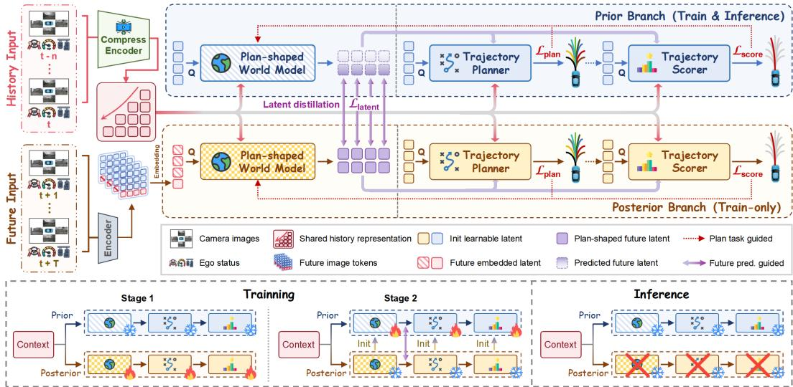  
Figure 2: Overview of PlanWAM. Historical multi-view observations are compressed into a compact representation for future reasoning. The privileged posterior branch uses ground-truth future observations and planning objectives to learn planning-shaped future latents, which are distilled into a prior branch conditioned only on history. The predicted future latents then serve as foresight for trajectory generation and selection. The posterior is training-only; inference uses only the prior.

We first use a history compression module $E _ { \eta }$ to compress multi-frame, multi-view historical observations in a recency-aware manner, yielding a compact history representation:

$$
h _ { t } = E _ { \eta } ( v _ { t - n : t } , c _ { t - n : t } ) .\tag{2}
$$

During training, we further introduce a privileged posterior branch $P _ { \phi } .$ , hereafter referred to as the posterior, which accesses ground-truth future observations and constructs a future latent representation:

$$
z _ { t } ^ { + } = P _ { \phi } \big ( h _ { t } , v _ { t + 1 : t + T } , c _ { t + 1 : t + T } \big ) .\tag{3}
$$

Rather than supervising $z _ { t } ^ { + }$ with pixel-level reconstruction or image-latent prediction objectives, we directly condition trajectory generation and selection on $z _ { t } ^ { + }$ :

$$
\tau _ { 1 : T } \sim \pi _ { \phi } ( h _ { t } , z _ { t } ^ { + } ) .\tag{4}
$$

The future latent space is therefore shaped jointly by the trajectory generation and trajectory selection, so that $z _ { t } ^ { + }$ preferentially encodes future information that affects planning. We refer to this representation as a planning-shapedfuture representation.

However, the future observations $v _ { t + 1 : t + T }$ and $c _ { t + 1 : t + T }$ are unavailable at deployment. PlanWAM therefore learns a prior branch $P _ { \theta }$ , hereafter referred to as the prior, which depends only on the history representation and is trained by Hindsight-to-Foresight Distillation to predict $z _ { t } ^ { + }$ :

$$
\hat { z } _ { t } ^ { + } = P _ { \theta } ( h _ { t } ) , \qquad \hat { z } _ { t } ^ { + } \approx z _ { t } ^ { + } .\tag{5}
$$

The predicted planning-shaped future representation $\hat { z } _ { t } ^ { + }$ is fused with the compact history representation $h _ { t }$ as a foresight planning context to guide trajectory generation and selection:

$$
\tau _ { 1 : T } \sim \pi _ { \theta } ( h _ { t } , \hat { z } _ { t } ^ { + } ) .\tag{6}
$$

At inference, the planning process of PlanWAM can be expressed as:

$$
p ( \tau _ { 1 : T } , \hat { z } _ { t } ^ { + } \mid v _ { t - n : t } , c _ { t - n : t } ) = p _ { \theta } ( \hat { z } _ { t } ^ { + } \mid h _ { t } ) p _ { \theta } ( \tau _ { 1 : T } \mid h _ { t } , \hat { z } _ { t } ^ { + } ) .\tag{7}
$$

## 3.2 RECENCY-AWARE HISTORY REPRESENTATION

Multi-frame, multi-view historical observations contain substantial temporal redundancy, and information from different temporal ranges has different value for planning. To this end, we propose a Temporal Register Pyramid that compresses historical scene registers level by level in a recencyaware manner, retaining, under a limited token budget, the dynamic information relevant to future reasoning and trajectory planning, as illustrated in Fig. 3.

Given the historical observations $v _ { t - n : t }$ and ego context $c _ { t - n : t } ,$ a shared visual encoder maps the k-th camera observation $v _ { i } ^ { k }$ at time i to visual tokens and further extracts scene registers $r _ { i } ^ { k }$ ; the ego state and navigation information $c _ { i }$ are encoded by an MLP into an ego feature $e _ { i } { : }$

$$
\begin{array} { r } { x _ { i } ^ { k } = F _ { \mathrm { v i s } } ( v _ { i } ^ { k } ) , \qquad r _ { i } ^ { k } = F _ { \mathrm { r e g } } ( x _ { i } ^ { k } ) , \qquad e _ { i } = F _ { \mathrm { e g o } } ( c _ { i } ) . } \end{array}\tag{8}
$$

We partition the history into $L$ temporal levels $\{ \mathcal { G } _ { l } \} _ { l = 1 } ^ { L }$ according to temporal distance, and assign different query budgets: recent levels use more learnable queries, whereas more distant history is compressed more strongly. For the l-th level, the queries $Q ^ { ( l ) }$ are fused with the ego feature as well as time, camera, and compression-level embeddings; the scene registers at the current time are aggregated into a shared current-scene context $\bar { r } _ { t } \mathrm { : }$

$$
\tilde { Q } ^ { ( l ) } = Q ^ { ( l ) } + E _ { \mathrm { t i m e } } ^ { ( l ) } + E _ { \mathrm { c a m } } ^ { ( l ) } + E _ { \mathrm { l e v e l } } ^ { ( l ) } + E _ { \mathrm { e g o } } ^ { ( l ) } + \bar { r } _ { t } .\tag{9}
$$

We then apply a Q-Former (Li et al., 2023) to perform compression of the historical information, using $\tilde { Q } ^ { ( l ) }$ as $Q$ and the scene registers $R ^ { ( l ) }$ of the corresponding level as $K$ and $V { : }$

$$
\begin{array} { r } { h _ { t } ^ { ( l ) } = \operatorname { Q F o r m e r } \bigl ( Q = \tilde { Q } ^ { ( l ) } , K = R ^ { ( l ) } , V = R ^ { ( l ) } \bigr ) , \qquad R ^ { ( l ) } = \operatorname { C o n c a t } _ { i \in \mathcal { G } _ { l } , k } r _ { i } ^ { k } . } \end{array}\tag{10}
$$

The compressed tokens from all levels constitute the compact history representation $h _ { t }$ . We do not use an additional historical reconstruction objective; instead, $h _ { t }$ is jointly optimized by the subsequent future-latent distillation objective $\mathcal { L } _ { \mathrm { l a t e n t } }$ and the trajectory-planning objective $\dot { \mathcal { L } } _ { \mathrm { t a s k } }$ , so that it focuses on the information required for future prediction and trajectory planning.

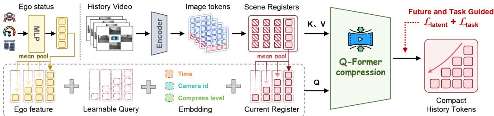  
Figure 3: Temporal Register Pyramid for Recency-Aware History Representation.

## 3.3 PLANNING-SHAPED FUTURE REPRESENTATION

Given the compact history representation $h _ { t }$ from Sec. 3.2, we construct a privileged posterior during training using future observations. For the future observations $v _ { t + 1 : t + T }$ , a shared visual encoder extracts scene registers $r _ { i } ^ { k }$ for each time and camera in the same way as for historical observations, and adds the corresponding future-time embedding $E _ { \mathrm { t i m e } } ^ { \mathrm { f u t } }$ to form future queries:

$$
f _ { t } ^ { + } = \operatorname { C o n c a t } _ { i , k } \big [ r _ { i } ^ { k } + E _ { \mathrm { t i m e } } ^ { \mathrm { f u t } } ( i - t ) \big ] , \qquad i \in \{ t + 1 , \ldots , t + T \} .\tag{11}
$$

Rather than using randomly initialized learnable queries, the privileged posterior $P _ { \phi }$ takes $f _ { t } ^ { + }$ formed from ground-truth future scene registers directly as queries, and uses the history representation $h _ { t }$ as context. The posterior world model $\mathrm { W M } _ { \phi } ^ { \mathrm { p o s t } }$ aggregates historical evidence and ground-truth future information to obtain the posterior future latent $z _ { t } ^ { + }$

$$
z _ { t } ^ { + } = P _ { \phi } ( h _ { t } , f _ { t } ^ { + } ) = \mathrm { W M } _ { \phi } ^ { \mathrm { p o s t } } \big ( Q = f _ { t } ^ { + } , K = h _ { t } , V = h _ { t } \big ) .\tag{12}
$$

We do not apply an additional generic reconstruction objective to the future latent $z _ { t } ^ { + }$ . Instead, we concatenate $z _ { t } ^ { + }$ with the history representation $h _ { t }$ to form a posterior planning context $m _ { t } ^ { + }$ , adding

type embeddings before concatenation to distinguish historical evidence from future context. The resulting $m _ { t } ^ { + }$ is used for both trajectory planner and trajectory scorer:

$$
m _ { t } ^ { + } = \mathrm { C o n c a t } \big ( h _ { t } + E _ { \mathrm { t y p e } } ^ { \mathrm { h i s t } } , z _ { t } ^ { + } + E _ { \mathrm { t y p e } } ^ { \mathrm { f u t } } \big ) , \quad \tau _ { \mathrm { 1 : } T } ^ { + } = G _ { \mathrm { p l a n } } ( m _ { t } ^ { + } ) , \quad s ^ { + } = G _ { \mathrm { s c o r e } } \big ( \tau _ { \mathrm { 1 : } T } ^ { + } , m _ { t } ^ { + } \big ) .\tag{13}
$$

The posterior is supervised by the trajectory generation and trajectory selection objectives:

$$
\mathcal { L } _ { \mathrm { p o s t } } = \mathcal { L } _ { \mathrm { p l a n } } + \mathcal { L } _ { \mathrm { s c o r e } } .\tag{14}
$$

The planning losses can therefore back-propagate through the planner and the scorer to shape $z _ { t } ^ { + }$ directly. The limited future latent capacity thus preferentially retains future scene information that affects trajectory generation and selection. We refer to this $\dot { z } _ { t } ^ { + }$ as a planning-shaped future representation. The next section uses it as a privileged target to train a history-only prior.

## 3.4 HINDSIGHT-TO-FORESIGHT PREDICTION AND PLANNING

The planning-shaped future representation $z _ { t } ^ { + }$ in Sec. 3.3 relies on future observations and is therefore unavailable at deployment. We thus construct a prior $P _ { \theta }$ conditioned solely on the history representation $h _ { t }$ to predict it. Unlike the posterior, which directly uses ground-truth future scene registers as queries, the prior uses learnable future queries $Q ^ { \mathrm { p r i o r } }$ . To establish a consistent tokenwise correspondence between the prior and posterior latents, we arrange the prior queries in the same order over future times, camera views, and register slots, and augment them with the corresponding structured embeddings:

$$
Q _ { i , k , j } ^ { \mathrm { p r i o r } } = Q _ { 0 , i , k , j } ^ { \mathrm { p r i o r } } + E _ { \mathrm { t i m e } } ^ { \mathrm { f u t } } ( i - t ) + E _ { \mathrm { c a m } } ( k ) + E _ { \mathrm { s l o t } } ( j ) , \qquad i \in \{ t + 1 , \dots , t + T \} .\tag{15}
$$

where $i ,$ k, and $j$ index the future time, camera view, and scene-register slot, respectively. The prior world model $\mathrm { W M } _ { \theta } ^ { \mathrm { p r i o r } }$ then predicts the planning-shaped future representation $\hat { z } _ { t } ^ { + }$ from $h _ { t }$ alone:

$$
\hat { z } _ { t } ^ { + } = P _ { \theta } ( h _ { t } ) = \mathrm { W M } _ { \theta } ^ { \mathrm { p r i o r } } \big ( Q = Q ^ { \mathrm { p r i o r } } , K = h _ { t } , V = h _ { t } \big ) .\tag{16}
$$

To transfer the future information captured by the privileged posterior to the prior, we propose Hindsight-to-Foresight Distillation, which directly aligns the prior prediction $\hat { z } _ { t } ^ { + }$ with the posterior target $z _ { t } ^ { + }$ . Through this alignment, the prior learns to infer from historical dynamics the planningshaped representation that the posterior derives from ground-truth future observations, thereby distilling privileged hindsight into foresight:

$$
\mathcal { L } _ { \mathrm { l a t e n t } } = \frac { 1 } { N _ { z } d } \big \| \hat { z } _ { t } ^ { + } - \mathrm { s g } ( z _ { t } ^ { + } ) \big \| _ { F } ^ { 2 } .\tag{17}
$$

where $\operatorname { s g } ( \cdot )$ denotes stop-gradient, $\| \cdot \| _ { F }$ denotes the Frobenius norm, and $N _ { z }$ and $d$ denote the number of tokens in the future latent and the feature dimension of each token, respectively. After adding the corresponding type embeddings, we concatenate the predicted $\hat { z } _ { t } ^ { + }$ with the history representation $h _ { t }$ to form a prior planning context. This context is provided to both the trajectory planner and scorer, yielding the following Foresight-Conditioned Planning formulation:

$$
m _ { t } ^ { - } = \mathrm { C o n c a t } \big ( h _ { t } + E _ { \mathrm { t y p e } } ^ { \mathrm { h i s t } } , \hat { z } _ { t } ^ { + } + E _ { \mathrm { t y p e } } ^ { \mathrm { f u t } } \big ) , \quad \tau _ { 1 : T } = G _ { \mathrm { p l a n } } ( m _ { t } ^ { - } ) , \quad s = G _ { \mathrm { s c o r e } } \big ( \tau _ { 1 : T } , m _ { t } ^ { - } \big ) .\tag{18}
$$

## 3.5 TRAINING AND INFERENCE

Training. PlanWAM is trained in two stages. The first stage optimizes only the privileged posterior, which learns the planning-shaped future representation from ground-truth future observations under trajectory generation, trajectory selection, and lightweight regularization objectives:

$$
\mathcal { L } _ { \mathrm { t a s k } } = \mathcal { L } _ { \mathrm { p l a n } } + \mathcal { L } _ { \mathrm { s c o r e } } + \lambda _ { \mathrm { r e g } } \mathcal { L } _ { \mathrm { r e g } } .\tag{19}
$$

where $\mathcal { L } _ { \mathrm { r e g } }$ includes diversity regularization to mitigate latent anti-collapse. In the second stage, we freeze the posterior and use its checkpoint to initialize structurally compatible parameters in the prior. We then fine-tune the prior with a lower learning rate using the objective:

$$
\mathcal { L } _ { \mathrm { t r a i n } } = \mathcal { L } _ { \mathrm { t a s k } } + \lambda _ { \mathrm { l a t e n t } } \mathcal { L } _ { \mathrm { l a t e n t } } .\tag{20}
$$

Inference. At inference, we remove the privileged posterior and retain only the prior. Historical observations are first encoded into $h _ { t }$ , after which the prior predicts the planning-shaped future representation $\hat { z } _ { t } ^ { + }$ . This representation serves as foresight and is combined with $\bar { h } _ { t }$ for trajectory planner and scorer. Consequently, the entire inference process relies solely on observable history.

## 4 EXPERIMENTS

## 4.1 EXPERIMENTAL SETUP

Datasets and benchmarks. We evaluate PlanWAM on NAVSIM-v1 Dauner et al. (2024), NAVSIM-v2 Cao et al. (2025), and HUGSIM Zhou et al. (2026a) to assess both planning performance and closed-loop generalization. Models are trained on NAVSIM navtrain and evaluated on navtest. NAVSIM-v1 follows the official evaluation protocol and uses PDM Score (PDMS) as the primary metric; NAVSIM-v2 uses the Extended PDM Score (EPDMS). We further perform zero-shot closed-loop evaluation on the high-fidelity closed-loop simulator HUGSIM, deploying the trained model directly without HUGSIM-specific fine-tuning, and report HUGSIM Driving Score (HD-Score) and Route Completion (RC) to assess closed-loop driving performance and cross-environment generalization.

Implementation details. PlanWAM takes T=4 historical frames from four cameras (front, left, right, and rear), while the training-only posterior observes future multi-view frames at 1-s intervals over a 4-s horizon. We use a DINOv2 ViT-S backbone with frozen base weights and rank-32 LoRA Hu et al. (2022), extracting 16 scene registers per camera-frame. The Temporal Register Pyramid assigns [4, 4, 8, 16] queries per camera across four temporal levels, producing a 128-token history representation $h _ { t }$ . Four future times, four cameras, and 16 registers per camera yield $N _ { z } { = } 2 5 6$ posterior future-latent tokens. Over the same horizon, the trajectory planner generates K=64 candidate trajectories of 8 waypoints, and the trajectory scorer ranks them for final selection. Both stages use AdamW Loshchilov & Hutter (2019) and are trained on 16 NVIDIA A800 GPUs with a per-GPU batch size of 8. The learning rates for Stages 1 and 2 are $1 \times 1 0 ^ { - 4 }$ and $1 \times 1 0 ^ { - 5 }$ , respectively, and the latent-alignment weight is set to $\lambda _ { \mathrm { l a t e n t } } { = } 0 . 0 5$ . For more details, please refer to the supplementary materials.

## 4.2 MAIN RESULTS

Open-loop Planning on NAVSIM. Tables 1 and 2 report the planning performance on the NAVSIM-v1/v2 navtest benchmarks. PlanWAM achieves 93.8 PDMS on NAVSIM-v1, outperforming all learned methods compared and improving the DrivoR baseline by 0.7 points; compared with the strongest prior world-model-based planner, DriveFuture, the gain reaches 3.1 points. On the more challenging NAVSIM-v2 benchmark, PlanWAM further achieves 90.9 EPDMS, exceeding the previous strongest learned result by 1.0 point and the reported Human Agent baseline by 0.6 points. PlanWAM also obtains the best learned NC of 99.0 and TTC of 98.5, with stable gains on safety-related planning metrics. These results show that planning-shaped future representation provide effective foresight for trajectory planning on both NAVSIM benchmarks.

Table 1: Performance on the NAVSIM-v2 navtest benchmark. The best learned result in each column is shown in bold.
<table><tr><td>Method</td><td>Reference</td><td>NC↑</td><td>DAC↑</td><td>DDC↑</td><td>TLC↑</td><td>EP↑</td><td>TTC↑</td><td>LK↑</td><td>HC↑</td><td>EC↑</td><td>EPDMS↑</td></tr><tr><td>Human Agent</td><td></td><td>100.0</td><td>100.0</td><td>99.8</td><td>100.0</td><td>87.4</td><td>100.0</td><td>100.0</td><td>98.1</td><td>90.1</td><td>90.3</td></tr><tr><td colspan="10">E2E-based planners</td><td></td><td></td><td></td></tr><tr><td>TransFuser Chitta et al. (2023)</td><td>TPAMI&#x27;23</td><td>96.9</td><td>89.9</td><td>97.8</td><td>99.7</td><td>87.1</td><td>95.4</td><td>92.7</td><td>98.3</td><td>87.2</td><td>76.7</td></tr><tr><td>DiffusionDrive Liao et al. (2025) MeanFuser Wang et al. (2026a)</td><td>CVPR&#x27;25 CVPR&#x27;26</td><td>98.2 98.3</td><td>95.9 97.2</td><td>99.4 99.6</td><td>99.8 99.8</td><td>87.5 87.6</td><td>97.3 97.4</td><td>96.8 97.3</td><td>98.3 98.3</td><td>87.7 88.2</td><td>84.5 89.5</td></tr><tr><td colspan="10">VLM-based planners</td><td></td></tr><tr><td>ReCogDrive Li et al. (2026c)</td><td>ICLR&#x27;26</td><td>98.3</td><td>95.2</td><td>99.5</td><td>99.8</td><td>87.1</td><td>97.5</td><td>96.6</td><td>98.3</td><td>86.5</td><td>83.6</td></tr><tr><td colspan="10"></td><td></td></tr><tr><td>SGDrive Li et al. (2026a) ExploreVLA Sheng et al. (2026)</td><td>CVPR&#x27;26</td><td>98.6</td><td>94.3</td><td>99.5</td><td>99.9</td><td>86.0</td><td>97.9</td><td>96.1</td><td>98.3</td><td>85.9</td><td>86.2</td></tr><tr><td></td><td>ECCV&#x27;26</td><td>98.8</td><td>96.2</td><td>99.6</td><td>99.8</td><td>87.1</td><td>98.2</td><td>97.8</td><td>98.3</td><td>86.8</td><td>88.8</td></tr><tr><td colspan="10">World-model-based planners</td></tr><tr><td>DriveVLA-W0 Li et al. (2026b)</td><td>ICLR&#x27;26</td><td>98.5</td><td>99.1</td><td>98.0</td><td>99.7</td><td>86.4</td><td>98.1</td><td>93.2</td><td>97.9</td><td>58.9</td><td>86.1</td></tr><tr><td>DriveLaW Xia et al. (2026)</td><td>CVPR&#x27;26</td><td>98.7</td><td>96.9</td><td>99.6</td><td>99.8</td><td>87.5</td><td>98.3</td><td>97.6</td><td>98.4</td><td>77.4</td><td>88.6</td></tr><tr><td>DreamerAD Yang et àl. (2026)</td><td>ECCV&#x27;26</td><td>98.0</td><td>97.2</td><td>99.5</td><td>99.8</td><td>87.8</td><td>97.4</td><td>97.5</td><td>98.3</td><td>72.4</td><td>87.7</td></tr><tr><td>Latent-WAM Wang et al. (2026b)</td><td>arXiv&#x27;26</td><td>98.1</td><td>97.3</td><td>99.6</td><td>99.8</td><td>87.7</td><td>97.3</td><td>97.6</td><td>98.1</td><td>87.3</td><td>89.3</td></tr><tr><td>DriveFuture Hong et al. (2026)</td><td>arXiv&#x27;26</td><td>98.8</td><td>99.1</td><td>99.6</td><td>99.9</td><td>86.6</td><td>98.4</td><td>96.4</td><td>98.3</td><td>74.8</td><td>89.9</td></tr><tr><td>PlanWAM (ours)</td><td></td><td>99.0</td><td>99.2</td><td>99.8</td><td>99.6</td><td>90.8</td><td>98.5</td><td>96.5</td><td>98.1</td><td>70.5</td><td>90.9</td></tr></table>

Zero-shot Closed-loop Generalization on HUGSIM. Table 3 reports zero-shot closed-loop results on HUGSIM without simulator-specific fine-tuning. PlanWAM achieves 53.7 average RC and 38.7 HD-Score, outperforming the strongest baselines by 7.8 and 9.8 points, respectively. The gains remain pronounced on the Hard / Extreme subsets, where PlanWAM reaches 51.9 / 37.2 RC and

35.6 / 22.0 HD-Score, respectively. These results demonstrate strong zero-shot closed-loop generalization across varying scenario difficulty.

Table 2: Performance on the NAVSIM-v1 navtest benchmark.
<table><tr><td>Method</td><td>NC↑ DAC↑ TTC↑</td><td></td><td>C↑ EP↑PDMS↑</td><td></td></tr><tr><td>Human Agent</td><td>100 100</td><td>100</td><td>99.9 87.5</td><td>94.8</td></tr><tr><td colspan="5">E2E-based planners</td></tr><tr><td>DiffusionDrive Liao et al. (2025)</td><td>98.2 96.2</td><td>94.7</td><td>100 82.2</td><td>88.1</td></tr><tr><td>MeanFuser Wang et al. (2026a)</td><td>98.6 97.0</td><td>95.0</td><td>100 82.8</td><td>89.0</td></tr><tr><td>iPad Guo et al. (2026)</td><td>98.6 98.3</td><td>94.9</td><td>100 88.0</td><td>91.7</td></tr><tr><td>DrivoR Kirby et al. (2026)</td><td>98.9 98.3</td><td>96.2</td><td>100 89.1</td><td>93.1</td></tr><tr><td colspan="5">VLM-based planners</td></tr><tr><td>AutoVLA Zhou et al. (2025b)</td><td>98.4 95.6</td><td></td><td>98.0 99.981.9</td><td>89.1</td></tr><tr><td>ReCogDrive Li et al. (2026c)</td><td>97.9 97.3</td><td>94.9</td><td>100 87.3</td><td>90.8</td></tr><tr><td>ExploreVLA Sheng et al. (2026)</td><td>98.8 98.4</td><td>96.5</td><td>99.9 83.5</td><td>90.4</td></tr><tr><td>SGDrive Li et al. (2026a)</td><td>98.6 97.8</td><td>96.2</td><td>100 85.8</td><td>91.1</td></tr><tr><td colspan="5">World-model-based planners</td></tr><tr><td>WoTE Li et al. (2025b)</td><td>98.5 96.8</td><td></td><td>94.9 99.9 81.9</td><td>88.3</td></tr><tr><td>Epona Zhang et al. (2025)</td><td>97.9 95.1</td><td></td><td>93.8 99.9 80.4</td><td>86.2</td></tr><tr><td>DreamerAD Yang et al. (2026)</td><td>98.0 97.2</td><td>94.3</td><td>100 83.1</td><td>88.7</td></tr><tr><td>DriveLaW Xia et al. (2026)</td><td>99.0</td><td>97.1 96.7</td><td>100 81.3</td><td>89.1</td></tr><tr><td>DriveVLA-W0 Li et al. (2026b)</td><td>98.7</td><td>99.1</td><td>95.3 99.3 83.3</td><td>90.2</td></tr><tr><td>DriveFuture Hong et al. (2026)</td><td>98.8 99.1</td><td></td><td>95.4 100 84.2</td><td>90.7</td></tr><tr><td>PlanWAM (ours)</td><td>98.9 98.8</td><td></td><td>96.3 100 91.0</td><td>93.8</td></tr></table>

Table 3: Closed-loop comparison on HUGSIM. E, M, H, and X denote Easy, Medium, Hard, and Extreme.
<table><tr><td>Method</td><td>M</td><td>H</td><td></td><td>X Avg.</td></tr><tr><td>UniAD Hu et al. (2023)</td><td>58.641.2 40.4 26.040.6</td><td></td><td></td><td></td></tr><tr><td>VAD Jiang et al. (2023) LTF Chitta et al. (2023)</td><td>38.7 27.0 25.5 23.0 27.9</td><td></td><td></td><td></td></tr><tr><td>GTRS-Dense Li et al. (2025c)</td><td>68.4 40.7 36.9 25.5 41.4 64.2 50.0 20.7 22.3 38.0</td><td></td><td></td><td></td></tr><tr><td>Latent-WAM Wang et al. (2026b)</td><td>84.242.530.635.545.9</td><td></td><td></td><td></td></tr><tr><td>PlanWAM (ours)</td><td>87.6 48.3 51.9 37.2 53.7</td><td></td><td></td><td></td></tr><tr><td colspan="5">(a) Route Completion</td></tr><tr><td>Method</td><td>E</td><td>H</td><td>X</td><td>Avg.</td></tr><tr><td>UniAD Hu et al. (2023)</td><td>48.7 29.5</td><td>27.3</td><td></td><td>14.3 28.9</td></tr><tr><td>VAD Jiang et al. (2023)</td><td>24.3 9.9</td><td>10.4</td><td>8.2</td><td>12.3</td></tr><tr><td>LTF Chitta et al. (2023)</td><td>52.8 24.619.8</td><td></td><td>8.1</td><td>24.8</td></tr><tr><td>GTRS-Dense Li et al. (2025c)</td><td>55.5 39.0 11.7 14.3 28.6</td><td></td><td></td><td></td></tr><tr><td>Latent-WAM Wang et al. (2026b)</td><td>72.5 24.0 12.2 18.1 28.9</td><td></td><td></td><td></td></tr><tr><td>PlanWAM (ours)</td><td>75.3 32.9 35.6 22.0 38.7</td><td></td><td></td><td></td></tr></table>

Qualitative Planning Results. Fig. 4 presents representative qualitative results on NAVSIM and HUGSIM. On NAVSIM, compared with DrivoR, PlanWAM produces trajectories that better account for surrounding vehicles and avoid unsafe interactions in challenging traffic scenarios. On HUGSIM, the model transfers zero-shot across KITTI-360, PandaSet, nuScenes, and Waymo, while maintaining stable closed-loop planning in diverse traffic conditions. These examples qualitatively support the consistent gains observed in the quantitative evaluation.

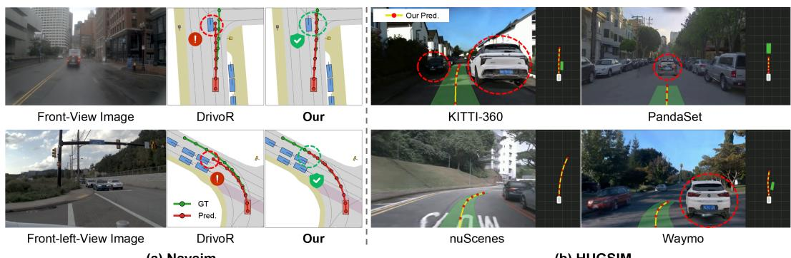  
(a) Navsim  
(b) HUGSIM  
Figure 4: Qualitative planning results. (a) Comparison with DrivoR on representative NAVSIM scenarios. (b) Zero-shot closed-loop rollouts on HUGSIM across different driving domains.

## 4.3 ABLATION STUDIES

We conduct systematic ablations on NAVSIM-v1 navtest to analyze the role of each PlanWAM component. Every run follows the full training procedure and changes only the module under study.

Overall Component Evaluation. We add the three core components in sequence, the Temporal Register Pyramid (TRP), Hindsight-to-Foresight Distillation (H2F), and Foresight-Conditioned Planning (FCP), as reported in Table 4. From the base model, TRP raises PDMS from 93.1 to 93.4, showing that a recency-aware history representation extracts more useful dynamics from multiframe observations. Adding H2F further reaches 93.5, so learning a future latent from privileged future information supplies additional foresight. FCP then uses the predicted future latent as planning context for trajectory generation and selection, and the model reaches 93.8 PDMS.

Table 4: Overall component ablation of PlanWAM.
<table><tr><td>ID</td><td>TRP</td><td>H2F</td><td>FCP</td><td>NC↑</td><td>DAC↑</td><td>TTC↑</td><td>C↑</td><td>EP↑</td><td>PDMS↑</td></tr><tr><td>0</td><td>X</td><td>X</td><td>X</td><td>98.3</td><td>98.9</td><td>94.6</td><td>100</td><td>90.5</td><td>93.1</td></tr><tr><td>1</td><td>√</td><td>X</td><td>X</td><td>98.8</td><td>98.8</td><td>95.3</td><td>100</td><td>90.9</td><td>93.4</td></tr><tr><td>2</td><td>√</td><td>√</td><td>×</td><td>98.6</td><td>98.6</td><td>95.5</td><td>100</td><td>91.5</td><td>93.5</td></tr><tr><td>3</td><td>√</td><td>√</td><td>√</td><td>98.9</td><td>98.8</td><td>96.3</td><td>100</td><td>91.0</td><td>93.8</td></tr></table>

Future Representation Learning and Utilization. Table 5 shows that generic future-feature supervision reaches only 93.5 PDMS, so a generic prediction target does not by itself yield planningrelevant information. Shaping the future latent directly with the trajectory planning objectives raises performance to 93.8 PDMS. Table 6 then varies where the predicted latent is used. Auxiliary supervision or conditioning only trajectory generation brings little gain, whereas using it for trajectory selection reaches 93.7 PDMS. Conditioning both generation and selection attains 93.8 PDMS.

Table 5: Ablation of Future Representation.
<table><tr><td>Future representation</td><td>Supervision</td><td>PDMS↑</td></tr><tr><td>Null future</td><td></td><td>93.4</td></tr><tr><td>Generic future latent</td><td> $\mathcal { L } _ { \mathrm { f e a t u r e } }$ </td><td>93.5</td></tr><tr><td>Planning-shaped latent (ours)</td><td> $\mathcal { L } _ { \mathrm { p l a n } } + \mathcal { L } _ { \mathrm { s c o r e } }$ </td><td>93.8</td></tr></table>

Lfeature: reconstruction of future scene registers.

Table 6: Ablation of Future Latent Usage.
<table><tr><td>Future latent usage</td><td>Generation</td><td>Selection</td><td>PDMS↑</td></tr><tr><td>Auxiliary supervision only</td><td>×</td><td>X</td><td>93.5</td></tr><tr><td>Generation only</td><td>√</td><td>X</td><td>93.5</td></tr><tr><td>Selection only</td><td>X</td><td>√</td><td>93.7</td></tr><tr><td>Generation + Selection</td><td>√</td><td>√</td><td>93.8</td></tr></table>

History Representation Compression and Future Distillation. Table 7 shows that, under the same 128-token budget, the recency-aware allocation [4, 4, 8, 16] reaches 93.8 PDMS, above both the uniform allocation and the reversed allocation. Raising the token count to 256 yields only 93.6 PDMS, so how the queries are allocated matters more than enlarging the representation. Table 8 shows that a prior alone has a latent similarity of 0.22. Adding latent distillation raises it to 0.92 and PDMS to 93.7. With posterior initialization, similarity reaches 0.93 and PDMS 93.8.

Table 7: Ablation of Temporal Allocation.
<table><tr><td>Query allocation</td><td>Tokens</td><td>Latency (ms)↓</td><td>PDMS↑</td></tr><tr><td>[16, 16, 16, 16]</td><td>256</td><td>380</td><td>93.6</td></tr><tr><td>[8,8,8, 8]</td><td>128</td><td>343</td><td>93.4</td></tr><tr><td>[16, 8, 4, 4]</td><td>128</td><td>346</td><td>92.9</td></tr><tr><td>[4, 4, 8, 16]</td><td>128</td><td>342</td><td>93.8</td></tr><tr><td>[2, 4, 8, 16]</td><td>120</td><td>335</td><td>93.6</td></tr></table>

Inference latency on one NVIDIA A800, batch size 1,fp32.

Table 8: Ablation of future latent distillation.
<table><tr><td>Setting</td><td>Posterior init.</td><td> $\mathcal { L } _ { \mathrm { l a t e n t } }$ </td><td>Latent sim.↑ PDMS↑</td><td></td></tr><tr><td>Prior-only</td><td>X</td><td>X</td><td>0.22</td><td>93.4</td></tr><tr><td>+ Posterior init.</td><td>√</td><td>X</td><td>0.46</td><td>93.5</td></tr><tr><td>+ H2F distillation</td><td>×</td><td>√</td><td>0.92</td><td>93.7</td></tr><tr><td>Init. + H2F (ours)</td><td>√</td><td>√</td><td>0.93</td><td>93.8</td></tr><tr><td>Privileged posterior (oracle)</td><td>一</td><td>一</td><td>一</td><td>95.0</td></tr></table>

Latent sim.: mean cosine similarity between $\hat { z } _ { t } ^ { + }$ and $z _ { t } ^ { + }$

## 4.4 ANALYSIS OF FAILURE REDUCTION

To further understand how planning-shaped foresight improves planning performance, we analyze the PDMS= 0 failure cases on NAVSIM-v1 navtest. As shown in Fig. 5(a), safety-related failures decrease markedly after introducing PlanWAM (ID 0 to ID 3). In particular, No at-fault Collision (NC) and Time-to-Collision (TTC) failures drop by 62.3% and 52.4%, indicating that the planningshaped future representation helps the model capture the motion trends of future traffic participants and thereby lowers potential collision risk. Driving Direction Compliance (DDC) failures also drop by 66.7%, further showing that future information improves the modeling of dynamic driving constraints. In contrast, Drivable Area Compliance (DAC) failures show a slight deterioration, indicating that the gains of PlanWAM concentrate on dynamic scene understanding and decision making. As shown in Fig. 5(b), the number of failures falls from 314 to 237, mainly from fewer trajectory select errors (−87). The predicted future latent thus provides effective foresight and improves the reliability of candidate-trajectory evaluation and selection. Proposal quality also improves to some extent, while proposal-collapse issues remain. This analysis indicates that, by learning a planningshaped future representation, PlanWAM provides effective foresight for trajectory evaluation and selection, thereby reducing planning failures caused by insufficient modeling of future evolution.

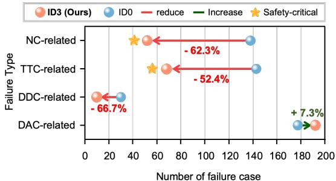  
(a) Failure-Type Comparison

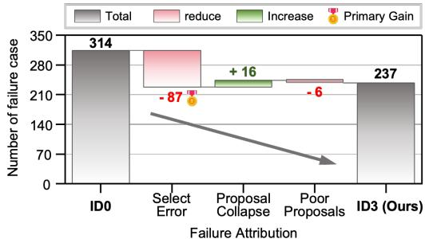  
(b) Attribution of Failure Reduction  
Figure 5: Analysis of failure reduction enabled by planning-shaped foresight. (a) Failure Type Distribution. (b) Attribution of Failure Reduction.

## 5 CONCLUSION

We presented PlanWAM, a planning-shaped world action model that reformulates future modeling in end-to-end autonomous driving as planning-oriented predictive representation learning. By shaping future latent representations with trajectory planning objectives and distilling them from privileged future observations to a history-only prior, PlanWAM learns deployable foresight for trajectory generation and selection. PlanWAM achieves 93.8 PDMS / 90.9 EPDMS on NAVSIM-v1/v2 navtest and 38.7 HD-Score in zero-shot closed-loop HUGSIM evaluation, demonstrating the effectiveness of planning-shaped future representations for end-to-end autonomous driving.

## REPRODUCIBILITY STATEMENT

The method of PlanWAM is specified in Sec. 3, including the Temporal Register Pyramid, the planning-shaped future posterior, Hindsight-to-Foresight Distillation, and the two-stage training and history-only inference procedure. Dataset splits, evaluation protocols, and the main imple mentation settings are given in Sec. 4.1. Appendix A records the architecture and data flow; Appendix B the training objectives, loss weights, and optimization schedule; Appendix C the PDMS, EPDMS, and HUGSIM scoring protocols used for the reported numbers; Appendix D the additional controlled ablations; and Appendix E further qualitative results. All experiments use the public NAVSIM-v1, NAVSIM-v2, and HUGSIM benchmarks. An anonymized repository containing a project overview, visualization videos, supplementary material, and source code is available at https://jinchan9.github.io/PlanWAM\_project\_page.

## AI USE STATEMENT

In this work, we used generative AI tools to aid and polish the writing. This included translation from Chinese notes into English, edits for clarity, grammar, and readability, and formatting of tables and LATEX. Additionally, we used generative AI tools for retrieval and discovery of related work: they searched for and suggested potentially relevant literature, and the authors verified each item before deciding which works to cite. We have not used generative AI tools to draft sections of the manuscript, to design or execute the research, to generate synthetic datasets, or to formulate or prove mathematical claims, and these uses are not applicable to this work. We have reviewed all AI-assisted text. We take responsibility for the final content of this work, including text and claims produced with the aid of generative AI.

## REFERENCES

Holger Caesar, Juraj Kabzan, Kok Seang Tan, Whye Kit Fong, Eric M. Wolff, Alex H. Lang, Luke Fletcher, Oscar Beijbom, and Sammy Omari. nuplan: A closed-loop ml-based planning benchmark for autonomous vehicles. volume abs/2106.11810, 2021. URL https: //arxiv.org/abs/2106.11810.

Wei Cao, Marcel Hallgarten, Tianyu Li, Daniel Dauner, Xunjiang Gu, Caojun Wang, Yakov Miron, Marco Aiello, Hongyang Li, Igor Gilitschenski, Boris Ivanovic, Marco Pavone, Andreas Geiger, and Kashyap Chitta. Pseudo-simulation for autonomous driving. In Proceedings of the 9th Conference on Robot Learning (CoRL), volume 305 of Proceedings of Machine Learning Research, pp. 4709–4722. PMLR, 2025. URL https://proceedings.mlr.press/v305/ cao25a.html.

Kashyap Chitta, Aditya Prakash, Bernhard Jaeger, Zehao Yu, Katrin Renz, and Andreas Geiger. TransFuser: Imitation with transformer-based sensor fusion for autonomous driving. IEEE Transactions on Pattern Analysis and Machine Intelligence, 45(11):12878–12895, 2023. doi: 10.1109/TPAMI.2022.3200245.

Felipe Codevilla, Matthias Muller, Antonio L¨ opez, Vladlen Koltun, and Alexey Dosovitskiy. End-´ to-end driving via conditional imitation learning. In IEEE International Conference on Robotics and Automation (ICRA), 2018.

Daniel Dauner, Marcel Hallgarten, Tianyu Li, Xinshuo Weng, Zhiyu Huang, Zetong Yang, Hongyang Li, Igor Gilitschenski, Boris Ivanovic, Marco Pavone, Andreas Geiger, and Kashyap Chitta. NAVSIM: Data-driven non-reactive autonomous vehicle simulation and benchmarking. In Advances in Neural Information Processing Systems (NeurIPS), 2024.

Haoyu Fu, Diankun Zhang, Zongchuang Zhao, Jianfeng Cui, Dingkang Liang, Chong Zhang, Dingyuan Zhang, Hongwei Xie, Bing Wang, and Xiang Bai. Orion: A holistic end-to-end autonomous driving framework by vision-language instructed action generation. In Proceedings of the IEEE/CVF International Conference on Computer Vision (ICCV), 2025.

Shenyuan Gao, Jiazhi Yang, Li Chen, Kashyap Chitta, Yihang Qiu, Andreas Geiger, Jun Zhang, and Hongyang Li. Vista: A generalizable driving world model with high fidelity and versatile controllability. In Advances in Neural Information Processing Systems (NeurIPS), pp. 91560– 91596, 2024.

Xingtai Gui, Meijie Zhang, Tianyi Yan, Wencheng Han, Jiahao Gong, Feiyang Tan, Cheng-zhong Xu, and Jianbing Shen. Bridging scene generation and planning: Driving with world model via unifying vision and motion representation. arXiv preprint arXiv:2603.14948, 2026.

Ke Guo, Haochen Liu, Xiaojun Wu, Jia Pan, and Chen Lv. iPad: Iterative proposal-centric endto-end autonomous driving. IEEE Robotics and Automation Letters, 11(10):11142–11149, 2026. doi: 10.1109/LRA.2026.3723334.

Yufeng Hong, Xiaotian Zhou, Yingyan Li, Xiangpo Zhou, Lin Liu, Yadan Luo, Shaoqing Xu, Lei Yang, and Ziying Song. DriveFuture: Future-aware latent world models for autonomous driving. arXiv preprint arXiv:2605.09701, 2026.

Edward J Hu, Yelong Shen, Phillip Wallis, Zeyuan Allen-Zhu, Yuanzhi Li, Shean Wang, Lu Wang, and Weizhu Chen. Lora: Low-rank adaptation of large language models. In International Conference on Learning Representations (ICLR), 2022.

Yihan Hu, Jiazhi Yang, Li Chen, Keyu Li, Chonghao Sima, Xizhou Zhu, Siqi Chai, Senyao Du, Tianwei Lin, Wenhai Wang, et al. Planning-oriented autonomous driving. In Proceedings of the IEEE/CVF Conference on Computer Vision and Pattern Recognition (CVPR), 2023.

Bo Jiang, Shaoyu Chen, Qing Xu, Bencheng Liao, Jiajie Chen, Helong Zhou, Qian Zhang, Wenyu Liu, Chang Huang, and Xinggang Wang. Vad: Vectorized scene representation for efficient autonomous driving. In Proceedings of the IEEE/CVF International Conference on Computer Vision (ICCV), 2023.

Ellington Kirby, Alexandre Boulch, Yihong Xu, Yuan Yin, Gilles Puy, Eloi Zablocki, Andrei Bursuc,´ Spyros Gidaris, Renaud Marlet, Florent Bartoccioni, Anh-Quan Cao, Nermin Samet, Tuan-Hung Vu, and Matthieu Cord. Driving on registers. In Proceedings of the IEEE/CVF Conference on Computer Vision and Pattern Recognition (CVPR), 2026.

Jingyu Li, Junjie Wu, Dongnan Hu, Xiangkai Huang, Bin Sun, Zhihui Hao, Xianpeng Lang, Xiatian Zhu, and Li Zhang. Sgdrive: Scene-to-goal hierarchical world cognition for autonomous driving. In Proceedings of the IEEE/CVF Conference on Computer Vision and Pattern Recognition (CVPR), 2026a.

Junnan Li, Dongxu Li, Silvio Savarese, and Steven Hoi. BLIP-2: Bootstrapping language-image pre-training with frozen image encoders and large language models. In Proceedings of the 40th International Conference on Machine Learning, volume 202 of Proceedings ofMachine Learning Research, pp. 19730–19742. PMLR, 2023. URL https://proceedings.mlr.press/ v202/li23q.html.

Yingyan Li, Lue Fan, Jiawei He, Yuqi Wang, Yuntao Chen, Zhaoxiang Zhang, and Tieniu Tan. Enhancing end-to-end autonomous driving with latent world model. In International Conference on Learning Representations (ICLR), 2025a.

Yingyan Li, Yuqi Wang, Yang Liu, Jiawei He, Lue Fan, and Zhaoxiang Zhang. End-to-end driving with online trajectory evaluation via bev world model. In Proceedings of the IEEE/CVF International Conference on Computer Vision (ICCV), 2025b.

Yingyan Li, Shuyao Shang, Weisong Liu, Bing Zhan, Haochen Wang, Yuqi Wang, Yuntao Chen, Xiaoman Wang, Yasong An, Chufeng Tang, et al. Drivevla-w0: World models amplify data scaling law in autonomous driving. In International Conference on Learning Representations (ICLR), 2026b.

Yongkang Li, Kaixin Xiong, Xiangyu Guo, Fang Li, Sixu Yan, Gangwei Xu, Lijun Zhou, Long Chen, Haiyang Sun, Bing Wang, et al. Recogdrive: A reinforced cognitive framework for endto-end autonomous driving. In International Conference on Learning Representations (ICLR), 2026c.

Zhenxin Li, Wenhao Yao, Zi Wang, Xinglong Sun, Joshua Chen, Nadine Chang, Maying Shen, Zuxuan Wu, Shiyi Lan, and Jose M Alvarez. Generalized trajectory scoring for end-to-end multimodal planning. arXiv preprint arXiv:2506.06664, 2025c.

Bencheng Liao, Shaoyu Chen, Haoran Yin, Bo Jiang, Cheng Wang, Sixu Yan, Xinbang Zhang, Xiangyu Li, Ying Zhang, Qian Zhang, et al. Diffusiondrive: Truncated diffusion model for endto-end autonomous driving. In Proceedings of the IEEE/CVF Conference on Computer Vision and Pattern Recognition (CVPR), 2025.

Ilya Loshchilov and Frank Hutter. Decoupled weight decay regularization. In International Conference on Learning Representations (ICLR), 2019.

Zihao Sheng, Xin Ye, Jingru Luo, Sikai Chen, and Liu Ren. Explorevla: Dense world modeling and exploration for end-to-end autonomous driving. In European Conference on Computer Vision (ECCV), pp. 266–284, 2026.

Wenchao Sun, Xuewu Lin, Yining Shi, Chuang Zhang, Haoran Wu, and Sifa Zheng. SparseDrive: End-to-end autonomous driving via sparse scene representation. In IEEE International Conference on Robotics and Automation (ICRA), pp. 8795–8801, 2025. doi: 10.1109/ICRA55743.2025. 11128800.

Junli Wang, Yinan Zheng, Xueyi Liu, Zebin Xing, Pengfei Li, Kun Ma, Hangjun Ye, Guang Chen, Guang Li, Long Chen, Zhongpu Xia, and Qichao Zhang. Meanfuser: Fast one-step multi-modal trajectory generation and adaptive reconstruction via meanflow for end-to-end autonomous driving. In Proceedings of the IEEE/CVF Conference on Computer Vision and Pattern Recognition (CVPR), pp. 17884–17893, June 2026a.

Linbo Wang, Yupeng Zheng, Qiang Chen, Shiwei Li, Yichen Zhang, Zebin Xing, Qichao Zhang, Xiang Li, Deheng Qian, Pengxuan Yang, Yihang Dong, Ce Hao, Xiaoqing Ye, Junyu Han, Yifeng Pan, and Dongbin Zhao. Latent-WAM: Latent world action modeling for end-to-end autonomou driving. arXiv preprint arXiv:2603.24581, 2026b.

Xiaofeng Wang, Zheng Zhu, Guan Huang, Xinze Chen, Jiagang Zhu, and Jiwen Lu. Drivedreamer: Towards real-world-drive world models for autonomous driving. In European Conference on Computer Vision (ECCV), 2024a.

Yuqi Wang, Jiawei He, Lue Fan, Hongxin Li, Yuntao Chen, and Zhaoxiang Zhang. Driving into the future: Multiview visual forecasting and planning with world model for autonomous driving. In Proceedings ofthe IEEE/CVF Conference on Computer Vision and Pattern Recognition (CVPR), pp. 14749–14759, 2024b.

Tianze Xia, Yongkang Li, Lijun Zhou, Jingfeng Yao, Kaixin Xiong, Haiyang Sun, Bing Wang, Kun Ma, Guang Chen, Hangjun Ye, et al. Drivelaw: Unifying planning and video generation in a latent driving world. In Proceedings of the IEEE/CVF Conference on Computer Vision and Pattern Recognition (CVPR), 2026.

Zebin Xing, Xingyu Zhang, Yang Hu, Bo Jiang, Tong He, Qian Zhang, Xiaoxiao Long, and Wei Yin. GoalFlow: Goal-driven flow matching for multimodal trajectories generation in end-toend autonomous driving. In Proceedings of the IEEE/CVF Conference on Computer Vision and Pattern Recognition (CVPR), pp. 1602–1611, 2025.

Pengxuan Yang, Yupeng Zheng, Deheng Qian, Zebin Xing, Qichao Zhang, Linbo Wang, Yichen Zhang, Shaoyu Guo, Zhongpu Xia, Qiang Chen, Junyu Han, Lingyun Xu, Yifeng Pan, and Dongbin Zhao. DreamerAD: Efficient reinforcement learning via latent world model for autonomous driving. In European Conference on Computer Vision (ECCV), 2026.

Kaiwen Zhang, Zhenyu Tang, Xiaotao Hu, Xingang Pan, Xiaoyang Guo, Yuan Liu, Jingwei Huang, Li Yuan, Qian Zhang, Xiao-Xiao Long, et al. Epona: Autoregressive diffusion world model for autonomous driving. In Proceedings of the IEEE/CVF International Conference on Computer Vision (ICCV), 2025.

Zhida Zhao, Talas Fu, Yifan Wang, Lijun Wang, and Huchuan Lu. From forecasting to planning: Policy world model for collaborative state-action prediction. In Advances in Neural Information Processing Systems (NeurIPS), 2025.

Wenzhao Zheng, Weiliang Chen, Yuanhui Huang, Borui Zhang, Yueqi Duan, and Jiwen Lu. Occworld: Learning a 3d occupancy world model for autonomous driving. In European Conference on Computer Vision (ECCV), 2024.

Yupeng Zheng, Pengxuan Yang, Zebin Xing, Qichao Zhang, Yuhang Zheng, Yinfeng Gao, Pengfei Li, Teng Zhang, Zhongpu Xia, Peng Jia, Xianpeng Lang, and Dongbin Zhao. World4Drive: Endto-end autonomous driving via intention-aware physical latent world model. In Proceedings of the IEEE/CVF International Conference on Computer Vision (ICCV), pp. 28632–28642, 2025.

Hongyu Zhou, Longzhong Lin, Jiabao Wang, Yichong Lu, Dongfeng Bai, Bingbing Liu, Yue Wang, Andreas Geiger, and Yiyi Liao. HUGSIM: A real-time, photo-realistic and closed-loop simulator for autonomous driving. IEEE Transactions on Pattern Analysis and Machine Intelligence, 48(4): 4673–4691, 2026a. doi: 10.1109/TPAMI.2025.3647952.

Xin Zhou, Dingkang Liang, Sifan Tu, Xiwu Chen, Yikang Ding, Dingyuan Zhang, Feiyang Tan, Hengshuang Zhao, and Xiang Bai. Hermes: A unified self-driving world model for simultaneous 3d scene understanding and generation. In Proceedings of the IEEE/CVF International Conference on Computer Vision (ICCV), 2025a.

Xin Zhou, Zongchuang Zhao, Zhibo Yang, Mingsheng Li, Humen Zhong, Shuai Bai, Du Chu, Ruizhe Chen, Zhaohai Li, Jun Tang, Qiuyue Wang, Mingkun Yang, Jiazhao Zhang, Dayiheng Liu, Dingkang Liang, and Xiang Bai. Qwen-Drive-1.0: An initial step towards a vision-language foundation model for autonomous driving. arXiv preprint arXiv:2609.00111, 2026b.

Zewei Zhou, Tianhui Cai, Seth Zhao, Yun Zhang, Zhiyu Huang, Bolei Zhou, and Jiaqi Ma. Autovla: A vision-language-action model for end-to-end autonomous driving with adaptive reasoning and reinforcement fine-tuning. In Advances in Neural Information Processing Systems (NeurIPS), 2025b.

## The contents of this appendix are as follows:

• Appendix A gives the data flow and tensor shapes of the three transformers, for checking the implementation.

• Appendix B gives the two-stage optimization and the full set of losses.

• Appendix C gives the metric definitions for NAVSIM-v1/v2 and HUGSIM, including how HD-Score and the HUGSIM average are computed.

• Appendix D gives four additional ablations: posterior registers, future duration, the distillation weight, and which modules are trained.

• Appendix E gives additional visualizations of NAVSIM candidate trajectories and HUGSIM closed-loop rollouts.

## A DETAILED ARCHITECTURE AND DATA FLOW

Fig. 6 shows the three transformers used at inference: the world model predicts the future latent from prior queries and the history context; the planner decodes candidate trajectories from that latent; the scorer selects one trajectory. The posterior queries that can replace the prior queries are used only while constructing the training target.

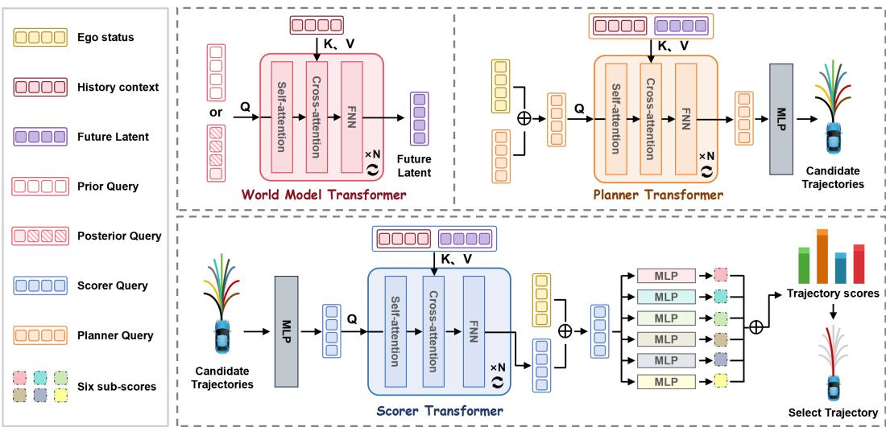  
Figure 6: Detailed transformer architecture and data flow. The world-model transformer takes either posterior queries or prior queries as $Q ,$ and uses the history context as K and $V ,$ , to produce the future latent. The planner transformer uses planner queries as $Q$ and the combined history–latent memory as $K$ and $V ;$ an MLP decodes its outputs into candidate trajectories. The scorer transformer embeds those candidates as $Q ,$ cross-attends to the same memory, adds the ego status, and maps the result through six subscore heads to select one trajectory. Posterior queries are used only during training.

## A.1 TOKEN BOOKKEEPING AND END-TO-END FLOW

The visual backbone extracts 16 scene registers from each camera frame. With four historical frames and four cameras, the uncompressed historical stream contains $4 \times 4 \times 1 6 = 2 5 6$ registers. The Temporal Register Pyramid allocates [4, 4, 8, 16] queries per camera from the oldest to the current temporal level, producing $4 \times { \left( 4 + 4 \dot { + } 8 + 1 6 \right) } ^ { - } = 1 2 8$ history tokens. The posterior observes four future times, {1, 2, 3, 4} seconds, and retains all $4 \times 4 \times 1 6 = 2 5 6$ future slots. The prior uses the same slot layout, so every predicted token has a fixed time–camera–register counterpart in the posterior target. Concatenating history and future tokens gives a 384-token planning memory.

Table 9: Tensor bookkeeping for the reported model. B is batch size, d=256, K=64, and $J { = } 8 .$

<table><tr><td>Quantity</td><td>Construction</td><td>Shape</td></tr><tr><td>Raw history registers</td><td>4 times × 4 cameras × 16 registers</td><td> $B \times 2 5 6 \times d$ </td></tr><tr><td>Compressed history</td><td>temporal allocation [4, 4, 8, 16] per camera</td><td> $B \times 1 2 8 \times d$ </td></tr><tr><td>Posterior queries  $f _ { t } ^ { + }$ </td><td>4 future times × 4 cameras × 16 registers</td><td> $B \times 2 5 6 \times d$ </td></tr><tr><td>Prior queries  $Q ^ { \mathrm { p r i o \bar { r } } }$ </td><td>learned queries with time/camera/slot embeddings</td><td> $B \times 2 5 6 \times d$ </td></tr><tr><td>Planning memory  $m _ { t } ^ { \pm }$ </td><td>history-future concatenation with type embeddings</td><td> $B \times 3 8 4 \times d$ </td></tr><tr><td>Candidate trajectories</td><td>K candidates, J poses  $( x , y , \psi )$ </td><td> $B \times 6 4 \times 8 \times 3$ </td></tr><tr><td>Candidate subscores</td><td>NC, DAC, TTC, EP, DDC, and comfort</td><td> $B \times 6 4 \times 6$ </td></tr></table>

The data flow is consequently

$$
\left( v _ { t - 3 : t } , c _ { t - 3 : t } \right) \xrightarrow { E _ { \eta } } h _ { t } \xrightarrow { P _ { \theta } } \hat { z } _ { t } ^ { + } \xrightarrow { \mathrm { c o n c a t } ( h _ { t } , \hat { z } _ { t } ^ { + } ) } m _ { t } ^ { - } \xrightarrow { G _ { \mathrm { p l a n } } , G _ { \mathrm { s c o r e } } } \tau ^ { * } ,\tag{21}
$$

whereas Stage 1 replaces $P _ { \theta }$ with the privileged posterior $P _ { \phi } ( h _ { t } , f _ { t } ^ { + } )$ and uses the resulting $z _ { t } ^ { + }$ to shape the latent space through planning supervision.

## A.2 WORLD-MODEL TRANSFORMER

As in Fig. 6, the world-model block is shared in structure by the posterior and the prior. Its $Q$ is either the posterior queries, formed from ground-truth future scene registers, or the learnable prior queries. Its K and $\dot { V }$ are the history context. Each of the four pre-normalized blocks applies selfattention on the queries, cross-attention from the queries to the history memory, and a feed-forward network, with a residual connection around every sublayer. The hidden width is $d { = } 2 5 6$ , with four attention heads, an FFN width of 1024, and dropout 0.1. The block output is the future latent. The two branches differ in the query source:

$$
z _ { t } ^ { + } = \mathrm { W M } _ { \phi } ^ { \mathrm { p o s t } } \big ( Q = f _ { t } ^ { + } , K = h _ { t } , V = h _ { t } \big ) ,\tag{22}
$$

$$
\begin{array} { r } { \hat { z } _ { t } ^ { + } = \mathrm { W M } _ { \theta } ^ { \mathrm { p r i o r } } \big ( Q = Q ^ { \mathrm { p r i o r } } , K = h _ { t } , V = h _ { t } \big ) . } \end{array}\tag{23}
$$

The prior queries follow the same future-time, camera, and register-slot order as $f _ { t } ^ { + }$ , so the tokenwise loss in equation 17 compares corresponding tokens. In the reported model, compatible transformer weights are initialized from the Stage 1 posterior checkpoint; the prior query slots remain prior-specific parameters. At inference only the prior queries are used.

## A.3 TRAJECTORY PLANNER

The planner transformer takes planner queries as Q. Its K and V are the planning memory formed from the history context and the future latent, the 384-token concatenation in Table 9. Four decoder blocks refine the $K { = } 6 4$ candidate tokens. Each block has one-head self-attention among the candidates, one-head cross-attention to the memory, and a width-1024 FFN, with hidden width 256, projection dropout 0.1, and stochastic depth 0.2. An MLP (256 → 1024 → 24) then maps each refined token to J=8 poses $( x , y , \psi )$ , giving the candidate trajectories drawn on the right of Fig. 6. The final refinement is passed to the scorer.

## A.4 TRAJECTORY SCORER AND SELECTION

The scorer follows the bottom path of Fig. 6. Candidate trajectories are embedded by an MLP $( 2 4  1 0 2 4  2 5 6 )$ and used as $Q .$ The K and V are the same history–latent memory used by the planner. Four decoder blocks, again with width 256, one attention head, and FFN width 1024, mix the candidate tokens and cross-attend to that memory. The ego-status token is added to every candidate feature. Six MLP heads $( 2 5 6  1 0 2 4  1 )$ then predict NC, DAC, TTC, EP, DDC, and comfort. For NAVSIM-v1 selection, candidate k is ranked by

$$
\log S _ { k } = \log p _ { k } ^ { \mathrm { N C } } + \log p _ { k } ^ { \mathrm { D A C } } + \log \left( 5 p _ { k } ^ { \mathrm { T F C } } + 5 p _ { k } ^ { \mathrm { E P } } + 2 p _ { k } ^ { \mathrm { C } } \right) , \qquad k ^ { \ast } = \arg \operatorname* { m a x } _ { k } \log S _ { k } .\tag{24}
$$

The constant denominator in PDMS does not change the argmax. DDC is supervised, and it has zero weight in this NAVSIM-v1 ranking. The geometry entering the scorer is detached, so the scoring loss updates the scorer without changing the trajectory decoder through that path.

## A.5 ARCHITECTURE SUMMARY

Table 10: Transformer configurations. “Heads” refers to attention heads in each block; all FFNs use GELU unless the output head is explicitly described as an MLP above.
<table><tr><td>Module</td><td>Blocks</td><td>Width</td><td>Heads</td><td>FFN</td><td>Output</td></tr><tr><td>Temporal Register Pyramid</td><td>2</td><td>256</td><td>4</td><td>1024</td><td>128 history tokens</td></tr><tr><td>Posterior world model</td><td>4</td><td>256</td><td>4</td><td>1024</td><td>256 target tokens  $z _ { t } ^ { + }$ </td></tr><tr><td>Prior world model</td><td>4</td><td>256</td><td>4</td><td>1024</td><td>256 predicted tokens  $\hat { z } _ { t } ^ { + }$ </td></tr><tr><td>Trajectory planner</td><td>4</td><td>256</td><td>1</td><td>1024</td><td> $6 4 \times 8 \times 3$  proposals</td></tr><tr><td>Trajectory scorer</td><td>4</td><td>256</td><td>1</td><td>1024</td><td>six scores per proposal</td></tr></table>

## B TRAINING OBJECTIVES AND OPTIMIZATION

## B.1 TWO-STAGE TRAINING PROTOCOL

Table 11 gives the complete training schedule used for the reported model. Stage 1 learns the privileged posterior and the shared planning modules from historical and future observations. Stage 2 loads structurally compatible parameters from Stage 1, keeps a separate posterior teacher frozen in evaluation mode, and optimizes the history-only prior. Future images are consumed only by this frozen teacher; they are neither augmented nor exposed to the student. The teacher output is detached before latent alignment. At test time, the teacher and all future-observation loading are removed.

Table 11: Optimization and implementation settings. Learning rates are kept consistent with Sec. 4.1; all runs use the same camera, token, and trajectory configuration unless an ablation states otherwise.
<table><tr><td>Item</td><td>Setting</td></tr><tr><td>Input images</td><td>four historical frames; front, left, right, rear; 1148 × 672</td></tr><tr><td>Training-only future observations</td><td>{1, 2, 3, 4} s; same four cameras</td></tr><tr><td>Visual encoder</td><td>DINOv2 ViT-S; frozen base; LoRA rank 32</td></tr><tr><td>Planning horizon</td><td>4 s, 8 waypoints at 0.5-s intervals</td></tr><tr><td>Candidate / latent counts</td><td>K=64 trajectories;  $N _ { z } { = } 2 5 6$  latent tokens</td></tr><tr><td>Optimizer and duration</td><td>AdamW; 50 epochs per stage</td></tr><tr><td>Learning-rate schedule</td><td>linear warm-up for first 10% of steps, then cosine decay to zero</td></tr><tr><td>Peak learning rate</td><td>Stage  $1 \colon 1 \times 1 0 ^ { - 4 } ;$  Stage  $2 \colon 1 \times 1 0 ^ { - 5 }$ </td></tr><tr><td>Hardware and batch</td><td>16× NVIDIA A800; 8 samples/GPU; global batch 128</td></tr><tr><td>Regularization weights</td><td> $\lambda _ { \mathrm { n o r m } } = \lambda _ { \mathrm { d i v } } = 1 0 ^ { - 4 }$ </td></tr><tr><td>Latent-alignment weight</td><td> $\lambda _ { \mathrm { l a t e n t } } = 0 . 0 5$ </td></tr></table>

## B.2 TRAJECTORY GENERATION OBJECTIVE

Let $\tau _ { k } \in \mathbb { R } ^ { J \times 3 }$ be candidate $k , \tau ^ { * }$ the demonstrated ego trajectory, and J=8. The planner is trained with a best-of-K regression loss,

$$
\mathcal { L } _ { \mathrm { p l a n } } = \frac { 1 } { B } \sum _ { b = 1 } ^ { B } \operatorname* { m i n } _ { 1 \leq k \leq K } \frac { 1 } { J } \sum _ { j = 1 } ^ { J } \left. \tau _ { b , k , j } - \tau _ { b , j } ^ { * } \right. _ { 1 } .\tag{25}
$$

Thus, only the closest candidate receives direct trajectory-regression supervision for a sample, while the learned candidate tokens and self-attention preserve a multimodal proposal set.

## B.3 TRAJECTORY SCORING OBJECTIVE

Every candidate is evaluated by the official proposal simulator to obtain targets ${ q } _ { b , k , m }$ for

$$
\begin{array} { r } { \mathcal { M } = \{ \mathrm { N C } , \mathrm { D A C } , \mathrm { T T C } , \mathrm { E P } , \mathrm { D D C } , \mathrm { C } \} . } \end{array}
$$

If $^ { a _ { b , k , m } }$ denotes the corresponding predicted logit, the scoring loss is

$$
\mathcal { L } _ { \mathrm { s c o r e } } = \sum _ { m \in \mathcal { M } } \frac { 1 } { B K } \sum _ { b = 1 } ^ { B } \sum _ { k = 1 } ^ { K } \mathrm { B C E W i t h L o g i t s } ( a _ { b , k , m } , q _ { b , k , m } ) .\tag{26}
$$

Targets taking the intermediate value 0.5 for NC or DDC are mapped to the conservative negative class for binary training. Undefined TTC targets are masked rather than treated as negatives. This loss teaches proposal selection directly from planning-quality signals instead of using distance to the demonstrated trajectory as a proxy score.

## B.4 LATENT REGULARIZATION AND HINDSIGHT-TO-FORESIGHT DISTILLATION

For a latent tensor $\boldsymbol { z } \in \mathbb { R } ^ { B \times N _ { z } \times d }$ , we use two lightweight anti-collapse terms:

$$
\mathcal { L } _ { \mathrm { n o r m } } ( z ) = \frac { 1 } { B N _ { z } } \sum _ { b , i } \bigg [ 1 - \frac { \| z _ { b , i } \| _ { 2 } } { \sqrt { d } } \bigg ] _ { + } ^ { 2 } ,\tag{27}
$$

$$
\mathcal { L } _ { \mathrm { d i v } } ( z ) = \frac { 1 } { B N _ { z } ( N _ { z } - 1 ) } \sum _ { b } \sum _ { i \neq j } \left( \frac { z _ { b , i } ^ { \top } z _ { b , j } } { \| z _ { b , i } \| _ { 2 } \| z _ { b , j } \| _ { 2 } } \right) ^ { 2 } .\tag{28}
$$

The first term penalizes vanishing token norms; the second penalizes redundant latent slots. Written without the shorthand in equation 19, the task objective is

$$
{ \mathcal { L } } _ { \mathrm { t a s k } } ( z ) = { \mathcal { L } } _ { \mathrm { p l a n } } + { \mathcal { L } } _ { \mathrm { s c o r e } } + 1 0 ^ { - 4 } { \mathcal { L } } _ { \mathrm { n o r m } } ( z ) + 1 0 ^ { - 4 } { \mathcal { L } } _ { \mathrm { d i v } } ( z ) .\tag{29}
$$

Stage 1 substitutes $z = z _ { t } ^ { + }$ . Stage 2 substitutes $z = \hat { z } _ { t } ^ { + }$ and adds the token-aligned teacher loss

$$
\mathcal { L } _ { \mathrm { S t a g e 2 } } = \mathcal { L } _ { \mathrm { t a s k } } ( \hat { z } _ { t } ^ { + } ) + 0 . 0 5 \underbrace { \frac { 1 } { N _ { z } d } \left. \hat { z } _ { t } ^ { + } - \mathrm { s g } ( z _ { t } ^ { + } ) \right. _ { F } ^ { 2 } } _ { \mathcal { L } _ { \mathrm { l a t e n t } } } .\tag{30}
$$

The latent loss is computed in FP32 even under mixed-precision training. The stop-gradient operation and frozen teacher ensure that Stage 2 improves the causal prior rather than moving the privileged target toward the student.

## C BENCHMARKS AND EVALUATION METRICS

## C.1 BENCHMARK SUMMARY

Table 12: Evaluation benchmarks and their roles. NAVSIM results use the official navtest evaluator; HUGSIM receives the NAVSIM-trained model without simulator-specific adaptation.

<table><tr><td>Benchmark</td><td>Data and protocol</td><td>Reported metrics</td></tr><tr><td>NAVSIM-v1 Dauner et al. (2024) OpenScene/nuPlan-derived real</td><td>driving logs; non-reactive 4-s proposal simulation; train on navtrain (103,288 scenes: 85k train / 18k validation), evaluate on navtest (12,146).</td><td>NC, DAC, TTC, EP, C, PDMS</td></tr><tr><td>NAVSIM-v2 Cao et al. (2025)</td><td>Same split used in this paper, evaluated with the extended official LK, HC, EC, EPDMS proposal scorer and additional rule/smoothness criteria.</td><td>NC, DAC, DDC, TLC, EP, TTC,</td></tr><tr><td>HUGSIM Zhou et al. (2026a)</td><td>Closed-loop rollouts on 436 public RC and HD-Score on Easy, scenarios from nuScenes, KITTI-360, Waymo, and PandaSet; scene-weighted average zero-shot transfer of the NAVSIM-trained model.</td><td>Medium, Hard, Extreme, and the</td></tr></table>

NAVSIM is derived from OpenScene, a compact distribution of nuPlan logs Caesar et al. (2021). It evaluates planned trajectories by rolling the ego vehicle forward while other actors follow recorded trajectories, which makes large-scale evaluation deterministic and non-reactive. HUGSIM complements this protocol with closed-loop observations: the ego action changes the next rendered view and simulated state, and surrounding actors can interact with the rollout. The cross-domain HUGSIM test therefore probes compounding planning errors and distribution shift that are not present in a single NAVSIM proposal rollout.

## C.2 NAVSIM-V1: PDM SCORE

For each proposal, the official Predictive Driver Model scorer returns no-at-fault collision (NC), drivable-area compliance (DAC), time-to-collision (TTC), normalized ego progress (EP), and comfort (C). NC and DAC are multiplicative safety gates, whereas TTC, EP, and C form a weighted quality term:

$$
\mathrm { P D M S } = \mathrm { N C } \cdot \mathrm { D A C } \cdot \frac { 5 \mathrm { T T C } + 5 \mathrm { E P } + 2 \mathrm { C } } { 1 2 } .\tag{31}
$$

NC penalizes at-fault collisions along the simulated ego rollout; DAC checks whether the ego footprint stays inside the drivable area; TTC detects imminent projected collisions; EP measures progress along the route centerline and is normalized within the proposal set; and C checks acceleration, jerk, and yaw-related comfort bounds. Component values and PDMS are first computed per scene and then averaged. Consequently, the aggregate component means in Table 2 need not reproduce the aggregate PDMS exactly when substituted into equation 31.

## C.3 NAVSIM-V2: EXTENDED PDM SCORE

NAVSIM-v2 adds driving-direction compliance (DDC), traffic-light compliance (TLC), lane keeping (LK), history comfort (HC), and extended comfort (EC). DDC and TLC join NC and DAC as multiplicative penalties. LK measures lane-relative stability, HC applies the standard withintrajectory dynamics constraints, and EC measures temporal consistency between consecutive plans. Before aggregation, the reported evaluator applies a human-penalty filter to every subscore. Le $M _ { \mathrm { p e n } } = \mathrm { \bar { \{ N C , D A C , D D C , T L C \} } }$ and $\mathcal { M } _ { \mathrm { a v g } } = \{ \mathrm { E P } , \mathrm { T T C } , \mathrm { \bar { L } K } , \mathrm { \bar { H } C } , \mathrm { E C } \}$ , with $w _ { \mathrm { E P } } = w _ { \mathrm { T T C } } =$ 5 and $w _ { \mathrm { L K } } = w _ { \mathrm { H C } } = w _ { \mathrm { E C } } = 2$ . If the human trajectory scores 0 on a subscore, that term is set to 1; otherwise the agent’s score is used:

$$
\begin{array} { r l } & { \mathrm { E P D M S } = \left( \underset { m \in \mathcal { M } _ { \mathrm { p e n } } } { \prod } \mathrm { ~ f l t e r } _ { m } \right) \cdot \frac { \sum _ { m \in \mathcal { M } _ { \mathrm { a v g } } } w _ { m } \mathrm { \# l t e r } _ { m } } { \sum _ { m \in \mathcal { M } _ { \mathrm { a v g } } } w _ { m } } , } \\ & { \mathrm { f l t e r } _ { m } = \left\{ \begin{array} { l l } { 1 } & { \mathrm { i f ~ } m ( \mathrm { h u m a n } ) = 0 , } \\ { m ( \mathrm { a g e n t } ) } & { \mathrm { o t h e r w i s e } . } \end{array} \right. } \end{array}\tag{32}
$$

As for PDMS, the benchmark computes equation 32 at the scene level before averaging; all values in the main tables are displayed on a 0–100 scale.

## C.4 HUGSIM: ROUTE COMPLETION AND HD-SCORE

HUGSIM evaluates closed-loop driving on reconstructed scenes from nuScenes, KITTI-360, Waymo, and PandaSet Zhou et al. (2026a). The public set used here has 436 scenarios, distributed as in Table 13. Easy inserts no extra vehicle. Medium typically inserts one constant-velocity vehicle. Hard uses more obstructive vehicles, including some attackers. Extreme uses attack planners that intercept the predicted ego future, with more inserted vehicles. We deploy the NAVSIM-trained prior directly, without HUGSIM-specific fine-tuning.

Table 13: HUGSIM public scenario split. Counts are the 436 released scenarios.
<table><tr><td>Source</td><td>Scenarios</td><td>E</td><td>M</td><td>H</td><td>X</td></tr><tr><td>nuScenes</td><td>88</td><td>18</td><td>34</td><td>18</td><td>18</td></tr><tr><td>Waymo</td><td>108</td><td>22</td><td>42</td><td>22</td><td>22</td></tr><tr><td>KITTI-360</td><td>113</td><td>25</td><td>36</td><td>26</td><td>26</td></tr><tr><td>PandaSet</td><td>127</td><td>15</td><td>45</td><td>30</td><td>37</td></tr><tr><td>Total</td><td>436</td><td>80</td><td>157</td><td>96</td><td>103</td></tr></table>

Route completion $R _ { c } \in [ 0 , 1 ]$ is the fraction of the prescribed route completed before termination. At each evaluated timestamp t, HUGSIM scores no collision, drivable-area compliance, TTC, and comfort. For an episode of $\bar { T } _ { e }$ timestamps,

$$
\mathrm { H D - S c o r e } = R _ { c } \cdot \frac { 1 } { T _ { e } } \sum _ { t = 1 } ^ { T _ { e } } \left[ \mathrm { N C } _ { t } \mathrm { D A C } _ { t } \frac { 5 \mathrm { T T C } _ { t } + 2 \mathrm { C O M } _ { t } } { 7 } \right] .\tag{33}
$$

The product of NC and DAC keeps an off-road or colliding rollout from being offset by comfort, and $\bar { \boldsymbol { R } } _ { c }$ scales the result by how much of the route is finished. Each difficulty column in Table 3 is the mean of its scenarios, shown on a 0–100 scale. The Avg. column is not $( { \bf \dot { E } } + M + H + X ) / 4 ,$ and it is not an equal average of the four source datasets. It weights the four difficulty means by their scenario counts,

$$
\mathrm { A v g . } = { \frac { 8 0 E + 1 5 7 M + 9 6 H + 1 0 3 X } { 4 3 6 } } ,\tag{34}
$$

which is the mean over all 436 scenarios. Medium contains the most scenarios, so it pulls Avg.   
below the unweighted mean of the four difficulties.

## D ADDITIONAL CONTROLLED ABLATIONS

The ablations below are reported on NAVSIM-v1 navtest. This section first compares how the posterior-only model reads future-register tokens, and those scores are posterior PDMS. It then compares the length of the observed future, the weight on latent distillation, and, finally, the distillation loss together with which modules are updated. Each subsection changes the factor named in its title. The highlighted row is the reported setting.

## D.1 FUTURE REGISTERS IN THE POSTERIOR

Table 14 compares three ways to use the scene-register tokens from the four future frames, on the posterior-only branch. These scores are posterior PDMS, not the deployed prior. Taking the future registers directly as queries is the reported posterior and reaches 95.0. Using the same tokens as keys and values instead drops the score to 94.6. Compressing them with an MLP to 128 tokens and then using those tokens as queries drops it further, to 94.2. The uncompressed future registers are therefore the stronger queries for the privileged posterior.

Table 14: How the posterior uses future-register tokens. Scores are posterior-only PDMS on NAVSIM-v1 navtest.
<table><tr><td>Future-register role</td><td>Tokens</td><td>PDMS↑</td></tr><tr><td>Keys and values</td><td>256</td><td>94.6</td></tr><tr><td>Queries (ours)</td><td>256</td><td>95.0</td></tr><tr><td>MLP compression, then queries</td><td>128</td><td>94.2</td></tr></table>

## D.2 OBSERVED-FUTURE DURATION

Table 15 varies how many future times the model observes. Each future time contributes one frame from each of the four cameras, and each camera-frame keeps 16 scene registers, so one future second is 64 tokens. Using only the 1 s future therefore supplies 64 tokens and reaches 93.5 PDMS. Extending the observation to {1, 2, 3, 4} s raises the latent to 256 tokens and the score to 93.8, which is the reported setting. The gain from the longer horizon shows that the additional future information is useful for planning.

Table 15: Ablation of future duration. Each future second contributes 4 × 16 register tokens. Scores are PDMS on NAVSIM-v1 navtest.
<table><tr><td>Future times</td><td>Tokens</td><td>PDMS↑</td></tr><tr><td>1s</td><td>64</td><td>93.5</td></tr><tr><td> $\{ 1 , 2 , 3 , 4 \} \mathrm { s ( o u r s ) }$ </td><td>256</td><td>93.8</td></tr></table>

## D.3 LATENT-DISTILLATION WEIGHT

Table 16 varies the weight on token-wise latent distillation. With $\lambda _ { \mathrm { l a t e n t } } { = } 0 ,$ the prior is not trained to match the posterior target: latent similarity stays at 0.46 and PDMS is 93.5. A small weight of 0.01 raises similarity to 0.88 and PDMS to 93.6. The reported weight, 0.05, reaches similarity 0.93 and the highest PDMS, 93.8. Increasing the weight further to 0.10 makes the latents still closer, with similarity 0.95, but PDMS falls back to 93.7. Tighter alignment therefore does not by itself produce a better plan. The selected weight is the one at which the planning score peaks.

Table 16: Sensitivity to the latent-distillation weight.
<table><tr><td> $\lambda _ { \mathrm { l a t e n t } }$ </td><td>Latent sim.↑</td><td>PDMS↑</td></tr><tr><td>0</td><td>0.46</td><td>93.5</td></tr><tr><td>0.01</td><td>0.88</td><td>93.6</td></tr><tr><td>0.05 (ours)</td><td>0.93</td><td>93.8</td></tr><tr><td>0.10</td><td>0.95</td><td>93.7</td></tr></table>

## D.4 DISTILLATION LOSS AND TRAINABLE MODULES

Table 17 varies the distillation loss and the set of trainable modules. The first two rows train only the prior world model. The history encoder, planner, scorer, and ViT stay frozen, and the planner and scorer are copied from the posterior-only model. Under $\mathcal { L } _ { \mathrm { l a t e n t } }$ alone, latent similarity is 0.96 and PDMS is 93.0. Adding ${ \mathcal { L } } _ { \mathrm { p l a n } }$ and $\mathcal { L } _ { \mathrm { s c o r e } } .$ , with gradients flowing only into the world model, changes these values to 0.94 and 93.1. Latent alignment alone therefore leaves the planning score low. Whether making the latent still closer would raise PDMS is measured with the modules held fixed, in Table 16: increasing $\lambda _ { \mathrm { l a t e n t } }$ from 0.05 to 0.10 raises similarity from 0.93 to 0.95, while PDMS falls from 93.8 to 93.7. The planning and scoring losses, not a smaller latent gap, determine the planning score.

The last three rows keep $\mathcal { L } _ { \mathrm { l a t e n t } } + \mathcal { L } _ { \mathrm { p l a n } } + \mathcal { L } _ { \mathrm { s c o r e } }$ and train a larger set of modules. With the posterior planner and scorer held fixed, PDMS remains 93.0–93.1. Training the prior world model together with the scorer raises it to 93.4, and training the planner as well raises it to 93.5. Training the remaining modules, with the ViT base frozen and adapted by LoRA, reaches 93.8. Those copied planner and scorer weights were learned for the privileged posterior latent. The prior has to relearn the downstream weights for the latent it predicts.

Table 17: Distillation loss and trainable modules. The first two rows train only the prior world model and freeze every other module, including LoRA. Scores are PDMS on NAVSIM-v1 navtest.
<table><tr><td>Trainable modules</td><td>Loss</td><td>Latent sim.↑</td><td>PDMS↑</td></tr><tr><td>Prior world model only</td><td> $\mathcal { L } _ { \mathrm { l a t e n t } }$ </td><td>0.96</td><td>93.0</td></tr><tr><td>Prior world model only</td><td> $\mathcal { L } _ { \mathrm { l a t e n t } } + \mathcal { L } _ { \mathrm { p l a n } } + \mathcal { L } _ { \mathrm { s c o r e } }$ </td><td>0.94</td><td>93.1</td></tr><tr><td>Prior world model and scorer</td><td> $\mathcal { L } _ { \mathrm { l a t e n t } } + \mathcal { L } _ { \mathrm { p l a n } } + \mathcal { L } _ { \mathrm { s c o r e } }$ </td><td>0.93</td><td>93.4</td></tr><tr><td>Prior world model, scorer, and planner</td><td> $\mathcal { L } _ { \mathrm { l a t e n t } } + \mathcal { L } _ { \mathrm { p l a n } } + \mathcal { L } _ { \mathrm { s c o r e } }$ </td><td>0.93</td><td>93.5</td></tr><tr><td>All except the ViT base (ours)</td><td> $\mathcal { L } _ { \mathrm { l a t e n t } } + \mathcal { L } _ { \mathrm { p l a n } } + \mathcal { L } _ { \mathrm { s c o r e } }$ </td><td>0.93</td><td>93.8</td></tr></table>

## E ADDITIONAL QUALITATIVE RESULTS

We provide two complementary qualitative views. The NAVSIM figures expose the complete candidate set and therefore illustrate generation and selection in a single frame. The HUGSIM figures show consecutive closed-loop observations, revealing whether the selected plan remains stable afte its actions alter the subsequent input. These examples are presented without cherry-picked metric annotations; the quantitative conclusions remain those of Sec. 4.2.

## E.1 NAVSIM CANDIDATE GENERATION AND SELECTION

In Figs. 7–10, each row contains the front-view image, ground-truth trajectory in the BEV scene, and PlanWAM output. Gray curves are all 64 candidates, the red curve is the trajectory selected

by PlanWAM, and the green curve is the recorded trajectory. The cases cover curved roads, turns, intersections, and dense multi-agent traffic.

Front-View Image  
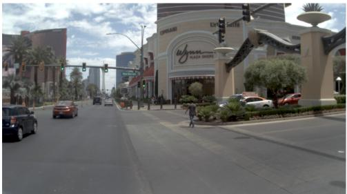

GT Trajectory  
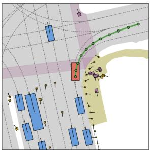

PlanWAM Trajectory  
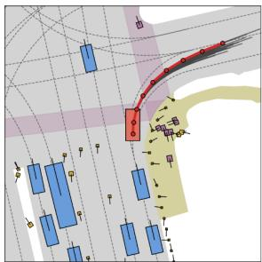

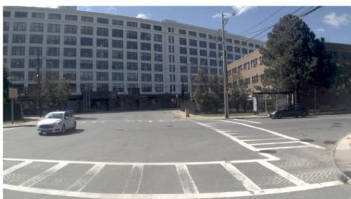

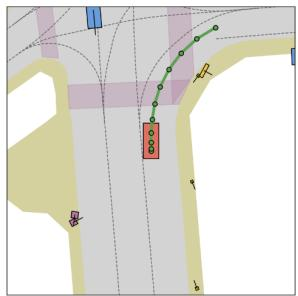

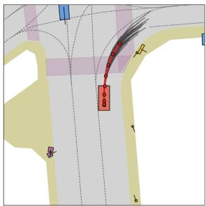

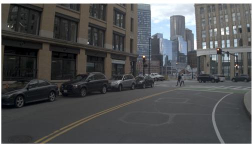  
—O GT Trajectory  
PlanWAM Trajectory

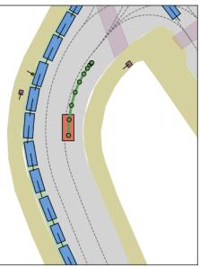

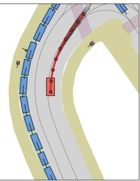  
PlanWAM Candidate Trajectory

Figure 7: Additional NAVSIM results (set 1). Front view, ground-truth trajectory, and PlanWAM candidates.

Front-View Image  
GT Trajectory  
PlanWAM Trajectory  
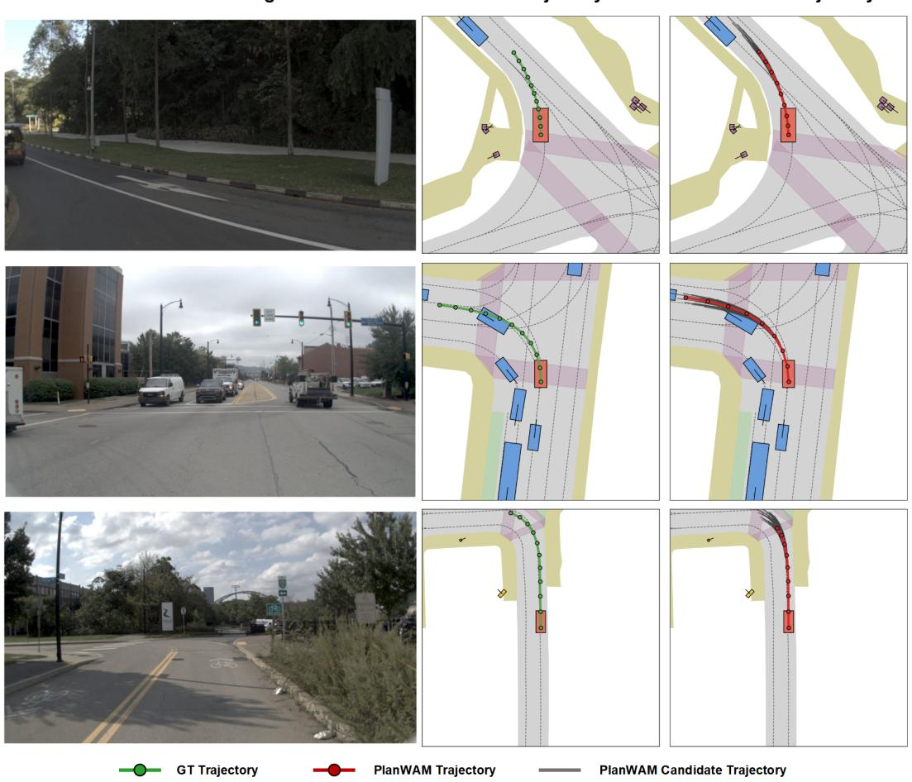  
Figure 8: Additional NAVSIM results (set 2). Curved roads and intersections.

Front-View Image  
GT Trajectory  
PlanWAM Trajectory  
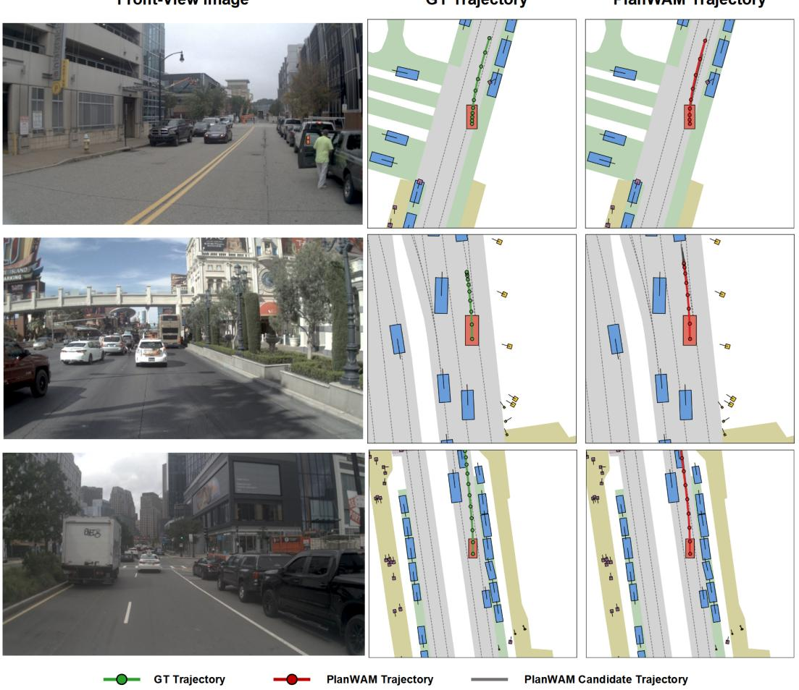  
Figure 9: Additional NAVSIM results (set 3). Urban scenes with parked and moving traffic.

GT Trajectory

PlanWAM Trajectory

Front-View Image  
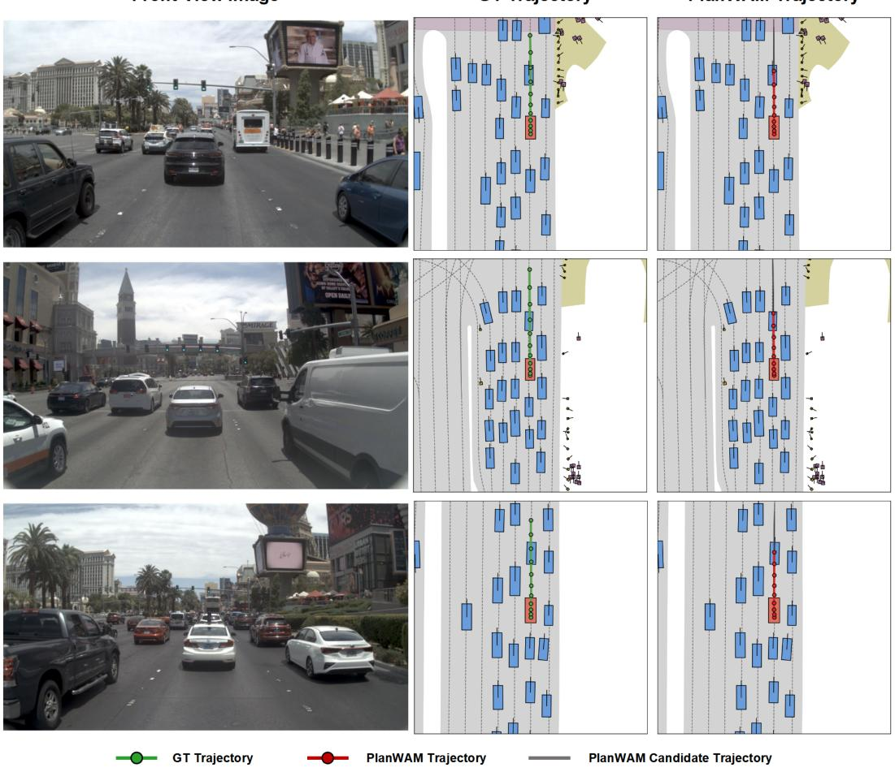  
Figure 10: Additional NAVSIM results (set 4). Dense multi-lane traffic. Gray curves are candidates; red is the selected plan.

## E.2 ZERO-SHOT CLOSED-LOOP ROLLOUTS ON HUGSIM

Figures 11–14 show two six-step rollouts for each of the four HUGSIM source domains. The overlaid corridor, centerline, and waypoints visualize the current PlanWAM plan. The model is unchanged across domains and receives no HUGSIM-specific training.

NuScenes Case 1  
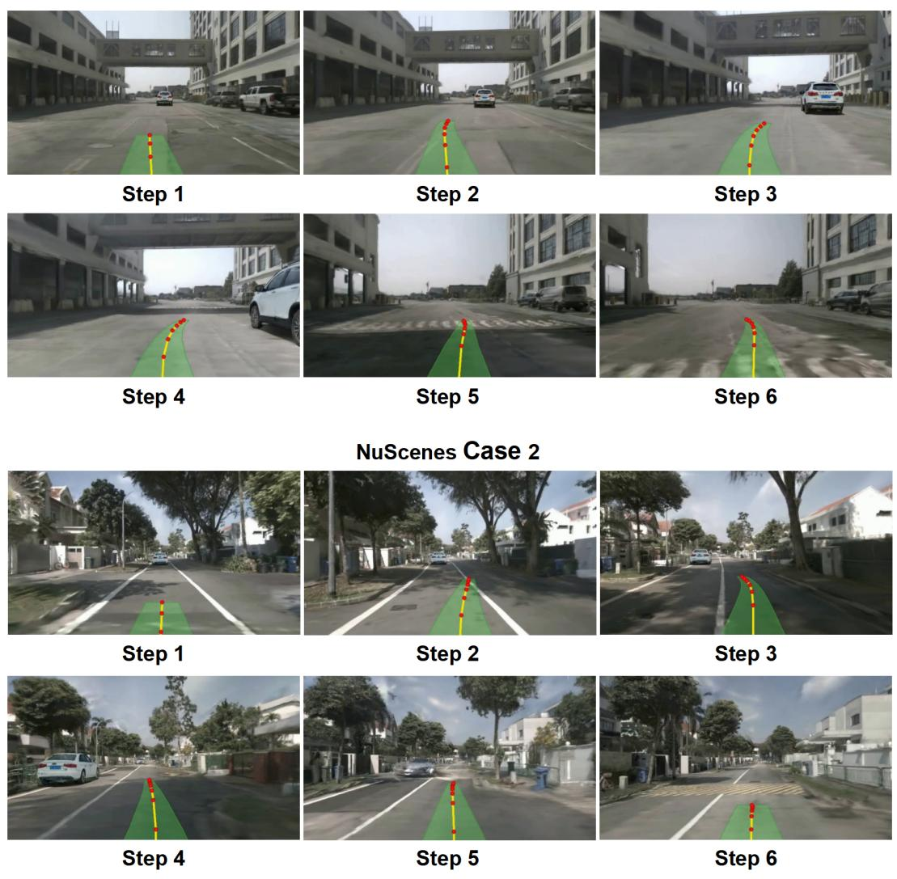  
Figure 11: Zero-shot HUGSIM rollouts on nuScenes. Two closed-loop cases are shown over six consecutive planning steps.

KITTI Case 1

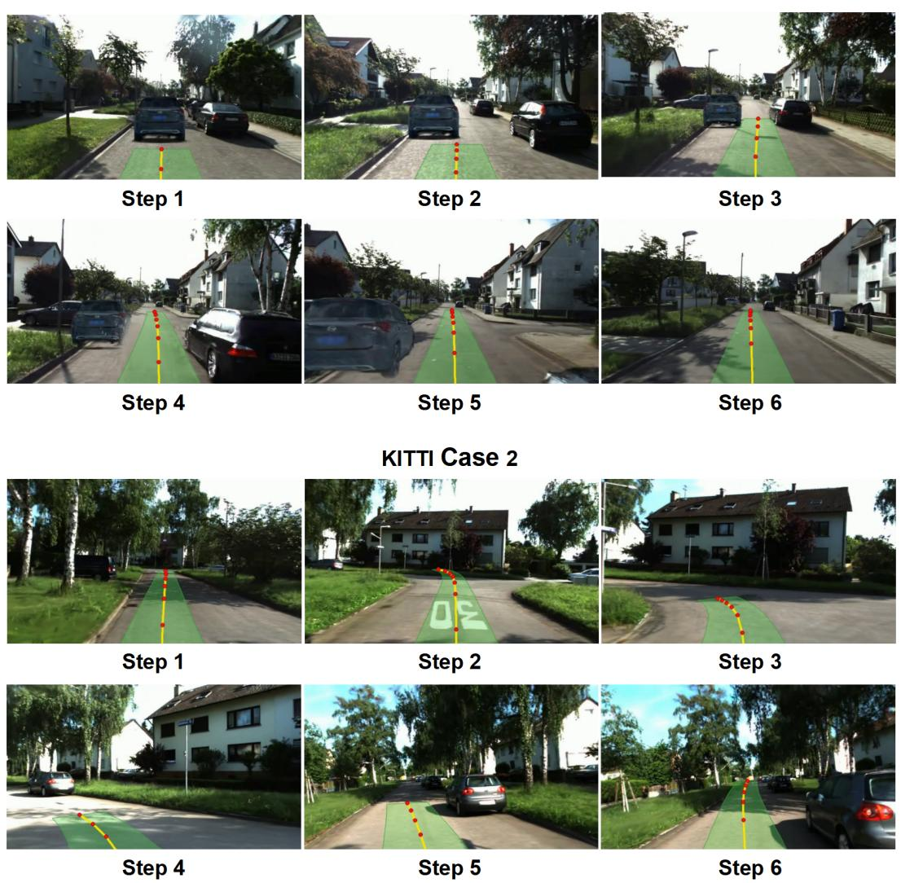  
Figure 12: Zero-shot HUGSIM rollouts on KITTI-360. Two closed-loop cases are shown over six consecutive planning steps.

Waymo Case 1  
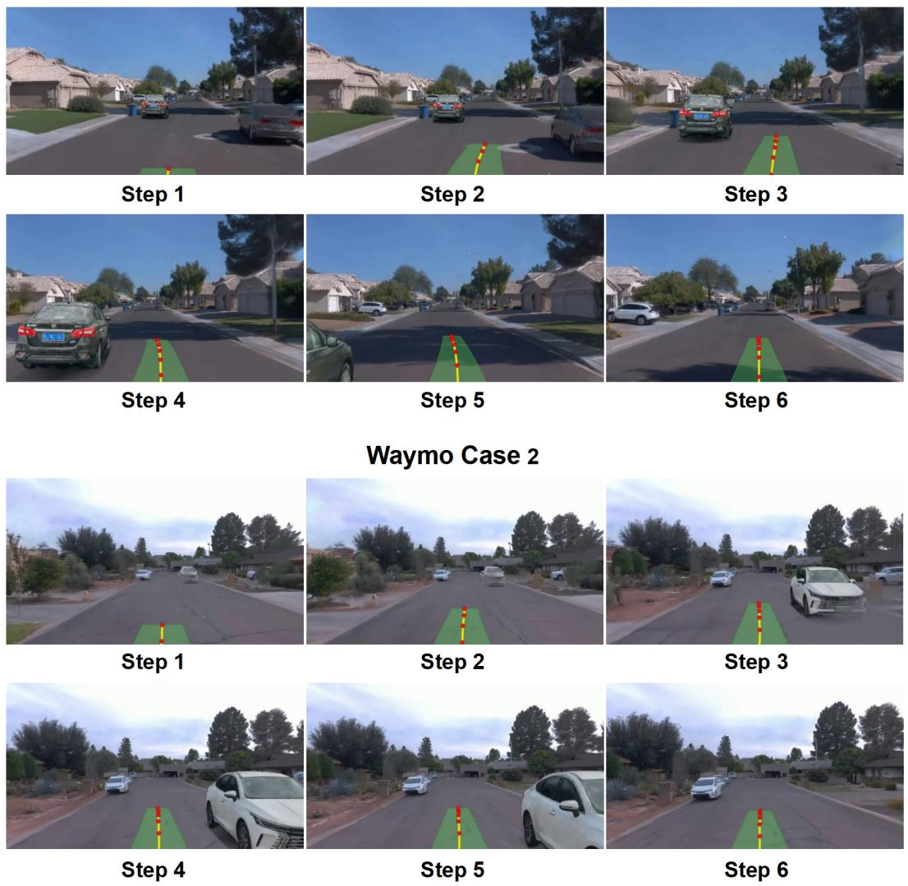  
Figure 13: Zero-shot HUGSIM rollouts on Waymo. Two closed-loop cases are shown over six consecutive planning steps.

Pandaset Case 1  
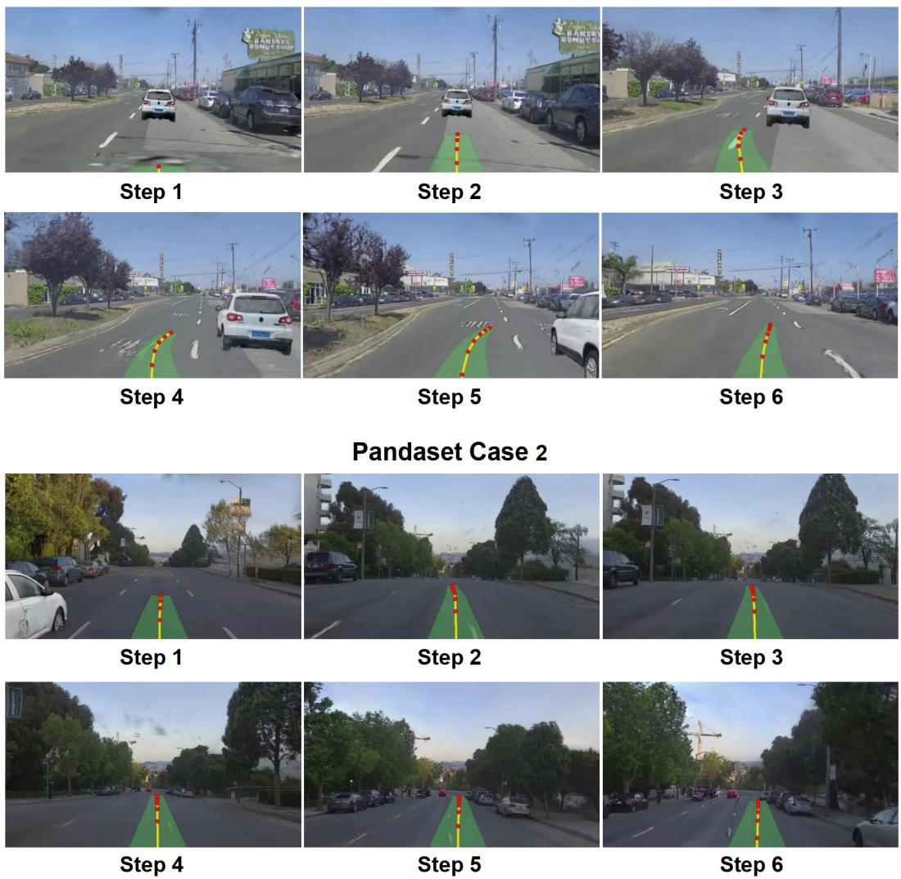  
Figure 14: Zero-shot HUGSIM rollouts on PandaSet. Two closed-loop cases are shown over six consecutive planning steps.