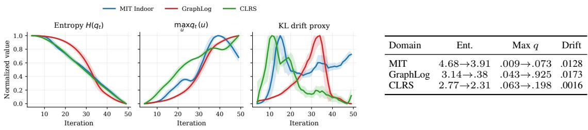
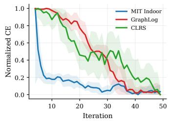
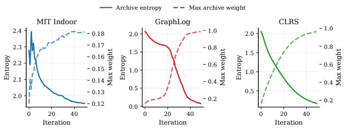
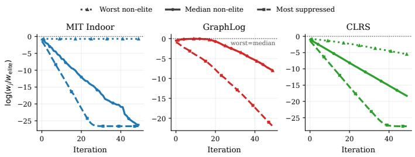

# PRAXIS: Learning Dynamics of Self-Improving Models with Symbolic Archives

Venkat Margapuri and Mustafa Teber Department of Computing Sciences Villanova University, Villanova, PA

## Abstract

Self-improving learning systems adapt data selection, optimization, and auxiliary symbolic components, inducing nonstationary objectives outside standard learning assumptions. We introduce PRAXIS, a co-evolutionary framework that models generators, learners, and symbolic archives as interacting dynamical processes. We prove that KL-constrained generator updates and controlled archive-weight movement bound one-step objective drift, that archive updates suppress a program relative to any fixed comparator with a persistent cumulative utility advantage under sub-Gaussian noise, and that stochastic gradient descent achieves an averagestationarity guarantee whose degradation is governed by cumulative objective drift. Experiments across visual robustness, relational graph reasoning, and algorithmic graph reasoning exhibit generator stabilization, decreasing learner loss, and archive concentration consistent with these theoretical mechanisms.

## 1 Introduction

Modern learning systems increasingly adapt not only model parameters, but also the data, tasks, and auxiliary inductive signals that shape training. This pattern appears in self-training (Wu et al., 2025; Behrouz et al., 2025), curriculum learning (Bengio et al., 2009; Shi et al., 2025; Wang et al., 2023), dataset distillation (Li et al., 2024; Howard et al., 2024; Li et al., 2021), active learning (Tamkin et al., 2022; Parvaneh et al., 2022), and self-evolving language models (Huang et al., 2025; Yu et al., 2025; Zhang et al., 2025). Yet these mechanisms are often specified externally or updated independently of the learner’s internal dynamics: data distributions, supervision signals, task families, reward models, and verifiers are typically fixed or treated as exogenous. This limits our ability to reason about objective drift, stability, and adaptation of inductive structure, especially in settings such as visual perception and symbolic reasoning where reliable semantic oracles may be unavailable. We introduce PRAXIS, a learning-theoretic framework for self-improving learning as a closed-loop dynamical process coupling adaptive universe selection, gradient-based optimization, and symbolic archive regularization. Unlike co-adaptive pipelines that demonstrate empirical gains without a unified dynamics model (Solko-Breslin et al., 2024; Naik et al., 2024), PRAXIS explicitly represents the interaction between the Generator, Learner, and symbolic Archive. This enables formal analysis of KL-controlled objective drift, learner tracking under nonstationarity, and selective suppression of non-competitive symbolic programs.

Our key contributions are: i). a formal Generator–Learner–Archive model for self-improving learning under endogenous nonstationarity; ii). finite-horizon guarantees for KL- and archive-controlled objective drift, average learner stationarity, and fixed-comparator archive suppression; iii). empirical evidence across visual robustness, relational graph reasoning, and algorithmic graph reasoning showing the predicted stability and suppression dynamics.

## 2 Preliminaries

Let R denote the real numbers, $\Delta ( \mathcal { T } )$ the probability simplex over a finite index set $\mathcal { T } ,$ and $\mathbb { E } [ \cdot ]$ expectation with respect to the distribution specified by context. Let $\mathcal { U }$ denote a universe space indexing a family of supervised data-generating distributions. Each universe $u \in \mathcal { U }$ induces a distribution $D _ { u }$ over labeled examples $( x , y ) \in \mathcal { X } \times \mathcal { Y }$ , differing in properties such as data volume, bias, augmentation strength, or noise. The simplex $\Delta ( \mathcal { U } )$ denotes distributions over universes, and $\pi _ { 0 } \in \Delta { \bar { ( } } \mathcal { U } )$ denotes a fixed reference prior. For $q , \pi \in \Delta ( \mathcal { U } )$ , the Kullback–Leibler (KL) divergence is defined as $\begin{array} { r } { \mathrm { K L } ( q \| \pi ) = \int _ { \mathcal { U } } \log \left( \frac { d q } { d \pi } \right) } \end{array}$ dq, whenever q is absolutely continuous with respect to π, and infinite otherwise. A Learner is a parametric predictor $f _ { \theta } : \mathcal { X }  \Delta ( \mathcal { Y } )$ $\theta \in \Theta$ , mapping inputs to predictive label distributions. The predictive output $z _ { \theta } ( x ) : = f _ { \theta } ( x )$ constitutes the sole interface exposed to symbolic components; all symbolic interaction operates directly on the Learner’s predictive distribution. A Generator is a stochastic policy $q _ { \phi } \in \Delta ( \mathcal { U } ) , \qquad \phi \in \Phi$ , which specifies a sampling distribution over universes and thereby determines the mixture distribution from which training data are drawn. The framework maintains a finite archive of symbolic programs $\mathcal { P } = \{ p _ { 1 } , . . . , p _ { m } \}$ . Each program $p _ { j } : \Delta ( \mathcal { V } )  \mathcal { V }$ is a deterministic rule mapping the Learnerâ $\mathbf { \epsilon } \mathbf { \epsilon } \mathbf { \epsilon } \mathbf { \epsilon } \mathbf { \epsilon } \mathbf { \epsilon } \mathbf { \epsilon } \mathbf { \epsilon } \mathbf { \epsilon } \mathbf { \epsilon } \mathbf { \epsilon } \mathbf { \epsilon } \mathbf { \epsilon } \mathbf { \epsilon } \mathbf { \epsilon } \mathbf { \epsilon } \mathbf { \epsilon } \mathbf { \epsilon } \mathbf { \epsilon } \mathbf { \epsilon } \mathbf { \epsilon } \mathbf { \epsilon } \mathbf { \epsilon } \mathbf { \epsilon } \mathbf { \epsilon } \mathbf { \epsilon } \mathbf { \epsilon } \mathbf { \epsilon } \mathbf { \epsilon } \mathbf { \epsilon } \mathbf { \epsilon } \mathbf { \epsilon } \mathbf { \epsilon } \mathbf { \epsilon } \mathbf { \epsilon } \mathbf { \epsilon } \mathbf { \epsilon } \mathbf { \epsilon } \mathbf { \epsilon } \mathbf { \epsilon } \mathbf { \epsilon } \mathbf { \epsilon } \mathbf { \epsilon } \mathbf { \epsilon } \mathbf { \epsilon } \mathbf { \epsilon } \mathbf { \epsilon } \mathbf { \epsilon } \mathbf { \epsilon } \mathbf { \epsilon } \mathbf { \epsilon } \mathbf { \epsilon } \mathbf { \epsilon } \mathbf { \epsilon } \mathbf { \epsilon } \mathbf { \epsilon } \mathbf { \epsilon \epsilon } \mathbf { \epsilon } \mathbf { \epsilon \epsilon } \mathbf { \epsilon \epsilon } \mathbf { \epsilon \epsilon } \mathbf { \epsilon \epsilon } \mathbf { \epsilon \epsilon } \mathbf { \epsilon \epsilon \epsilon } \mathbf { \epsilon \epsilon \epsilon } \mathbf { \epsilon \epsilon \epsilon \epsilon } \mathbf { \epsilon \epsilon \epsilon \epsilon } \mathrm { \epsilon \epsilon \epsilon \epsilon \epsilon } \mathrm \mathrm { \epsilon \epsilon \epsilon \epsilon \epsilon \epsilon \epsilon } \epsilon \mathrm  \epsilon \epsilon \epsilon \epsilon \epsilon \epsilon \epsilon \epsilon \epsilon \epsilon \epsilon \epsilon \epsilon \epsilon \epsilon \epsilon \epsilon \epsilon \epsilon \epsilon \epsilon \epsilon \epsilon \epsilon \epsilon \epsilon \epsilon \epsilon \epsilon \epsilon \epsilon \epsilon \epsilon \epsilon \epsilon \epsilon \epsilon \epsilon \epsilon \epsilon \epsilon \epsilon \epsilon \epsilon \epsilon \epsilon \epsilon \epsilon \epsilon \epsilon \epsilon \epsilon \epsilon \epsilon \epsilon \epsilon \epsilon \epsilon \epsilon \epsilon \epsilon \epsilon \epsilon \epsilon \epsilon \epsilon \epsilon \epsilon \epsilon \epsilon \epsilon \epsilon \epsilon \epsilon \epsilon \epsilon \epsilon \epsilon \epsilon \epsilon \epsilon \epsilon \epsilon \epsilon \epsilon \epsilon \epsilon \epsilon \epsilon \epsilon \epsilon \epsilon \epsilon \epsilon \epsilon \epsilon \epsilon \epsilon \epsilon \epsilon \epsilon \epsilon \epsilon \epsilon \epsilon \epsilon \epsilon \epsilon \epsilon \epsilon \epsilon \epsilon \epsilon \epsilon \epsilon \epsilon \epsilon \epsilon \epsilon \epsilon \epsilon \epsilon \epsilon \epsilon $ predictive distribution to a hard label. Programs encode heuristic or structural biases and are not assumed to be semantically correct. Each program $p _ { j }$ is associated with a score $s _ { j } \in \mathbb { R }$ , inducing a Gibbs distribution over the archive: $\begin{array} { r } { w _ { j } = \frac { \exp ( \beta s _ { j } ) } { \sum _ { k = 1 } ^ { m } \exp ( \beta s _ { k } ) } , \qquad \beta > 0 } \end{array}$ , where $w \in \Delta ( \mathcal { P } )$ represents a soft inductive bias over symbolic hypotheses.

## 3 Problem Formulation

Learning is defined over a universe space U indexing a family of supervised data-generating distributions $\{ D _ { u } \} _ { u \in { \mathcal { U } } } .$ For a Learner $f _ { \theta } : \mathcal { X }  \Delta \bar { ( } \mathcal { Y } )$ , the population loss on universe u is $L ( \theta , u ) = \mathbb { E } _ { ( x , y ) \sim D _ { u } } \left[ \ell \big ( f _ { \theta } ( x ) , y \big ) \right]$ , where ℓ is a bounded supervised loss. Given a universe distribution $q \in \Delta ( \mathcal { U } )$ , the induced mixture risk is $\mathcal { R } ( \theta , q ) = \mathbb { E } _ { u \sim q } L ( \theta , u )$ . The Generator adapts the universe distribution to emphasize learning-relevant regions of $\bar { \mathcal { U } }$ . Deviations from a reference prior $\pi _ { 0 } \in \Delta ( \mathcal { U } )$ are regularized via a KL penalty, yielding the variational objective

$$
\operatorname* { m i n } _ { \theta \in \Theta } \operatorname* { m a x } _ { q \in \Delta ( \mathcal { U } ) } \left\{ \mathbb { E } _ { u \sim q } L ( \theta , u ) - \frac { 1 } { \eta } \mathrm { K L } ( q \| \pi _ { 0 } ) \right\} ,\tag{1}
$$

where $\eta > 0$ controls the adaptation rate. In practice, the maximization over $q$ is implemented through KL–proximal updates, ensuring smooth generator dynamics and bounded objective drift. The symbolic archive $\bar { \mathcal { P } } = \{ p _ { j } \} _ { j = 1 } ^ { m }$ introduces auxiliary inductive structure through a nonnegative consistency functional. Each program produces a discrete symbolic prediction $p _ { j } ( f _ { \theta } ( x ) ) \ \in \mathcal { V }$ from the learner’s predictive distribution. This hard prediction is not differentiated through. Let $\tilde { y } _ { j , \theta } ( x ) = \mathrm { s g } [ p _ { j } ( f _ { \theta } \bar { ( x ) } ) ]$ denote the resulting stop-gradient pseudo-label, where $\mathrm { s g } [ \cdot ]$ means that the argument is treated as a constant during backpropagation. The program then induces the clipped cross-entropy discrepancy

$$
D _ { j } ( \theta ; x ) = \frac { 1 } { C _ { \Psi } } \operatorname* { m i n } \bigl \{ - \log f _ { \theta } ( x ) _ { \tilde { y } _ { j , \theta } ( x ) } , C _ { \Psi } \bigr \} , \qquad 0 \leq D _ { j } ( \theta ; x ) \leq 1 ,\tag{2}
$$

where $C _ { \Psi } > 0$ is a clipping constant. Gradients of $D _ { j }$ flow only through the learner distribution $f _ { \boldsymbol { \theta } } ( \boldsymbol { x } )$ ; the discrete program output $\tilde { y } _ { j , \theta } ( x )$ is treated as fixed for the purpose of the learner update. For a labeled example $( x , y )$ , the archive-induced penalty is

$$
\Psi ( f _ { \boldsymbol { \theta } } , \mathcal { P } ; x , y ) = \sum _ { j = 1 } ^ { m } w _ { j } g _ { j } ( f _ { \boldsymbol { \theta } } ; x , y ) D _ { j } ( \boldsymbol { \theta } ; x ) ,\tag{3}
$$

where $w _ { j }$ is the current archive weight and $g _ { j } ( f _ { \theta } ; x , y ) \in [ 0 , 1 ]$ is an optional intervention gate that modulates whether program $j$ contributes on the example. The gate is not differentiated; it is used only to control the strength of the learner-facing consistency regularizer. This yields the augmented per-universe loss

$$
L _ { \mathrm { a u g } } ( \theta , u ) = \mathbb { E } _ { ( x , y ) \sim D _ { u } } \left[ \ell \big ( f _ { \theta } ( x ) , y \big ) + \lambda \Psi \big ( f _ { \theta } , \mathcal { P } ; x , y \big ) \right] ,\tag{4}
$$

with $\lambda > 0$ controlling the strength of symbolic regularization. Combining adaptive universe selection with archive-augmented learning yields the regularized min–max objective

$$
\operatorname* { m i n } _ { \theta \in \Theta } \operatorname* { m a x } _ { q \in \Delta ( \mathcal { U } ) } \left\{ \mathbb { E } _ { u \sim q } L _ { \mathrm { a u g } } ( \theta , u ) - \frac { 1 } { \eta } \mathrm { K L } ( q \| \pi _ { 0 } ) \right\} .\tag{5}
$$

This objective is not solved to equilibrium; instead, it induces a coupled closed-loop dynamics in which the Learner and Generator evolve jointly. The Archive is not optimized directly, and influences learning only through the time-varying weights $w _ { j }$ appearing in Ψ.

## 4 Solution Approach

PRAXIS realizes the variational formulation of Section 3 as a discrete-time stochastic process. At iteration $t = 0 , 1 , 2 , \ldots$ , the system maintains a coupled state $( \theta _ { t } , s _ { t } , \phi _ { t } )$ , where $\theta _ { t } \in \Theta$ are Learner parameters, $s _ { t } = ( s _ { 1 , t } , \ldots , s _ { m , t } )$ are Archive scores, and $\phi _ { t } \in \Phi$ parameterizes a Generator distribution $q _ { t } : = \pi _ { \phi _ { t } } \in \Delta ( \mathcal { U } )$ . The induced Archive weights are $w _ { j , t } = \exp ( \beta s _ { j , t } ) / \sum _ { k } \exp ( \beta s _ { k , t } )$ Updates are performed online and are not solved to equilibrium. Instead, each component is updated using stochastic first-order information computed under the current state of the others. All coupling between components occurs through the augmented loss $L _ { \mathrm { a u g } }$ and the current weights $( q _ { t } , w _ { t } )$ yielding a closed-loop learning process in which data selection, inductive structure, and model parameters evolve jointly.

## 4.1 Sampling and Estimation

At iteration $t ,$ the Generator distribution $q _ { t }$ is used to sample K universes $u _ { t } ^ { ( 1 ) } , \ldots , u _ { t } ^ { ( K ) } \sim q _ { t }$ independently. From each sampled universe $u _ { t } ^ { ( k ) }$ , an empirical dataset $\mathcal { D } _ { t } ^ { ( k ) }$ is drawn from $D _ { u _ { t } ^ { ( k ) } }$ These samples define a Monte Carlo approximation to expectations with respect to the mixture distribution induced by $q _ { t }$ . Let $\mathcal { D } _ { t } : = \bar { \bigcup } _ { k = 1 } ^ { \bar { K } } \mathcal { D } _ { t } ^ { ( k ) }$ denote the aggregated dataset at iteration t. This sampling mechanism provides a unified source of signal for the Learner, Archive, and Generator updates, ensuring that all components respond to the same underlying universe mixture at each iteration.

## 4.2 Learner Update

At each iteration $t ,$ the Learner produces predictive distributions $z _ { \theta _ { t } } ( x ) = f _ { \theta _ { t } } ( x ) \in \Delta ( \mathcal { V } )$ ). Symbolic programs in the archive operate exclusively on these predictive distributions, and no additional latent representations are assumed. This design enforces a strict interface between neural and symbolic components. For any universe $u \in \mathcal { U } .$ , the augmented population loss is

$$
L _ { \mathrm { a u g } } ( \theta _ { t } , u ) = \mathbb { E } _ { ( x , y ) \sim D _ { u } } \Big [ \ell \big ( f _ { \theta _ { t } } ( x ) , y \big ) + \lambda \Psi \big ( f _ { \theta _ { t } } , \mathcal { P } _ { t } ; x , y \big ) \Big ] ,\tag{6}
$$

where ℓ is a bounded supervised loss and Ψ is the Archive-induced consistency functional. By construction of the consistency functional (Section $3 ) , 0 \leq \Psi \leq 1$ , and therefore $0 \leq L _ { \mathrm { a u g } } ( \theta , u ) \leq$ $L _ { \operatorname* { m a x } } + \lambda = : M \qquad \forall \theta , u$ . Given $q _ { t }$ , the induced mixture objective is $F _ { t } ( \theta ) = \mathbb { E } _ { u \sim q _ { t } } L _ { \mathrm { a u g } } ^ { \sim } ( \theta , u )$ The Learner update is implemented via a stochastic descent step $\theta _ { t + 1 } = \theta _ { t } - \alpha _ { t } g _ { t }$ , where $g _ { t }$ is an unbiased estimator of $\nabla \bar { F } _ { t } ( \theta _ { t } )$ computed from minibatches drawn from $\mathcal { D } _ { t }$ . Gradients propagate only through $f _ { \boldsymbol { \theta } _ { t } } ( \boldsymbol { x } )$ . Symbolic programs are treated as fixed, non-differentiable mappings: each hard program output is converted into a stop-gradient pseudo-label, and the learner receives gradient only from the clipped discrepancy in Eq. (2). Thus Ψ is a learner-facing regularizer, with each program’s contribution scaled by its weight $w _ { j , t }$ and optional gate $g _ { j }$

## 4.3 Archive Update

At each iteration $t ,$ the framework maintains a finite archive of symbolic programs $\mathcal { P } = \{ p _ { 1 } , \ldots , p _ { m } \}$ Each program $p _ { j } : \Delta ( \mathcal { V } )  \mathcal { V }$ is a deterministic mapping from the Learner’s predictive distribution to a hard label. Programs encode heuristic or structural inductive biases and are not assumed to be semantically correct. The archive may be augmented at discrete expansion events; between such events, $\mathcal { P }$ is treated as fixed, and learning dynamics act only on the associated scores and weights.

Let $\hat { y } _ { t } ( x ) = \arg \operatorname* { m a x } _ { y ^ { \prime } \in \mathcal { V } } f _ { \theta _ { t } } ( x ) _ { y ^ { \prime } }$ denote the learner’s hard prediction. Each program $p _ { j }$ is assigned a scalar utility $U _ { j , t } = \mathrm { \bar { ~ } } F _ { j , t } - \mathrm { \tilde { ~ } } \gamma B _ { j , t }$ , where $\gamma > 0$ controls the penalty assigned to counterproductive symbolic influence. The fitness term $\begin{array} { r } { F _ { j , t } = \frac { 1 } { | \mathcal { D } _ { t } | } \sum _ { ( x , y ) \in \mathcal { D } _ { t } } \mathbf { 1 } [ p _ { j } ( f _ { \theta _ { t } } ( x ) ) = y ] } \end{array}$ measures empirical agreement with ground-truth labels under the current universe mixture, while the blame term $B _ { j , t } =$ $\begin{array} { r } { \frac { \bar { 1 } } { | \mathcal { D } _ { t } | } \sum _ { ( x , y ) \in \mathcal { D } _ { t } } \bar { 1 } \big [ \hat { y } _ { t } ( x ) = y \mathrm { ~ \wedge ~ } p _ { j } ( f _ { \theta _ { t } } ( x ) ) \neq y } \end{array}$ y] penalizes symbolic disagreement only on samples already classified correctly by the Learner, thereby gating blame by learner reliability. The fitness $F _ { j , t }$ and blame $B _ { j , t }$ are archive-level statistics. They are not differentiated through and are not the same object as the per-example discrepancy $D _ { j }$ used in Ψ. The discrepancy $D _ { j }$ affects the learner update through the differentiable regularizer in Eq. (3), while $F _ { j , t }$ and $B _ { j , t }$ affect future archive influence only through the score and weight updates below. The empirical utility used in the update is $\widehat { U } _ { j , t } = U _ { j , t } + \xi _ { j , t }$ , where $\xi _ { j , t }$ captures stochastic estimation noise due to finite sampling. Archive scores evolve according to $s _ { j , t + 1 } = s _ { j , t } + \eta _ { p } \widehat { U } _ { j , t }$ , where $\eta _ { p } > 0$ controls the rate at which empirical utility is accumulated over time. Scores are mapped to archive weights via a Gibbs distribution $\begin{array} { r } { w _ { j , t } = \frac { \exp ( \beta s _ { j , t } ) } { \sum _ { k = 1 } ^ { m } \exp ( \beta s _ { k , t } ) } , \qquad \beta > 0 } \end{array}$ . This update induces a competitive selection process in which symbolic programs accumulate influence in proportion to sustained empirical utility, while programs that are persistently uninformative or contradictory are progressively downweighted.

## 4.4 Generator Update

The Generator maintains a parametric distribution $q _ { t } = \pi _ { \phi _ { t } } \in \Delta ( \mathcal { U } )$ over the universe space and adapts it in response to the evolving Learner–Archive state. At iteration t, universes $u _ { t } ^ { ( 1 ) } , \ldots , u _ { t } ^ { ( K ) } \sim$ $q _ { t }$ are sampled and used to update the Learner. After the Learner update $\theta _ { t + 1 }$ , each sampled universe is assigned a scalar reward $\begin{array} { r } { \bar { R } _ { t } ^ { ( k ) } = \widehat { L } _ { \mathrm { a u g } } ( \theta _ { t + 1 } , u _ { t } ^ { ( k ) } ) + \epsilon _ { t } ^ { ( k ) } } \end{array}$ , where $\widehat { L } _ { \mathrm { a u g } }$ is the empirical augmented loss evaluated post-update and $\epsilon _ { t } ^ { ( k ) }$ is an exploration noise term. Post-update evaluation biases the Generator toward universes that remain informative under adaptation.

The Generator update minimizes the KL-regularized objective

$$
\mathcal { I } _ { t } ( \phi ) = - \frac { 1 } { K } \sum _ { k = 1 } ^ { K } \left( R _ { t } ^ { ( k ) } - b _ { t } \right) \log \pi _ { \phi } ( u _ { t } ^ { ( k ) } ) + \frac { 1 } { \eta _ { 1 } } \mathrm { K L } ( \pi _ { \phi } \| \pi _ { \phi _ { t } } ) + \frac { 1 } { \eta _ { 2 } } \mathrm { K L } ( \pi _ { \phi } \| \pi _ { 0 } ) ,
$$

where $b _ { t }$ is a variance-reduction baseline and $\pi _ { 0 }$ is a fixed reference prior. The first KL term enforces a trust-region constraint limiting step-to-step distributional movement, while the second prevents collapse onto degenerate subsets of $\mathcal { U }$

Updates are accepted only if the resulting distribution $q _ { t + 1 } = \pi _ { \phi _ { t + 1 } }$ satisfies $\mathrm { K L } ( q _ { t + 1 } \| q _ { t } ) \leq \kappa _ { t }$ for a prescribed radius $\kappa _ { t } > 0$ . Generator parameters are updated via $\phi _ { t + 1 } = \phi _ { t } - \eta _ { \phi } \nabla _ { \phi } \mathcal { T } _ { t } ( \phi _ { t } )$ which corresponds to a natural-gradient step on $\Delta ( \mathcal { U } )$ under a softmax parameterization. In expectation, these dynamics approximate ascent on the KL-regularized inner maximization of Eq. (5). Collectively, these updates implement a stochastic primal–dual tracking procedure for the regularized min–max objective in Eq. (5), with the Learner performing descent in θ and the Generator performing regularized ascent in q.

## 5 Theoretical Analysis of PRAXIS Dynamics

This section analyzes the stability properties of the learning dynamics induced by PRAXIS. Rather than establishing convergence to a stationary optimum, the analysis focuses on structural guarantees that align directly with the implemented update rules. Specifically, KL-regularized Generator updates are shown to control nonstationarity of the Learner’s population objective (Subsection 5.1), Archive weights are shown to suppress persistently uninformative symbolic programs under stochastic utility estimation (Subsection 5.2), and the Learner is shown to track the resulting time-varying objective under standard stochastic gradient assumptions (Subsection 5.3). While interpretations of the theory are provided here, the proofs are provided in the Appendix.

## 5.1 Generator-induced objective drift

Definition 5.1 (Time–Varying Mixture Objective). At iteration t, let $q _ { t } : = \pi _ { \phi _ { t } } \in \Delta ( \mathcal { U } )$ denote the Generator distribution and let $L _ { \mathrm { a u g } , t }$ denote the augmented loss formed using the current archive state $( \mathcal { P } _ { t } , w _ { t } )$ . The associated time–varying mixture objective is $F _ { t } ( \theta ) : = \mathbb { E } _ { u \sim q _ { t } } L _ { \mathrm { a u g } , t } ( \theta , u )$ 2 $\theta \in$ Θ, where $L _ { \mathrm { a u g } } ( \theta , u )$ is the augmented per–universe loss defined in Section 3.

Definition 5.2 (Uniform Objective Drift). The one–step pathwise uniform objective drift at iteration t is defined as $\begin{array} { r } { \delta _ { t } : = \operatorname* { s u p } _ { \theta \in \Theta } \left| F _ { t + 1 } ( \theta ) - F _ { t } ( \theta ) \right| } \end{array}$

Remark 5.3. The PRAXIS Generator update enforces a KL trust region, ensuring that consecutive universe distributions do not change arbitrarily between iterations. This constraint is the primary mechanism used to control objective drift.

Theorem 5.4 (Generator- and archive-controlled objective drift). Let $\{ q _ { t } \} _ { t \ge 0 } \subset \Delta ( \mathcal { U } )$ be the Generator sequence and $F _ { t } ( \theta ) = \mathbb { E } _ { u \sim q _ { t } } L _ { \mathrm { a u g } , t } ( \theta , u )$ the induced mixture objective. Define the archive-induced loss drift $a _ { t } : = \operatorname* { s u p } _ { \theta \in \Theta , u \in \mathcal { U } } | L _ { \mathrm { a u g } , t + 1 } ( \theta , u ) - L _ { \mathrm { a u g } , t } ( \theta , u )$ |. Ifthe augmented losses satisfy the uniform bound $\begin{array} { r } { \operatorname* { s u p } _ { \theta \in \Theta , u \in \mathcal { U } } | L _ { \mathrm { a u g } , t } ( \theta , u ) | \ \leq \ M } \end{array}$ , then,for every $t \geq 0 , \delta _ { t } \leq M \Vert q _ { t + 1 } -$ $q _ { t } \| _ { 1 } + a _ { t } \le M \sqrt { 2 \mathrm { K L } ( q _ { t + 1 } \| q _ { t } ) } + a _ { t }$ , whenever $\mathrm { K L } ( q _ { t + 1 } \| q _ { t } ) < \infty$ . If programs and intervention gates are fixed across the step and only the archive weights change, then $a _ { t } \leq \lambda \| w _ { t + 1 } - w _ { t } \| _ { 1 }$ Moreover, $i f \mathrm { K L } ( q _ { t + 1 } | | q _ { t } ) \to 0$ and $a _ { t } \to 0 ,$ , then $\delta _ { t }  0 .$

Interpretation. Theorem 5.4 separates the two sources of objective movement: Generator movement in KL geometry and change in the archive-induced loss. Thus Generator stabilization alone controls the full objective only when the archive is frozen or its induced loss drift is controlled separately.

While $\delta _ { t }$ bounds worst-case objective drift, learning proceeds along a specific stochastic trajectory.   
The next result relates this uniform notion to the drift actually experienced along the Learner iterates.

Definition 5.5 (Along-iterate objective drift (magnitude)). Let $\{ \theta _ { t } \} _ { t \ge 0 }$ denote the (possibly stochastic) sequence of Learner iterates and $\{ F _ { t } \} _ { t \ge 0 }$ the associated mixture objectives. The one–step objective drift along the iterates is defined as $\begin{array} { r c l } { \Delta _ { t } } & { : = } & { \mathbb { E } \big [ \big | F _ { t + 1 } ( \theta _ { t + 1 } ) - F _ { t } ( \theta _ { t + 1 } ) \big | \big ] } \end{array}$ , where the expectation is taken over all algorithmic randomness up to iteration $t + 1$

Lemma 5.6 (Along-iterate drift is dominated by uniform drift). For all $t \geq 0 , \Delta _ { t } \leq \mathbb { E } [ \delta _ { t } ]$

Lemma 5.6 states that the expected objective change experienced by the Learner along its realized trajectory is bounded by the worst–case (uniform) objective drift. This permits uniform drift bounds to be used as conservative surrogates in tracking analyses. Under stronger assumptions on Generator stabilization, the objective drift decays at a quantifiable rate as shown below.

Definition 5.7 (Exponential Generator stabilization). The Generator is said to stabilize exponentially after T if there exist constants $c > 0 , \kappa > 0$ , and $T _ { 0 } ~ \in ~ \mathbb { N }$ such that $\begin{array} { r l } { \| q _ { t + 1 } - q _ { t } \| _ { 1 } } & { { } \leq } \end{array}$ $c e ^ { - \kappa ( t - T _ { 0 } ) } , \quad \quad \forall t \geq T _ { 0 }$

Corollary 5.8 (Exponential component stabilization implies objective stabilization). Under the assumptions ofTheorem 5.4, suppose the Generator stabilizes exponentially and $a _ { t } \leq d e ^ { - \rho ( t - T _ { 0 } ) } f o r$ constants $d , \rho > 0 .$ . Thenfor all $t \ge T _ { 0 } , \delta _ { t } \le M c e ^ { - \kappa ( t - T _ { 0 } ) } \dot { + } d e ^ { - \rho ( t - \tilde { T } _ { 0 } ) }$ , and the along-iterate drift satisfies $\Delta _ { t } \ \leq \ \mathbb { E } \big [ \tilde { M } c e ^ { - \kappa ( t - T _ { 0 } ) } + d e ^ { - \rho ( t - T _ { 0 } ) } \big ]$

Remark (stabilization versus concentration). In finite universe spaces, measures such as entropy or the maximum mass maxu $ , q _ { t } ( u )$ are often used to diagnose Generator concentration. Such concentration is compatible with stabilization measured in the $\ell _ { 1 }$ distance $\| q _ { t + 1 } - q _ { t } \|$ 1 (equivalently, total variation distance) or in KL divergence: the distribution may become increasingly peaked while the one-step change between successive Generator iterates decays. For this reason, stabilization in KL geometry (or $\ell _ { 1 }$ distance), rather than concentration alone, is the appropriate condition governing the drift of the time-varying mixture objective.

## 5.2 Archive suppression under persistent utility advantage

Definition 5.9 (Population and empirical archive utilities). For each program $p _ { j }$ at iteration $t ,$ its population utility is $U _ { j , t } : = F _ { j , t } - \gamma B _ { j , t }$ , where $F _ { j , t }$ and $B _ { j , t }$ denote symbolic fitness and blame, respectively, as defined in Section 4. These are non-differentiated archive update statistics computed after evaluating programs on a batch or probe set. They should be distinguished from the learnerfacing discrepancy $D _ { j }$ in Eq. (2), which enters Ψ and is differentiated only through the learner distribution. The empirical utility used to update the archive is $\widehat { U } _ { j , t } = U _ { j , t } + \xi _ { j , t }$ , where $\xi _ { j , t }$ represents stochastic estimation noise arising from finite sampling over universes and data.

Definition 5.10 (Sub-Gaussian pairwise utility estimation noise). Let $\{ \mathcal { F } _ { t } \} _ { t \ge 0 }$ denote the natural filtration generated by the PRAXIS dynamics. The noise process $\{ \xi _ { j , t } \}$ satisfies, for constants $\mu \geq 0$ and $\sigma > 0 :$ (i) Bounded conditional bias: For all $j , t , \big | \mathbb { E } [ \xi _ { j , t } \ | \ \mathcal { F } _ { t - 1 } ] \big | \ \leq \ \mu \qquad \mathrm { a . s }$ . (ii) Pairwise sub-Gaussian increments: For all ordered pairs $( i , j ) \dot { \in } \left[ m \right] \times \left[ m \right]$ , all $t ,$ and all $\lambda \in \mathbb { R }$ $\begin{array} { r l } & { \mathbb { E } \Big [ \exp \Big ( \lambda \Big ( ( \xi _ { j , t } - \xi _ { i , t } ) - \mathbb { E } [ \xi _ { j , t } - \xi _ { i , t } \mid \mathcal { F } _ { t - 1 } ] \Big ) \Big ) \Big | \mathcal { F } _ { t - 1 } \Big ] \leq \exp \Big ( \frac { \lambda ^ { 2 } ( 2 \sigma ) ^ { 2 } } { 2 } \Big ) } \end{array}$ a.s.

Lemma 5.11 (Learner-coupled lower bound on utility gaps). Assume $0 \leq F _ { k , t } \leq 1$ for all k, t, and that blame is learner-gated in the sense that blame is incurred only on samples correctly classified by the learner. Let $\overset { \cdot } { \underset { t } { \neg } } : = \mathbb { P } ( \hat { y } _ { t } ( x ) \neq y )$ denote the learner population error at iteration t. Then, for all $k , t , 0 \leq B _ { k , t } \leq 1 - e _ { t }$ . Consequently, for any programs $i , j ,$ , the population utility gap satisfies $U _ { i , t } - U _ { j , t } ~ \geq ~ ( F _ { i , t } - F _ { j , t } ) - \gamma ( 1 - \bar { e } _ { t } )$ . Define the endogenous margin lower bound $\varepsilon _ { i , j , t } ^ { \mathrm { e n d o } } : = ( F _ { i , t } - F _ { j , t } ) - \gamma ( 1 - e _ { t } )$ . Then $U _ { i , t } - U _ { j , t } \geq \varepsilon _ { i , j , t } ^ { \mathrm { e n d o } }$ for all t.

Interpretation. Lemma 5.11 gives a conservative learner-dependent utility bound. It does not by itself imply that learner improvement enlarges utility gaps: such a conclusion requires directional control of the blame difference $B _ { i , t } - B _ { j , t }$

Theorem 5.12 (High-probability fixed-comparator archive suppression). Let archive scores evolve as $\begin{array} { r } { s _ { j , t + 1 } = s _ { j , t } + \eta _ { p } \widehat { U } _ { j , t } , \qquad w _ { j , t } = \frac { e ^ { \beta s _ { j , t } } } { \sum _ { k = 1 } ^ { m } e ^ { \beta s _ { k , t } } } } \end{array}$ , with $\beta > 0 , \eta _ { p } > 0 ,$ , and $\widehat { U } _ { j , t } = U _ { j , t } + \xi _ { j , t }$ Assume the noise process satisfies Definition 5.10. Fix a nonempty subset $S \subseteq \lceil m \rceil$ ]. For each $j \not \in { \mathcal { S } } _ { : }$ fix a comparator $\bar { \iota } ( j ) \in \mathcal { S }$ and define the pairwise utility gap $\begin{array} { r } { \varepsilon _ { j , t } : = U _ { i ( j ) , t } \stackrel { \cdot } { - } \bar { U } _ { j , t } } \end{array}$ . Then for any horizon $T \geq T _ { 0 }$ and confidence level $\delta \in ( 0 , 1 )$ , with probability at least $1 - \delta ,$ , the following holds uniformlyfor all $t \in \{ T _ { 0 } , \ldots , T \}$ and all j /∈ $\begin{array} { r l r } { S \colon \frac { w _ { j , t } } { \sum _ { i \in S } w _ { i , t } } ~ \le } & { { } \frac { w _ { j , T _ { 0 } } } { w _ { i ( j ) , T _ { 0 } } } \exp \Big ( - \beta \eta _ { p } \sum _ { \tau = T _ { 0 } } ^ { t - 1 } \varepsilon _ { j , \tau } + } \end{array}$ $\begin{array} { r l } & { \beta \eta _ { p } \Gamma _ { \mathrm { s u b G } } ( t , \delta ) \Big ( \eta , \delta ) , w h e r e \Gamma _ { \mathrm { s u b G } } ( t , \delta ) = 2 \mu ( t - T _ { 0 } ) + 2 \sigma \sqrt { 2 ( t - T _ { 0 } ) \log \left( \frac { m ^ { 2 } ( T - T _ { 0 } + 1 ) } { \delta } \right) } } \end{array}$

Interpretation. Theorem 5.12 shows that a symbolic program that is persistently less useful than one fixed comparator experiences decay in relative weight, up to stochastic fluctuations induced by finite sampling. The result holds with high probability under mild assumptions on utility estimation noise and does not require the learner to be optimal or converged. Crucially, suppression depends on cumulative utility gaps rather than instantaneous performance, ensuring robustness to transient noise and short-term reversals. As a consequence, the archive dynamics favor sustained empirical usefulness over momentary agreement, yielding a stable pruning effect even in a nonstationary learning environment.

Corollary 5.13 (Exponential suppression under a persistent signed margin). Under the conditions of Theorem 5.12, suppose there exist constants $\varepsilon > 0$ and $T _ { 1 } ~ \ge ~ T _ { 0 }$ such that, for each ${ j \not \in \cal S , }$ $\begin{array} { r l r } { \sum _ { \tau = T _ { 1 } } ^ { t - 1 } \varepsilon _ { j , \tau } } & { { } \ge \ \varepsilon ( t - T _ { 1 } ) } & { \quad \forall t \le T } \end{array}$ . Then, with probability at least $1 - \delta ,$ , the archive weights satisfy log $\begin{array} { r l r } { \frac { w _ { j , t } } { \sum _ { i \in \mathcal { S } } w _ { i , t } } } & { \leq } & { C _ { j } - \beta \eta _ { p } \varepsilon ( t - T _ { 1 } ) + \beta \eta _ { p } \Gamma _ { \mathrm { s u b G } } ( t , \delta ) , \qquad j \notin \mathcal { S } } \end{array}$ , for a constant $C _ { j }$ depending on the score state at $T _ { 1 }$ . In particular, $i f \mu = 0 ;$ , the exponent grows linearly in t, yielding exponential suppression up to sublinear stochasticfluctuations.

Corollary 5.13 strengthens Theorem 5.12 by identifying a simple sufficient condition under which archive suppression becomes exponential. If each non-elite program has a persistent signed utility gap relative to a fixed comparator, then its relative weight decays exponentially fast, up to sublinear stochastic fluctuations induced by finite-sample noise. In this regime, archive selection behaves analogously to a replicator dynamic with endogenous margins: once a program is consistently dominated, its influence vanishes at a rate determined by the learning rate, inverse temperature, and the magnitude of the persistent utility gap. This formalizes how long-term symbolic competition induces effective archive compression without requiring explicit pruning heuristics.

## 5.3 Average learner stationarity under objective drift

Theorem 5.14 (Average SGD stationarity under objective drift). Let $\{ q _ { t } \} _ { t \ge 0 }$ denote the Generator sequence and define the time–varying mixture objective $F _ { t } ( \theta ) : = \mathbb { E } _ { u \sim q _ { t } } \ L _ { \mathrm { a u g } , t } ^ { - } ( \theta , u )$ , where $L _ { \mathrm { a u g } , t }$ is the current augmented loss. Let $\mathcal { G } _ { t }$ denote the pre-gradient sigma-field, with $\theta _ { t } , \ q _ { t } , \ w _ { t } ,$ and $\breve { F } _ { t }$ measurable with respect to $\mathcal { G } _ { t } .$ . Assume that each $F _ { t }$ is bounded below on Θ, i.e., there exists $F _ { \operatorname* { m i n } } \in \mathbb { R }$ such that $F _ { t } ( \theta ) \geq \bar { F } _ { \operatorname* { m i n } }$ for all $t \geq 0$ and $\theta \in \Theta$ . Let the Learner update be $\theta _ { t + 1 } = \theta _ { t } - \eta g _ { t } , A$ ssume thatfor all $t \geq 0$ the stochastic gradient $g _ { t }$ satisfies:

(i) Unbiasedness: $\mathbb { E } [ g _ { t } \mid { \mathcal { G } } _ { t } ] = \nabla F _ { t } ( \theta _ { t } )$

(ii) Bounded conditional variance: There exists $\sigma ^ { 2 } > 0$ such that $\mathbb { E } \left[ \lVert g _ { t } - \nabla F _ { t } ( \theta _ { t } ) \rVert ^ { 2 } \Big | \mathcal { G } _ { t } \right] \leq$ $\sigma ^ { 2 }$

Assume further that $\Theta \ : = \ : \mathbb { R } ^ { d }$ and each $F _ { t }$ is differentiable and L–smooth, $i . e . , \parallel \nabla F _ { t } ( \theta ) \textrm { - }$ ∇Ft(θ′)∥ ≤ L∥θ − θ′∥, ∀ θ, θ′ ∈ Θ. Then, for any horizon $T \geq 1$ and stepsize $\eta \in ( 0 , 1 / L ]$ $\begin{array} { r } { \frac { 1 } { T } \sum _ { t = 0 } ^ { T - 1 } \mathbb { E } \big [ \| \nabla F _ { t } ( \theta _ { t } ) \| ^ { 2 } \big ] \ \leq \ \frac { 2 } { \eta T } \big ( F _ { 0 } ( \theta _ { 0 } ) - F _ { \mathrm { m i n } } \big ) \ + \ \eta L \sigma ^ { 2 } \ + \ \frac { 2 } { \eta T } \sum _ { t = 0 } ^ { T - 1 } \mathbb { E } [ \delta _ { t } ] } \end{array}$ , where the one–step uniform objective drift is defined as $\delta _ { t } : = \operatorname* { s u p } _ { \theta \in \Theta } \left| F _ { t + 1 } ( \theta ) - F _ { t } ( \theta ) \right|$

Interpretation. Theorem 5.14 bounds the average stationarity violation $\begin{array} { r l } {  { \frac { 1 } { T } \sum _ { t = 0 } ^ { T - 1 } \mathbb { E } \| \nabla F _ { t } ( \theta _ { t } ) \| ^ { 2 } } } \end{array}$ of stochastic gradient descent when optimizing a time–varying mixture objective. The first two terms coincide with standard nonconvex SGD guarantees for a fixed objective, capturing optimization error due to initialization and gradient noise. The additional term $\begin{array} { r } { \frac { 2 } { \eta T } \dot { \sum } _ { t = 0 } ^ { T - 1 } \mathbb { E } [ \delta _ { t } ] } \end{array}$ explicitly quantifies the effect of objective nonstationarity, measuring how rapidly the underlying objective itself changes across iterations. Consequently, when Generator and archive movement make $\sum _ { t = 0 } ^ { T - 1 } \mathbb { E } [ \delta _ { t } ]$ sublinear in T, the drift contribution to average stationarity vanishes. This does not by itself establish parameter space tracking of a moving minimizer.

## 6 PRAXIS Experimental Setup

We evaluate the same Generator–Learner–Archive process across three domains: MIT Indoor visual robustness, GraphLog relational reasoning, and CLRS algorithmic graph reasoning. In MIT Indoor, universes encode image training conditions defined by draw count, augmentation strength, corruption type, and corruption severity; held-out universes use disjoint corruption/severity settings. In GraphLog, universes correspond to graph-reasoning worlds and target relation families in binary relational query answering. In CLRS, universes encode graph size, graph family, density, and edgeweight regime for a shortest-path threshold task; the hard split tests transfer to larger weighted graphs. Dataset and universe details are provided next.

All experiments instantiate the same PRAXIS abstraction: a finite universe set U, a KL-regularized Generator over universes, a Learner trained on samples from selected universes, and a symbolic Archive whose program weights evolve by utility-based Gibbs updates. The three domains differ in modality and task semantics, but not in the closed-loop structure being tested.

Table 1: Dataset scale and universe splits used in the multidomain evaluation.
<table><tr><td>Domain</td><td>Task scale</td><td>Train universes</td><td>Held-out universes</td></tr><tr><td>MIT Indoor</td><td>1,200 images</td><td>300</td><td>27</td></tr><tr><td>GraphLog</td><td>200 tasks / 1,800 binary examples</td><td>43</td><td>24</td></tr><tr><td>CLŘS</td><td>4,080 generated graph examples</td><td>16</td><td>18</td></tr></table>

MIT Indoor visual robustness. The visual-domain experiment uses a controlled subset of the MIT Indoor Scenes dataset. We select 12 scene classes with 100 images per class, yielding a balanced dataset of 1,200 images. The selected classes are auditorium, bedroom, bookstore, classroom, computer room, corridor, grocery store, kitchen, library, living room, office, and restaurant.

Universes are defined by stochastic training conditions rather than by disjoint image pools. Each MIT Indoor training universe is a tuple of training draw count {400, 800, 1200, 1600, 2000}, augmentation strength from 5 evenly spaced values in [0, 0.5], corruption type {none, blur, jpeg, noise}, and corruption severity {0.0, 0.3, 0.6}. This gives 300 training universes. Held-out universes use evaluation draw count 2400, augmentation strengths {0.5, 0.75, 0.9}, corruption types {blur, jpeg, noise}, and severities {0.5, 0.75, 0.85}, giving 27 evaluation universes.

GraphLog relational reasoning. The GraphLog experiment is formulated as binary relational query answering. Each task contains labeled graph structure and query-answer examples. Each example asks whether a target relation is entailed for a queried node pair under the sampled rule world. The experiment used a rule-balanced file containing 200 tasks and 1,800 binary examples where universes are indexed by rule world and target relation family. The fixed split used for all methods contains 43 training universes and 24 held-out universes.

CLRS graph reasoning. The CLRS-domain experiment is a CLRS-style algorithmic graphreasoning task rather than a benchmark number on the full CLRS suite. Each example is a graph instance with graph size, graph family, edge density, and edge-weight regime parameters. The binary target asks whether a shortest-path quantity crosses a threshold. The hard split contains 16 training universes and 18 held-out universes. We generate 120 examples per universe, for 4,080 examples in total across train and held-out universes, and use 40 probe examples per training universe for generator and archive diagnostics.

Baselines are matched by role across domains: fixed-mixture empirical risk minimzation (ERM), adaptive universe selection without archive regularization, Group Domain Random Optimization (DRO)-style and bandit-style samplers. Performance in comparison to PRAXIS is reported in Appendix C.1. These comparisons contextualize predictive performance, while the main empirical question is whether the predicted Generator, Learner, and Archive dynamics recur across domains.

## 7 Results

We organize results around three research questions (RQ) aligned with the three theoretical mechanisms. They are presented as follows.

RQ1: Does the Generator adapt while remaining stable? Figure 1 compares the temporal shape of Generator entropy, maximum universe probability, and KL drift across domains using withindomain min–max normalization. The normalized curves show the same qualitative pattern: entropy decreases, maximum universe probability increases, and the KL drift proxy remains bounded rather than diverging. Because normalization hides absolute scale, The table in Figure 1 reports the corresponding absolute quantities. The absolute values show domain-specific concentration strength. MIT Indoor remains comparatively diffuse, with entropy decreasing from 4.68 to 3.91 and maximum universe probability increasing from 0.009 to 0.073. GraphLog concentrates sharply, with entropy decreasing from 3.14 to 0.38 and maximum probability increasing from 0.043 to 0.925. CLRS lies between these cases, with entropy decreasing from 2.77 to 2.31 and maximum probability increasing from 0.063 to 0.198. Despite these differences, the maximum observed drift proxy remains small in all cases: 0.0128 for MIT Indoor, 0.0173 for GraphLog, and 0.0016 for CLRS. This supports the prediction of Theorem 5.4: the Generator can concentrate the training distribution while keeping one-step movement controlled.

<table><tr><td>Domain</td><td>Ent.</td><td>Max q</td><td>Drift</td></tr><tr><td>MIT</td><td>4.68→3.91</td><td>.009→.073</td><td>.0128</td></tr><tr><td>GraphLog</td><td>3.14→.38</td><td>.043→.925</td><td>.0173</td></tr><tr><td>CLRS</td><td>2.77→2.31</td><td>.063→.198</td><td>.0016</td></tr></table>

Figure 1: Generator dynamics across domains. Curves show within-domain min–max normalized rolling means; bands show one rolling standard deviation.

RQ2: Does learner optimization remain stable under the induced nonstationarity? Figure 2 shows the learner-side response to the moving training distribution. In all three domains, the rolling training cross-entropy decreases rather than destabilizing under adaptive sampling. MIT Indoor decreases from 1.007 to 0.080, GraphLog from 0.702 to 0.109, and CLRS from 0.617 to 0.421 with a minimum of 0.361. These observations are consistent with stable optimization under a moving objective, but training loss is not a direct measurement of the gradient-norm quantity bounded in Theorem 5.14.

RQ3: Does the symbolic archive concentrate and suppress non-elite programs? Figure 3 shows archive weight evolution. MIT Indoor exhibits moderate concentration, with maximum archive weight increasing from 0.120 to 0.181. GraphLog and CLRS show much stronger concentration: GraphLog increases from 0.141 to 0.987, while CLRS increases from 0.164 to 0.964. Archive entropy decreases in all three domains, indicating that the archive does not remain a diffuse pool of interchangeable programs. Figure 4 reports the original envelope view: worst non-elite, median non-elite, and most-suppressed non-elite ratios relative to the final elite set with k = 2. The median non-elite ratio decreases from −0.95 to −26.19 on MIT Indoor, from $- 0 . 4 9 \ \mathrm { t o \ - } 8 . 0 3$ on GraphLog, and from $- 1 . 0 4 \mathrm { t o } - 1 8 . 2 9$ on CLRS. This demonstrates empirical concentration. The fixed-comparator theorem predicts such decay only when a named comparator has a persistent signed cumulative utility advantage; verifying that assumption requires logging the corresponding pairwise utility gaps.

<table><tr><td>Domain</td><td>First</td><td>Final</td><td>Min</td></tr><tr><td>MIT</td><td>1.007</td><td>0.080</td><td>0.068</td></tr><tr><td>GraphLog</td><td>0.702</td><td>0.109</td><td>0.109</td></tr><tr><td>CLŘS</td><td>0.617</td><td>0.421</td><td>0.361</td></tr></table>

Figure 2: Normalized Learner stability across domains. Curves show rolling training cross-entropy min–max normalized within each domain; shaded bands show one rolling standard deviation after the same normalization.

  
Figure 3: Archive weight evolution across domains. Solid curves show entropy

  
Figure 4: Archive suppression envelopes for elite size k = 2.

## 8 Conclusion and Future Work

We introduced PRAXIS, a framework for modeling self-improving learning as the coupled evolution of adaptive universe selection, gradient-based learning, and symbolic archive regularization. The analysis separates Generator- and archive-induced objective drift, establishes average SGD stationarity under cumulative drift, and proves fixed-comparator suppression under persistent signed utility advantages. Experiments across visual robustness, relational graph reasoning, and algorithmic graph reasoning exhibit stable optimization and archive concentration, although their effect on predictive performance is domain dependent. The present formulation is intentionally controlled: universes are finite and archive programs are simple deterministic rules. Extending PRAXIS to continuous or latent universe spaces, richer compositional or probabilistic archives, and a unified closed-loop theory of long-horizon co-evolution are natural directions for future work.

## References

Pranjal Awasthi, Satyen Kale, and Ankit Pensia. Semi-supervised group dro: Combating sparsity with unlabeled data. In International Conference on Algorithmic Learning Theory, pp. 125–160. PMLR, 2024.

Ali Behrouz, Meisam Razaviyayn, Peilin Zhong, and Vahab Mirrokni. Nested learning: The illusion of deep learning architectures. arXiv preprint arXiv:2512.24695, 2025.

Yoshua Bengio, Jérôme Louradour, Ronan Collobert, and Jason Weston. Curriculum learning. In Proceedings ofthe 26th annual international conference on machine learning, pp. 41–48, 2009.

Aurélien Bibaut, Maria Dimakopoulou, Nathan Kallus, Antoine Chambaz, and Mark van Der Laan. Post-contextual-bandit inference. Advances in neural information processing systems, 34:28548– 28559, 2021.

Djallel Bouneffouf and Raphael Feraud. Multi-armed bandits meet large language models. arXiv preprint arXiv:2505.13355, 2025.

Nicolas Gutowski, Tassadit Amghar, Olivier Camp, and Fabien Chhel. Gorthaur-exp3: Bandit-based selection from a portfolio of recommendation algorithms balancing the accuracy-diversity dilemma. Information Sciences, 546:378–396, 2021.

Steve Hanneke and Mingyue Xu. Universal rates of empirical risk minimization. Advances in Neural Information Processing Systems, 37:116291–116331, 2024.

Phillip Howard, Junlin Wang, Vasudev Lal, Gadi Singer, Yejin Choi, and Swabha Swayamdipta. Neurocomparatives: Neuro-symbolic distillation of comparative knowledge. In Findings of the Association for Computational Linguistics: NAACL 2024, pp. 4502–4520, 2024.

Chengsong Huang, Wenhao Yu, Xiaoyang Wang, Hongming Zhang, Zongxia Li, Ruosen Li, Jiaxin Huang, Haitao Mi, and Dong Yu. R-zero: Self-evolving reasoning llm from zero data. arXiv preprint arXiv:2508.05004, 2025.

Borna Jafarpour, Dawn Sepehr, and Nick Pogrebnyakov. Active curriculum learning. In Proceedings ofthe First Workshop on Interactive Learningfor Natural Language Processing, pp. 40–45, 2021.

Jinyong Jeong, Hyungu Kahng, and Seoung Bum Kim. Multi-expert distributionally robust optimization for out-of-distribution generalization. In The Thirty-ninth Annual Conference on Neural Information Processing Systems.

Seobeom Jung, Woojae Lee, Jihun Hamm, and Jangho Park. Per-group distributionally robust optimization (per-gdro) with learnable ambiguity set sizes via bilevel optimization. In OPT 2025: Optimizationfor Machine Learning.

Tianhao Li, Limin Wang, and Gangshan Wu. Self supervision to distillation for long-tailed visual recognition. In Proceedings of the IEEE/CVF international conference on computer vision, pp. 630–639, 2021.

Xinwei Li, Li Lin, Shuai Wang, and Chen Qian. Self-improving teacher cultivates better student: Distillation calibration for multimodal large language models. In Proceedings ofthe 47th International ACM SIGIR Conference on Research and Development in Information Retrieval, pp. 882–892, 2024.

Ziyang Li, Jiani Huang, and Mayur Naik. Scallop: A language for neurosymbolic programming. Proceedings of the ACM on Programming Languages, 7(PLDI):1463–1487, 2023.

Robin Manhaeve, Sebastijan Dumancic, Angelika Kimmig, Thomas Demeester, and Luc De Raedt. Deepproblog: Neural probabilistic logic programming. Advances in neural information processing systems, 31, 2018.

Jiayuan Mao, Chuang Gan, Pushmeet Kohli, Joshua B Tenenbaum, and Jiajun Wu. The neurosymbolic concept learner: Interpreting scenes, words, and sentences from natural supervision. arXiv preprint arXiv:1904.12584, 2019.

Aaditya Naik, Jason Liu, Claire Wang, Amish Sethi, Saikat Dutta, Mayur Naik, and Eric Wong. Dolphin: A programmable framework for scalable neurosymbolic learning. arXiv preprint arXiv:2410.03348, 2024.

Amin Parvaneh, Ehsan Abbasnejad, Damien Teney, Gholamreza Reza Haffari, Anton Van Den Hengel, and Javen Qinfeng Shi. Active learning by feature mixing. In Proceedings of the IEEE/CVF conference on computer vision and pattern recognition, pp. 12237–12246, 2022.

Yu Shang, Yu Li, Keyu Zhao, Likai Ma, Jiahe Liu, Fengli Xu, and Yong Li. Agentsquare: Automatic llm agent search in modular design space. arXiv preprint arXiv:2410.06153, 2024.

Taiwei Shi, Yiyang Wu, Linxin Song, Tianyi Zhou, and Jieyu Zhao. Efficient reinforcement finetuning via adaptive curriculum learning. arXiv preprint arXiv:2504.05520, 2025.

Alaia Solko-Breslin, Seewon Choi, Ziyang Li, Neelay Velingker, Rajeev Alur, Mayur Naik, and Eric Wong. Data-efficient learning with neural programs. Advances in Neural Information Processing Systems, 37:14666–14689, 2024.

Tasuku Soma, Khashayar Gatmiry, Sharut Gupta, and Stefanie Jegelka. Near-optimal algorithms for group distributionally robust optimization and beyond. arXiv e-prints, pp. arXiv–2212, 2025.

Alex Tamkin, Dat Nguyen, Salil Deshpande, Jesse Mu, and Noah Goodman. Active learning helps pretrained models learn the intended task. Advances in Neural Information Processing Systems, 35:28140–28153, 2022.

Yingxu Wang, Siwei Liu, Jinyuan Fang, and Zaiqiao Meng. Evoagentx: An automated framework for evolving agentic workflows. In Proceedings of the 2025 Conference on Empirical Methods in Natural Language Processing: System Demonstrations, pp. 643–655, 2025.

Yulin Wang, Yang Yue, Rui Lu, Tianjiao Liu, Zhao Zhong, Shiji Song, and Gao Huang. Efficienttrain: Exploring generalized curriculum learning for training visual backbones. In Proceedings ofthe IEEE/CVF International Conference on Computer Vision, pp. 5852–5864, 2023.

Xiao Wu, Ting-Zhu Huang, Liang-Jian Deng, Xiaobing Yu, Yu Zhong, Shangqi Deng, Ufaq Khan, Jianghao Wu, Xiaofeng Liu, Imran Razzak, et al. Selfai: Building a self-training ai system with llm agents. arXiv preprint arXiv:2512.00403, 2025.

Peng Xia, Kaide Zeng, Jiaqi Liu, Can Qin, Fang Wu, Yiyang Zhou, Caiming Xiong, and Huaxiu Yao. Agent0: Unleashing self-evolving agents from zero data via tool-integrated reasoning. arXiv preprint arXiv:2511.16043, 2025.

Wenhao Yu, Zhenwen Liang, Chengsong Huang, Kishan Panaganti, Tianqing Fang, Haitao Mi, and Dong Yu. Guided self-evolving llms with minimal human supervision. arXiv preprint arXiv:2512.02472, 2025.

Hangfan Zhang, Siyuan Xu, Zhimeng Guo, Huaisheng Zhu, Shicheng Liu, Xinrun Wang, Qiaosheng Zhang, Yang Chen, Peng Ye, Lei Bai, et al. The path of self-evolving large language models: Achieving data-efficient learning via intrinsic feedback. arXiv preprint arXiv:2510.02752, 2025.

## Appendix

## A Related Work

Self-Improving Learning Frameworks. A growing body of work studies self-improving and agentic systems in which models iteratively modify their data, policies, prompts, or intermediate reasoning artifacts through feedback-driven loops, including self-training frameworks (Huang et al., 2025), foundational agent architectures (Xia et al., 2025; Shang et al., 2024), and population-based evolutionary agents (Wang et al., 2025). These approaches demonstrate substantial empirical gains by leveraging archives of prior behaviors, reasoning traces, or candidate solutions, often guided by reward models, verifiers, or task success signals. However, such systems typically emphasize capability growth and system-level behavior, with limited formal analysis of the learning dynamics induced by repeated self-modification, particularly under non-stationary objectives. PRAXIS is complementary to this line of work: rather than proposing a new agent architecture or self-improvement mechanism, it provides a learning-theoretic framework for modeling and analyzing the coupled evolution of data selection, optimization, and symbolic structure that underlies many self-improving systems. In this sense, PRAXIS serves as an abstract dynamical model that captures common mechanisms in agentic and self-evolving frameworks, while enabling explicit guarantees on objective drift, stability, and long-horizon tracking.

Adaptive Data Selection and Learning under Non-Stationary Objectives. ERM Hanneke & Xu (2024) constitutes the classical learning paradigm, optimizing average risk under a fixed and stationary data distribution. A large body of work extends ERM by adapting the training distribution over time, thereby implicitly inducing non-stationary learning objectives. Curriculum Learning (CL) methods reorder or reweight examples to accelerate convergence or improve representation learning, beginning with fixed difficulty schedules (Bengio et al., 2009) and extending to modern variants that emphasize training efficiency in large visual backbones (Wang et al., 2023) or integrate active selection criteria (Jafarpour et al., 2021). Distributionally Robust Optimization (DRO) addresses distribution shift by replacing the average-risk objective with a worst-case or group-wise objective, leading to minimax formulations whose solutions evolve as group weights are updated; recent work provides near-optimal algorithms and lower bounds for group DRO (Soma et al., 2025), multiexpert robust formulations (Jeong et al.), and semi-supervised extensions that mitigate group sparsity using unlabeled data (Awasthi et al., 2024; Jung et al.). From a complementary perspective, bandit algorithms formalize adaptive data or policy selection as an online decision problem, balancing exploration and exploitation through regret-minimizing updates or, more recently, enabling valid statistical inference under adaptive data collection (Bibaut et al., 2021; Gutowski et al., 2021). Such methods have also been applied to adaptive components in large language model pipelines, including decoding and tool selection (Bouneffouf & Feraud, 2025). While these approaches differ in mechanism, they share a common structure: the learner is trained against an objective that changes over time as a consequence of adaptive selection, yet the resulting non-stationarity is typically treated as exogenous, adversarial, or heuristic rather than as a first-class dynamical quantity. In contrast, PRAXIS explicitly models data selection, parameter learning, and symbolic structure as a coupled closed-loop system, enabling theoretical guarantees that directly relate the rate and geometry of objective drift to stability and tracking behavior in non-stationary learning environments.

Symbolic and Structured Inductive Bias in Learning. A broad class of neuro-symbolic methods incorporates symbolic structure into learning pipelines to improve compositionality, interpretability, or generalization. Differentiable logic frameworks such as DeepProbLog Manhaeve et al. (2018) and Scallop Li et al. (2023) integrate neural predicates with probabilistic or differentiable logic programs, enabling end-to-end training while predominantly assuming a fixed and trusted symbolic program provided as background knowledge. Complementary approaches address non-differentiable symbolic components through gradient estimation techniques, such as InputâC“Output Sample Gradient Estimation (ISED) Solko-Breslin et al. (2024), which enables data-efficient optimization of neural programs containing black-box symbolic modules or external APIs without access to internal structure. Other lines of work, including the Neuro-Symbolic Concept Learner (NSCL) Mao et al. (2019) and related program induction models, learn latent symbolic programs for reasoning over structured representations, demonstrating strong compositional generalization but focusing primarily on task-level accuracy rather than long-horizon learning dynamics. More recent programmable neurosymbolic systems, such as Dolphin Naik et al. (2024), combine symbolic modules with adaptive task distributions to scale reasoning across problem families, while symbolic discovery methods extract interpretable rules or expressions from trained neural networks as post-hoc explanations. Across these approaches, symbolic structure is typically treated as fixed, correctness-assumed, or optimized solely for predictive performance, with limited consideration of how symbolic components should be regulated under non-stationary learning conditions. In contrast, PRAXIS treats symbolic programs as fallible inductive biases whose influence is dynamically modulated through interaction with adaptive data selection and parameter learning. By explicitly modeling the coupled evolution of symbolic structure, data distributions, and model parameters, PRAXIS enables theoretical analysis of stability, suppression, and tracking behavior in learning systems operating under endogenous non-stationarity.

## B Symbolic Archive Composition

The symbolic archive supplies a finite set of deterministic programs that produce auxiliary predictions or structural preferences. It is not a separate semantic oracle. Archive programs are evaluated through the same utility, blame, and Gibbs-weight update mechanism across domains, so the reported suppression behavior reflects PRAXIS dynamics rather than manual selection at evaluation time. When an archive program is used in the learner loss, its discrete output is converted into a stopgradient pseudo-label and compared with the learner’s soft prediction through the clipped discrepancy in Eq. (2).

Table 2: Symbolic archive sizes and program families.
<table><tr><td>Domain</td><td>Archive size</td><td>Program families</td></tr><tr><td>MIT Indoor</td><td>10 initial programs</td><td>ranking, threshold, symmetry, temporal, distributional</td></tr><tr><td>GraphLog</td><td>8 programs</td><td>constant, prior, descriptor, uncertainty-gated</td></tr><tr><td>CLRS</td><td>8 programs</td><td>algorithmic, local graph rule, reachability, sparsity, weighted prior</td></tr></table>

MIT Indoor archive. For MIT Indoor, each archive program maps the learner’s class-probability vector to a hard label. The initial archive contains 10 manually seeded programs from five families: ranking-based rules such as argmax, second-best, and top-2 margin switching; threshold-based rules based on confidence or entropy; symmetry-breaking rules such as even/odd or low-index preferences; temporal and modular rules conditioned on iteration or modulo patterns; and distributional preference such as center-biased label selection.

GraphLog archive. The GraphLog archive contains 8 programs: AlwaysYes, AlwaysNo, TargetPrior, WorldPrior, WorldTargetPrior, DescriptorLookup, LowConfidenceNo, and LowConfidenceTargetPrior. These cover constant predictors, relation and world priors, descriptor-based symbolic lookup, and uncertainty-gated fallback rules. The argmax-style model program is excluded in the main run so that archive concentration is not driven by copying the learner’s current prediction.

CLRS archive. The CLRS archive contains 8 programs: UnweightedBFS, DirectOrTwoHop, ChainDistancePrior, ReachablePrior, DirectEdgePrior, DegreeConnectivityPrior, SparseChainPrior, and WeightedSlackPrior. These programs encode lightweight algorithmic and graph-structural heuristics: unweighted shortest-path search, local edge or two-hop rules, reachability and degree priors, sparsity-sensitive chain priors, and weighted slack heuristics. Exact oracle and argmax-copy programs are excluded from the main run.

## C Implementation and Reproducibility Details

All adaptive methods operate over the same train and held-out universe splits within each domain. Uniform / ERM keeps a fixed uniform distribution over universes. GroupDRO-style sampling upweights universes with lower recent held-out accuracy. Bandit-style sampling treats universes as adaptive arms. Generator-only keeps the KL-regularized PRAXIS Generator but disables archive regularization. Full PRAXIS uses both adaptive universe selection and archive regularization. The main multidomain diagnostics use 50 PRAXIS iterations.

## C.1 Component Ablation Analysis

This subsection evaluates the contribution of adaptive universe selection and symbolic archive adaptation. We compare five roles documented in Table 3: ERM with a fixed uniform mixture and no archive, adaptive generator training with no archive regularization, a frozen archive with adaptive generator, a frozen generator with adaptive archive, and full PRAXIS. The goal is not to claim that every component dominates in every domain, but to identify when performance gains arise from the coupled system and when one mechanism carries most of the benefit.

The ablations reveal different component roles across domains. On MIT Indoor, full PRAXIS obtains the strongest mean and $\mathrm { C V a R _ { 1 0 } }$ , while freezing either adaptive component reduces tail robustness. On

Table 3: Component ablations across domains. Mean, Min, $\mathrm { C V a R } _ { 1 0 } ,$ , and Std are computed across held-out universes.
<table><tr><td>Domain</td><td>Method</td><td>Mean</td><td>Min</td><td> $\mathrm { C V a R } _ { 1 0 }$ </td><td>Std</td></tr><tr><td>MIT Indoor</td><td>ERM fixed</td><td>0.678</td><td>0.617</td><td>0.630</td><td>0.029</td></tr><tr><td>MIT Indoor</td><td>No archive</td><td>0.658</td><td>0.574</td><td>0.618</td><td>0.038</td></tr><tr><td>MIT Indoor</td><td>Frozen archive</td><td>0.672</td><td>0.590</td><td>0.624</td><td>0.034</td></tr><tr><td>MIT Indoor</td><td>Frozen generator</td><td>0.661</td><td>0.589</td><td>0.603</td><td>0.031</td></tr><tr><td>MIT Indoor</td><td>Full PRAXIS</td><td>0.694</td><td>0.602</td><td>0.639</td><td>0.031</td></tr><tr><td>GraphLog</td><td>ERM fixed</td><td>0.718</td><td>0.429</td><td>0.429</td><td>0.282</td></tr><tr><td>GraphLog</td><td>No archive</td><td>0.912</td><td>0.857</td><td>0.857</td><td>0.053</td></tr><tr><td>GraphLog</td><td>Frozen archive</td><td>0.709</td><td>0.222</td><td>0.222</td><td>0.299</td></tr><tr><td>GraphLog</td><td>Frozen generator</td><td>0.746</td><td>0.429</td><td>0.429</td><td>0.258</td></tr><tr><td>GraphLog</td><td>Full PRAXIS</td><td>0.851</td><td>0.714</td><td>0.714</td><td>0.106</td></tr><tr><td>CLRS</td><td>ERM fixed</td><td>0.718</td><td>0.583</td><td>0.596</td><td>0.063</td></tr><tr><td>CLRS</td><td>No archive</td><td>0.751</td><td>0.633</td><td>0.654</td><td>0.055</td></tr><tr><td>CLRS</td><td>Frozen archive</td><td>0.753</td><td>0.650</td><td>0.654</td><td>0.064</td></tr><tr><td>CLRS</td><td>Frozen generator</td><td>0.739</td><td>0.642</td><td>0.642</td><td>0.054</td></tr><tr><td>CLRS</td><td>Full PRAXIS</td><td>0.763</td><td>0.650</td><td>0.658</td><td>0.059</td></tr></table>

CLRS, full PRAXIS also gives the best mean and $\mathrm { C V a R } _ { 1 0 } .$ , although the margin over the no-archive and frozen-archive variants is modest. GraphLog behaves differently: adaptive universe selection without archive regularization is strongest, while frozen archive and frozen generator variants both underperform full PRAXIS. This indicates that the GraphLog split is primarily solved by adaptive data selection, whereas the archive contributes more clearly to robustness in MIT Indoor and more weakly in CLRS. These results support the modular interpretation of PRAXIS: the framework exposes the coupled dynamics, but the empirical value of each component depends on the domain and archive quality.

## D Theory Proofs

## D.1 Proofs for Section 5.1

Proof of Theorem 5.4. Add and subtract $\mathbb { E } _ { u \sim q _ { t } } L _ { \mathrm { a u g } , t + 1 } ( \theta , u )$ . For every θ,

$$
\begin{array} { r l } & { | F _ { t + 1 } ( \theta ) - F _ { t } ( \theta ) | \leq \left| \mathbb { E } _ { q _ { t + 1 } } L _ { \mathrm { a u g } , t + 1 } - \mathbb { E } _ { q _ { t } } L _ { \mathrm { a u g } , t + 1 } \right| } \\ & { ~ + \left| \mathbb { E } _ { q _ { t } } ( L _ { \mathrm { a u g } , t + 1 } - L _ { \mathrm { a u g } , t } ) \right| } \\ & { ~ \leq M \| q _ { t + 1 } - q _ { t } \| _ { 1 } + a _ { t } . } \end{array}
$$

Taking the supremum over θ and applying Pinsker’s inequality proves

$$
\delta _ { t } \leq M \| q _ { t + 1 } - q _ { t } \| _ { 1 } + a _ { t } \leq M { \sqrt { 2 \mathrm { K L } ( q _ { t + 1 } \| q _ { t } ) } } + a _ { t } .
$$

When only the weights change, the archive contribution is a weighted sum of terms in [0, 1], so the triangle inequality gives $a _ { t } \leq \lambda \| w _ { t + 1 } - w _ { t } \| _ { 1 }$ . The convergence claim follows immediately when both terms on the right tend to zero. □

Proof of Lemma 5.6. Fix any $t \geq 0$ . For every realization of the algorithmic randomness up to iteration t + 1, we have $\theta _ { t + 1 } \in \Theta$ . Hence,

$$
\left| F _ { t + 1 } ( \theta _ { t + 1 } ) - F _ { t } ( \theta _ { t + 1 } ) \right| \ \leq \ \operatorname* { s u p } _ { \theta \in \Theta } \left| F _ { t + 1 } ( \theta ) - F _ { t } ( \theta ) \right| \ = \ \delta _ { t } .
$$

Taking expectations over the randomness preserves the inequality, yielding $\Delta _ { t } \leq \mathbb { E } [ \delta _ { t } ]$ □

ProofofCorollary 5.8. Theorem 5.4 and the two exponential component bounds give

$$
\delta _ { t } \leq M c e ^ { - \kappa ( t - T _ { 0 } ) } + d e ^ { - \rho ( t - T _ { 0 } ) } .
$$

Taking expectations and applying Lemma 5.6 proves the along-iterate claim.

## D.2 Proofs for Section 5.2

Proof of Lemma 5.11. Fix an arbitrary iteration t and program index k.

Step 1: Bounding the blame term. By assumption, blame is learner-gated i.e., blame is incurred only on examples that the learner classifies correctly at iteration t. Equivalently, $B _ { k , t }$ is an expectation of a bounded indicator (or bounded loss) multiplied by the learner-correctness gate $\mathbb { 1 } \{ \hat { y } _ { t } ( x ) { \dot { = } } y \}$ . In particular, for every $x ,$ the per-sample blame contribution is nonnegative and at most 1 whenever the gate is active, and it is 0 when the gate is inactive. Therefore, almost surely,

$$
0 \ \leq \ ( \mathrm { p e r - s a m p l e ~ b l a m e ~ c o n t r i b u t i o n } ) \ \leq \ \mathbb { 1 } \{ \hat { y }  _ { t } ( x ) = y \} .
$$

Taking expectations over $( x , y )$ yields

$$
0 \ \leq \ B _ { k , t } \ \leq \ \mathbb { P } ( \hat { y } _ { t } ( x ) = y ) .
$$

By definition of the learner population error $e _ { t } : = \mathbb { P } ( \hat { y } _ { t } ( x ) \neq y )$ , we have $\mathbb { P } ( \hat { y } _ { t } ( x ) = y ) = 1 - e _ { t }$ hence

$$
0 \leq B _ { k , t } \leq 1 - e _ { t } .\tag{7}
$$

Step 2: Lower bounding utility gaps. Recall the population utility definition $U _ { j , t } : = F _ { j , t } - \gamma B _ { j , t }$ with $\gamma \geq 0$ . For any two programs i and j,

$$
\begin{array} { r l } & { U _ { i , t } - U _ { j , t } = ( F _ { i , t } - \gamma B _ { i , t } ) - ( F _ { j , t } - \gamma B _ { j , t } ) } \\ & { \qquad = ( F _ { i , t } - F _ { j , t } ) - \gamma ( B _ { i , t } - B _ { j , t } ) . } \end{array}\tag{8}
$$

Using the blame bounds (7) for each program, we have $0 \leq B _ { i , t } \leq 1 - e _ { t }$ and $0 \leq B _ { j , t } \leq 1 - e _ { t }$ which implies

$$
B _ { i , t } - B _ { j , t } \ \leq \ B _ { i , t } \ \leq \ 1 - e _ { t } .
$$

Substituting into (8) gives

$$
U _ { i , t } - U _ { j , t } ~ \geq ~ ( F _ { i , t } - F _ { j , t } ) - \gamma ( 1 - e _ { t } ) .
$$

Define

$$
\varepsilon _ { i , j , t } ^ { \mathrm { e n d o } } : = ( F _ { i , t } - F _ { j , t } ) - \gamma ( 1 - e _ { t } ) .
$$

Then the preceding inequality is exactly $U _ { i , t } - U _ { j , t } \geq \varepsilon _ { i , j , t } ^ { \mathrm { e n d o } }$ , as claimed. Hence, proved.

ProofofTheorem 5.12. Fix $j \not \in { \mathcal { S } }$ and write $i = i ( j )$ . The Gibbs weights satisfy the exact pairwise identity

$$
\frac { w _ { j , t } } { w _ { i , t } } = \frac { w _ { j , T _ { 0 } } } { w _ { i , T _ { 0 } } } \exp \left( \beta \eta _ { p } \sum _ { \tau = T _ { 0 } } ^ { t - 1 } ( \widehat { U } _ { j , \tau } - \widehat { U } _ { i , \tau } ) \right) .
$$

Since $\begin{array} { r } { \sum _ { k \in \mathcal { S } } w _ { k , t } \ge w _ { i , t } } \end{array}$ and $U _ { j , \tau } - U _ { i , \tau } = - \varepsilon _ { j , \tau } $

$$
\frac { w _ { j , t } } { \sum _ { k \in \mathcal { S } } w _ { k , t } } \leq \frac { w _ { j , T _ { 0 } } } { w _ { i , T _ { 0 } } } \exp \left( - \beta \eta _ { p } \sum _ { \tau = T _ { 0 } } ^ { t - 1 } \varepsilon _ { j , \tau } + \beta \eta _ { p } \sum _ { \tau = T _ { 0 } } ^ { t - 1 } ( \xi _ { j , \tau } - \xi _ { i , \tau } ) \right) .
$$

For a fixed ordered pair, decompose the noise difference into its conditional mean and centered martingale difference. The conditional means sum to at most $2 \mu ( t - T _ { 0 } )$ ). The conditional $( 2 \sigma )$ -sub-Gaussian MGF assumption and a Chernoff bound give, for $t > T _ { 0 }$

$$
\mathbb { P } \left( \sum _ { \tau = T _ { 0 } } ^ { t - 1 } d _ { \tau } ^ { ( i , j ) } \geq a \right) \leq \exp \left( - \frac { a ^ { 2 } } { 8 \sigma ^ { 2 } ( t - T _ { 0 } ) } \right) .
$$

A union bound over the at most $m ^ { 2 }$ ordered pairs and $T - T _ { 0 }$ positive-length horizons, with the zero-length case handled deterministically, yields the simultaneous bound $\Gamma _ { \mathrm { s u b G } }$ . Substitution in the preceding display proves the result. □

ProofofCorollary 5.13. Apply Theorem 5.12 and take logarithms. Split the cumulative gap at $T _ { 1 }$ and use the assumed signed-margin bound. For $i = i ( j )$ this gives

$$
\log \frac { w _ { j , t } } { \sum _ { k \in S } w _ { k , t } } \leq C _ { j } - \beta \eta _ { p } \varepsilon ( t - T _ { 1 } ) + \beta \eta _ { p } \Gamma _ { \mathrm { s u b G } } ( t , \delta ) ,
$$

where

$$
C _ { j } : = \log \frac { w _ { j , T _ { 0 } } } { w _ { i , T _ { 0 } } } - \beta \eta _ { p } \sum _ { \tau = T _ { 0 } } ^ { T _ { 1 } - 1 } \varepsilon _ { j , \tau }
$$

depends only on the score state and finite history through $T _ { 1 } . \mathrm { H } \mu = 0 , \Gamma _ { \mathrm { s u b G } } ( t , \delta ) = O ( \sqrt { t \log T } )$ for fixed horizon T, whereas the signed signal is linear in t. □

## D.3 Proof for Section 5.3

Proof of Theorem 5.14. By L–smoothness and $\theta _ { t + 1 } = \theta _ { t } - \eta g _ { t }$ ,

$$
F _ { t } ( \theta _ { t + 1 } ) \leq F _ { t } ( \theta _ { t } ) - \eta \langle \nabla F _ { t } ( \theta _ { t } ) , g _ { t } \rangle + \frac { L \eta ^ { 2 } } { 2 } \| g _ { t } \| ^ { 2 } .
$$

Conditioning on $\mathcal { G } _ { t } .$ , unbiasedness and the variance bound imply

$$
\mathbb { E } [ F _ { t } ( \theta _ { t + 1 } ) \mid \mathcal { G } _ { t } ] \le F _ { t } ( \theta _ { t } ) - \eta \left( 1 - \frac { L \eta } { 2 } \right) \| \nabla F _ { t } ( \theta _ { t } ) \| ^ { 2 } + \frac { L \eta ^ { 2 } } { 2 } \sigma ^ { 2 } .
$$

For $\eta \leq 1 / L$ , the gradient coefficient is at least $\eta / 2$ . Pathwise, $F _ { t + 1 } ( \theta _ { t + 1 } ) \leq F _ { t } ( \theta _ { t + 1 } ) + \delta _ { t } ;$ hence, after taking total expectation,

$$
\mathbb { E } F _ { t + 1 } ( \theta _ { t + 1 } ) \le \mathbb { E } F _ { t } ( \theta _ { t } ) - \frac { \eta } { 2 } \mathbb { E } \| \nabla F _ { t } ( \theta _ { t } ) \| ^ { 2 } + \frac { L \eta ^ { 2 } } { 2 } \sigma ^ { 2 } + \mathbb { E } \delta _ { t } .
$$

Summing from $t = 0$ to $T - 1$ , telescoping, and using $F _ { T } ( \theta _ { T } ) \ge F _ { \mathrm { m i n } }$ gives

$$
\frac { \eta } { 2 } \sum _ { t = 0 } ^ { T - 1 } \mathbb { E } \| \nabla F _ { t } ( \theta _ { t } ) \| ^ { 2 } \leq F _ { 0 } ( \theta _ { 0 } ) - F _ { \operatorname* { m i n } } + \frac { L \eta ^ { 2 } T } { 2 } \sigma ^ { 2 } + \sum _ { t = 0 } ^ { T - 1 } \mathbb { E } \delta _ { t } .
$$

Division by $\eta T / 2$ proves the claim.