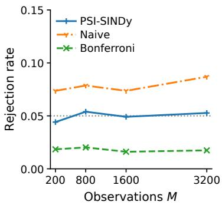
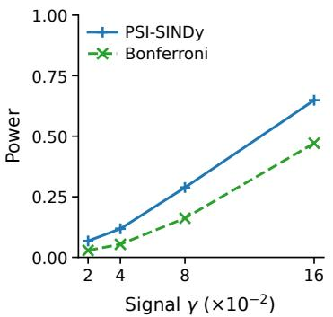
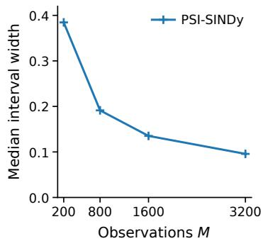
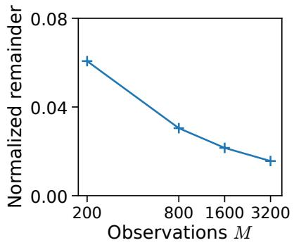
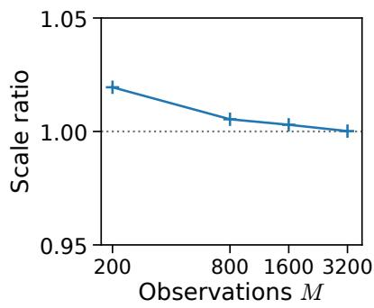
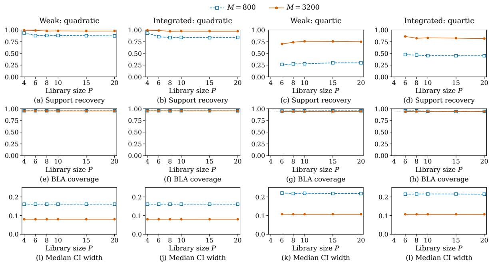

# PSI-SINDy: Post-Selection Inference for Sparse Identification of Nonlinear Dynamics

Ashraful Islam1, Shuichi Nishino2, Tomohiro Shiraishi2, Ichiro Takeuchi2,†

1RIKEN 2Nagoya University

## Abstract

Sparse identification of nonlinear dynamics (SINDy) is a data-driven framework for discovering governing dynamics from time-series data by identifying a sparse subset of candidate dynamical terms from a prespecified library. In this work, we develop a statistical inference framework for quantifying the reliability of dynamical terms selected by SINDy through hypothesis tests and confidence intervals. A key dificulty is that using the same noisy trajectory for both selecting dynamical terms and assessing their statistical significance can introduce selection bias. Postselection inference provides a principled framework for addressing such bias, and we propose PSI-SINDy, a post-selection inference method tailored to SINDy. Direct application of existing post-selection inference techniques is challenging because SINDy involves measurement error in the candidate terms and shared noise between the response and design. To address these challenges, PSI-SINDy uses data thinning to decompose a single observed trajectory into four mutually independent views with distinct roles in selection and inference. This construction enables inference for selected dynamical terms while accounting not only for selection bias but also for measurement-error and shared noise efects. We establish the theoretical validity of PSI-SINDy under stated conditions and evaluate its performance through numerical experiments on simulated and experimental dynamical-system data.

Keywords: Sparse identification of nonlinear dynamics; post-selection inference; dynamical systems;   
measurement error; data thinning.

## 1 INTRODUCTION

Sparse identification of nonlinear dynamics (SINDy) (Brunton et al., 2016) discovers dynamical systems from time-series observations by selecting sparse combinations of terms from a prespecified library. The resulting models provide interpretable descriptions of the dynamics and identify terms relevant to the observed system.

To assess the statistical reliability of terms selected from noisy data, a natural goal is to construct hypothesis tests and confidence intervals. However, reusing the trajectory for inference while treating the selected model as fixed can introduce selection bias (Taylor & Tibshirani, 2015; Berk et al., 2013). This is a form of data double dipping (Kriegeskorte et al., 2009): the same data determine the hypotheses and provide the evidence used to test them.

Post-selection inference (PSI) provides a framework for inference after data-dependent model selection (Lee et al., 2016; Tibshirani et al., 2018; Tian & Taylor, 2018). We propose PSI-SINDy to construct hypothesis tests and confidence intervals for selected dynamical terms while accounting for their selection from a noisy trajectory.

Applying existing PSI methods to SINDy requires additional care. Unlike regression with an error-free design, SINDy’s candidate terms are evaluated from noisy states, introducing measurement error into the design. The response and design also share noise from the same trajectory. These classical inference problems (Fuller, 1987; Bortz et al., 2023) must therefore be addressed jointly with data-dependent selection.

The key idea is to use data thinning (Neufeld et al., 2024) to allocate information from one observed trajectory across four mutually independent views, V1, V2, V3, and $V _ { 4 }$ . We use $V _ { 1 }$ for term selection, $V _ { 2 }$ for constructing the testing response, $V _ { 3 }$ for constructing a corrected design, and $V _ { 4 }$ for constructing an instrument, an independent corrected estimate of the same noise-free design (Sections 2 and 3). Their independence separates selection from inference and the testing response from the noisy design and instrument.

We consider two related inferential targets. Our primary target asks what coeficient each term would have in the best linear approximation within the selected model if the noise-free trajectory were available. Because that trajectory is unobserved, we introduce an auxiliary coeficient using the corrected design and instrument from independent views. Under the assumptions in Section 3, this auxiliary target admits finite-sample-valid conditional tests and confidence intervals. The targets generally difer because the corrected dynamical terms still contain random measurement-error fluctuations. An asymptotic characterization of this diference enables asymptotically valid tests and confidence intervals for the primary target. Section 2 defines both targets and the weak-form SINDy formulation.

Numerical experiments evaluate Type I error, confidence-interval coverage and width in finite samples, and the efect of accounting for uncertainty in the diference between the auxiliary and noise-free targets. We consider simulated and experimental settings, including larger candidate libraries and multistate dynamical systems.

## Contributions.

• We propose PSI-SINDy, a post-selection inference framework for quantifying the statistical reliability of dynamical terms selected by SINDy from a noisy trajectory.

• We develop a four-view data-thinning construction that separates selection, testing response, corrected design, and instrument, thereby addressing selection bias, shared response–design noise, and measurement error in the design.

• We establish finite-sample-valid inference for an auxiliary realized target and asymptotically valid inference for the primary noise-free target through a theoretical bridge between the two, and evaluate the resulting procedure in numerical experiments.

Related Work. SINDy discovers ordinary diferential equations and extends to partial diferential equations (Brunton et al., 2016; Rudy et al., 2017). Weak-form variants use integral relations to avoid numerical diferentiation in both settings (Schaefer & McCalla, 2017; Messenger & Bortz, 2021a,b). For diferential equations whose form is specified in advance, orthogonality-condition methods estimate unknown parameters and construct confidence intervals using large-sample approximations (Brunel et al., 2014). They first estimate a smooth trajectory nonparametrically from noisy observations and then fit the equation through integrated residual conditions. Weak-form estimation of nonlinear dynamics (WENDy) jointly accounts for response and design noise for a prescribed diferential equation (Bortz et al., 2023); its numerical calibration has been studied across noise distributions and levels (Chawla et al., 2026). Continuum-data analysis establishes weak-form SINDy (WSINDy) consistency under specified library, noise, and filtering conditions (Messenger & Bortz, 2025).

Uncertainty quantification in SINDy takes several directions. UQ-SINDy uses sparse Bayesian inference to quantify posterior coeficient uncertainty and term-inclusion probabilities (Hirsh et al., 2022).

Ensemble-SINDy uses bootstrap aggregation to assess term inclusion, coeficient variability, and forecast uncertainty (Fasel et al., 2022); Gao et al. (2023) provide bootstrap guarantees in a sparse linearregression setting with support-recovery conditions. Conformal methods combined with Ensemble-SINDy address time-series prediction, library-term importance, and coeficient uncertainty (Fasel, 2025). These methods do not establish hypothesis tests and confidence intervals conditional on the selected model while jointly accounting for design measurement error and shared response–design noise. PSI-SINDy addresses this joint problem for the selected noise-free approximation without requiring correct support recovery.

Post-selection inference provides valid inference for data-dependent hypotheses. Early work addressed linear-regression selection through simultaneous protection over submodels (Berk et al., 2013) and conditional inference after lasso and related procedures (Lee et al., 2016; Tibshirani et al., 2018). Subsequent work has improved statistical power and computational flexibility; for example, parametric programming reduces unnecessary conditioning for the generalized lasso (Duy & Takeuchi, 2022). Conditional inference also covers k-means clustering (Chen & Witten, 2023) and regions selected by Transformer attention (Shiraishi et al., 2026). Randomized selective inference introduces additional randomization into selection (Tian & Taylor, 2018).

A complementary approach separates information for selection and inference. Classical sample splitting uses disjoint observations, leaving less information for each task (Wasserman & Roeder, 2009; Rinaldo et al., 2019). Gaussian randomized splitting (Garc´ıa Rasines & Young, 2023) and data fission (Leiner et al., 2025) construct statistically tractable components from the same data. Data thinning decomposes observations from suitable distributions into mutually independent views (Neufeld et al., 2024).

## 2 PROBLEM SETUP

We formulate the inference problem by specifying the observation model and weak-form SINDy setup, identifying the statistical challenges, and defining the coeficient targets and hypotheses.

## 2.1 Weak-form SINDy and model selection

Noisy time-series observations and underlying dynamics. We observe a scalar time series $x _ { 1 } , \ldots , x _ { M }$ at $M \geq 2$ uniformly spaced times $t _ { 1 } < \cdots < t _ { M }$ , with $\Delta t = ( t _ { M } - t _ { 1 } ) / ( M - 1 )$ . For a continuously diferentiable noise-free trajectory $x ^ { \star } ( t )$ on $[ t _ { 1 } , t _ { M } ]$ , set $x _ { m } ^ { \star } = x ^ { \star } ( t _ { m } )$ and treat $x ^ { \star } =$ $( x _ { 1 } ^ { \star } , \ldots , x _ { M } ^ { \star } ) ^ { \top }$ as fixed. We assume

$$
x _ { m } = x _ { m } ^ { \star } + \varepsilon _ { m } , \qquad \varepsilon _ { m } \overset { \mathrm { i i d } } { \sim } N ( 0 , \sigma _ { X } ^ { 2 } ) , \quad m \in [ M ] ,\tag{1}
$$

where $\sigma _ { X } ^ { 2 } > 0$ and $[ n ] = \{ 1 , \dots , n \}$ for a positive integer n. Throughout our theoretical development, we treat $\sigma _ { X } ^ { 2 }$ as known; in practice, it may be estimated from an independent data set. The underlying dynamics satisfy

$$
{ \dot { x } } ^ { \star } ( t ) = f { \bigl ( } x ^ { \star } ( t ) { \bigr ) } ,\tag{2}
$$

where $f : \mathbb { R } \to \mathbb { R }$ is unknown and the dot denotes time diferentiation.

Weak-form SINDy. Given prespecified candidate functions $\theta _ { j } : \mathbb { R }  \mathbb { R } , j \in [ P ]$ , SINDy (Brunton et al., 2016) seeks a sparse vector $\pmb { \xi } = ( \xi _ { 1 } , \ldots , \xi _ { P } ) ^ { \top } \in \mathbb { R } ^ { P }$ such that

$$
f ( x ) \approx \sum _ { j \in [ P ] } \xi _ { j } \theta _ { j } ( x ) .\tag{3}
$$

For example, $\theta _ { j } ( x ) = x ^ { j - 1 }$ with $P = 4 { \mathrm { ~ g i v e s ~ } } ( 1 , x , x ^ { 2 } , x ^ { 3 } )$ . To avoid amplifying noise through numerical diferentiation, weak-form SINDy integrates the dynamics against prespecified smooth weights

$\psi _ { 1 } , \dots , \psi _ { K }$ , supported inside $( t _ { 1 } , t _ { M } )$ and vanishing at their support endpoints (Schaefer & McCalla, 2017; Messenger $\&$ Bortz, 2021a; Bortz et al., 2023). The noise-free weak response $\boldsymbol { y } ^ { \star } \in \mathbb { R } ^ { K }$ and design $W ^ { \star } \in \mathbb { R } ^ { K \times P }$ are

$$
y _ { k } ^ { \star } = - \sum _ { m = 1 } ^ { M } \psi _ { k } ^ { \prime } ( t _ { m } ) x _ { m } ^ { \star } \Delta t , k \in [ K ] , \qquad W _ { k j } ^ { \star } = \sum _ { m = 1 } ^ { M } \psi _ { k } ( t _ { m } ) \theta _ { j } ( x _ { m } ^ { \star } ) \Delta t , k \in [ K ] , \ j \in [ P ] .\tag{4}
$$

At the finite-grid level, SINDy seeks a sparse $\boldsymbol { \xi }$ with $\pmb { y } ^ { \star } \approx \pmb { W } ^ { \star } \pmb { \xi } ;$ Appendix A.1 gives the derivation and distinguishes model approximation from discretization error.

Feature selection. Because $y ^ { \star }$ and $W ^ { \star }$ are unobserved, basic SINDy substitutes $x _ { m }$ for $x _ { m } ^ { \star }$ in (4), obtaining $\widehat { \pmb { y } } \in \mathbb { R } ^ { K }$ and $\widehat { W } \in \mathbb { R } ^ { \bar { K } \times P }$ . Sparse regression, such as the lasso or sequentially thresholded least squares, selects candidate functions ${ \widehat { s } } \subseteq [ P ]$ . In PSI-SINDy, selection and its data-dependent hyperparameter choices use only the selection view constructed in Section 3.1. Subsection 2.3 defines each selected coeficient after adjusting for the other selected terms.

## 2.2 Statistical challenges for inference after SINDy

Inference for the selected coeficients must address the following three challenges jointly.

1. Data-dependent model selection. The coeficient targets depend on the selected set ${ \widehat { S } } .$ Reusing the selection data for inference while treating this set as fixed can invalidate tests and confidence intervals (Taylor & Tibshirani, 2015).

2. Dependence between response and design errors. The empirical response $\widehat { \pmb { y } }$ and design $\widehat { W }$ are constructed from the same noisy observations. Their errors are therefore generally dependent, which must be accounted for in inference (Bortz et al., 2023).

3. Measurement error in the design. Replacing the unobserved noise-free design $W ^ { \star }$ with $\widehat { W }$ creates an errors-in-variables (EIV) problem (Fuller, 1987). Nonlinear features can also introduce mean bias; for example, $\mathbb { E } [ x _ { m } ^ { 2 } \mid \pmb { x } ^ { \star } ] = ( x _ { m } ^ { \star } ) ^ { 2 } + \sigma _ { X } ^ { 2 }$ . Inference must account for both this bias and the variability of the noisy design.

## 2.3 Inferential targets and hypotheses

For a realization $\boldsymbol { s }$ of ${ \widehat { s } } ,$ we consider two inferential targets. The first, primary target is the best linear approximation (BLA) coeficient in the noise-free weak regression restricted to ${ \mathcal { S } } .$ The second is an auxiliary realized instrumental-variable (IV) coeficient admitting exact conditional tests and confidence intervals under Section 3’s assumptions. These targets generally difer in finite samples. Their relationship provides the bridge from exact inference for the second target to asymptotically valid inference for the first.

Selected-model best linear approximation (BLA) coeficient. Let $\Sigma _ { \mathrm { t e s t } } \in \mathbb { R } ^ { K \times K }$ be the covariance of the unwhitened testing response constructed in Section 3.1. Shared measurement errors can correlate its components. We assume $\Sigma _ { \mathrm { t e s t } }$ is positive definite and define the symmetric whitening matrix $Q = \Sigma _ { \mathrm { t e s t } } ^ { - 1 / 2 } , \bar { \pmb { y } } ^ { \star } = Q \pmb { y } ^ { \star }$ and $\bar { W } ^ { \star } = Q W ^ { \star }$ . A design subscript S denotes its columns indexed by S. Definition 1 (BLA coeficient for the selected model). Assume $( W _ { S } ^ { \star } ) ^ { \top } \Sigma _ { \mathrm { t e s t } } ^ { - 1 } W _ { S } ^ { \star }$ is invertible. The covariance-weighted selected-model BLA coeficient is

$$
\pmb { \xi } _ { S } ^ { \star } = \underset { \pmb { \beta } \in \mathbb { R } ^ { | S | } } { \arg \operatorname* { m i n } } \| \bar { \pmb { y } } ^ { \star } - \bar { W } _ { S } ^ { \star } \pmb { \beta } \| _ { 2 } ^ { 2 } ,\tag{5}
$$

where $| S |$ is the number of selected features and $\| \cdot \| _ { 2 }$ is the Euclidean norm.

The target allows model misspecification and generally changes with S (Berk et al., 2013; Lee et al., 2016). Write $I _ { n }$ for the $n \times n$ identity matrix, $A ^ { + }$ for the Moore–Penrose pseudoinverse, and $A _ { : , j }$ for column j of A. For $j \in \mathcal S$ , retaining its original library label, adjust for the other selected terms using

$$
M _ { S \backslash \{ j \} } ^ { \star } = I _ { K } - \bar { W } _ { S \backslash \{ j \} } ^ { \star } \big ( \bar { W } _ { S \backslash \{ j \} } ^ { \star } \big ) ^ { + } ,
$$

with $M _ { S \backslash \{ j \} } ^ { \star } = I _ { K } \operatorname { i f } \mathcal { S } \setminus \{ j \}$ is empty. Let $y _ { j , S } ^ { \star \bot } = M _ { S \backslash \{ j \} } ^ { \star } \bar { y } ^ { \star }$ and $w _ { j , S } ^ { \star \bot } = { M } _ { S \setminus \{ j \} } ^ { \star } \bar { W } _ { : , j } ^ { \star }$ . The Frisch–Waugh– Lovell representation (Lovell, 1963) is

$$
\xi _ { j , S } ^ { \star } = \frac { ( w _ { j , S } ^ { \star \perp } ) ^ { \top } y _ { j , S } ^ { \star \perp } } { ( w _ { j , S } ^ { \star \perp } ) ^ { \top } w _ { j , S } ^ { \star \perp } } .\tag{6}
$$

Definition 1’s rank assumption ensures a positive denominator; Appendix A.2 gives the derivation.

Realized instrumental-variable (IV) coeficient. We introduce the second, auxiliary target to obtain exact conditional inference and an asymptotic connection to the primary BLA. The noise-free design is unobserved, so we construct corrected quantities from independent views. Gaussian correction removes polynomial feature-mean bias (Stefanski, 1989), but leaves random design error. We therefore pair a corrected design $\widetilde { W } \in \mathbb { R } ^ { K \times P }$ with an independent corrected estimate $\widetilde { Z } \in \mathbb { R } ^ { K \times P }$ of the same noise-free design, used as an instrument. In whitened coordinates,

$$
\mathbb { E } [ \widetilde { W } \mid \pmb { x } ^ { \star } ] = \mathbb { E } [ \widetilde { Z } \mid \pmb { x } ^ { \star } ] = \bar { W } ^ { \star } , \qquad \widetilde { W } \perp \widetilde { Z } \mid \pmb { x } ^ { \star } .\tag{7}
$$

Before residualization, their expected cross-product is the whitened noise-free Gram matrix: $\mathbb { E } [ \widetilde { Z } ^ { \top } \widetilde { W } \ |$ $\pmb { x } ^ { \star } ] = ( \bar { W } ^ { \star } ) ^ { \top } \bar { W } ^ { \star }$ . Section 3.1 constructs these matrices for fixed-degree polynomial libraries under the Gaussian measurement model.

To adjust term j for the other selected terms, we apply the residualization idea in (6) to the corrected design. For $j \in \mathcal S$ , set

$$
\widetilde { M } _ { S \backslash \{ j \} } = I _ { K } - \widetilde { W } _ { S \backslash \{ j \} } \big ( \widetilde { W } _ { S \backslash \{ j \} } \big ) ^ { + } ,
$$

with $\widetilde { M } _ { S \backslash \{ j \} } = I _ { K } \mathrm { i f } \ : S \backslash \{ j \}$ is empty. Set $\widetilde { y } _ { j , S } ^ { \perp } = \widetilde { M } _ { S \setminus \{ j \} } \bar { y } ^ { \star } , \widetilde { w } _ { j , S } ^ { \perp } = \widetilde { M } _ { S \setminus \{ j \} } \widetilde { W } _ { : , j }$ , and $\widetilde { z } _ { j , S } ^ { \perp } = \widetilde { M } _ { S \backslash \{ j \} } \widetilde { Z } _ { : , j }$ The residualized response uses the noise-free mean and is random through $M _ { S \backslash \{ j \} }$ . The same estimated matrix residualizes all three quantities; independence in (7) applies before residualization.

Definition 2 (Realized IV coeficient for the selected model).

Suppose $( \widetilde { z } _ { j , S } ^ { \perp } ) ^ { \top } \widetilde { w } _ { j , S } ^ { \perp } \neq 0$ . The realized IV coeficient is

$$
c _ { j , S } ^ { \star } = \frac { ( \widetilde { z } _ { j , S } ^ { \perp } ) ^ { \top } \widetilde { y } _ { j , S } ^ { \perp } } { ( \widetilde { z } _ { j , S } ^ { \perp } ) ^ { \top } \widetilde { w } _ { j , S } ^ { \perp } } ,\tag{8}
$$

the unique $c \in \mathbb { R }$ satisfying $( \widetilde { z } _ { j , S } ^ { \bot } ) ^ { \top } ( \widetilde { y } _ { j , S } ^ { \bot } - c \widetilde { w } _ { j , S } ^ { \bot } ) = 0 .$

Equations (6) and (8) have parallel forms, but use diferent residualizers; the IV coeficient also uses an instrument in the inner products. Even for fixed S, the IV target is random through the corrected design and instrument. Conditioning on the selected set and both matrices fixes the target for exact inference.

Post-selection hypotheses. For each $j \in \widehat { \mathcal { S } }$ , whenever the corresponding target is defined, we consider

$$
H _ { 0 , j } ^ { \mathrm { I V } } ( c _ { 0 } ) : c _ { j , \widehat { S } } ^ { \star } = c _ { 0 } , \qquad H _ { 0 , j } ^ { \mathrm { B L A } } ( c _ { 0 } ) : \xi _ { j , \widehat { S } } ^ { \star } = c _ { 0 } ,\tag{9}
$$

where $c _ { 0 } \in \mathbb { R }$ is specified. Setting $c _ { 0 } = 0$ tests whether the relevant coeficient is zero within the selected model. A zero selected-BLA coeficient does not by itself establish absence of the term from the underlying governing equation.

## 3 PSI-SINDY

The key idea of PSI-SINDy is to use data thinning to decompose a single noisy trajectory into four mutually independent views with distinct roles in selection and inference. This construction first enables finite-sample exact conditional inference for the second, auxiliary IV target. We then establish an asymptotic bridge from this auxiliary target to the first, primary selected-BLA target, leading to asymptotically valid inference for the latter.

## 3.1 Four-view Gaussian data thinning

Let $V _ { 1 } , V _ { 2 } , V _ { 3 } $ , and $V _ { 4 }$ denote the four independent views obtained by Gaussian data thinning (Neufeld et al., 2024). Prespecified fractions $a _ { i } > 0$ with $\textstyle \sum _ { i = 1 } ^ { 4 } a _ { i } = 1$ give $V _ { i } \sim N ( { \pmb x } ^ { \star } , s _ { i } ^ { 2 } I _ { M } )$ , where $s _ { i } ^ { 2 } = \sigma _ { X } ^ { 2 } / a _ { i }$ The four views are assigned distinct roles so that selection and inference use independent information. Model selection and data-dependent tuning of the selector use $V _ { 1 }$ alone. Any auxiliary selection randomization is independent of all four views. Let A denote the sigma-field generated by $V _ { 1 }$ and this randomization.

We construct the weak testing response $\bar { y } ^ { \mathrm { t e s t } }$ from $V _ { 2 }$ in the whitened coordinates of Section 2. Applying Gaussian measurement-error correction (Stefanski, 1989) to the polynomial features evaluated on $V _ { 3 }$ and $V _ { 4 }$ yields the corrected design $\widetilde { W }$ and instrument ${ \widetilde { Z } } ,$ , respectively, satisfying (7). The independence of the four views is crucial for inference. Let $\mathcal { H } = \sigma ( \mathcal { A } , \widetilde { W } , \widetilde { Z } )$ denote the information from selection, the corrected design, and the instrument. Conditioning on H fixes these quantities while leaving the testing response with independent Gaussian noise:

$$
\bar { \pmb { y } } ^ { \mathrm { t e s t } } = \bar { \pmb { y } } ^ { \star } + \varepsilon ^ { \mathrm { t e s t } } , \ \varepsilon ^ { \mathrm { t e s t } } \sim N ( 0 , I _ { K } ) , \ \varepsilon ^ { \mathrm { t e s t } } \ \bot \ \forall \ d t .\tag{10}
$$

This conditional Gaussian property enables the finite-sample exact inference developed in Section 3.2, while the remaining random errors in the corrected design and instrument enter the IV–BLA gap studied in Section 3.3. Appendix B.1 gives the thinning construction, weak maps, and correction formulas.

## 3.2 Exact conditional inference for the realized IV coeficient

The conditional Gaussian property in (10) enables exact inference for the auxiliary IV target. For a selected term $j \in \mathcal S$ , define $d _ { j , S } = ( \widetilde { z } _ { j , S } ^ { \perp } ) ^ { \top } \widetilde { w } _ { j , S } ^ { \perp }$ using the residualized quantities from Section 2.3. When $d _ { j , S } \neq 0$ , replacing the noise-free response in (8) with the testing response gives the estimator and standard error

$$
\widehat { c } _ { j , S } = \frac { ( \widetilde { z } _ { j , S } ^ { \perp } ) ^ { \top } \bar { y } ^ { \mathrm { t e s t } } } { d _ { j , S } } , \qquad e _ { j , S } = \frac { \| \widetilde { z } _ { j , S } ^ { \perp } \| _ { 2 } } { | d _ { j , S } | } .\tag{11}
$$

Conditional on $\mathcal { H } ,$ , the target $c _ { j , s } ^ { \star }$ and $e _ { j , S }$ are fixed and $\widehat { c } _ { j , S }$ is linear in the Gaussian testing response, which gives Theorem 1. For $p \in ( 0 , 1 )$ , let $z _ { p } = \Phi ^ { - 1 } ( p )$ , where Φ is the standard normal distribution function.

Theorem 1 (Exact conditional IV inference). Assume the measurement model (1) with known $\sigma _ { X } ^ { 2 }$ and the four-view construction of Section 3.1, so that (10) holds (Lemma B.1). Whenever $d _ { j , s } \neq 0$ , the standardized estimation error has the conditional distribution

$$
\frac { \widehat { c } _ { j , S } - c _ { j , S } ^ { \star } } { e _ { j , S } } \mid \mathcal { H } \sim N ( 0 , 1 ) .\tag{12}
$$

For $0 < \alpha < 1$ , define

$$
I _ { j , S } ^ { \mathrm { I V } } ( \alpha ) = [ \widehat c _ { j , S } - z _ { 1 - \alpha / 2 } e _ { j , S } , ~ \widehat c _ { j , S } + z _ { 1 - \alpha / 2 } e _ { j , S } ] , \qquad p _ { j , S } ^ { \mathrm { I V } } ( c _ { 0 } ) = 2 \Phi \left( - \frac { | \widehat c _ { j , S } - c _ { 0 } | } { e _ { j , S } } \right) .\tag{13}
$$

Then $\mathbb { P } \{ c _ { j , S } ^ { \star } \in I _ { j , S } ^ { \mathrm { I V } } ( \alpha ) \mid \mathcal { H } \} = 1 - \alpha$ . The p-value evaluated at $c _ { j , s } ^ { \star }$ is uniform on (0, 1) conditional on H.

When $d _ { j , S } = 0$ , the realized IV coeficient is unidentified and no IV test or interval is reported; additional numerical checks preserve the conditional guarantee for available IV inference if they depend only on H.

## 3.3 Relating the IV and BLA coeficients

An exact IV interval need not cover the primary selected-BLA coeficient: the estimation error for that target contains an additional component. When both targets are defined,

$$
\widehat { c } _ { j , S } - \xi _ { j , S } ^ { \star } = \underbrace { \widehat { c } _ { j , S } - c _ { j , S } ^ { \star } } _ { \mathrm { r e s p o n s e ~ e r r o r } } + \underbrace { c _ { j , S } ^ { \star } - \xi _ { j , S } ^ { \star } } _ { \mathrm { I V - B L A ~ d i f f e r e n c e ~ ( g a p ) } } .
$$

Theorem 1 characterizes the response error. To obtain inference for the primary BLA target, it remains to quantify the IV–BLA diference. If the corrected design and instrument were equal to the noise-free design, $\widetilde { W } = \widetilde { Z } = \bar { W } ^ { \star }$ , the two targets would coincide. The remaining diference therefore arises from the random errors in the corrected design and instrument. We quantify their efect by expanding in $E _ { 3 } = \widetilde { W } - \bar { W } ^ { \star }$ and $E _ { 4 } = \widetilde { Z } - \bar { W } ^ { \star }$ . We ${ \mathrm { u s e } } \Rightarrow { \mathrm { a n d } } \to _ { p }$ for convergence in distribution and probability, respectively.

To characterize the IV–BLA diference asymptotically, we consider the following fixed-dimensional dense-grid regime.

Assumption 1 (Fixed-dimensional weak-design limit). The observation grid becomes dense on a fixed time interval as $M \to \infty$ . The dimensions K and $P ,$ noise variance $\sigma _ { X } ^ { 2 }$ , thinning fractions, and weak weight functions remain fixed. There exist deterministic limits $A \in \mathbb { R } ^ { \hat { K } \times P }$ and $b \in \mathbb { R } ^ { K }$ such that

$$
{ \cal A } _ { { \cal M } } : = \bar { \cal W } ^ { \star } / \sqrt { { \cal M } } \longrightarrow { \cal A } , \qquad b _ { { \cal M } } : = \bar { \pmb { y } } ^ { \star } / \sqrt { { \cal M } } \longrightarrow b .
$$

The submatrix $A _ { S } .$ , containing the columns of A indexed by S, has full column rank. The errors $( E _ { 3 } , E _ { 4 } )$ converge jointly in distribution to independent centered Gaussian matrices $( \mathcal { E } _ { 3 } , \mathcal { E } _ { 4 } )$ with finite covariance matrices $\Omega _ { 3 } , \Omega _ { 4 }$ of their columnwise vectorizations.

For fixed-degree polynomial libraries, Proposition B.1 gives suficient trajectory and weak-weight conditions for these limits; full column rank of $A _ { \cal { S } }$ remains a separate assumption.

The first-order gap combines instrument error, the error in adjusting for the other selected terms, and corrected-design error. Only the last remains when the limiting selected-model approximation residual is zero. For $j \in \mathcal S$ , let $q > 0$ be the squared norm of column $j$ of A after projecting out the other selected columns, and let $\tau _ { j , S } \geq 0$ denote the standard deviation of the Gaussian limit of $\sqrt { M } ( c _ { j , S } ^ { \star } - \xi _ { j , S } ^ { \star } )$ Appendix B.4 derives the expansion and its variance (B.13).

Theorem 2 (Selected-model IV–BLA bridge). Under Assumption 1, for each fixed selected set S and coordinate $j \in \mathcal S$

$$
\sqrt { M } ( c _ { j , S } ^ { \star } - \xi _ { j , S } ^ { \star } ) \Rightarrow N ( 0 , \tau _ { j , S } ^ { 2 } ) , \qquad M e _ { j , S } ^ { 2 }  _ { p } \kappa _ { j , S } ^ { 2 } : = 1 / q > 0 .\tag{14}
$$

The probability that the IV coeficient is unidentified tends to zero. These conclusions also hold conditional on ${ \widehat { S } } = { \mathcal { S } }$ whenever that event has positive probability along the sequence considered.

The gap contributes uncertainty at the response error’s $M ^ { - 1 / 2 }$ scale when $\tau _ { j , S } > 0$ and is negligible at this scale when $\tau _ { j , S } = 0 \mathrm { { ; } }$ ; the centering in (14) remains the finite-grid BLA of Section 2.

## 3.4 Asymptotic inference for the selected BLA

We now combine the two uncertainty components identified in Section 3.3 to obtain inference for the primary BLA target. The response error is quantified by the exact conditional standard error $e _ { j , S }$ from Section 3.2, while the IV–BLA gap contributes an additional asymptotic uncertainty of scale $\tau _ { j , S } / \sqrt { M }$ Because their limiting Gaussian components are independent (Theorems 1 and 2), their variances add. With $\widehat { t } _ { j , S } \geq 0$ estimating $\tau _ { j , S } / \sqrt { M }$ , the combined standard error, confidence interval, and two-sided p-value are

$$
\widehat { s } _ { j , S } = \sqrt { e _ { j , S } ^ { 2 } + \widehat { t } _ { j , S } ^ { 2 } } , \qquad I _ { j , S } ^ { \mathrm { B L A } } ( \alpha ) = \widehat { c } _ { j , S } \pm z _ { 1 - \alpha / 2 } \widehat { s } _ { j , S } , \qquad p _ { j , S } ^ { \mathrm { B L A } } ( c _ { 0 } ) = 2 \Phi \left( - \frac { | \widehat { c } _ { j , S } - c _ { 0 } | } { \widehat { s } _ { j , S } } \right) .\tag{15}
$$

The response scale $e _ { j , S }$ is available directly from (11), whereas the IV–BLA gap scale depends on the unknown noise-free trajectory through the remaining uncertainty in the corrected design and instrument. We therefore estimate this additional scale using a parametric bootstrap (Davison & Hinkley, 1997) around a pilot trajectory xb. The pilot is obtained by local cubic smoothing of the allocation-weighted average $( a _ { 2 } V _ { 2 } + a _ { 3 } V _ { 3 } + a _ { 4 } V _ { 4 } ) / ( 1 - a _ { 1 } )$ , using a prespecified bandwidth. It therefore uses only views independent of the selection view.

Each draw fixes the selected support and the pilot’s whitened weak response, regenerates the corrected design and instrument, and recomputes residualization and the IV coeficient. Fixing the response isolates gap uncertainty, since $e _ { j , S }$ already accounts for testing-response noise.

The gap scale $\widehat { t } _ { j , s }$ is the interquartile range of the retained IV coeficients divided by $2 \Phi ^ { - 1 } ( 3 / 4 )$ . This normal-reference scale does not require the unfiltered finite-sample IV ratio to have a finite variance. Appendix B.5 and Algorithm 2 specify the construction and retention checks.

Under the conditions of Proposition B.2, $\sqrt { M } \widehat { t } _ { j , S } \to _ { p } \tau _ { j , S }$ as M and the number of bootstrap draws $B _ { \mathrm { b o o t } }$ tend to infinity, including when $\tau _ { j , S } = 0$

Theorem 3 (Asymptotically valid selected-BLA inference). Fix a selected set S and coordinate $j \in \mathcal S$ such that $\mathbb { P } ( \widehat { \cal S } = { \cal S } ) > 0$ along the sequence considered. Assume the conditions of Theorems 1 and 2 and Proposition B.2 hold, and the observed and pilot numerical checks pass with probability tending to one for this support. Conditional on ${ \widehat { S } } = S$ 2

$$
\frac { \widehat { c } _ { j , S } - \xi _ { j , S } ^ { \star } } { \widehat { s } _ { j , S } } \Rightarrow N ( 0 , 1 ) .\tag{16}
$$

Consequently, for every fixed $0 < \alpha < 1$ ，

$$
\mathbb { P } \{ \xi _ { j , S } ^ { \star } \in I _ { j , S } ^ { \mathrm { B L A } } ( \alpha ) \mid \widehat { \mathcal { S } } = S \}  1 - \alpha ,
$$

and the p-value evaluated at the true selected BLA coeficient converges in distribution to a uniform random variable on (0, 1).

BLA validity conditions on the selected support and allows the design and instrument to vary; exact IV validity conditions on H. The BLA result assumes dense observations of a scalar trajectory, a fixed polynomial library, and fixed weak weights. The pilot may use $V _ { 2 } .$ , since scale consistency does not require independence from the testing response.

IV inference remains available when design and instrument checks pass, even if the gap scale is unavailable. Failed BLA checks yield the interval R and $p = 1$ ; their probabilities vanish under the stated asymptotic conditions. Within the selected family, Bonferroni intervals and Bonferroni or Holm tests provide simultaneous coverage and familywise error control, respectively, conditionally in finite samples for available IV inference and asymptotically for BLA under the respective conditions (Appendix B.6). Algorithms 1–2 specify reporting, and Appendix B contains the proofs.

  
(a) True-BLA rejection(a) True-BLA rejection

  
(b) Reference-null power

  
(c) BLA interval width  
Figure 1: Primary selected-BLA inference conditional on selecting $x ^ { 2 } \left( \sigma _ { X } = 0 . 0 6 , \delta = 0 \right)$ . (a) Rejection at each support’s true BLA, $\gamma = 0 ;$ dotted line at 0.05. (b) Power against the reference null (18), $M = 8 0 0$ . (c) Median width of PSI-SINDy’s 95% BLA intervals, $\gamma = 0 ;$ counts and MC intervals in Tables 2–3.

## 4 EXPERIMENTS

Methods and evaluation metrics. We assess Type I error, reference-null power, coverage, and median interval width at nominal level 0.05. Type I error is the rejection rate when testing each selected support’s true BLA or realized IV coeficient; coverage is the complementary rate for the corresponding 95% intervals on the same cases. Appendix C.2 specifies target-specific denominators, unavailable-inference handling, and pointwise Wilson Monte Carlo intervals.

Naive reuses the selection response while retaining the corrected design and independent instrument. Model-count Bonferroni adjusts Naive p-values over eligible models. Their definitions and guarantees are in Appendix B.9.

Simulation setup. We simulate noisy observations from the scalar dynamics

$$
{ \dot { x } } ^ { \star } ( t ) = - 0 . 2 5 - 0 . 3 5 x ^ { \star } ( t ) + \gamma \{ x ^ { \star } ( t ) \} ^ { 2 } + \delta \sin \{ 2 x ^ { \star } ( t ) \} , \qquad x ^ { \star } ( 0 ) = 1 . 2 , \qquad t \in [ 0 , 8 ] .\tag{17}
$$

Primary simulations use independent Gaussian noise with known $\sigma _ { X } = 0 . 0 6$ , the library $( 1 , x , x ^ { 2 } , x ^ { 3 } )$ $K = 1 2$ weak equations, and equal thinning fractions. Sequentially thresholded least squares (STLSQ) selects corrected, whitened features on V1, retaining the intercept, with a threshold fixed using only selected-support counts from separate pilot simulations.

Each primary setting has 5,000 independently generated datasets. Calibration uses $\gamma = \delta = 0$ and $M \in \{ 2 0 0 , 8 0 0 , 1 6 0 0 , 3 2 0 0 \}$ ; power uses $\delta = 0 , M = 8 0 0$ , and $\gamma \in \{ 0 . 0 2 , 0 . 0 4 , 0 . 0 8 , 0 . 1 6 \}$ . For the quadratic coeficient $( j = 3 )$ , BLA calibration uses each support’s true coeficient as the null value. All methods use the same datasets selecting this term. Rejection, coverage, and power are proportions over these datasets, retaining each support’s target. Bonferroni counts the four models containing the intercept and quadratic term.

For the power comparison, we test

$$
H _ { 0 , S } : ~ \xi _ { 3 , S } ^ { \star } = \xi _ { 3 , S } ^ { \star , ( 0 ) } ,\tag{18}
$$

where $\xi _ { 3 , S } ^ { \star , ( 0 ) }$ is the same subset’s quadratic BLA on the $\gamma = 0$ reference trajectory; omitted relevant terms can make it nonzero. Every selected quadratic coeficient received a finite PSI-SINDy interval in the primary simulations. Appendix C gives the protocol, selected counts, and pointwise Monte Carlo (MC) intervals (Morris et al., 2019).

## 4.1 Type I error, power, coverage, and interval width

Primary PSI-SINDy rejection rates at the true selected BLA are 4.41%–5.39% (Figure 1), versus 7.36%–8.69% for Naive and 1.61%–2.02% for Bonferroni. Its 95% intervals have 94.61%–95.59% coverage on these datasets, and all four MC rejection intervals contain 5%. As M increases from 200 to 3200, the median BLA interval width decreases from 0.3846 to 0.0957.

Across the signal grid, power for (18) rises from 6.75% to 64.85% for PSI-SINDy and from 2.85% to 47.10% for Bonferroni; quadratic-term selection frequency rises from 70.80% to 97.92%. Higher power is specific to this protocol: a supplementary comparison reverses the ordering (Appendix D.3). Neither comparison establishes superiority at matched conditional Type I error.

Pooled calibration does not establish calibration within every selected model: one of eight prespecified support groups in the supplementary study shows conditional BLA undercoverage (Appendix D.1).

Comparison with coeficient-bootstrap methods. We compare PSI-SINDy with Ensemble-SINDy data-bagging adapters (Fasel et al., 2022) and a residual-bootstrap adapter motivated by Gao et al. (2023). At $M = 8 0 0 , \sigma _ { X } = 0 . 0 6$ , and δ = 0, we test the structural null $H _ { 0 } : \gamma = 0$ on the same 1,382 of 2,000 datasets in which PSI-SINDy selects $x ^ { 2 }$ . Rejection is 4.70% for PSI-SINDy, 8.10% for the longer-smoothing ensemble, and 20.48% for the residual adapter; the latter two MC intervals exclude 5%. The five-point ensemble has no observed rejections but about 15 times PSI-SINDy’s median interval width. This empirical comparison concerns the specified adapters and structural target. Appendix C.4 gives implementation details, coverage, widths, and a setting with a diferent ordering.

## 4.2 Efect of measurement-error adjustments

Table 1 assesses feature correction and gap adjustment with matched observations, selection, views, and bootstrap randomness at the same true selected BLA; removing the gap scale keeps the estimate, whereas removing feature correction recomputes the design, instrument, estimate, and standard error.

Omitting the gap scale increases rejection for all three coeficients at both noise levels. Removing feature correction raises high-noise intercept rejection from 5.53% to 11.06%, but leaves the linear and quadratic tests unchanged: the included intercept absorbs the constant subtracted from the quadratic feature, an efect specific to the selected basis.

We also examine the accuracy of the asymptotic bridge at the sample sizes used. Primary bridge diagnostics show a decreasing median normalized linearization remainder with M and a median estimated-to-oracle scale ratio close to one (Appendix D.2). In a separate sine-drift study, rejection at the respective true coeficients is 12.18% for BLA and 5.15% for IV inference, conditional on selection of the quadratic term (Appendix G). BLA failure coincides with a larger bridge remainder (Table 7), illustrating that near-nominal IV calibration does not ensure finite-sample BLA calibration.

## 4.3 Larger libraries and multistate systems

We examine libraries with up to P = 20 candidates and four multistate systems. Larger-library inference remains informative within sparse selected models; in a separate study with unregularized selection, intervals widen substantially (Appendix E). This does not establish growing-dimensional validity. Multistate experiments extend beyond the scalar BLA theorem: gap adjustment improves coverage, but nominal coverage is not uniformly attained (Appendix F).

Table 1: Rejection at the true selected BLA $( \% ;$ nominal 5%) in the matched polynomial study: $\gamma = 0 . 2 0$ $\delta = 0 , M = 8 0 0 , S = \{ 1 , 2 , 3 \}$ . $N _ { S }$ counts datasets selecting this support. Full uses both adjustments. Paired diferences and MC intervals are in Table 8.
<table><tr><td></td><td>Term  $N _ { S }$ </td><td>Full No gap</td><td>No feature correction</td></tr><tr><td> $\sigma _ { X }$  0.06</td><td>1</td><td>812 5.42 7.51</td><td>6.28</td></tr><tr><td>0.06</td><td>x</td><td>812 5.30 7.51</td><td>5.30†</td></tr><tr><td>0.06</td><td> $x ^ { 2 }$ </td><td>812 5.42 6.28</td><td>5.42†</td></tr><tr><td>0.12</td><td>1</td><td>452 25.53 7.30</td><td>11.06</td></tr><tr><td>0.12</td><td>x</td><td>452 6.86 8.85</td><td>6.86†</td></tr><tr><td>0.12</td><td> $x ^ { 2 }$ </td><td>452 5.53 6.86</td><td>5.53†</td></tr></table>

† For the selected basis $\{ 1 , x , x ^ { 2 } \}$ , the intercept absorbs the quadratic correction, leaving the x and $x ^ { 2 }$ tests unchanged.

## 4.4 Supercapacitor discharge data

We analyze eight supercapacitor discharge traces (Hanschek et al., 2026a,b) using a cubic voltage library, M = 1600 processed observations per device, and K = 20 weak equations. Device 1 retains constant, linear, and cubic terms; Table 14 reports estimates and nominal 95% intervals. Estimated noise variance and unresolved temporal dependence place this application outside the theoretical guarantees. Appendix H specifies preprocessing and settings.

Simulations based on fixed, smoothed traces assess sensitivity to temporal dependence while inference assumes independent noise. With the true marginal noise scale supplied, selected-coeficient BLA coverage, averaged equally across devices, is 95.23% under independent noise and 81.86% under correlated noise (Table 15). These simulations show sensitivity to dependence; they do not validate measured-trace coverage.

## 5 CONCLUSION

We proposed PSI-SINDy for statistical inference after selecting dynamical terms from a noisy trajectory. Four-view data thinning and measurement-error correction address selection bias, shared response–design noise, and design measurement error. It gives finite-sample exact conditional inference for the auxiliary realized IV coeficient and, through an asymptotic bridge, asymptotically valid inference for the primary selected-model BLA coeficient. In the primary simulations, its Type I error and coverage are compatible with the nominal level, whereas naive reuse of the selection response inflates rejection. Omitting the gap adjustment also increases rejection in the matched ablation.

The selected-model BLA is a least-squares approximation to the noise-free weak response and need not equal a governing-equation coeficient. Its inferential guarantee is asymptotic and currently established for scalar trajectories, fixed polynomial libraries, and independent Gaussian noise of known variance; in some supplementary settings, BLA intervals undercover in finite samples even where exact IV inference remains near nominal. Finite-sample calibration and extensions to multistate systems, broader libraries, dependent noise, and estimated noise variance remain open.

## AI Use Statement

During manuscript preparation, generative AI tools assisted with paper organization, suggestions of potentially relevant references, language editing, and discussion of schematic illustration design. Generative AI tools also assisted with drafting and revising technical passages, reviewing mathematical arguments, providing feedback on methodology and experimental analyses, interpreting results, reviewing and refining existing code, and developing numerical verification scripts. The authors checked all cited references against the original sources and independently obtained the bibliographic information.

The authors reviewed and verified all AI-assisted work and take full responsibility for the final manuscript, including its text, claims, code, analyses and proofs.

## References

Richard Berk, Lawrence Brown, Andreas Buja, Kai Zhang, and Linda Zhao. Valid post-selection inference. The Annals of Statistics, 41(2):802–837, 2013. doi: 10.1214/12-AOS1077.

David M. Bortz, Daniel A. Messenger, and Vanja Dukic. Direct estimation of parameters in ODE models using WENDy: Weak-form estimation of nonlinear dynamics. Bulletin of Mathematical Biology, 85 (11):110, 2023. doi: 10.1007/s11538-023-01208-6.

Nicolas J.-B. Brunel, Quentin Clairon, and Florence d’Alch´e-Buc. Parametric estimation of ordinary diferential equations with orthogonality conditions. Journal of the American Statistical Association, 109(505):173–185, 2014. doi: 10.1080/01621459.2013.841583. URL https://arxiv.org/abs/1410. 7566.

Steven L. Brunton, Joshua L. Proctor, and J. Nathan Kutz. Discovering governing equations from data by sparse identification of nonlinear dynamical systems. Proceedings of the National Academy of Sciences, 113(15):3932–3937, 2016. doi: 10.1073/pnas.1517384113.

Abhi Chawla, David M. Bortz, and Vanja Dukic. Bias and coverage properties of the WENDy-IRLS algorithm. In Bharath Sriraman (ed.), Handbook of Visual, Experimental and Computational Mathematics, pp. 1639–1746. Springer, Cham, 2026. doi: 10.1007/978-3-032-16368-4 86. URL https://link.springer.com/rwe/10.1007/978-3-032-16368-4\_86.

Yiqun T. Chen and Daniela M. Witten. Selective inference for k-means clustering. Journal of Machine Learning Research, 24(152):1–41, 2023. URL https://jmlr.org/papers/v24/22-0371.html.

A. C. Davison and D. V. Hinkley. Bootstrap Methods and their Application. Cambridge University Press, 1997. doi: 10.1017/cbo9780511802843.

Vo Nguyen Le Duy and Ichiro Takeuchi. More powerful conditional selective inference for generalized lasso by parametric programming. Journal of Machine Learning Research, 23(300):1–37, 2022. URL https://jmlr.org/papers/v23/21-0494.html.

Urban Fasel. Sparse identification of nonlinear dynamics with conformal prediction. arXiv preprint arXiv:2507.11739, 2025. URL https://arxiv.org/abs/2507.11739.

Urban Fasel, J. Nathan Kutz, Bingni W. Brunton, and Steven L. Brunton. Ensemble-SINDy: Robust sparse model discovery in the low-data, high-noise limit, with active learning and control. Proceedings of the Royal Society A: Mathematical, Physical and Engineering Sciences, 478(2260):20210904, 2022. doi: 10.1098/rspa.2021.0904.

Wayne A. Fuller. Measurement Error Models. John Wiley & Sons, 1987. doi: 10.1002/9780470316665.

L. Mars Gao, Urban Fasel, Steven L. Brunton, and J. Nathan Kutz. Convergence of uncertainty estimates in ensemble and Bayesian sparse model discovery. arXiv preprint arXiv:2301.12649, 2023. URL https://arxiv.org/abs/2301.12649.

D. Garc´ıa Rasines and G. A. Young. Splitting strategies for post-selection inference. Biometrika, 110 (3):597–614, 2023. doi: 10.1093/biomet/asac070.

G. H. Golub and V. Pereyra. The diferentiation of pseudo-inverses and nonlinear least squares problems whose variables separate. SIAM Journal on Numerical Analysis, 10(2):413–432, 1973. doi: 10.1137/0710036.

A. Hanschek, S. Dusini, and P. Grbovi´c. A standard-aligned framework for voltage-dependent supercapacitor characterization. IEEE Open Journal of Industry Applications, 7:485–499, 2026a. doi: 10.1109/OJIA.2026.3675690.

A. J. Hanschek, S. Dusini, G. Tatschl, A. Horn, and P. Grbovic. Supercapacitor discharge measurements 25F and 50F DUT-sets. Zenodo, 2026b. URL https://doi.org/10.5281/zenodo.19221698. Version 1.0. Dataset.

Seth M. Hirsh, David A. Barajas-Solano, and J. Nathan Kutz. Sparsifying priors for Bayesian uncertainty quantification in model discovery. Royal Society Open Science, 9(2):211823, 2022. doi: 10.1098/rsos. 211823.

Sture Holm. A simple sequentially rejective multiple test procedure. Scandinavian Journal of Statistics, 6(2):65–70, 1979. URL https://www.jstor.org/stable/4615733.

Nikolaus Kriegeskorte, W. Kyle Simmons, Patrick S. F. Bellgowan, and Chris I. Baker. Circular analysis in systems neuroscience: the dangers of double dipping. Nature Neuroscience, 12:535–540, 2009. doi: 10.1038/nn.2303.

Jason D. Lee, Dennis L. Sun, Yuekai Sun, and Jonathan E. Taylor. Exact post-selection inference, with application to the lasso. The Annals of Statistics, 44(3):907–927, 2016. doi: 10.1214/15-AOS1371.

James Leiner, Boyan Duan, Larry Wasserman, and Aaditya Ramdas. Data fission: Splitting a single data point. Journal of the American Statistical Association, 120(549):135–146, 2025. doi: 10.1080/01621459.2023.2270748.

Michael C. Lovell. Seasonal adjustment of economic time series and multiple regression analysis. Journal of the American Statistical Association, 58(304):993–1010, 1963. doi: 10.1080/01621459.1963.10480682.

Tatsuya Matsukawa, Tomohiro Shiraishi, Shuichi Nishino, Teruyuki Katsuoka, and Ichiro Takeuchi. Statistical test for auto feature engineering by selective inference. In Proceedings of the 28th International Conference on Artificial Intelligence and Statistics, volume 258 of Proceedings of Machine Learning Research, pp. 3214–3222. PMLR, 2025. URL https://proceedings.mlr.press/v258/ matsukawa25a.html.

Daniel A. Messenger and David M. Bortz. Weak SINDy: Galerkin-based data-driven model selection. Multiscale Modeling & Simulation, 19(3):1474–1497, 2021a. doi: 10.1137/20M1343166.

Daniel A. Messenger and David M. Bortz. Weak SINDy for partial diferential equations. Journal of Computational Physics, 443:110525, 2021b. doi: 10.1016/j.jcp.2021.110525.

Daniel A. Messenger and David M. Bortz. Asymptotic consistency of the WSINDy algorithm in the limit of continuum data. IMA Journal of Numerical Analysis, 45(6):3264–3312, 2025. doi: 10.1093/imanum/drae086.

Tim P. Morris, Ian R. White, and Michael J. Crowther. Using simulation studies to evaluate statistical methods. Statistics in Medicine, 38(11):2074–2102, 2019. doi: 10.1002/sim.8086.

Anna Neufeld, Ameer Dharamshi, Lucy L. Gao, and Daniela Witten. Data thinning for convolutionclosed distributions. Journal of Machine Learning Research, 25(57):1–35, 2024. URL https://jmlr. org/papers/v25/23-0446.html.

Alessandro Rinaldo, Larry Wasserman, and Max G’Sell. Bootstrapping and sample splitting for high-dimensional, assumption-lean inference. The Annals of Statistics, 47(6):3438–3469, 2019. doi: 10.1214/18-aos1784.

Samuel H. Rudy, Steven L. Brunton, Joshua L. Proctor, and J. Nathan Kutz. Data-driven discovery of partial diferential equations. Science Advances, 3(4):e1602614, 2017. doi: 10.1126/sciadv.1602614.

Hayden Schaefer and Scott G. McCalla. Sparse model selection via integral terms. Physical Review E, 96(2):023302, 2017. doi: 10.1103/PhysRevE.96.023302.

Tomohiro Shiraishi, Daiki Miwa, Teruyuki Katsuoka, Vo Nguyen Le Duy, Shuichi Nishino, Kouichi Taji, and Ichiro Takeuchi. Statistical test for attention in transformers for images and time series. Journal of Machine Learning Research, 27(119):1–43, 2026. URL https://jmlr.org/papers/v27/25-1631. html.

Leonard A. Stefanski. Unbiased estimation of a nonlinear function of a normal mean with application to measurement-error models. Communications in Statistics - Theory and Methods, 18(12):4335–4358, 1989. doi: 10.1080/03610928908830159.

Jonathan Taylor and Robert J. Tibshirani. Statistical learning and selective inference. Proceedings of the National Academy of Sciences, 112(25):7629–7634, 2015. doi: 10.1073/pnas.1507583112.

Xiaoying Tian and Jonathan Taylor. Selective inference with a randomized response. The Annals of Statistics, 46(2):679–710, 2018. doi: 10.1214/17-aos1564.

Ryan J. Tibshirani, Alessandro Rinaldo, Rob Tibshirani, and Larry Wasserman. Uniform asymptotic inference and the bootstrap after model selection. The Annals of Statistics, 46(3):1255–1287, 2018. doi: 10.1214/17-aos1584.

A. W. van der Vaart. Asymptotic Statistics. Cambridge University Press, 1998. doi: 10.1017/ cbo9780511802256.

Larry Wasserman and Kathryn Roeder. High-dimensional variable selection. The Annals of Statistics, 37(5A):2178–2201, 2009. doi: 10.1214/08-aos646.

Edwin B. Wilson. Probable inference, the law of succession, and statistical inference. Journal of the American Statistical Association, 22(158):209–212, 1927. doi: 10.1080/01621459.1927.10502953.

## APPENDICES

## A FINITE-GRID WEAK-FORM FORMULATION

Throughout, R denotes the real numbers and $A ^ { \top }$ the transpose of a vector or matrix A. We use P, E, Var and Cov for probability, expectation, variance and covariance, respectively, and ⊥⊥ for statistical independence. The notation $N ( \mu , \Sigma )$ denotes a Gaussian distribution with mean $\mu$ and covariance Σ (variance in the scalar case), and iid denotes independent and identically distributed.

## A.1 Continuous-time dynamics and finite-grid approximation

The weak-form literature often refers to the functions $\psi _ { k }$ as test functions; here we call them weight functions to distinguish them from statistical tests.

We separate approximation by the selected library from numerical quadrature. For a continuously diferentiable trajectory $x ^ { \star }$ , assume that the feature integrands $\psi _ { k } ( t ) \theta _ { j } ( x ^ { \star } ( t ) )$ are integrable and define the continuous weak quantities over an interval of length $T = t _ { M } - t _ { 1 }$ by

$$
y _ { k } ^ { \mathrm { { c o n t } } } = - \int _ { t _ { 1 } } ^ { t _ { M } } \psi _ { k } ^ { \prime } ( t ) x ^ { \star } ( t ) d t , \qquad W _ { k j } ^ { \mathrm { { c o n t } } } = \int _ { t _ { 1 } } ^ { t _ { M } } \psi _ { k } ( t ) \theta _ { j } ( x ^ { \star } ( t ) ) d t .
$$

For the full-library approximation in (3), multiplying (2) by $\psi _ { k }$ and integrating by parts gives

$$
- \int _ { t _ { 1 } } ^ { t _ { M } } \psi _ { k } ^ { \prime } ( t ) x ^ { \star } ( t ) d t \approx \sum _ { j \in [ P ] } \xi _ { j } \int _ { t _ { 1 } } ^ { t _ { M } } \psi _ { k } ( t ) \theta _ { j } { \big ( } x ^ { \star } ( t ) { \big ) } d t .\tag{A.1}
$$

For a selected set $\boldsymbol { \mathcal { S } }$ and any coeficient vector $\beta \in \mathbb { R } ^ { | S | }$ , integration by parts and (2) give

$$
y _ { k } ^ { \mathrm { { c o n t } } } - \sum _ { j \in \cal { S } } W _ { k j } ^ { \mathrm { { c o n t } } } \beta _ { j } = \int _ { t _ { 1 } } ^ { t _ { M } } \psi _ { k } ( t ) \left[ f ( x ^ { \star } ( t ) ) - \sum _ { j \in \cal { S } } \beta _ { j } \theta _ { j } ( x ^ { \star } ( t ) ) \right] d t .\tag{A.2}
$$

The boundary term is zero because the weights have support inside $( t _ { 1 } , t _ { M } )$ . Here $\beta _ { j }$ denotes the coeficient associated with original feature label j.

Suppose that $g _ { k , 0 } ( t ) = - \psi _ { k } ^ { \prime } ( t ) x ^ { \star } ( t )$ and $g _ { k , j } ( t ) = \psi _ { k } ( t ) \theta _ { j } ( x ^ { \star } ( t ) )$ are continuously diferentiable. Their endpoint values are zero because the smooth weights are supported inside the observation interval. For any such integrand $^ { g , }$ the full-grid sum equals the left Riemann sum because $g ( t _ { M } ) = 0$ , and

$$
\begin{array} { r l r } {  {  \Delta t \sum _ { m = 1 } ^ { M } g ( t _ { m } ) - \int _ { t _ { 1 } } ^ { t _ { M } } g ( t ) d t  \leq \sum _ { m = 1 } ^ { M - 1 } \int _ { t _ { m } } ^ { t _ { m + 1 } } \vert g ( t _ { m } ) - g ( t ) \vert d t } } \\ & { } & { \leq \frac { T \Delta t } { 2 } \| g ^ { \prime } \| _ { \infty } . \quad } \end{array}\tag{A.3}
$$

The last step uses $| g ( t _ { m } ) - g ( t ) | \leq \| g ^ { \prime } \| _ { \infty } ( t - t _ { m } )$ , where $\begin{array} { r } { \| g ^ { \prime } \| _ { \infty } = \operatorname* { s u p } _ { t \in [ t _ { 1 } , t _ { M } ] } | g ^ { \prime } ( t ) | } \end{array}$ . Let $\pmb { e } _ { y } = \pmb { y } ^ { \star } - \pmb { y } ^ { \mathrm { c o n t } }$ and $E _ { W } = W ^ { \star } - W ^ { \mathrm { c o n t } }$ be the quadrature errors. Then

$$
\pmb { y } ^ { \star } - W _ { S } ^ { \star } \beta = \big ( \pmb { y } ^ { \mathrm { c o n t } } - W _ { S } ^ { \mathrm { c o n t } } \beta \big ) + \pmb { e } _ { y } - E _ { W , S } \beta .
$$

Equation (A.2) identifies the continuous approximation residual, while (A.3) bounds each quadratureerror component. The selected BLA in Section 2 is defined using the finite-grid quantities themselves. Its finite-grid interpretation therefore does not require the continuous approximation residual or the quadrature error to be zero.

## A.2 Normal equations and residualization within the selected model

Since $Q ^ { \top } Q = \Sigma _ { \mathrm { t e s t } } ^ { - 1 }$ , the whitened objective in (5) equals its covariance-weighted form:

$$
\lVert \bar { \boldsymbol { y } } ^ { \star } - \bar { \boldsymbol { W } } _ { \mathcal { S } } ^ { \star } \beta \rVert _ { 2 } ^ { 2 } = ( \boldsymbol { y } ^ { \star } - \boldsymbol { W } _ { \mathcal { S } } ^ { \star } \beta ) ^ { \top } \boldsymbol { \Sigma } _ { \mathrm { t e s t } } ^ { - 1 } ( \boldsymbol { y } ^ { \star } - \boldsymbol { W } _ { \mathcal { S } } ^ { \star } \beta ) .
$$

Let $X = \bar { W } _ { S } ^ { \star } , \mu = \bar { \pmb { y } } ^ { \star }$ , and assume X has full column rank. The selected BLA minimizes $\| \mu - X \beta \| _ { 2 } ^ { 2 }$ over $\beta \in \mathbb { R } ^ { | S | }$ . Its unique minimizer is $( X ^ { \top } X ) ^ { - 1 } X ^ { \top } \mu ,$ and its residual $\rho _ { S } = \mu - X \xi _ { S } ^ { \star }$ satisfies $X ^ { \top } \rho s = 0$ These normal equations are used in the IV–BLA bridge derivation in Appendix B.4.

For $j \in { \mathcal { S } }$ , write $X _ { j } = \bar { W } _ { : , j } ^ { \star }$ and $N = S \setminus \{ j \}$ , and let $X _ { N }$ contain the columns with original feature labels in N. The matrix $R _ { N } = I _ { K } - X _ { N } X _ { N } ^ { + }$ is the orthogonal projector onto the orthogonal complement of the nuisance column space. Equivalently, write $M _ { S \backslash \{ j \} } ^ { \star } = R _ { N }$ and define the noise-free residualized response and regressor by $y _ { j , S } ^ { \star \bot } = R _ { N } \mu$ and $w _ { j , S } ^ { \star \bot } = R _ { N } X _ { j }$

Minimizing first over the nuisance coeficients leaves the objective $\| R _ { N } \mu - R _ { N } X _ { j } b \| _ { 2 } ^ { 2 }$ for a scalar coeficient $b \in \mathbb { R }$ . Full column rank gives $X _ { j } ^ { \top } R _ { N } X _ { j } = \| R _ { N } X _ { j } \| _ { 2 } ^ { 2 } > \overset { \cdot } { 0 }$ , so diferentiation yields the Frisch–Waugh–Lovell representation (Lovell, 1963):

$$
\xi _ { j , S } ^ { \star } = \frac { X _ { j } ^ { \top } R _ { N } \mu } { X _ { j } ^ { \top } R _ { N } X _ { j } } = \frac { ( w _ { j , S } ^ { \star \bot } ) ^ { \top } y _ { j , S } ^ { \star \bot } } { ( w _ { j , S } ^ { \star \bot } ) ^ { \top } w _ { j , S } ^ { \star \bot } } .\tag{A.4}
$$

This is the main-text representation (6). If N is empty, $R _ { N } = M _ { S \backslash \{ j \} } ^ { \star } = I _ { K }$ . Thus, $\xi _ { j , S } ^ { \star }$ is the coeficient of term $j ,$ retaining its original library label, after adjusting for the other selected terms. The coeficient can change when the selected adjustment set changes.

## B PSI-SINDY CONSTRUCTION AND PROOFS

The proofs follow the construction in Section 3. We first establish independence of the measurement views and unbiasedness of the corrected features. The conditional Gaussian law then gives auxiliary IV inference. Weak-design limits and diferentiation of the nuisance projector yield the IV–BLA bridge, after which pilot and bootstrap consistency establish the primary BLA result.

## B.1 Independent views and polynomial correction

Write $\pmb { x } = ( x _ { 1 } , \ldots , x _ { M } ) ^ { \top }$ . For the fixed fractions in Section 3.1, independently of the observations draw mutually independent $g _ { i } \sim N ( 0 , a _ { i } \sigma _ { X } ^ { 2 } I _ { M } )$ . With $g = \textstyle \sum _ { i } g _ { i }$ , define

$$
V _ { i } = { \pmb x } + \frac { g _ { i } - a _ { i } g } { a _ { i } } , \qquad s _ { i } ^ { 2 } = \frac { \sigma _ { X } ^ { 2 } } { a _ { i } } , \qquad i = 1 , \dots , 4 .\tag{B.1}
$$

Here $s _ { i } > 0$ is the noise standard deviation in view i.

Lemma B.1 (Independent measurement views). The vectors $V _ { i }$ are mutually independent with $V _ { i } \sim$ $N ( \pmb { x } ^ { \star } , s _ { i } ^ { 2 } I _ { M } )$ , and $\textstyle \sum _ { i } a _ { i } V _ { i } = { \pmb x }$

This independence is with respect to measurement noise and thinning randomness, with the noise-free trajectory fixed. It does not hold after conditioning on the original observed vector x.

Proof of Lemma B.1. Put $G _ { i } = g _ { i } - a _ { i } g$ . Independence of the $g _ { i }$ gives

$$
\mathrm { C o v } ( G _ { i } , G _ { \ell } ) = \sigma _ { X } ^ { 2 } ( a _ { i } \mathbf { 1 } _ { \{ i = \ell \} } - a _ { i } a _ { \ell } ) I _ { M } ,
$$

where ${ \bf 1 } _ { E }$ is the indicator of an event $E .$ The original measurement error is independent of the $G _ { i }$ Hence

$$
\mathrm { C o v } ( V _ { i } - { \pmb x } ^ { \star } , V _ { \ell } - { \pmb x } ^ { \star } ) = \sigma _ { X } ^ { 2 } I _ { M } + \frac { \mathrm { C o v } ( G _ { i } , G _ { \ell } ) } { a _ { i } a _ { \ell } } = { \bf 1 } _ { \{ i = \ell \} } \frac { \sigma _ { X } ^ { 2 } } { a _ { i } } I _ { M } .
$$

The views are jointly Gaussian as afine functions of Gaussian vectors. Their block-diagonal covariance implies mutual independence. Their means equal ${ \pmb x } ^ { \star }$ , and $\textstyle \sum _ { i } G _ { i } = 0$ proves the reconstruction identity. □

Known variance and practical substitution. The exact guarantees assume that the variance used for thinning equals $\sigma _ { X } ^ { 2 }$ . Substituting an estimate, including one obtained from independent data, need not preserve independence of the thinned views (Neufeld et al., 2024, Section 2.3) and is not covered by the present guarantees. The discussion in Section 2.1 therefore distinguishes a practical variance estimate from the known variance assumed in the theoretical analysis.

Weak maps, whitening, and corrected features. The weak sums from Section 2 use the deterministic $K \times M$ matrices

$$
( D _ { M } ) _ { k m } = - \psi _ { k } ^ { \prime } ( t _ { m } ) \Delta t , \qquad ( H _ { M } ) _ { k m } = \psi _ { k } ( t _ { m } ) \Delta t , \qquad k \in [ K ] , \quad m \in [ M ] .\tag{B.2}
$$

The testing response before whitening is $D _ { M } V _ { 2 }$ . Its covariance determines the whitening map introduced in Section 2:

$$
\Sigma _ { \mathrm { t e s t } } = s _ { 2 } ^ { 2 } D _ { M } D _ { M } ^ { \top } , \qquad Q = \Sigma _ { \mathrm { t e s t } } ^ { - 1 / 2 } , \qquad C _ { M } = Q D _ { M } , \qquad B _ { M } = Q H _ { M } .\tag{B.3}
$$

We assume that $\Sigma _ { \mathrm { t e s t } }$ is positive definite, so $s _ { 2 } ^ { 2 } C _ { M } C _ { M } ^ { \top } = I _ { K }$ . For $v \in \mathbb { R } ^ { M }$ , let $\Theta ( v ) \in \mathbb { R } ^ { M \times P }$ have entries $\Theta ( v ) _ { m j } = \theta _ { j } ( v _ { m } )$ . The noise-free quantities are then $\bar { \pmb y } ^ { \star } = C _ { M } \pmb x ^ { \star }$ and $\bar { W } ^ { \star } = B _ { M } \Theta ( { \pmb x } ^ { \star } )$ , as in Section 2.

Independent views remove the shared noise between the testing response and features, but nonlinear feature evaluations can still have biased means. For the polynomial library $\theta _ { j } ( u ) = u ^ { j - 1 }$ , Gaussian measurement-error correction provides unbiased evaluations (Stefanski, 1989). For a scalar argument v and noise standard deviation $s > 0$ , define

$$
\begin{array} { r } { \mathcal { C } _ { 0 , s } ( v ) = 1 , \qquad \mathcal { C } _ { 1 , s } ( v ) = v , \qquad \mathcal { C } _ { d + 1 , s } ( v ) = v \mathcal { C } _ { d , s } ( v ) - d s ^ { 2 } \mathcal { C } _ { d - 1 , s } ( v ) , \qquad d \geq 1 . } \end{array}\tag{B.4}
$$

Here d denotes polynomial degree, so feature $j$ uses degree $j - 1$ . The correction satisfies $\mathbb { E } \{ \mathcal { C } _ { d , s } ( u +$ $s G ) \} = u ^ { d }$ for $G \sim N ( 0 , 1 )$ ; a proof is given below. For a cubic library, the corrected evaluations are $( 1 , v , v ^ { 2 } - s ^ { 2 } , v ^ { 3 } - 3 s ^ { 2 } v )$

Let $\mathcal { C } _ { s } ( v )$ be the $M \times P$ matrix with entries $\mathcal { C } _ { j - 1 , s } ( v _ { m } )$ . We construct the three inference quantities as

$$
\bar { \pmb { y } } ^ { \mathrm { t e s t } } = C _ { M } V _ { 2 } , \qquad \widetilde { \pmb { W } } = B _ { M } \mathcal { C } _ { s _ { 3 } } ( V _ { 3 } ) , \qquad \widetilde { \pmb { Z } } = B _ { M } \mathcal { C } _ { s _ { 4 } } ( V _ { 4 } ) .\tag{B.5}
$$

The corrected design $\widetilde { W }$ and instrument $\widetilde { Z }$ are independent and both have expectation $\bar { W } ^ { \star }$ . Correction removes their mean bias, but they still fluctuate around this noise-free design.

For a real generating parameter $t ,$ the polynomial recursion in (B.4) has generating function

$$
\exp ( t v - s ^ { 2 } t ^ { 2 } / 2 ) = \sum _ { d = 0 } ^ { \infty } \mathcal { C } _ { d , s } ( v ) t ^ { d } / d ! .
$$

Evaluating at $t = 0$ gives the constant term; diferentiating with respect to t and equating coeficients gives the recursion and the linear term. For $G \sim N ( 0 , 1 )$ , the Gaussian moment-generating function gives

$$
\mathbb { E } \exp \{ t ( u + s G ) - s ^ { 2 } t ^ { 2 } / 2 \} = e ^ { t u } .
$$

Taking the dth derivative at zero yields $\mathbb { E } \mathcal { C } _ { d , s } ( u + s G ) = u ^ { d } .$ . The interchange with expectation is justified by finite Gaussian exponential moments on a neighborhood of zero.

For the subsequent covariance calculation, let $d , e$ be nonnegative polynomial degrees and define the probabilists’ Hermite polynomials by exp $\begin{array} { r } { ( t G - t ^ { 2 } / 2 ) = \sum _ { r > 0 } \mathrm { H e } _ { r } ( G ) t ^ { r } / r ! } \end{array}$ . Multiplication of generating functions gives

$$
\mathcal { C } _ { d , s } ( u + s G ) = \sum _ { r = 0 } ^ { d } \binom { d } { r } u ^ { d - r } s ^ { r } \mathrm { H e } _ { r } ( G ) .
$$

For real generating parameters t and $v , \mathbb { E } \{ \exp ( t G - t ^ { 2 } / 2 ) \exp ( v G - v ^ { 2 } / 2 ) \} = e ^ { t v }$ . Equating coeficients shows ${ \mathbb E } \{ \mathrm { H e } _ { r } ( G ) \mathrm { H e } _ { \ell } ( G ) \} = r ! \mathbf { 1 } _ { \{ r = \ell \} }$ . Consequently,

$$
\mathrm { C o v } \{ \mathcal { C } _ { d , s } ( u + s G ) , \mathcal { C } _ { e , s } ( u + s G ) \} = \sum _ { r = 1 } ^ { \operatorname* { m i n } ( d , e ) } { \binom { d } { r } } { \binom { e } { r } } r ! u ^ { d + e - 2 r } s ^ { 2 r } .\tag{B.6}
$$

At fixed degrees, bounded $u ,$ and fixed s, all fixed moments of the centered corrected evaluations are uniformly bounded, since they are polynomials of a Gaussian variable with bounded coeficients.

The maps $B _ { M } , C _ { M }$ are deterministic. The correction identity and Lemma B.1 therefore give $\mathbb { E } \widetilde { W } =$ $\mathbb { E } \widetilde { Z } = \bar { W } ^ { \star }$ and independence of the two matrices. The response $\bar { \pmb { y } } ^ { \mathrm { t e s t } } = C _ { M } V _ { 2 }$ has mean $\bar { \mathbf { y } } ^ { \star }$ and covariance $s _ { 2 } ^ { 2 } C _ { M } C _ { M } ^ { \top } = I _ { K }$ and is independent of H. This proves (10).

## B.2 Exact conditional IV inference

For a fixed selected set $\boldsymbol { \mathcal { S } }$ and $j \in \mathcal S$ , write $N = S \setminus \{ j \}$ . The residualizer from Section 2 is $\widetilde { M } _ { N } =$ $I _ { K } - \widetilde { W } _ { N } \widetilde { W } _ { N } ^ { + }$ , with $\widetilde { M } _ { N } = I _ { K }$ for empty N. Thus $\widetilde { z } _ { j , S } ^ { \perp } = \widetilde { M } _ { N } \widetilde { Z } _ { : , j }$ and $\widetilde { w } _ { j , S } ^ { \perp } = \widetilde { M } _ { N } \widetilde { W } _ { : , j }$ . Since $\stackrel { \triangledown } { M } _ { N }$ is symmetric and idempotent, $\widetilde { M } _ { N } \widetilde { z } _ { j , S } ^ { \perp } = \widetilde { z } _ { j , S } ^ { \perp }$ and (8) becomes

$$
c _ { j , S } ^ { \star } = \frac { ( \widetilde { z } _ { j , S } ^ { \perp } ) ^ { \top } \bar { y } ^ { \star } } { d _ { j , S } } .
$$

Proof of Theorem 1. For this proof abbreviate $\widetilde { z } _ { j , S } ^ { \perp }$ by z and $d _ { j , s }$ by d. Both are H-measurable. Substituting (10) into (11) gives

$$
\widehat { c } _ { j , { \mathscr { S } } } - c _ { j , { \mathscr { S } } } ^ { \star } = \frac { z ^ { \top } \varepsilon ^ { \mathrm { t e s t } } } { d } , \qquad U : = \frac { \widehat { c } _ { j , { \mathscr { S } } } - c _ { j , { \mathscr { S } } } ^ { \star } } { e _ { j , { \mathscr { S } } } } = \mathrm { s i g n } ( d ) \frac { z ^ { \top } \varepsilon ^ { \mathrm { t e s t } } } { \| z \| _ { 2 } } .
$$

Here $\mathrm { s i g n } ( d ) = d / | d |$ for d $\neq 0$ . Conditional on H, the direction is fixed and has unit Euclidean norm. The last expression is therefore $N ( 0 , 1 )$ . Since $U \mid { \mathcal { H } } \sim N ( 0 , 1 ) , \mathbb { P } \{ | U | \leq z _ { 1 - \alpha / 2 } | { \mathcal { H } } \} = 1 - \alpha$ , which proves conditional coverage. For $0 < u < 1$

$$
\begin{array} { r } { \mathbb { P } \{ 2 \Phi ( - | U | ) \le u \mid \mathcal { H } \} = \mathbb { P } \{ | U | \ge z _ { 1 - u / 2 } \mid \mathcal { H } \} = u , } \end{array}
$$

which proves conditional uniformity.

This argument requires independence of the testing noise from H and a nonzero IV denominator. Unbiased feature correction is needed for the BLA bridge, but not for this conditional Gaussian identity. When identification holds almost surely, the tower property also gives exact IV coverage conditional on ${ \widehat { S } } = { \mathcal { S } }$ . Otherwise the exact statement applies conditional on the identified realizations.

## B.3 Suficient conditions for the weak-design limit

Write $\psi ( t ) = ( \psi _ { 1 } ( t ) , \cdot \cdot \cdot , \psi _ { K } ( t ) ) ^ { \top }$ , and use vec for columnwise vectorization.

Proposition B.1 (Polynomial weak-design limit). Let the endpoints of the observation interval be fixed, with $T = t _ { M } - t _ { 1 } > 0$ . Suppose $x ^ { \star }$ and the prespecified weights $\psi _ { k }$ are continuously diferentiable and the polynomial library has fixed degree. If $\begin{array} { r } { G _ { D } = \int _ { t _ { 1 } } ^ { t _ { M } } \psi ^ { \prime } ( t ) \psi ^ { \prime } ( t ) ^ { \top } d t } \end{array}$ is positive definite, define $L _ { D } = ( s _ { 2 } ^ { 2 } T G _ { D } ) ^ { - 1 / 2 }$ . The limits in Assumption 1, apart from its separate requirement on the rank of the selected design, hold with

$$
\begin{array} { r l } & { \displaystyle \boldsymbol { A } = L _ { D } \int _ { t _ { 1 } } ^ { t _ { M } } \boldsymbol { \psi } ( t ) \theta ( \boldsymbol { x } ^ { \star } ( t ) ) ^ { \top } d t , \qquad \boldsymbol { b } = - L _ { D } \int _ { t _ { 1 } } ^ { t _ { M } } \boldsymbol { \psi } ^ { \prime } ( t ) \boldsymbol { x } ^ { \star } ( t ) d t , } \\ & { \displaystyle \Omega _ { i } = T \int _ { t _ { 1 } } ^ { t _ { M } } \Gamma _ { i } ( \boldsymbol { x } ^ { \star } ( t ) ) \otimes \{ L _ { D } \boldsymbol { \psi } ( t ) \boldsymbol { \psi } ( t ) ^ { \top } L _ { D } ^ { \top } \} d t , \qquad i = 3 , 4 . } \end{array}\tag{B.7}
$$

Here $\theta ( u ) = ( 1 , u , . . . , u ^ { P - 1 } ) ^ { \top } , \otimes$ is the Kronecker product, and $\Gamma _ { i } ( u )$ is the $P \times P$ covariance matrix from (B.6), with $s = s _ { i }$ and degrees $d = j - 1 , e = \ell - 1$ in entry $( j , \ell )$ . The matrices $\Omega _ { i }$ may be singular.

Proof. Riemann-sum convergence and $M \Delta t  T$ give

$$
M D _ { M } D _ { M } ^ { \top } = M ( \Delta t ) ^ { 2 } \sum _ { m = 1 } ^ { M } \psi ^ { \prime } ( t _ { m } ) \psi ^ { \prime } ( t _ { m } ) ^ { \top } \longrightarrow T G _ { D } .
$$

Continuity of the symmetric inverse square root on positive-definite matrices gives $Q / \sqrt { M } \to L _ { D }$ Combining this limit with the weak sums gives the limits of $\bar { W } ^ { \star } / \sqrt { M }$ and $\bar { \pmb y } ^ { \star } / \sqrt { M }$ in (B.7). Positive definiteness also ensures that the finite-grid whitening is well defined for all suficiently large M.

Let $w _ { M m } = Q \Delta t \psi ( t _ { m } )$ be column m of $B _ { M }$ . Then ma $\mathrm { x } _ { m } \| w _ { M m } \| _ { 2 } = O ( M ^ { - 1 / 2 } )$ and $\begin{array} { r } { \sum _ { m } \| w _ { M m } \| _ { 2 } ^ { 2 } = } \end{array}$ $O ( 1 )$ . For view $i ,$ let $h _ { i m } \in \mathbb { R } ^ { P }$ be the centered vector of corrected feature evaluations at time $t _ { m }$ . We have

$$
E _ { i } = \sum _ { m = 1 } ^ { M } w _ { M m } h _ { i m } ^ { \top } , \qquad \mathrm { C o v } \{ \mathrm { v e c } ( E _ { i } ) \} = \sum _ { m = 1 } ^ { M } \Gamma _ { i } ( x ^ { \star } ( t _ { m } ) ) \otimes ( w _ { M m } w _ { M m } ^ { \top } ) .
$$

The latter sum converges to $\Omega _ { i }$ by Riemann-sum convergence. For any fixed linear contrast of $\mathrm { v e c } ( E _ { i } )$ ， the independent centered summands have total $( 2 + \delta ) \mathrm { t h }$ absolute moment $O ( M ^ { - \delta / 2 } )$ , for any fixed $\delta > 0$ , by the polynomial Gaussian moment bounds above. When its limiting variance is positive, the Lyapunov central limit theorem applies. When that variance is zero, Chebyshev’s inequality gives convergence in probability to zero. The Cram´er–Wold criterion yields the Gaussian matrix limit, and independence of views 3 and 4 gives independence of their limits. □

This argument also gives bounded row sums of absolute entries in $B _ { M } / \sqrt { M }$ and $C _ { M } / \sqrt { M }$ . These bounds will transfer uniform pilot consistency to the normalized weak quantities. Neither smoothness nor the correction identity implies full rank of $A _ { S } ;$ that identification condition must be imposed for each support under consideration.

## B.4 IV–BLA expansion and bridge proof

Write $N = S \setminus \{ j \}$ . The selected BLA residual is $\rho s = \bar { \pmb { y } } ^ { \star } - \bar { W } _ { s } ^ { \star } \pmb { \xi } _ { s } ^ { \star }$ , with $( \bar { W } _ { \mathcal { S } } ^ { \star } ) ^ { \top } \rho _ { \mathcal { S } } = 0$ . The IV moment gives the exact identity

$$
c _ { j , S } ^ { \star } - \xi _ { j , S } ^ { \star } = \frac { ( \widetilde { z } _ { j , S } ^ { \perp } ) ^ { \top } \rho _ { S } - ( \widetilde { z } _ { j , S } ^ { \perp } ) ^ { \top } E _ { 3 , S } \xi _ { S } ^ { \star } } { d _ { j , S } } .\tag{B.8}
$$

The numerator contains the selected-model approximation residual and corrected-design error, both evaluated against the estimated residualized instrument. We allow $\rho _ { S } \neq 0$ : the selected model need not represent the noise-free weak response exactly.

To describe the first-order diference, let $\beta$ and r be the BLA coeficient and approximation residual for the limiting pair $( A _ { \cal { S } } , b )$ . Let $R _ { 0 }$ be the orthogonal projector onto the orthogonal complement of the limiting nuisance column space, let v be the residualized tested column, and let $q$ be its squared norm. The vector π gives the projection coeficients of the original tested column $A _ { : , j }$ on the nuisance columns:

$$
\begin{array} { r l r } & { \beta = ( A _ { \mathcal { S } } ^ { \top } A _ { \mathcal { S } } ) ^ { - 1 } A _ { \mathcal { S } } ^ { \top } b , } & { r = b - A _ { \mathcal { S } } \beta , } \\ & { R _ { 0 } = I _ { K } - A _ { N } A _ { N } ^ { + } , } & { v = R _ { 0 } A _ { : , j } , } \\ & { q = v ^ { \top } v > 0 , } & { \pi = A _ { N } ^ { + } A _ { : , j } . } \end{array}\tag{B.9}
$$

The coordinate labels of $\beta$ retain the original feature indices, and empty nuisance terms are omitted. Define

$$
L _ { j , \mathcal { S } } = \frac { r ^ { \top } ( ( \mathcal { E } _ { 4 } ) _ { : , j } - \mathcal { E } _ { 3 , N } \pi ) - v ^ { \top } \mathcal { E } _ { 3 , \mathcal { S } } \beta } { q } , \qquad \tau _ { j , \mathcal { S } } ^ { 2 } = \mathrm { V a r } ( L _ { j , \mathcal { S } } ) .\tag{B.10}
$$

The expansion separates uncertainty from the instrument, the adjustment for the other selected terms, and the corrected design. The latter two contributions involve the same design error $\mathcal { E } _ { 3 }$ and can be correlated; their covariance is included in the limiting variance $\mathrm { V a r } ( L _ { j , S } )$

If $r = 0$ , the instrument and nuisance-projector terms in (B.10) vanish, although corrected-design uncertainty can remain. The bridge is centered at the finite-grid target $\xi _ { j , S } ^ { \star } ,$ rather than the limiting coeficient $\beta _ { j }$ , so it requires no additional rate for the convergence of $A _ { M }$ and $b _ { M }$

For this subsection abbreviate $\widetilde { M } _ { N }$ $R , \widetilde { z } _ { j , s } ^ { \perp }$ by $z ,$ and $d _ { j , s }$ by d. The selected BLA normal equations give $( \bar { W } _ { S } ^ { \star } ) ^ { \top } \rho _ { S } = 0$ . Appendix $\mathrm { A . 2 }$ derives these equations and the residualization formula.

Because $z ^ { \top } \widetilde { W } _ { N } = 0$ , substituting $\pmb { \tilde { y } } ^ { \star } = ( \widetilde { W } _ { S } - E _ { 3 , S } ) \pmb { \xi } _ { S } ^ { \star } + \rho _ { S }$ yields

$$
z ^ { \top } \bar { y } ^ { \star } = d \xi _ { j , S } ^ { \star } - z ^ { \top } E _ { 3 , S } \pmb { \xi } _ { S } ^ { \star } + z ^ { \top } \rho _ { S } .
$$

Division by d proves (B.8). At a noise-free pair $\widetilde { W } = \widetilde { Z } = \bar { W } ^ { \star }$ , residualization and the normal equations give $c _ { j , S } ^ { \star } = \xi _ { j , S } ^ { \star }$ , including when $\rho _ { S } \neq 0$

We next diferentiate the nuisance projector. This is a full-column-rank instance of projector diferentiation (Golub & Pereyra, 1973); the calculation is included here. For a full-column-rank matrix $F$ and perturbation D, put $G = F ^ { \top } F$ and $\Pi ( F ) = F G ^ { - 1 } F ^ { \top }$ . For $F ( u ) = F + u D$ , a dot denotes diferentiation at $u = 0$ . The product rule and diferentiation of $G G ^ { - 1 } = I$ give

$$
\dot { \boldsymbol G } = \boldsymbol D ^ { \top } \boldsymbol F + \boldsymbol F ^ { \top } \boldsymbol D , \qquad ( \boldsymbol G ^ { - 1 } ) = - \boldsymbol G ^ { - 1 } \dot { \boldsymbol G } \boldsymbol G ^ { - 1 } .
$$

Substitution in $\dot { \Pi }$ and collection of terms yield

$$
\begin{array} { r } { \dot { \Pi } = ( I - \Pi ) D F ^ { + } + ( F ^ { + } ) ^ { \top } D ^ { \top } ( I - \Pi ) . } \end{array}
$$

For fixed direction matrices $D _ { 3 } , D _ { 4 } \in \mathbb { R } ^ { K \times P }$ and scalar perturbation parameter $u ,$ perturb the normalized design and instrument to $A + u D _ { 3 }$ and $A + u D _ { 4 }$ with b fixed. In this diferentiation, $R , z$ and c denote the residualizer, residualized instrument and IV ratio formed from these normalized matrices. Then

$$
\dot { R } = - R _ { 0 } D _ { 3 , N } A _ { N } ^ { + } - ( A _ { N } ^ { + } ) ^ { \top } D _ { 3 , N } ^ { \top } R _ { 0 } .\tag{B.11}
$$

For empty $N , { \dot { R } } = 0$ . At the unperturbed point $z = v$ , the derivative of the residualized instrument is

$$
\dot { z } = R _ { 0 } ( D _ { 4 , : , j } - D _ { 3 , N } \pmb { \pi } ) - ( A _ { N } ^ { + } ) ^ { \top } D _ { 3 , N } ^ { \top } v .
$$

Here $D _ { i , : , j }$ denotes column $j$ of the direction matrix $D _ { i }$ . Since $v ^ { \top } A _ { : , j } = q$ and $v ^ { \top } b = \beta _ { j } q$ , the quotient rule gives

$$
\dot { c } = \frac { \dot { z } ^ { \top } ( b - \beta _ { j } A _ { : , j } ) - \beta _ { j } v ^ { \top } D _ { 3 , : , j } } { q } .
$$

Diferentiating $z ( u ) ^ { \top } ( A _ { N } + u D _ { 3 , N } ) = 0$ at $u = 0$ gives $\dot { z } ^ { \top } A _ { N } = - v ^ { \top } D _ { 3 , N }$ . The normal equations imply $r ^ { \top } A _ { N } = 0$ and $R _ { 0 } r = r$ , so $\dot { z } ^ { \top } r = r ^ { \top } ( D _ { 4 , : , j } - D _ { 3 , N } \pi )$ . Substituting $b - \beta _ { j } A _ { : , j } = A _ { N } \beta _ { N } + r$ proves

$$
\dot { c } = \frac { r ^ { \top } ( D _ { 4 , : , j } - D _ { 3 , N } \pi ) - v ^ { \top } D _ { 3 , S } \beta } { q } .\tag{B.12}
$$

Proof of Theorem 2. The IV ratio is unchanged when its design, instrument, and response mean are all divided by $\sqrt { M }$ . At the moving deterministic baseline $( A _ { M } , A _ { M } , b _ { M } )$ , its value is exactly $\xi _ { j , S } ^ { \star } ,$ , by the noise-free identity above.

Full rank of $A _ { \cal { S } }$ and $q > 0$ give a neighborhood of $( A , A , b )$ on which the nuisance inverse and ratio denominator are nonsingular. The ratio is twice continuously diferentiable there, with bounded second derivatives on a smaller closed neighborhood. The normalized perturbations are $E _ { 3 } / \sqrt { M }$ and $E _ { 4 } / \sqrt { M }$ both $O _ { p } ( M ^ { - 1 / 2 } )$ . We use the multivariate delta-method principle (van der Vaart, 1998, Chapter 3) at this moving deterministic baseline. Taylor’s theorem at $( A _ { M } , A _ { M } , b _ { M } )$ gives a remainder $O _ { p } ( M ^ { - 1 } )$ . After multiplication by $\sqrt { M }$ , this remainder is $o _ { p } ( 1 )$ . The derivative coeficients converge to those in (B.12); applying the joint Gaussian limit proves the first claim in (14).

Continuity of residualization gives $z / \sqrt { M } \to _ { p } \imath$ and $d / M \to _ { p } q > 0$ . This proves asymptotic identification, and

$$
M e _ { j , S } ^ { 2 } = \frac { \| z / \sqrt { M } \| _ { 2 } ^ { 2 } } { ( d / M ) ^ { 2 } }  _ { p } \frac { 1 } { q } .
$$

For each fixed support, these quantities are functions of views 3 and 4 and deterministic problem quantities. Their law is unchanged by conditioning on the independent event ${ \widehat { S } } = S$ when that event has positive probability. This proves the conditional statements without a uniform positive lower bound on the selection probability. □

For an explicit covariance expression, let $e _ { j } ^ { ( S ) } \in \mathbb { R } ^ { | S | }$ have value one at the selected coordinate corresponding to $j$ and zero elsewhere. Let $\pi ^ { \mathrm { e m b } } \in \mathbb { R } ^ { | { \cal S } | }$ contain $\pi$ at the nuisance coordinates and zero at $j .$ Put $J _ { 3 } = - v \beta ^ { \top } - r ( \pi ^ { \mathrm { e m b } } ) ^ { \top }$ and $J _ { 4 } = r ( e _ { j } ^ { ( S ) } ) ^ { \top }$ . If $\Omega _ { i , S }$ is the covariance submatrix for selected columns, then

$$
\tau _ { j , S } ^ { 2 } = \frac { \mathrm { v e c } ( J _ { 3 } ) ^ { \top } \Omega _ { 3 , S } \mathrm { v e c } ( J _ { 3 } ) + \mathrm { v e c } ( J _ { 4 } ) ^ { \top } \Omega _ { 4 , S } \mathrm { v e c } ( J _ { 4 } ) } { q ^ { 2 } } .\tag{B.13}
$$

This expression uses the covariance of the limiting Gaussian matrices. No finite-sample variance of the random-denominator ratio is required.

## B.5 Pilot consistency and the bootstrap gap scale

The pilot is constructed from

$$
\overline { { V } } = \frac { a _ { 2 } V _ { 2 } + a _ { 3 } V _ { 3 } + a _ { 4 } V _ { 4 } } { 1 - a _ { 1 } } ,\tag{B.14}
$$

using local cubic smoothing with a prespecified bandwidth $h _ { M }$

By independence of the views,

$$
\operatorname { V a r } ( { \overline { { V } } } ) = { \frac { \sum _ { i = 2 } ^ { 4 } a _ { i } ^ { 2 } s _ { i } ^ { 2 } } { ( 1 - a _ { 1 } ) ^ { 2 } } } I _ { M } = { \frac { \sigma _ { X } ^ { 2 } } { 1 - a _ { 1 } } } I _ { M } .
$$

Its mean is ${ \pmb x } ^ { \star }$ , and it is independent of A. Write this variance factor as $\sigma _ { \mathrm { p i l } } ^ { 2 }$

Assumption B.1 (Conditions for the local cubic pilot). The trajectory $x ^ { \star }$ has four continuous derivatives on the fixed interval. The deterministic fitting windows have radius of order $h _ { M }$ and contain order $M h _ { M }$ observations, including at the boundaries. Their cubic Gram matrices, normalized by the window counts with coordinates scaled by $h _ { M }$ , have uniformly bounded inverses. The bandwidth satisfies $h _ { M } \to 0$ and $M h _ { M } / \log M \to \infty$

This construction gives

$$
\| \widehat { \pmb x } - \pmb x ^ { \star } \| _ { \infty } = O ( h _ { M } ^ { 4 } ) + O _ { p } \biggl ( \sqrt { \frac { \log M } { M h _ { M } } } \biggr ) = o _ { p } ( 1 ) .\tag{B.15}
$$

Here $\| \cdot \| _ { \infty }$ is the largest absolute coordinate.

Under Assumption B.1, the local cubic fit at $t _ { m }$ is a linear smoother $\begin{array} { r } { \widehat { x } _ { m } = \sum _ { \ell } w _ { m \ell } \overline { { V } } _ { \ell } } \end{array}$ . The bounded inverse Gram matrices and rescaled coordinates give, uniformly in $m$

$$
\sum _ { \ell } | w _ { m \ell } | \leq C , \qquad \sum _ { \ell } w _ { m \ell } ^ { 2 } \leq \frac { C } { M h _ { M } }
$$

for a finite constant C. Cubic reproduction and a fourth-order Taylor remainder give bias $O ( h _ { M } ^ { 4 } )$ . Each noise term is Gaussian with variance at most $C \sigma _ { \mathrm { p i l } } ^ { 2 } / ( M h _ { M } )$ . A Gaussian tail bound followed by a union bound therefore gives

$$
\mathbb { P } \Bigg \{ \operatorname* { m a x } _ { m } \left. \sum _ { \ell } w _ { m \ell } ( \overline { { V } } _ { \ell } - x _ { \ell } ^ { \star } ) \right. > u \Bigg \} \leq 2 M \exp \{ - c M h _ { M } u ^ { 2 } / \sigma _ { \mathrm { p i l } } ^ { 2 } \}
$$

for a constant $c > 0$ . Taking u to be a suficiently large multiple of $\sqrt { { \log M } / { ( M h _ { M } ) } }$ proves (B.15).   
One-sided boundary windows satisfy the same argument under the stated Gram condition.

We resample only the feature views because $e _ { j , S }$ already accounts for testing-response noise. Each draw recomputes the adjustment for the other selected terms while keeping the response mean fixed. We use a parametric bootstrap of the known measurement model (Davison & Hinkley, 1997), with superscript boot denoting bootstrap quantities. Hold the selected support fixed and condition on the inference views. Generate independent $V _ { i } ^ { \mathrm { b o o t } } \sim N ( \widehat { \pmb { x } } , s _ { i } ^ { 2 } I _ { M } )$ for $i = 3 , 4$ , correct their features, and form $\widetilde { W } ^ { \mathrm { b o o t } }$ and $\widetilde { Z } ^ { \mathrm { b o o t } }$ as in (B.5). The resulting nuisance adjustment is

$$
\widetilde { \cal M } _ { N } ^ { \mathrm { b o o t } } = I _ { K } - \widetilde { \cal W } _ { N } ^ { \mathrm { b o o t } } ( \widetilde { \cal W } _ { N } ^ { \mathrm { b o o t } } ) ^ { + } , \qquad z _ { j , \cal S } ^ { \mathrm { b o o t } } = \widetilde { \cal M } _ { N } ^ { \mathrm { b o o t } } \widetilde { Z } _ { : , j } ^ { \mathrm { b o o t } } .
$$

Holding the response mean at $\widehat { \bar { y } } = C _ { M } \widehat { \pmb { x } }$ , calculate

$$
c _ { j , S } ^ { \mathrm { b o o t } } = \frac { ( z _ { j , S } ^ { \mathrm { b o o t } } ) ^ { \top } \widehat { \pmb { y } } } { ( z _ { j , S } ^ { \mathrm { b o o t } } ) ^ { \top } \widetilde { W } _ { : , j } ^ { \mathrm { b o o t } } }\tag{B.16}
$$

whenever the denominator is nonzero.

From $B _ { \mathrm { b o o t } }$ draws independent conditional on the inference views, with the selected support held fixed, we compute $\widehat { t } _ { j , s }$ by dividing the retained IV coeficients’ empirical interquartile range by the standard normal interquartile range. Algorithm 2 specifies the retention checks and the empirical-quantile calculation.

Define the pilot weak design $\widehat { \bar { W } } = B _ { M } \Theta ( \widehat { \pmb { x } } )$ . When the pilot selected design has full column rank, let

$$
\widehat { \xi _ { j , S } ^ { \mathrm { p i l } } } = \left[ ( \widehat { \bar { W } } _ { \mathcal { S } } ^ { \top } \widehat { \bar { W } } _ { \mathcal { S } } ) ^ { - 1 } \widehat { \bar { W } } _ { \mathcal { S } } ^ { \top } \widehat { \bar { \pmb { y } } } \right] _ { j } ,
$$

where $[ \cdot ] _ { j }$ denotes the coordinate associated with original feature $j .$ Let $\mathcal { D } = \sigma ( V _ { 2 } , V _ { 3 } , V _ { 4 } )$ . We use $\Rightarrow ^ { \mathrm { b o o t } }$ for weak convergence under bootstrap randomness conditional on D, in probability with respect to the original experiment, with the support held fixed. For the convergence arguments only, assign zero to an undefined pilot BLA or bootstrap coeficient. The calculations below show that pilot-rank failure has probability tending to zero and that the conditional probability of bootstrap nonidentification tends to zero in probability; numerical reporting remains as in Algorithm 2.

We first establish

$$
\sqrt { M } ( c _ { j , S } ^ { \mathrm { b o o t } } - \widehat { \xi } _ { j , S } ^ { \mathrm { p i l } } ) \Rightarrow ^ { \mathrm { b o o t } } N ( 0 , \tau _ { j , S } ^ { 2 } ) \quad \mathrm { i n ~ p r o b a b i l i t y } .\tag{B.17}
$$

Uniform pilot consistency implies $\operatorname* { m a x } _ { m } | \widehat { x } _ { m } | = O _ { p } ( 1 )$ . Fixed-degree polynomials are Lipschitz on bounded intervals. The normalized row-sum bounds from Appendix B.3 then imply $\widehat { \bar { W } } / \sqrt { M } \to p$ A and $\widehat { \bar { y } } / \sqrt { M } \to b$ . The pilot selected design is consequently full rank with probability tending to one.

Conditional on $\mathcal { D } ,$ the centered bootstrap feature errors are independent across times, with covariances $\Gamma _ { i } ( \widehat { x } _ { m } )$ . Formula (B.6) shows that the entries of these covariance matrices are polynomials. Uniform pilot consistency therefore makes their diferences from $\Gamma _ { i } ( x _ { m } ^ { \star } )$ uniformly $o _ { p } ( 1 )$ on bounded pilot events. Since $\begin{array} { r } { \sum _ { m } \| w _ { M m } \| _ { 2 } ^ { 2 } = O ( 1 ) } \end{array}$ , the bootstrap weak-error covariances converge in probability to $\Omega _ { i }$ . The same fixed-degree moment bounds give a conditional Lyapunov bound $O ( M ^ { - \delta / 2 } )$ on those events.

To justify conditional convergence, take any subsequence and then a further subsequence on which uniform pilot consistency and convergence of the pilot baselines and covariance limits hold almost surely. For every data realization in this probability-one event, the triangular-array argument in Proposition B.1 gives the Gaussian bootstrap error limit. The Taylor expansion in Appendix B.4, now at the pilot baseline, gives (B.17). The subsequence characterization of convergence in probability proves the assertion for the original sequence. The same positive limiting denominator q gives bootstrap identification with conditional probability tending to one.

Proposition B.2 (Consistency of the bootstrap gap scale). Suppose the polynomial weak-design conditions of Proposition $B . 1 ,$ , the selected-design rank condition in Assumption 1, and Assumption B.1 hold. If $B _ { \mathrm { b o o t } }  \infty$ and any filtering has conditional acceptance probability tending to one, then

$$
\sqrt { M } \widehat { t } _ { j , S } \to _ { p } \tau _ { j , S } .\tag{B.18}
$$

This includes $\tau _ { j , S } = 0$ . The conclusion holds conditional on every positive-probability event ${ \widehat { S } } = { \mathcal { S } }$ for the fixed support.

Proof of Proposition B.2. Write n for the retained count. The conditional expected fraction of discarded draws tends to zero, so Markov’s inequality gives $n / B _ { \mathrm { b o o t } } \to _ { p } 1$ . Thus $n  _ { p }$ ∞ because $B _ { \mathrm { b o o t } }  \infty$ On $n > 0$ , the empirical distribution functions before and after filtering difer by at most $1 - n / B _ { \mathrm { b o o t } }$ at every point.

For a nondegenerate limiting distribution, the argument uses the usual quantile-consistency principle (van der Vaart, 1998, Chapter 21); we give the details and handle the degenerate case separately. For $p \in \{ 1 / 4 , 3 / 4 \}$ and $\tau = \tau _ { j , s } > 0$ , put $a _ { p } = \tau z _ { p } .$ . For any $\epsilon > 0$ , the limiting distribution function is strictly below $p$ at $a _ { p } - \epsilon$ and strictly above p at $a _ { p } + \epsilon$ . The unfiltered conditional bootstrap probabilities satisfy the same strict inequalities with probability tending to one by (B.17). Conditional on $\mathcal { D } _ { \mathrm { : } }$ , the empirical proportions from the $B _ { \mathrm { b o o t } }$ independent draws have variance at most $1 / ( 4 B _ { \mathrm { b o o t } } )$ . Chebyshev’s inequality and the bound on the efect of filtering place the retained empirical p-quantile between the two points with probability tending to one.

If $\tau = 0$ , weak convergence is to a point mass at zero. For every $\epsilon > 0$ , the probabilities below $- \epsilon$ and below +ϵ tend to zero and one, respectively. The same empirical-proportion argument shows that both quartiles tend to zero. Thus the quantile conclusion remains valid in this case.

Subtracting the pilot BLA from every draw leaves the IQR unchanged. The two scaled empirical quartiles converge to $\tau z _ { 1 / 4 }$ and $\tau z _ { 3 / 4 }$ , so their diference divided by $2 z _ { 3 / 4 }$ converges to τ. This proves (B.18).

For each fixed support, the entire pilot and scale calculation uses only D and bootstrap randomization independent of ${ \mathcal { A } } .$ Its law and failure probabilities are unchanged by conditioning on any positiveprobability event ${ \widehat { S } } = { \mathcal { S } }$ . This proves the conditional assertion. □

One suficient filtering rule retains draws with full selected and nuisance rank and absolute denominator greater than $\delta _ { M }$ , where $\delta _ { M } \ \geq \ 0$ and $\delta _ { M } / M \to 0$ If numerical rank uses the smallest-to-largest singular-value ratio, a relative tolerance tending to zero sufices. A fixed tolerance instead needs to lie strictly below the corresponding limiting selected and nonempty nuisance ratios. These conditions give acceptance probability tending to one, since normalized selected designs converge to a full-rank limit and normalized denominators converge to $q > 0$ . They also make the observed and pilot rank checks pass with probability tending to one: the normalized pilot design converges to $A _ { \cal { S } }$ , and the normalized augmented nuisance/instrument matrix converges to a column permutation of $A _ { \cal { S } }$ . For an observed relative-denominator tolerance $\eta _ { M } ,$ lim $\mathrm { s u p } _ { M } \eta _ { M } < 1$ sufices, since $\lvert d _ { j , S } \rvert / ( \lVert \widetilde { z } _ { j , S } ^ { \perp } \rVert _ { 2 } \lVert \widetilde { w } _ { j , S } ^ { \perp } \rVert _ { 2 } )  _ { p } 1$ . A fixed minimum retained count is then reached with probability tending to one. Together, these conditions satisfy the numerical-check hypothesis of Theorem 3.

A zero IQR is not treated as failure: on identified realizations, the positive response scale still makes the combined standard error positive. In the constant-only selected model ${ \mathcal { S } } = \{ 1 \}$ , provided its noise-free weak column is nonzero, the corrected design and instrument equal the noise-free constant column exactly, so the IV and BLA targets coincide and we set the gap scale to zero directly.

## B.6 Selected-BLA coverage and simultaneous inference

Proof of Theorem 3. Write $G _ { M } = \sqrt { M } ( c _ { j , S } ^ { \star } - \xi _ { j , S } ^ { \star } )$ and let U be the exact pivot in (12). On identified realizations,

$$
\sqrt { M } ( \widehat { c } _ { j , S } - \xi _ { j , S } ^ { \star } ) = \sqrt { M } e _ { j , S } U + G _ { M } .
$$

Both $e _ { j , S }$ and $G _ { M }$ are H-measurable. Conditional on H, U is standard normal. Integrating over H conditional on ${ \widehat { S } } = S$ gives the characteristic function, with $i ^ { 2 } = - 1$

$$
\mathbb { E } \Big [ \exp \{ i t G _ { M } - t ^ { 2 } M e _ { j , S } ^ { 2 } / 2 \} \mid \widehat { \mathcal { S } } = \mathcal { S } \Big ] + o ( 1 ) , \qquad t \in \mathbb { R } .
$$

The $o ( 1 )$ allows an arbitrary extension on nonidentification events, whose probabilities vanish. The bounded factor exp $\left( - t ^ { 2 } M e _ { j , s } ^ { 2 } / 2 \right)$ converges in probability, hence in mean, to $\exp ( - t ^ { 2 } \kappa _ { j , S } ^ { 2 } / 2 )$ . The bridge limit for $G _ { M }$ therefore gives

$$
\sqrt { M } ( \widehat { c } _ { j , S } - \xi _ { j , S } ^ { \star } ) \Rightarrow N ( 0 , \kappa _ { j , S } ^ { 2 } + \tau _ { j , S } ^ { 2 } ) \quad \mathrm { c o n d i t i o n a l \ o n } \ \widehat { S } = S .
$$

Moreover, $M \widehat { s } _ { j , S } ^ { 2 } \to _ { p } \kappa _ { j , S } ^ { 2 } + \tau _ { j , S } ^ { 2 } > 0$ by Proposition B.2. Slutsky’s theorem proves (16), with any extension of the pivot to unavailable realizations. The limiting normal distribution is continuous at the critical values, which gives coverage. For $0 \textless u \textless 1$ and $T _ { M } = ( \widehat { c } _ { j , S } - \xi _ { j , S } ^ { \star } ) / \widehat { s } _ { j , S }$ , the identity $\{ 2 \Phi ( - | T _ { M } | ) \le u \} = \{ | T _ { M } | \ge z _ { 1 - u / 2 } \}$ gives the p-value statement. The theorem’s numerical-check hypothesis and the retained-count argument above make failure probabilities vanish. Reporting R and $p = 1$ on those events therefore leaves these limits unchanged. □

The proof uses bounded characteristic functions and requires neither finite-sample second moments of the ratio nor independence between the estimated scale and the numerator. The bridge variance $\tau _ { j , S } ^ { 2 }$ is the variance of the limiting linearization, not necessarily M Var $( c _ { j , S } ^ { \star } - \xi _ { j , S } ^ { \star } )$ at finite M.

For a nonempty selected family of size $m _ { S } = | S |$ , let $p _ { j }$ be the applicable IV or BLA p-value at its specified null value. For multiplicity adjustment, assign $p _ { j } = 1$ whenever inference is unavailable; undefined IV targets are excluded from the true-null set. Bonferroni testing uses $p _ { j } \le \alpha / m s$ , and simultaneous intervals use $z _ { 1 - \alpha / ( 2 m s ) }$ in place of $z _ { 1 - \alpha / 2 }$ . This factor counts all selected hypotheses; any unavailable hypotheses are left unrejected. The familywise error rate (FWER) is at most α for the identified IV family conditional on $\mathcal { H } .$ , and asymptotically at most α for a fixed BLA family conditional on ${ \widehat { S } } = { \mathcal { S } }$ . Simultaneous IV coverage concerns only the available intervals, an H-measurable subfamily; no coverage is claimed for an undefined IV target. BLA intervals include the R fallback on failures.

For simultaneous inference, let $ { \boldsymbol { S } } _ { 0 }$ be the true-null indices in a tested family of size $m _ { \cal S }$ . The union bound gives

$$
\mathbb { P } \{ \exists j \in S _ { 0 } : p _ { j } \leq \alpha / m _ { S } \mid \mathcal { H } \} \leq \sum _ { j \in S _ { 0 } } \mathbb { P } \{ p _ { j } \leq \alpha / m _ { S } \mid \mathcal { H } \} \leq | S _ { 0 } | \alpha / m _ { S } \leq \alpha
$$

for identified IV targets. For BLA targets under the fixed-support conditional law, each summand is $\alpha / m s + o ( 1 )$ . Since $m s$ is fixed, the limit superior is at most α. Applying the union bound over available IV intervals, or over all selected BLA intervals, gives simultaneous coverage at least $1 - \alpha$ in the corresponding exact or asymptotic sense. No independence across coordinate p-values is needed.

For testing this same selected family, Holm’s step-down procedure (Holm, 1979) is an alternative. Order the p-values as $p _ { ( 1 ) } \leq \dots \leq p _ { ( m _ { \cal S } ) }$ , and reject in sequence while $p _ { ( k ) } \leq \alpha / ( m s - k + 1 )$ , stopping at the first failed comparison.

If the family contains $m _ { 0 } > 0$ true nulls, its first rejected true null must have $p _ { j } \le \alpha / m _ { 0 }$ . A union bound over those $m _ { 0 }$ indices gives error probability at most α conditional on H for identified IV targets, and $\alpha + o ( 1 )$ conditional on $\widehat { S } = \widehat { S }$ for a fixed BLA family. If $m _ { 0 } = 0$ , a familywise error is impossible.

The fixed-support argument also permits pooling coverage over a fixed finite collection of eligible selected supports, provided the conditions hold for each support and each interval is assessed against that support’s own target. The largest fixed-support approximation error then tends to zero, so any probability-weighted average does as well. A Type I error experiment with null value zero additionally requires a zero target on every support included in that null experiment.

## B.7 Inference and bootstrap algorithms

Algorithm 1 combines independent selection, IV inference and BLA inference; Algorithm 2 estimates the gap scale required by the last step. Both use known measurement variance, fixed thinning fractions and a prespecified polynomial library. The observation times are equally spaced, with $\Delta t = ( t _ { M } - t _ { 1 } ) / ( M - 1 )$ ). We write Φ for the standard normal distribution function, $z _ { p } = \Phi ^ { - 1 } ( p )$ , and $c _ { 0 } \in \mathbb { R }$ for a null coeficient value. The vector ${ \bf 1 } _ { M }$ contains M ones.

For an empty nuisance set, the column-space projection is zero and the residualizer is $I _ { K } ;$ ; its rank check passes. Observed IV rank and denominator checks use only the corrected design and instrument. The rank checks require full column rank of $\widetilde { W } _ { S }$ and $[ \widetilde { W } _ { N } , \widetilde { Z } _ { : , j } ]$ for each $j \in { \mathcal { S } }$ , with $N = \mathcal { S } \setminus \{ j \}$ For a prespecified tolerance $0 \leq \eta _ { M } < 1$ , the observed denominator check requires finite $d _ { j , s }$ , a finite positive product $\| \widetilde { z } _ { j , S } ^ { \perp } \| _ { 2 } \| \widetilde { w } _ { j , S } ^ { \perp } \| _ { 2 }$ , and $| d _ { j , S } | > \eta _ { M } \| \widetilde { z } _ { j , S } ^ { \perp } \| _ { 2 } \| \widetilde { w } _ { j , S } ^ { \perp } \| _ { 2 }$ . Pilot and bootstrap checks may use the inference views, but failure of a gap-scale check does not invalidate an otherwise available IV interval. The asymptotic threshold conditions are stated in Appendix B.5. All bootstrap draws use fresh randomness independent of selection. Algorithm 1 returns coeficientwise intervals and tests; simultaneous inference requires the separate adjustment in Section 3.4.

Algorithm 1 PSI-SINDy: selection and coeficient inference   
Require: Observations $\pmb { x } = \left( x _ { 1 } , \ldots , x _ { M } \right) ^ { \top }$ at equally spaced times $t _ { 1 } , \dots , t _ { M } ;$ known variance $\tau _ { X } ^ { 2 } ;$ weights $\psi _ { k } ;$ library   
$\theta _ { j } ( u ) = u ^ { j - 1 } , j \in [ P ] ;$ selection rule; fractions $a _ { i } > 0$ summing to one; level $\alpha ;$ bootstrap settings.   
Ensure: Selected support, coeficient estimates, coeficientwise IV and BLA intervals and p-value functions of $c _ { 0 } ,$ , and   
availability indicators.   
1: Independently of ${ \mathbf { } } ^ { \mathbf { } } \mathbf { { \mathbf { { x } } } } ,$ draw mutually independent $g _ { i } \sim { \cal N } ( 0 , a _ { i } \sigma _ { X } ^ { 2 } I _ { M } ) , i = 1 , \ldots , 4 ;$ set $g = \textstyle \sum _ { i } g _ { i }$   
2: Set $\dot { V } _ { i } = { \pmb x } + \overset { \sim } ( g _ { i } - \dot { a } _ { i } g ) / a _ { i }$ and $s _ { i } = \sigma _ { X } / { \sqrt { a _ { i } } } .$   
3: Set $( D _ { M } ) _ { k m } = - \psi _ { k } ^ { \prime } ( t _ { m } ) \Delta t$ and $( H _ { M } ) _ { k m } \dot { = } \psi _ { k } ( t _ { m } ) \Delta t .$   
4: Apply the prespecified selection and tuning rule to $V _ { 1 }$ , using only V1 and known quantities for any preprocessing;   
obtain $s .$   
5: if S is empty, return no coeficient hypotheses.   
6: Set $Q = ( s _ { 2 } ^ { 2 } D _ { M } D _ { M } ^ { \top } ) ^ { - 1 / 2 } , C _ { M } = Q D _ { M } , B _ { M } = Q H _ { M } ; \mathrm { r e q u i r e }$ e positive-definite response covariance.   
7: Use $\begin{array} { r } { \check { \mathcal { C } } _ { 0 , s } ( v ) ^ { - } = 1 , \mathring { \mathcal { C } } _ { 1 , s } ^ { { \mathrm { - } , \ } } ( v ) = v \mathrm { ~ a n d ~ } \mathring { \mathcal { C } } _ { d + 1 , s } ( v ) = v \mathring { \mathcal { C } } _ { d , s } ^ { \ } ( v ) ^ { - } \mathring { d s } ^ { 2 } \mathring { \mathcal { C } } _ { d - 1 , s } ^ { \ } ( v ) . } \end{array}$   
8: Set $\mathcal { C } _ { s } ( V ) _ { m j } = \mathcal { C } _ { j - 1 , s } ( V _ { m } )$ and $\bar { \pmb { y } } ^ { \mathrm { t e s t } } = C _ { M } V _ { 2 } , \widetilde { W } = B _ { M } \mathcal { C } _ { s _ { 3 } } ( V _ { 3 } ) , \widetilde { Z } = B _ { M } \mathcal { C } _ { s _ { 4 } } ( V _ { 4 } ) .$   
9: Obtain gap scales $\hat { t _ { j , s } }$ and their availability indicators from Algorithm $2 .$   
10: for each ${ \bf \widehat { j } } \in { \cal S }$ do   
11: Set $\tilde { N } = S \setminus \{ j \} , R = I _ { K } - \widetilde { W } _ { N } \widetilde { W } _ { N } ^ { + } , z = R \widetilde { Z } _ { : , j } , d _ { j , S } = z ^ { \top } \widetilde { W } _ { : , j } .$   
12: if the prescribed observed rank or denominator checks fail then   
13: Mark IV inference unavailable; report $I _ { j , S } ^ { \mathrm { B L A } } = \mathbb { R } , p _ { j , S } ^ { \mathrm { B L A } } = 1 ;$ continue.   
14: end if   
15: Set $\widehat { c } = z ^ { \top } \bar { y } ^ { \mathrm { t e s t } } / d _ { j , s }$ and $e = \| z \| _ { 2 } / | d _ { j , s } | .$   
16: Report $I _ { j , \mathcal { S } } ^ { \mathrm { I V } } = [ \widehat { c } - z _ { 1 - \alpha / 2 } e , \widehat { c } + z _ { 1 - \alpha / 2 } e ]$ and $p _ { j , S } ^ { \mathrm { I V } } \big ( c _ { 0 } \big ) = 2 \Phi \big ( { - | \widehat { c } - c _ { 0 } | / e } \big )$   
17: if the gap scale is available then   
18: Set $\widehat s = \sqrt { e ^ { 2 } + { \widehat t } _ { j , S } ^ { 2 } } .$   
19: Report $I _ { j , S } ^ { \mathrm { \tiny { { B L A } } } } = [ \widehat { c } - z _ { 1 - \alpha / 2 } \widehat { s } , \widehat { c } + z _ { 1 - \alpha / 2 } \widehat { s } ]$ and $p _ { j , \mathcal { S } } ^ { \mathrm { B L A } } ( c _ { 0 } ) = 2 \Phi ( - | \widehat { c } - c _ { 0 } | / \widehat { s } )$   
20: else   
21: Report $I _ { j , S } ^ { \mathrm { B L A } } = \mathbb { R }$ and $p _ { j , S } ^ { \mathrm { B L A } } = 1 .$   
22: end if   
23: end for

## B.8 Calibration conditional on feature inclusion

Let M be a fixed finite family containing every possible selected support, fix a feature index $j ,$ and set ${ \mathfrak { M } } _ { j } = \{ S \in { \mathfrak { M } } : j \in S \}$ and $\mathcal { T } _ { M , j } = \{ j \in \widehat { \mathcal { S } } \}$ . Each support retains its own target $\xi _ { j , S } ^ { \star } ;$ pooling does not make those coeficients numerically identical.

Proposition B.3 (Inclusion-conditional calibration). Assume $\mathbb { P } ( \mathcal { I } _ { M , j } ) > 0$ . No positive lower bound on the inclusion probability is required. If every support in ${ \mathfrak { M } } _ { j }$ has almost-sure IV identification, the true-value IV p-value in (13) is uniform conditional on $\mathcal { I } _ { M , j }$ . Assigning $p = 1$ when numerical checks make IV inference unavailable gives a superuniform law instead. Conditional also on IV availability, the law remains exactly uniform whenever that conditioning event has positive probability. If the fixed-support BLA conditions of Theorem 3 hold for every support in this finite family, then the corresponding BLA interval has limiting coverage $1 - \alpha$ and, for $0 < u < 1$

$$
\mathbb { P } \{ p _ { j , \widehat { \mathcal { S } } } ^ { \mathrm { B L A } } ( \xi _ { j , \widehat { \mathcal { S } } } ^ { \star } ) \leq u \mid \mathcal { I } _ { M , j } \} \longrightarrow u .
$$

Proof. The weights $w _ { M } ( \boldsymbol { S } ) = \mathbb { P } ( \boldsymbol { \widehat { S } } = \boldsymbol { S } \mid \mathcal { T } _ { M , j } )$ sum to one. Integrating the exact IV law within each support and then summing with these weights gives $\textstyle \sum _ { { \mathcal { S } } \in { \mathfrak { M } } _ { i } } w _ { M } ( S ) u = u$ . Write $\mathcal { E } _ { M , j }$ for IV availability. Since $\mathcal { E } _ { M , j } \in \mathcal { H }$ , the reported true-value p-value satisfies, for $0 < u < 1$

$$
\mathbb { P } \{ p _ { j , \widehat { \mathcal { S } } } ^ { \mathrm { I V , r e p } } \leq u \mid \mathcal { I } _ { M , j } \} = u \mathbb { P } ( \mathcal { E } _ { M , j } \mid \mathcal { I } _ { M , j } ) \leq u .
$$

Integrating the conditional uniform law over $\mathcal { I } _ { M , j } \cap \mathcal { E } _ { M , j }$ proves the availability-conditional assertion.

For BLA inference, construct the hypothetical statistic for each deterministic support using only the inference views and independent bootstrap randomness. It is independent of the selection information.

Algorithm 2 Bootstrap estimation of the IV–BLA gap scale   
Require: Inference views $V _ { 2 } , \ V _ { 3 } ,$ and $V _ { 4 }$ at times $t _ { 1 } , \dots , t _ { M } ;$ polynomial library $\theta _ { j } ( u ) = u ^ { j - 1 } , j \in [ P ]$ ; fixed selected   
support $s ;$ fractions $a _ { i }$ and standard deviations $s _ { 3 } , s _ { 4 } ;$ maps $\dot { B _ { M } } , C _ { M } ;$ prespecified local-cubic bandwidth $h _ { M } ;$ draw   
count $B _ { \mathrm { b o o t } } ;$ fixed minimum retained count $n _ { \mathrm { m i n } } \ge 2 ;$ rank and denominator thresholds.   
Ensure: Nonnegative gap scales $\widehat { t } _ { j , s }$ , or an unavailable indicator.   
1: if ${ \mathcal { S } } = \{ 1 \}$ contains only the constant feature then   
2: if $- \dot { B _ { M } } \dot { \bf 1 } _ { M } \neq 0$ then   
3: return $\widehat { t } _ { 1 , \{ 1 \} } = 0 .$   
4: else   
5: Mark the gap scale unavailable and return.   
6: end if   
7: end if   
8: Set $\overline { { V } } = ( a _ { 2 } V _ { 2 } + a _ { 3 } V _ { 3 } + a _ { 4 } V _ { 4 } ) / ( 1 - a _ { 1 } )$   
9: Fit the specified local cubic smoother to ${ \overline { { V } } } ;$ obtain x and set ${ \widehat { \bar { y } } } = C _ { M } { \widehat { \pmb { x } } } .$   
10: Form the pilot design without added measurement noise, $\widehat { W } = B _ { M } \Theta ( \widehat { \pmb x } )$ , where $\Theta ( \widehat { \pmb x } ) _ { m j } = \widehat { x } _ { m } ^ { j - 1 }$   
11: if $\widehat { \bar { W } } _ { \mathcal { S } }$ fails the prescribed rank check, mark all gap scales unavailable and return.   
12: Initialize an empty list $\mathcal { L } _ { j }$ for each $j \in { \mathcal { S } } .$   
13: for $\ell = 1 , \dots , \bar { B _ { \mathrm { b o o t } } }$ do   
14: Independently draw Vboot3 $\sim N ( \widehat { \pmb { x } } , s _ { 3 } ^ { 2 } I _ { M } )$ and $V _ { 4 } ^ { \mathrm { b o o t } } \sim N ( \widehat { \pmb { x } } , s _ { 4 } ^ { 2 } I _ { M } )$   
15: Correct each degree using $\mathcal { C } _ { 0 , s } \doteq 1 , \mathcal { C } _ { 1 , s } ( v ) = v$ and $\mathcal { C } _ { d + 1 , s } \big ( \dot { v } \big ) \dot { = } v \dot { \mathcal { C } } _ { d , s } ( v ) - d s ^ { 2 } \mathcal { C } _ { d - 1 , s } ( v )$   
16: Form $\widetilde { W } ^ { \mathrm { b o o t } } = B _ { M } \mathcal { C } _ { s _ { 3 } } ( V _ { 3 } ^ { \mathrm { b o o t } } )$ and $\widetilde { Z } ^ { \mathrm { b o o t } } = B _ { M } \mathcal { C } _ { s _ { 4 } } ( V _ { 4 } ^ { \mathrm { b o o t } } )$ , with feature j using degree $j - 1$   
17: for each $j \in \mathcal S$ do   
18: Set $\begin{array} { r } { \stackrel { \sim } { N } = \mathcal { S } \setminus \{ j \} , \ R ^ { \mathrm { b o o t } } = I _ { K } - \widetilde { W } _ { N } ^ { \mathrm { b o o t } } ( \widetilde { W } _ { N } ^ { \mathrm { b o o t } } ) ^ { + } , z ^ { \mathrm { b o o t } } = R ^ { \mathrm { b o o t } } \widetilde { Z } _ { : , j } ^ { \mathrm { b o o t } } , d _ { j , \mathcal { S } } ^ { \mathrm { b o o t } } = ( z ^ { \mathrm { b o o t } } ) ^ { \top } \widetilde { W } _ { : , j } ^ { \mathrm { b o o t } } . } \end{array}$   
19: if the selected and nuisance rank checks pass and $| d _ { j , S } ^ { \mathrm { b o o t } } | > \delta _ { M }$ then   
20: Append $( z ^ { \mathrm { b o o t } } ) ^ { \top } \widehat { \bar { \pmb { y } } } / d _ { j , s } ^ { \mathrm { b o o t } }$ to $\mathcal { L } _ { j }$   
21: end if   
22: end for   
23: end for   
24: for each $j \in \mathcal S$ do   
25: if $| { \mathcal { L } } _ { j } | \geq n _ { \operatorname* { m i n } }$ then   
26: Set $\widehat { t } _ { j , S } = ( \widehat { Q } _ { j } ( 3 / 4 ) - \widehat { Q } _ { j } ( 1 / 4 ) ) / ( 2 z _ { 3 / 4 } )$ , where $\widehat { Q } _ { j } ( p )$ is the linearly interpolated empirical quantile at position   
$1 + ( n - 1 ) \dot { p }$ in the sorted retained sample, with $n = | \mathcal { L } _ { j } | ;$ retain a zero value.   
27: else   
28: Mark the gap scale unavailable.   
29: end if   
30: end for

Its true-value rejection probability is $u + \epsilon _ { M } ( S )$ , where $\epsilon _ { M } ( \pmb { S } )  0$ by the fixed-support theorem. For every support event of positive probability, conditioning on that event leaves this law unchanged. Therefore the absolute error of the pooled rejection probability is bounded by

$$
\sum _ { S \in \mathfrak { M } _ { j } } w _ { M } ( S ) | \epsilon _ { M } ( S ) | \le \operatorname* { m a x } _ { S \in \mathfrak { M } _ { j } } | \epsilon _ { M } ( S ) | \longrightarrow 0 .
$$

The last step uses finiteness of the family. The same maximum argument makes the probabilities of unavailable BLA inference vanish. Test inversion gives the interval statement. □

For a pooled reference-null experiment, the specified value must equal the current true BLA separately for every possible selected support. Testing another trajectory’s reference coeficient measures power when that reference value difers from the current support-specific BLA. Proposition B.3 justifies pooling under its assumptions; pooled empirical calibration alone cannot establish calibration in a rare support.

## B.9 Comparator calibration and model-count Bonferroni inference

The comparator in Section 4 replaces the testing response by $Y ^ { ( 1 ) } = C _ { M } V _ { 1 }$ . Fix a deterministic support $s$ and coeficient $j \in { \mathcal { S } } ,$ , set $N = S \setminus \{ j \}$ , and define $z = ( I _ { K } - \widetilde { W } _ { N } \widetilde { W } _ { N } ^ { + } ) \widetilde { Z } _ { : , j } , d = z ^ { \top } \widetilde { W } _ { : , j }$ and $\ell = z / d$ on identified realizations. The response $\dot { Y } ^ { ( 1 ) }$ is Gaussian and independent of ${ \mathcal { F } } = \sigma ( V _ { 3 } , V _ { 4 } )$ . Conditional

on ${ \mathcal { F } } ,$ the contrast is fixed, and

$$
\begin{array} { r } { \hat { c } _ { j , S } ^ { \mathrm { N } } = \ell ^ { \top } Y ^ { ( 1 ) } , \qquad c _ { j , S } ^ { \star } = \ell ^ { \top } \bar { y } ^ { \star } , \qquad e _ { j , S } ^ { \mathrm { N } } = ( s _ { 1 } / s _ { 2 } ) \| \ell \| _ { 2 } . } \end{array}
$$

The factor $s _ { 1 } / s _ { 2 }$ follows from $s _ { 2 } ^ { 2 } C _ { M } C _ { M } ^ { \top } = I _ { K }$ . The naive comparator of Matsukawa et al. (2025, Section 6) likewise uses a classical Gaussian test without conditioning on selection.

Proposition B.4 (Fixed-support distributions of the comparator statistics). For deterministic $S _ { ; }$ $( \widehat { c } _ { j , S } ^ { \mathrm { N } } - c _ { j , S } ^ { \star } ) / e _ { j , S } ^ { \mathrm { N } }$ is standard normal conditional on $\mathcal { F }$ on identified realizations. Under the fixed-support bridge and bootstrap assumptions,

$$
\frac { \widehat { c } _ { j , S } ^ { \mathrm { N } } - \xi _ { j , S } ^ { \star } } { \sqrt { ( e _ { j , S } ^ { \mathrm { N } } ) ^ { 2 } + \widehat { t } _ { j , S } ^ { 2 } } } \Rightarrow N ( 0 , 1 ) .
$$

These statements do not condition on the event ${ \widehat { S } } = S$

Proof. Independence of $V _ { 1 }$ and $( V _ { 3 } , V _ { 4 } )$ gives the first law by applying the fixed contrast $\ell$ to $Y ^ { ( 1 ) } \sim$ ${ \cal N } ( \bar { y } ^ { \star } , ( s _ { 1 } / s _ { 2 } ) ^ { 2 } I _ { K } )$ . For the second, decompose the scaled estimation error into the response error and $G _ { M } = \sqrt { M } ( c _ { j , S } ^ { \star } - \xi _ { j , S } ^ { \star } )$ . Conditioning first on $\mathcal { F }$ and then integrating gives the characteristic-function argument in Appendix B.6, with $M ( e _ { j , s } ^ { \mathrm { N } } ) ^ { 2 }  _ { p } ( s _ { 1 } / s _ { 2 } ) ^ { 2 } / q$ . The bridge contributes limiting variance $\tau _ { j , S } ^ { 2 }$ . Scale consistency and Slutsky’s theorem complete the proof, even though the estimated scale can depend on the other views. Under the stated assumptions, identification failure has vanishing probability. Failures of the numerical checks also have vanishing probability when the checks satisfy the conditions in Appendix B.5. □

For equal allocations, $e _ { j , S } ^ { \mathrm { N } } = e _ { j , S }$ and both methods use the same BLA scale. Their estimates difer through the response view.

For the primary quadratic comparison, the Naive estimator therefore has the ratio form

$$
\widehat { c } _ { 3 , S } ^ { \mathrm { N } } = \frac { ( \widetilde { z } _ { 3 , S } ^ { \perp } ) ^ { \top } C _ { M } V _ { 1 } } { d _ { 3 , S } } .
$$

It retains the corrected design and instrument, and equal thinning fractions give the selection and testing responses the same covariance. For target type $a \in \{ \mathrm { I V } , \mathrm { B L A } \}$ , its two-sided $p -$ value at null value $b \in \mathbb { R }$ is

$$
p _ { S } ^ { \mathrm { N } , a } ( b ) = 2 \Phi \left( - \frac { | \widehat { c } _ { 3 , S } ^ { \mathrm { N } } - b | } { s _ { 3 , S } ^ { a } } \right) ,\tag{B.19}
$$

where $s _ { 3 , S } ^ { \mathrm { I V } } = e _ { 3 , S }$ and $s _ { 3 , S } ^ { \mathrm { B L A } } = \widehat { s } _ { 3 , S }$

The argument below applies these fixed-support laws to the finite family of possible selected models. The resulting model-count protection averages over selection. It difers from Bonferroni or Holm adjustment of several PSI-SINDy hypotheses within one selected support, as proved in Appendix B.6.

Error control of the model-count Bonferroni procedure. Model-count Bonferroni uses

$$
p _ { S } ^ { \mathrm { B o n } , a } ( b ) = \mathrm { m i n } \{ 1 , 4 p _ { S } ^ { \mathrm { N } , a } ( b ) \} ,\tag{B.20}
$$

counting the four supports containing the intercept and quadratic, with the linear and cubic terms optional. Appendix D.3 also assesses multiplier eight.

For this comparison, the support family is

$$
\mathfrak { M } _ { 3 } = \big \{ \{ 1 , 3 \} , \{ 1 , 2 , 3 \} , \{ 1 , 3 , 4 \} , \{ 1 , 2 , 3 , 4 \} \big \} .
$$

For each deterministic ${ \mathcal { S } } \in { \mathfrak { M } } _ { 3 }$ , Proposition B.4 gives $\mathbb { P } \{ p _ { S } ^ { \mathrm { N , I V } } ( c _ { 3 , S } ^ { \star } ) \le u \ | \ \mathcal { F } \} = u$ on identified realizations, where $\mathcal { F } = \sigma ( V _ { 3 } , V _ { 4 } )$ and $0 < u < 1$ . For an unidentified hypothetical model, the rejection event is false without evaluating an undefined target. With this convention, its conditional rejection probability is at most u.

Although the selected support depends on $V _ { 1 } .$ , a rejection at its true realized target is contained in the union of the four fixed-model rejection events. Consequently,

$$
\begin{array} { r l } & { \mathbb { P } \Big \{ 3 \in \widehat { \mathcal { S } } , \ p _ { \widehat { \mathcal { S } } } ^ { \mathrm { B o n , I V } } ( c _ { 3 , \widehat { \mathcal { S } } } ^ { \star } ) \leq \alpha \mid \mathcal { F } \Big \} } \\ & { \quad \leq \displaystyle \sum _ { \mathcal { S } \in \mathfrak { M } _ { 3 } } \mathbb { P } \Big \{ p _ { \mathcal { S } } ^ { \mathrm { N , I V } } ( c _ { 3 , \mathcal { S } } ^ { \star } ) \leq \alpha / 4 \mid \mathcal { F } \Big \} \leq \alpha . } \end{array}\tag{B.21}
$$

This bound averages over selection and response noise conditional on F. It does not divide by the probability of selecting a particular support or the quadratic term. Thus it does not imply a bound of α for the conditional rates plotted in Section 4.

For the BLA comparison, the corresponding statement is asymptotic. If the fixed-support rank, pilot, and scale conditions of Theorem 2 and Proposition B.2 hold for every model in M3, then each fixed-model Naive statistic, centered at its BLA and divided by its total scale, converges to a standard normal distribution. Proposition B.4 combines the independent Gaussian response error with the bridge limit and scale consistency. Summing the four fixed-model error probabilities gives

$$
\operatorname* { l i m } _ { M \to \infty } \operatorname { \mathbb { P } } \Big \{ 3 \in \widehat { S } , \ p _ { \widehat { S } } ^ { \mathrm { B o n , B L A } } ( \xi _ { 3 , \widehat { S } } ^ { \star } ) \leq \alpha \Big \} \leq \alpha .\tag{B.22}
$$

This asymptotic bound averages over selection. It provides neither support-conditional BLA control nor a power ordering relative to PSI-SINDy.

## C SIMULATION PROTOCOLS AND RESULTS

This appendix documents the primary selected-BLA study, supporting realized-IV calibration, and a separate comparison with coeficient-bootstrap uncertainty for Section 4; Appendix D gives the bridge approximation diagnostics. The primary study, support-conditioned study, and additional simulation studies use separate cohorts. The following sections specify the assessment events, numerical conventions and Monte Carlo uncertainty for the reported results.

## C.1 Primary simulation protocol

The primary study generates 5,000 independent datasets in each of eight cells: the reference trajectory at $M \in \{ 2 0 0 , 8 0 0 , 1 6 0 0 , 3 2 0 0 \}$ and the four positive signals of Section 4. The scalar library is $( 1 , x , x ^ { 2 } , x ^ { 3 } )$ the interval is [0, 8], and the observation grid is $t _ { m } = 8 ( m - 1 ) / ( M - 1 )$ ). Twelve weak weights are

$$
\psi _ { k } ( t ) = \big [ 1 - \{ ( t - c _ { k } ) / 0 . 7 5 \} ^ { 2 } \big ] _ { + } ^ { 4 } , \qquad c _ { k } = 0 . 8 + ( k - 1 ) ( 7 . 2 - 0 . 8 ) / 1 1 .\tag{C.1}
$$

Here $[ u ] _ { + } = \operatorname* { m a x } ( u , 0 )$ . Whitening uses the known response covariance, so $s _ { 2 } ^ { 2 } C _ { M } C _ { M } ^ { \top } = I _ { K }$ . All four thinning allocations are equal. Selection uses only $V _ { 1 }$ : least-squares refitting on retained corrected columns, threshold $\lambda _ { M } = 0 . 0 2 \sqrt { 8 0 0 / M }$ in original coeficient units, mandatory intercept, and at most 20 iterations. A separate selection-only pilot used 1,000 null datasets at each M and inspected support

counts only. The threshold allows assessment of quadratic-term selection under the reference trajectory;   
we do not claim that it is optimal for model recovery.

The trajectory pilot fits local cubic polynomials to $( V _ { 2 } + V _ { 3 } + V _ { 4 } ) / 3$ , using windows of 21, 61, 105 and 183 observations at the four observation counts. Boundary values use the first or last full window. Bootstrap budgets are 799, 1,199, 1,599 and 2,399; all positive-signal cells use 1,199. Each draw holds the selected support fixed, regenerates corrected design and instrument, and recomputes the nuisance projector. The estimated gap scale is the interquartile range of the bootstrap IV ratios divided by $2 \Phi ^ { - 1 } ( 3 / 4 )$

The smallest-to-largest eigenvalue ratio of the response covariance must exceed $1 0 ^ { - 1 2 }$ , and matrix rank is assessed with relative singular-value tolerance $1 0 ^ { - 1 1 }$ . The primary implementation checks nuisance rank, a nonzero residualized instrument, and a finite nonzero denominator. The absolute bootstrap denominators exceed $1 0 ^ { - 1 2 } / s _ { 2 } ^ { 2 }$ in fully whitened units; at least 100 usable draws are required. The equivalent covariance-shape whitening uses cutof $1 0 ^ { - 1 2 }$ and retains $s _ { 2 }$ in the response scale; coeficients, scales and ratios are invariant to that common rescaling. All 30,437 selected primary focal cases were identified, had positive estimated gap scales and retained every requested draw. In the primary simulations, IV inference is available whenever the observed design and instrument checks pass. BLA inference additionally requires a finite positive estimated gap scale; otherwise, the confidence interval is R and the p-value is 1. Algorithm 1 permits a zero estimated gap scale and checks full selected rank, augmented instrument rank and a relative denominator tolerance, as specified in Appendix B.7.

The accompanying code supplement provides a reproducibility manifest mapping each reported figure and table to its implementation, configuration, random-number settings, and regeneration command. Its selected-support inference routine separates IV availability from gap-scale availability and permits a zero gap scale, as in Algorithm 1.

## C.2 Assessment denominators and Monte Carlo uncertainty

In tables and method subscripts, PSI denotes PSI-SINDy and Bon. (or Bon) denotes Bonferroni. For replication $r ,$ let $\widehat { S } _ { r }$ denote the selected support, A indicate focal inclusion and $R _ { r , v }$ rejection by method v. Set $R _ { r , v } = 0$ when the focal term is absent. With $\textstyle N _ { A } = \sum _ { r } A _ { \scriptscriptstyle 1 }$ and $R _ { \mathrm { M C } }$ generated datasets,

$$
\widehat { p } _ { \mathrm { c o n d , v } } = \frac { \sum _ { r } A _ { r } R _ { r , v } } { N _ { A } } , \qquad \widehat { p } _ { \mathrm { j o i n t , v } } = \frac { \sum _ { r } A _ { r } R _ { r , v } } { R _ { \mathrm { M C } } } .\tag{C.2}
$$

Conditional rates are undefined at $N _ { A } = 0$ . Summaries conditional on a selected support instead use $\begin{array} { r } { N _ { S } = \sum _ { r } \mathbf { 1 } _ { \{ \widehat { S } _ { r } = S \} } } \end{array}$ . Calibration evaluates the test at each support’s true BLA coeficient, whereas reference-null rejection tests the reference trajectory’s coeficient within that same support. The calibration and reference-null values agree only when the reference null is true. IV checks evaluate each identified realized target separately. Unavailable BLA inference returns no rejection and the confidence interval R; such intervals remain in the coverage assessment when the target is assessable. For conditional IV rates, the sum and denominator are restricted to focal selections with available IV inference; joint rates retain $R _ { \mathrm { M C } }$ as their denominator. Nonunique latent BLAs are excluded from BLA assessments, and excluded cases are counted separately. Finite-width medians exclude whole-line intervals, whose frequency must also be reported.

Rates are reported with pointwise 95% Wilson intervals (Wilson, 1927). These quantify Monte Carlo error, not coeficient uncertainty or simultaneous error over the displayed grid. For paired method diferences, set $D _ { r } = R _ { r , \mathrm { P S I } } - R _ { r , \mathrm { B o n } }$ on the selected datasets. For $N _ { A } > 1$ , define

$$
\overline { { D } } = \frac { 1 } { N _ { A } } \sum _ { r : A _ { r } = 1 } D _ { r } , \qquad s _ { D } ^ { 2 } = \frac { 1 } { N _ { A } - 1 } \sum _ { r : A _ { r } = 1 } ( D _ { r } - \overline { { D } } ) ^ { 2 } .
$$

With $z _ { \mathrm { M C } } = \Phi ^ { - 1 } ( 0 . 9 7 5 )$ , the approximate paired interval is $\overline { { D } } \pm z _ { \mathrm { M C } } s _ { D } / \sqrt { N _ { A } } ;$ it is undefined for $N _ { A } \leq 1$ Replications, not coeficients within a replication, are the independent sampling units.

## C.3 Primary numerical results

Table 2 reports primary calibration at each target and median coeficient-interval widths. Rejection at the true target and coverage are complementary events; their Wilson intervals transform accordingly. For PSI-SINDy, all pointwise Monte Carlo intervals for IV and BLA coverage in these four primary cells contain 95%. This evaluates finite-sample calibration; the exact-IV and asymptotic BLA guarantees are established separately in Section 3. Table 3 reports selected-BLA reference-null power and the corresponding joint selection-and-rejection frequencies.

Table 2: Primary quadratic calibration, conditional on selection. Both panels report rejection percentages with pointwise 95% Wilson intervals at the stated true target. Widths are median coeficient-interval widths. Bonferroni uses multiplier four.
<table><tr><td rowspan="2">M</td><td rowspan="2"> $N _ { A }$ </td><td colspan="4">Selected-BLA target</td></tr><tr><td>Naive</td><td></td><td>Bonferroni</td><td>PSI-SINDy</td></tr><tr><td>200</td><td>3425</td><td>7.36 [6.53,8.28]</td><td>1.84</td><td>[1.44,2.35]</td><td>4.41</td><td>[3.77,5.15]</td></tr><tr><td>800</td><td>3360</td><td>7.86</td><td>[6.99,8.82]</td><td>2.02 [1.60,2.56]</td><td>5.39</td><td>[4.67,6.20]</td></tr><tr><td>1600</td><td>3423</td><td>7.36</td><td>[6.53,8.29]</td><td>1.61 [1.24,2.09]</td><td>4.91</td><td>[4.23,5.68]</td></tr><tr><td>3200</td><td>3452</td><td>8.69</td><td>[7.80,9.68]</td><td>1.74 [1.35,2.23]</td><td>5.27</td><td>[4.58,6.07]</td></tr><tr><td></td><td colspan="6">Realized-IV target</td></tr><tr><td>M</td><td> $N _ { A }$ </td><td>Naive</td><td></td><td>Bonferroni</td><td></td><td>PSI-SINDy</td></tr><tr><td>200</td><td>3425</td><td>7.85</td><td>[7.00,8.80]</td><td>1.64 [1.26,2.12]</td><td></td><td>5.05 [4.37,5.84]</td></tr><tr><td>800</td><td>3360</td><td>7.98</td><td>[7.11,8.94]</td><td>2.05 [1.63,2.59]</td><td>5.57</td><td>[4.84,6.39]</td></tr><tr><td>1600</td><td>3423</td><td>7.04</td><td>[6.23,7.95]</td><td>1.75 [1.36,2.25]</td><td>4.94</td><td>[4.26,5.71]</td></tr><tr><td>3200</td><td>3452</td><td>7.94</td><td>[7.08,8.89] 1.51</td><td>[1.15,1.97]</td><td>4.92</td><td>[4.25,5.70]</td></tr><tr><td colspan="7"></td></tr><tr><td></td><td></td><td>M</td><td>200</td><td>800</td><td>1600</td><td>3200</td></tr><tr><td>PSI median BLA width</td><td>PSI median IV width</td><td></td><td>0.3690 0.3846</td><td>0.1841 0.1913</td><td>0.1301 0.1352</td><td>0.0921 0.0957</td></tr></table>

Table 3: Selected-BLA power. The Bonferroni and PSI-SINDy cells give rejection counts, conditional power percentages and pointwise 95% Monte Carlo intervals, with denominator $N _ { A }$ . The last two columns give joint selection-and-rejection percentages with denominator 5,000.
<table><tr><td> $\gamma$ </td><td> $N _ { A }$ </td><td>Bonferroni</td><td>PSI-SINDy</td><td>Bon. joint</td><td>PSI joint</td></tr><tr><td>0.02</td><td>3540</td><td>101 2.85 [2.35, 3.45]</td><td>239 6.75 [5.97, 7.63]</td><td>2.02</td><td>4.78</td></tr><tr><td>0.04</td><td>3901</td><td>210 5.38 [4.72, 6.14]</td><td>460 11.79 [10.82, 12.84]</td><td>4.20</td><td>9.20</td></tr><tr><td>0.08</td><td>4440</td><td>718 16.17 [15.12, 17.28]</td><td>1280 28.83 [27.52, 30.18]</td><td>14.36</td><td>25.60</td></tr><tr><td>0.16</td><td>4896</td><td>2306 47.10 [45.70, 48.50]</td><td>3175 64.85 [63.50, 66.17]</td><td>46.12</td><td>63.50</td></tr></table>

Primary PSI-minus-Bonferroni paired power diferences are 3.90, 6.41, 12.66 and 17.75 percentage points, respectively. These diferences use the selected denominators; the marginal guarantee for model-count protection is stated in Appendix B.9. At M = 200 under the reference trajectory, the two selections of $S = \{ 1 , 3 , 4 \}$ have quadratic BLA approximately 0.13977, not zero; the reference-null definition retains their correct targets. The pooled results predominantly assess supports containing the linear term and do not establish precise calibration for rare supports.

## C.4 Comparison with coeficient-bootstrap methods

Purpose and setup. This supplementary comparison examines whether coeficient-bootstrap intervals provide calibrated tests and coverage for a dynamical term reported after selection. The evaluation target is the structural quadratic coeficient γ in (17), rather than the selected finite-grid BLA used in the primary study. We use $\gamma = \delta = 0 , M = 8 0 0$ , and independent Gaussian measurement errors with known $\sigma _ { X } = 0 . 0 6$ . The library is $( 1 , x , x ^ { 2 } , x ^ { 3 } )$ , and PSI-SINDy retains the primary study’s weak weights and equal thinning allocations. Unlike the primary selection protocol, PSI selection always retains 1 and x, with threshold 0.02 for the remaining terms. Thus the PSI-selected support contains all nonzero dynamical terms in this benchmark.

Compared procedures. The Ensemble-SINDy data-bagging adapters use cubic Savitzky–Golay smoothing, finite-diference derivatives, paired time-row resampling, and sparse least-squares refits (Fasel et al., 2022). SG5 uses the five-point smoothing window from the oficial uncertainty-quantification example; the longer-SG adapter uses a prespecified 61-point window. Both use a sparse-fit threshold of 0.02 and the full candidate library without mandatory terms, ridge regularization, or library bagging. Their nominal 95% coeficient intervals are empirical percentile intervals of all 999 bootstrap draws, including zero coeficients.

The residual-bootstrap adapter uses the longer-SG preprocessing and the PSI-selected support. Motivated by Gao et al. (2023), it constructs studentized residual-bootstrap intervals from 999 draws, with centered residuals, resampling-pool scaling $\sqrt { n / ( n - q ) }$ , and residual-variance divisor $n - q .$ , where $n = M$ is the number of time rows and q is the fitted dimension. These preprocessing, support, and interval conventions are explicit adaptations. External adapters receive the original noisy trajectory. PSI-SINDy uses its BLA interval with 1,199 bootstrap draws to estimate the IV–BLA gap scale. This structural-target assessment is empirical: in this benchmark, finite-grid quadrature error can make the selected BLA coeficient difer from γ.

Assessment. All methods are evaluated on the same 1,382 of 2,000 paired datasets for which PSI selects $x ^ { 2 }$ . Ensemble fits need not select the same support as PSI. We reject the structural null $H _ { 0 } : \gamma = 0$ when the nominal 95% coeficient interval excludes zero, and assess coverage by whether that interval contains $\gamma = 0$ . Both rates use the common selected denominator. At this null, coverage is therefore the complement of rejection. All intervals in this comparison are finite. Pointwise 95% Wilson intervals quantify Monte Carlo uncertainty in the rejection rates.

Table 4: Focal structural-null comparison at $M = 8 0 0 , \sigma _ { X } = 0 . 0 6$ , and $\gamma = \delta = 0$ . All methods are assessed on the same 1,382 datasets, out of 2,000, in which PSI selects the quadratic term. Type I error, structural-coeficient coverage, and pointwise 95% Wilson Monte Carlo intervals are expressed as percentages. Monte Carlo intervals refer to Type I error. Width is the median finite coeficient-interval width.
<table><tr><td>Method</td><td>Type I error</td><td>95% MC interval for Type I error</td><td>Structural coverage</td><td>Median width</td></tr><tr><td>PSI-SINDy</td><td>4.70</td><td>[3.71, 5.95]</td><td>95.30</td><td>0.1914</td></tr><tr><td>Ensemble, SG5</td><td>0.00</td><td>[0.00, 0.28]</td><td>100.00</td><td>2.9573</td></tr><tr><td>Ensemble, longer SG</td><td>8.10</td><td>[6.78, 9.66]</td><td>91.90</td><td>0.1675</td></tr><tr><td>Residual, matched support</td><td>20.48</td><td>[18.43, 22.69]</td><td>79.52</td><td>0.1676</td></tr></table>

Interpretation. In Table 4, PSI-SINDy’s observed rejection is compatible with the nominal 5% level, while its intervals are substantially shorter than those of the conservative SG5 ensemble. The longer-SG ensemble and matched residual adapter produce narrower intervals but undercover in this setting. These results illustrate why coeficient variability should be assessed through both calibration and interval width.

Performance varies across settings. For example, at $M = 2 0 0$ and $\sigma _ { X } = 0 . 1 2$ , the longer-SG ensemble has 5.00% null rejection and median width 0.5707, compared with 3.45% and 0.8086 for PSI-SINDy. The accompanying code reproduces the complete null-grid results and exact-BLA sensitivity analyses. The comparison concerns the specified application adapters and structural target; it neither establishes a uniform ordering nor tests the cited methods’ theoretical guarantees outside their assumptions.

## D BRIDGE DIAGNOSTICS AND SUPPLEMENTARY INFERENCE RESULTS

## D.1 Support-conditioned calibration and familywise error

The supplementary cohort has 28,000 independent datasets, 2,000 per setting, under $\dot { x } = - 0 . 2 5 - 0 . 3 5 x +$ $\gamma x ^ { 2 } + \delta \sin ( 2 x ) , x ( 0 ) = 1 . 2 \nonumber$ , on [0, 8]. Eight calibration cells use $\gamma = 0 . 2 0 , \sigma _ { X } = 0 . 0 6 , \delta \in \{ 0 , 0 . 0 5 \}$ and $M \in \{ 2 0 0 , 8 0 0 , 1 6 0 0 , 3 2 0 0 \}$ . The system labels Polynomial and Sine-augmented denote $\delta = 0$ and $\delta = 0 . 0 5$ , respectively. Five further signals are $\gamma \in \{ 0 , 0 . 0 5 , 0 . 1 0 , 0 . 1 5 , 0 . 3 0 \}$ at $M = 8 0 0 , \delta = 0$ , and one additional ablation cell has $\sigma _ { X } = 0 . 1 2$ . The $\gamma = 0 . 2 0 , M = 8 0 0$ cell is reused for power and ablation, not counted twice. Selection retains the intercept and uses STLSQ threshold 0.18 in original coeficient units. Weak weights and pilot windows match the primary protocol; bootstrap counts are 399, 799, 1,199 and 1,599. In fourteen datasets the selected model was constant-only; these use the exact zero gap scale. All 72,807 selected-coordinate assessments are retained, with no BLA fallback, bootstrap rank failure or discarded draw.

The prespecified focal groups assess the slope: $j = 2 , S = \{ 1 , 2 , 3 \}$ for Polynomial and $\mathcal { S } = \{ 1 , 2 \}$ for Sine-augmented. Table 5 retains all eight groups. To assess familywise error, we test every selected coordinate at its own true BLA and record whether any null hypothesis is rejected in each dataset. In this all-true-null evaluation, Holm and Bonferroni have identical any-rejection events; simultaneous Bonferroni coverage is their complement. These are within-selected-family adjustments, distinct from the model-count comparator.

Table 5 reports selected-BLA slope coverage and median interval width for these exact-support events. Polynomial coverage is 92.92%–94.70%, and sine-augmented coverage is 94.50%–95.65%. At $M = 2 0 0$ the polynomial group has 420/452 coverage, with pointwise MC interval [90.18%, 94.94%]; the other seven intervals contain 95%. Coverage need not improve monotonically over a finite grid, and these results do not establish the asymptotic limit. From M = 200 to 3200, median widths decrease from 0.11091 to 0.02769 for the polynomial group and from 0.07656 to 0.01908 for the sine-augmented group. Width comparisons across the groups concern diferent selected targets. For the sine-augmented group at $M = 2 0 0$ , the familywise rejection rate is 6.98% (47/673; pointwise 95% Monte Carlo interval [5.29%, 9.16%]), indicating a finite-sample departure from the nominal 5% level. These intervals are not adjusted for comparisons across the displayed groups.

Table 5: All prespecified support-conditioned groups. Coverage and FWER entries are percentages with pointwise 95% Wilson intervals. $n = N _ { S } ;$ median width is in coeficient units. Simultaneous Bonferroni coverage is 100 − FWER.
<table><tr><td>System</td><td>M</td><td>n</td><td></td><td>Slope BLA coverage</td><td>Width</td><td>Family events</td><td>FWER</td></tr><tr><td>Polynomial</td><td>200</td><td>452</td><td>92.92</td><td>[90.18,94.94]</td><td>0.11091</td><td>14</td><td>3.10 [1.85,5.13]</td></tr><tr><td>Polynomial</td><td>800</td><td>812</td><td>94.70</td><td>[92.94,96.04]</td><td>0.05536</td><td>32</td><td>3.94 [2.81,5.51]</td></tr><tr><td>Polynomial</td><td>1600</td><td>1046</td><td>94.55</td><td>[93.00,95.77]</td><td>0.03917</td><td>45 4.30</td><td>[3.23,5.71]</td></tr><tr><td>Polynomial</td><td>3200</td><td>1234</td><td>94.17</td><td>[92.72,95.34]</td><td>0.02769</td><td>40 3.24</td><td>[2.39,4.38]</td></tr><tr><td>Sine-augmented</td><td>200</td><td>673</td><td>94.50</td><td>[92.51,95.99]</td><td>0.07656</td><td>47 6.98</td><td>[5.29,9.16]</td></tr><tr><td>Sine-augmented</td><td>800</td><td>1096</td><td>94.62</td><td>[93.12,95.80]</td><td>0.03818</td><td>54 4.93</td><td>[3.80,6.37]</td></tr><tr><td>Sine-augmented</td><td>1600</td><td>1219</td><td>95.65</td><td>[94.36,96.66]</td><td>0.02699</td><td>50 4.10</td><td>[3.12,5.37]</td></tr><tr><td>Sine-augmented</td><td>3200</td><td>1290</td><td>94.57</td><td>[93.20,95.68]</td><td>0.01908</td><td>69 5.35</td><td>[4.25,6.71]</td></tr></table>

## D.2 Bridge approximation and bootstrap scale accuracy

For $A _ { M } = \bar { W } ^ { \star } / \sqrt { M } , b _ { M } = \bar { y } ^ { \star } / \sqrt { M }$ , a full-rank selected design, and $N = S \setminus \{ j \}$ , set

$$
\begin{array} { r l r l } & { \beta _ { M } = A _ { M , S } ^ { + } b _ { M } , } & & { r _ { M } = b _ { M } - A _ { M , S } \beta _ { M } , } \\ & { R _ { M } = I _ { K } - A _ { M , N } A _ { M , N } ^ { + } , } & { v _ { M } = R _ { M } A _ { M , : , j } , } \\ & { q _ { M } = v _ { M } ^ { \top } v _ { M } , } & & { \pmb { \pi } _ { M } = A _ { M , N } ^ { + } A _ { M , : , j } . } \end{array}\tag{D.1}
$$

Here $\beta _ { M }$ is the selected finite-grid BLA. With realized feature errors $E _ { 3 } = \widetilde { W } - \bar { W } ^ { \star }$ and $E _ { 4 } = \widetilde { Z } - \bar { W } ^ { \star }$ 2 the first-order scaled gap is

$$
L _ { M , j , S } = \{ r _ { M } ^ { \top } ( E _ { 4 , : , j } - E _ { 3 , N } \pi _ { M } ) - v _ { M } ^ { \top } E _ { 3 , S } \beta _ { M } \} / q _ { M } .\tag{D.2}
$$

The term involving $E _ { 3 , N } \pi _ { M }$ retains nuisance-projector uncertainty. We calculate $\tau _ { M , j , S } ^ { 2 } = \mathrm { V a r } ( L _ { M , j , S } )$ using the known trajectory and exact corrected-feature covariance, solely for assessment. It is not the variance of the nonlinear IV ratio. The normalized remainder and scale ratio are

$$
\frac { | \sqrt { M } ( c _ { j , S } ^ { \star } - \xi _ { j , S } ^ { \star } ) - L _ { M , j , S } | } { \tau _ { M , j , S } } , \qquad \frac { \sqrt { M } \widehat { t } _ { j , S } } { \tau _ { M , j , S } } .\tag{D.3}
$$

All oracle scales used in these diagnostics are positive. Figure 2 assesses the complete first-order expansion in the primary quadratic cohort using (D.3). From M = 200 to 3200, the median normalized remainder decreases from 0.0607 to 0.0156 and the median estimated-to-oracle scale ratio changes from 1.0195 to 1.0002. The oracle scale is the standard deviation of the scaled first-order term; finite-sample IV-ratio moments are not required. The reported intervals use the estimated inference-view pilot, never the oracle trajectory. These median diagnostics assess approximation and scale accuracy, whereas the coverage results additionally assess tail calibration. Table 6 gives complementary support-conditioned diagnostics: a scale ratio near one does not alone establish tail accuracy, absence of bias, or nomina coverage.

Table 7 compares the primary regime with the two calibration failures highlighted in Section 4. Both failures have much larger normalized remainders. The median estimated-to-oracle scale ratio exceeds one for the pendulum, so median scale underestimation does not explain both failures. These oracle diagnostics identify limitations of the first-order approximation; they neither establish a unique cause of undercoverage nor provide a calibration check from observed data alone. The pendulum calculation applies the same algebraic expansion equationwise, without asserting the scalar asymptotic theorem for multistate observations.

  
(a) Bridge remainder  
(b) Gap-scale accuracy  
Figure 2: Primary IV–BLA bridge accuracy conditional on selecting $x ^ { 2 }$ , with $\gamma = \delta = 0$ . (a) Median absolute first-order approximation error divided by the oracle scale. (b) Median estimated-to-oracle gap-scale ratio; reference one. In (D.3), the oracle scale is the standard deviation of the scaled first-order gap. Both M axes are logarithmic. Table 6 gives complementary support-conditioned diagnostics.

Table 6: IV and bridge diagnostics for the same slope and exact-support groups as Table 5, with the same assessment counts. Brackets give pointwise 95% Wilson Monte Carlo intervals for IV rejection. Here $\widehat { t } = \widehat { t } _ { j , s }$ and $\tau = \tau _ { M , j , S }$ denote the estimated gap scale and oracle standard deviation of the scaled first-order gap for the stated coordinate and support. The scale ratio is the median ${ \sqrt { M } } { \widehat { t } } / \tau ;$ the remainder is the median absolute scaled linearization error divided by τ . SD denotes the empirical standard deviation of the studentized BLA statistic.
<table><tr><td>System</td><td>M</td><td>IV rejection</td><td>(%)</td><td>Scale ratio</td><td>Remainder</td><td>SD</td></tr><tr><td>Polynomial</td><td>200</td><td>6.19</td><td>[4.32, 8.81]</td><td>0.986</td><td>0.0267</td><td>1.005</td></tr><tr><td>Polynomial</td><td>800</td><td>5.42</td><td>[4.06, 7.20]</td><td>0.996</td><td>0.0154</td><td>1.010</td></tr><tr><td>Polynomial</td><td>1600</td><td>6.12</td><td>[4.82, 7.74]</td><td>0.999</td><td>0.0103</td><td>1.003</td></tr><tr><td>Polynomial</td><td>3200</td><td>4.86</td><td>[3.80, 6.21]</td><td>0.998</td><td>0.0074</td><td>1.008</td></tr><tr><td>Sine-augmented</td><td>200</td><td>5.35</td><td>[3.89, 7.32]</td><td>0.998</td><td>0.0145</td><td>1.005</td></tr><tr><td>Sine-augmented</td><td>800</td><td>5.02</td><td>[3.88, 6.48]</td><td>0.999</td><td>0.0076</td><td>1.002</td></tr><tr><td>Sine-augmented</td><td>1600</td><td>4.02</td><td>[3.05, 5.27]</td><td>1.000</td><td>0.0055</td><td>0.971</td></tr><tr><td>Sine-augmented</td><td>3200</td><td>5.66</td><td>[4.52, 7.06]</td><td>0.998</td><td>0.0037</td><td>1.031</td></tr></table>

Table 7: Bridge diagnostics in the primary regime and two cases of undercoverage. Each row conditions on inclusion of the stated term and retains each support’s own target. n is the selected count; remainder and scale ratio are medians of (D.3). Primary and sine rows use $\sigma _ { X } = 0 . 0 6 ;$ the sine drift is ${ \dot { x } } = - 2$ sin x. The pendulum row uses its second equation and $\sigma _ { X } = 0 . 0 5$ . Coverage is expressed as a percentage.
<table><tr><td>Study</td><td>Term</td><td>M</td><td>n</td><td>BLA coverage</td><td>Remainder</td><td>Scale ratio</td></tr><tr><td>Primary</td><td> $x ^ { 2 }$ </td><td>200</td><td>3425</td><td>95.59</td><td>0.0607</td><td>1.0195</td></tr><tr><td>Primary</td><td> $x ^ { 2 }$ </td><td>3200</td><td>3452</td><td>94.73</td><td>0.0156</td><td>1.0002</td></tr><tr><td>Sine drift</td><td> $x ^ { 2 }$ </td><td>800</td><td>2989</td><td>87.82</td><td>0.8341</td><td>0.9232</td></tr><tr><td>Pendulum</td><td> $x y ^ { 2 }$ </td><td>1600</td><td>275</td><td>85.82</td><td>0.9562</td><td>1.4048</td></tr></table>

## D.3 Component ablations and sensitivity analyses

The matched ablation in the main text uses common observations, selected support, views and bootstrap randomness. Table 8 reports all twelve paired component contrasts for the six noise-level–coordinate groups. At $\sigma _ { X } = 0 . 1 2$ , removing feature correction raises intercept rejection by 5.53 percentage points

[2.73,8.33]. At $\sigma _ { X } = 0 . 0 6$ , removing the gap scale raises intercept rejection by 2.09 percentage points [1.11,3.08]. In the selected basis $\{ 1 , x , x ^ { 2 } \}$ , Gaussian feature correction changes the quadratic feature only by a constant shift, which is absorbed by the included intercept. Thus the slope and quadratic decisions are unchanged in this ablation; this mechanism is specific to the stated basis and does not make feature correction generally irrelevant.  
Table 8: Matched component assessment at $M = 8 0 0$ and $\mathcal { S } = \{ 1 , 2 , 3 \}$ . Here $N _ { S }$ is the number of datasets selecting exactly S. The full-method column reports rejection at the true selected BLA (nominal 5%). The last columns give ablated-minus-full changes in percentage points with approximate paired 95% Monte Carlo intervals. Shared measurements, selection, views and bootstrap randomness give matched comparisons. A dagger marks unchanged decisions because, for the selected basis $\{ 1 , x , x ^ { 2 } \}$ , the intercept absorbs the quadratic feature correction.
<table><tr><td>σx j  $N _ { S }$ </td><td>Full-method rejection (%)</td><td>scale</td><td>Without gap Without feature correction</td></tr><tr><td>0.06 1 812</td><td>5.42</td><td>+2.09 [1.11, 3.08]</td><td>+0.86 [−0.72, 2.44]</td></tr><tr><td>0.06 2 812</td><td></td><td>+2.22 [1.20,3.23]</td><td>0†</td></tr><tr><td></td><td>5.30</td><td>+0.86</td><td> $0 ^ { \dagger }$ </td></tr><tr><td>0.06 3 812</td><td>5.42</td><td>[0.23, 1.50] +1.77</td><td>+5.53</td></tr><tr><td>0.12 1 452</td><td>5.53</td><td>[0.55, 2.99] +1.99</td><td>[2.73, 8.33]</td></tr><tr><td>0.12 2 452</td><td>6.86</td><td>[0.70, 3.28] +1.33</td><td>0†</td></tr><tr><td>0.12 3 452</td><td>5.53</td><td>[0.27, 2.38]</td><td>0†</td></tr></table>

Additional component comparisons. A separate six-cell component study uses 30,000 datasets, with $M \in \{ 2 0 0 , 8 0 0 \}$ $\sigma _ { X } \in \{ 0 . 0 6 , 0 . 1 2 , 0 . 2 4 \}$ , and 5,000 datasets per cell. Table 9 reports intercept results at M = 800 for the two larger noise scales. The study compares full PSI with variants that omit feature correction, share the response and design views, or omit the separate instrument; raw, whitened, corrected and selection-view ordinary least squares (OLS); and response reuse with and without model count adjustments. Arms share observations but can select diferent supports. Multiplier-four and multiplier-eight p-values are capped at one; the support-count variant uses eight for the mandatory intercept and four for other coordinates. The no-gap intervals retain the full method’s coeficient estimate and response scale. No pointwise MC interval for full-method BLA coverage lies entirely below 95%; no-gap coeficient intervals undercover in several cells. Oracle bridge summaries are not assigned to shared-design or no-instrument arms. Raw OLS uses an unweighted projection target, whereas whitened methods use the covariance-weighted BLA. Shared response–design views violate response independence; using the corrected design as instrument changes the bridge assumptions. These comparisons therefore assess each arm at its own target and are distinct from the matched ablation above.

Comparator sensitivity. The fixed-threshold comparator analysis reuses 26,000 supplementary datasets, excluding the high-noise ablation cell; it is not an independent cohort. With threshold 0.18 and multiplier eight, Bonferroni has higher observed reference-null power at four of five positive signals. At $\gamma = 0 . 1 0$ , its count is 165/177 (93.22% [88.52,96.08]) versus PSI’s 84/177 (47.46% [40.23,54.79]). At zero signal no quadratic is selected among 2,000 datasets, so conditional reference-null calibration is undefined, not zero. These comparisons neither establish equal conditional Type I error nor isolate the changes in threshold, signal grid and multiplier. Replacing multiplier four by eight on the primary p-values lowers Bonferroni power from 2.85–47.10% to 1.47–38.64%; PSI-SINDy still has higher observed power in the primary comparison.

Table 9: Additional intercept assessment at $M = 8 0 0$ , pooled over selected supports, $n = 5 0 0 0$ per noise level. Entries are percentages with pointwise 95% Wilson intervals. OLS denotes ordinary least squares after whitening. The full and no-gap intervals target the same selected BLA.
<table><tr><td rowspan="2">σX</td><td colspan="4">Rejection at the true selected BLA</td></tr><tr><td>Full</td><td></td><td>Uncorrected</td><td>OLS</td></tr><tr><td>0.12 0.24</td><td>4.76 4.46</td><td>[4.20,5.39] [3.92,5.07]</td><td>6.74 [6.08,7.47] 5.82 [5.20,6.50]</td><td>9.64 [8.85,10.49] 11.98 [11.11,12.91]</td></tr><tr><td></td><td></td><td></td><td></td><td></td></tr><tr><td></td><td></td><td></td><td>Selected-BLA coverage</td><td></td></tr><tr><td></td><td>σX</td><td>Full</td><td></td><td>No gap</td></tr><tr><td></td><td>0.12</td><td>95.24</td><td>[94.61,95.80]</td><td>92.74 [91.99,93.43]</td></tr><tr><td></td><td>0.24</td><td></td><td>95.54 [94.93,96.08]</td><td>92.00 [91.22,92.72]</td></tr></table>

Support-specific calibration departures. Across the eight prespecified calibration cells, we assessed 110 support–coordinate groups and 38 selected families. Six pointwise MC intervals for empirical coverage have upper endpoints below 95%, including the prespecified polynomial $M = 2 0 0$ slope and five further groups. For example, the polynomial $M = 1 6 0 0 , \mathcal { S } = \{ 1 , 2 \}$ intercept has $7 5 5 / 8 1 0$ coverage, 93.21% [91.27,94.75]; the rare $S = \{ 1 , 2 , 4 \}$ cubic has 69/77, 89.61% [80.82,94.64]. The scan is descriptive and not multiplicity-adjusted.

## E INFERENCE WITH LARGER CANDIDATE LIBRARIES

This paired study distinguishes support recovery, selected-coeficient calibration, and interval informativeness. The library size P counts candidate scalar functions, not state variables. The results do not establish a growing-P theorem or uniform weak-identification robustness for the BLA target.

Paired simulation design. The study generates 3,000 independent datasets: 500 for each combination of $M \in \{ 8 0 0 , 3 2 0 0 \}$ and the three dynamics

$$
x ^ { \prime } ( t ) = - 0 . 2 5 - 0 . 3 5 x ( t ) + \gamma x ( t ) ^ { d } , \qquad x ( 0 ) = 1 . 2 , \quad t \in [ 0 , 8 ] .
$$

The null case has $\gamma = 0$ , the quadratic case has $( \gamma , d ) = ( 0 . 2 , 2 )$ , and the quartic case has $( \gamma , d ) = ( 0 . 2 , 4 )$ Each dataset is evaluated at $P \in \{ 4 , 6 , 8 , 1 0 , 1 5 , 2 0 \}$ with both fixed selectors, giving 36,000 paired evaluations, rather than 36,000 independent datasets. The scalar library is $\{ 1 , x , \dotsc , x ^ { P - 1 } \}$ , so increasing P also increases polynomial degree. Measurement-noise standard deviation is 0.06; each of the four equally allocated independent Gaussian views has standard deviation $s _ { i } = 0 . 1 2$ . The generation seed is 2026092501. The selectors and protocol were fixed before generating these independent evaluation datasets, with no outcome-dependent stopping or switching between selectors.

STLSQ variants and selection criterion. The prespecified integrated variant (I) uses a cumulativeintegral design constructed from a fixed cubic Savitzky–Golay smoother of $V _ { 1 }$ . The smoothing windows are 61 and 183 observations at $M = 8 0 0$ and 3200, respectively, with endpoint interpolation. Hermite correction uses the exactly propagated marginal smoothing variance. This correction does not remove bias in the smoothed mean. Cumulative trapezoidal integration gives the feature matrix $F ;$ centering $F$ and $V _ { 1 }$ accounts for an unpenalized trajectory ofset during candidate generation. The matched weak-design variant (W) uses the corrected weak $V _ { 1 }$ design and weak response, with $K = 1 2$

For each variant, write its selection design and response as $W _ { 1 }$ and $Y _ { 1 }$ , and let $A _ { 1 }$ be the design after

normalizing each column to unit Euclidean norm. On the current support $s ,$ STLSQ refits

$$
\widehat { b } _ { S } ^ { \mathrm { s e l } } \left( \lambda _ { \mathrm { r i d g e } } \right) \in \operatorname * { a r g m i n } _ { b } \left\{ \| Y _ { 1 } - \varLambda _ { 1 , \mathcal { S } } b \| _ { 2 } ^ { 2 } + \lambda _ { \mathrm { r i d g e } } \| b \| _ { 2 } ^ { 2 } \right\} , \qquad \lambda _ { \mathrm { r i d g e } } \in \left\{ 0 \right\} \cup \left\{ 1 0 ^ { - 1 0 + 1 2 k / 6 4 } : k = 0 , \ldots , 6 4 \right\} .
$$

It removes coeficients whose normalized magnitude is below a common threshold $\lambda _ { \mathrm { s e l } }$ , then refits until the support stabilizes. The drift constant is penalized in ridge fitting but is never removed. Every computed nonnegative scalar-threshold path interval is examined, with the same fixed ridge grid at every P. There is no cardinality cap. When $P > K ,$ , the zero-ridge full weak fit uses the minimum-norm least-squares solution; positive ridge gives a unique refit.

Both variants choose among their own STLSQ-generated supports using

$$
\mathrm { S c o r e } ( S ) = \operatorname* { m i n } _ { b _ { 0 } , b } \frac { | | V _ { 1 } - b _ { 0 } \mathbf { 1 } _ { M } - F _ { S } { \pmb b } | | _ { 2 } ^ { 2 } } { s _ { 1 } ^ { 2 } } + ( | S | + 1 ) \log M .
$$

The ofset $b _ { 0 }$ is distinct from the drift constant. This is a plug-in selection score, not a likelihoodcalibrated Bayesian information criterion (BIC), because $F$ is constructed from $V _ { 1 }$ . Candidates are ordered by score, support size, lexicographic support, ridge strength, and the first threshold-path value, in that order. Numerically rank-deficient score designs are assigned infinite score at relative singular-value tolerance $1 0 ^ { - 1 0 }$

Inference and numerical implementation. The other three independent views provide the testing response, corrected design and instrument. No ridge penalty is used in the IV ratio, its uncertainty or the selected-BLA target. The weak maps remain at $K = 1 2$ and the existing pilot and IQR bootstrap scale are retained, with 1,199 draws at $M = 8 0 0$ and 2,399 at $M = 3 2 0 0$ . For numerical stability, the implementation normalizes columns before QR factorization, residualizes twice, and screens dimensionless moment denominators using only the realized design and instrument. Its relative rank tolerance is $1 0 ^ { - 1 1 }$ These numerical changes preserve the estimands in exact arithmetic, although the implementation difers from the primary implementation. For assessment, the noiseless selected weak-design BLA is solved by column-normalized least squares, with relative rank tolerance $1 0 ^ { - 1 2 }$ Unassessable targets are excluded from coverage denominators and counted separately. Unavailable BLA inference returns the whole-real-line interval, which remains in coverage assessment when the target is assessable.

Assessment denominators. Exact support recovery and focal inclusion use all 500 generated datasets. The focal term is $x ^ { 2 }$ in the null and quadratic cases and $x ^ { 4 }$ in the quartic case. Focal coverage is conditional on its selection and on an assessable noiseless selected-BLA target, pooled across the selected supports. It does not assert separate calibration for every support. IV coverage is conditional on focal selection and an identified realized-IV target. BLA calibration tests use the true finite-grid selected-BLA coeficient, without substituting a physical coeficient or an assumed zero; IV checks use the realized-IV coeficient. Reported Monte Carlo intervals use the Wilson method described in Appendix C.2. These denominators separate focal inclusion, target availability and coeficient calibration.

Table 10 reports the complete integrated-selector signal grids together with their selected denominators and support sizes.

Support recovery and inferential performance. At $M = 3 2 0 0$ , integrated-selector quartic recovery is 83.2%, 82.8% and 81.8% at $P = 1 0 , 1 5 , 2 0$ , respectively. The corresponding focal BLA coverage is 94.5%, 94.5% and 94.4%; at $P = 2 0$ this is $3 8 7 / 4 1 0$ , with Wilson interval [91.7%, 96.2%] and median interval width 0.1068. Weak-design recovery in these cells is 76.0%, 75.8% and 75.0%. Quartic support recovery remains dificult at the smaller sample size: at $M = 8 0 0 , P = 2 0$ , recovery is 30.0% (W) and 45.0% (I), whereas integrated-selector focal coverage is $2 2 3 / 2 3 6 = 9 4 . 5 \%$ . Thus coverage on selected coordinates does not measure successful discovery across all datasets. The integrated variant is not uniformly better: quadratic recovery at $M = 3 2 0 0 , P = 2 0$ is 98.0% (W) and 97.6% (I). For quadratic dynamics, each selector has its own $P = 4$ baseline in Figure 3.

Table 10: Complete quadratic and quartic grids for the integrated ridge-STLSQ selector. Size is the selected-support mean/maximum over all 500 datasets; n counts focal selection $( x ^ { 2 }$ for quadratic dynamics and $x ^ { 4 }$ for quartic dynamics). Coverage is a percentage with its pointwise 95% Wilson interval, conditional on focal selection and pooled across supports. Width is the median selected-BLA interva width on the same assessed datasets. The quartic focal term is absent from the library at $P = 4$ , so its coverage and width are undefined. There are no unavailable intervals or unassessable selected targets in these cells.
<table><tr><td></td><td></td><td colspan="5">M = 800</td><td colspan="6">M = 3200</td></tr><tr><td>Dynamics</td><td>P</td><td>Size</td><td> $n / 5 0 0$ </td><td></td><td>Coverage [MC]</td><td></td><td>Width</td><td>Size</td><td>n/500</td><td>Coverage</td><td>[MC]</td><td>Width</td></tr><tr><td>Quadratic</td><td></td><td>4 3.010/4</td><td>473/50095.77</td><td></td><td>[93.56,97.25]</td><td></td><td>0.1615 3.004/4</td><td>500/500</td><td>95.40</td><td></td><td>[93.19,96.92]</td><td>0.0806</td></tr><tr><td></td><td></td><td>63.034/4</td><td>434/50095.85</td><td></td><td>[93.54,97.36]</td><td></td><td>0.16143.002/4</td><td></td><td>495/500</td><td>95.56</td><td>[93.36,97.05]</td><td>0.0806</td></tr><tr><td></td><td></td><td>83.052/5</td><td>426/500</td><td>95.54</td><td>[93.14,97.13]</td><td></td><td>0.1614 3.018/4</td><td></td><td>487/500</td><td>95.48</td><td>[93.26,97.00]</td><td>0.0806</td></tr><tr><td></td><td></td><td>103.054/5</td><td>426/50095.77</td><td></td><td>[93.42,97.31]</td><td></td><td>0.1614 3.014/4</td><td></td><td>489/500</td><td>95.50</td><td>[93.28,97.01]</td><td>0.0806</td></tr><tr><td></td><td></td><td>153.056/5</td><td>424/50095.75</td><td></td><td>[93.39,97.30]</td><td></td><td>0.1614 3.016/4</td><td></td><td>488/500</td><td>95.49</td><td>[93.27,97.00]</td><td>0.0806</td></tr><tr><td></td><td></td><td>203.054/5</td><td>426/50095.54</td><td></td><td>[93.14,97.13]</td><td></td><td>0.1614 3.016/4</td><td></td><td>488/500</td><td>95.49</td><td>[93.27,97.00]</td><td>0.0806</td></tr><tr><td>Quartic</td><td></td><td>4 3.000/3</td><td>0/500</td><td></td><td></td><td></td><td></td><td>3.366/4</td><td>0/500</td><td></td><td></td><td></td></tr><tr><td></td><td></td><td>6 3.118/ /4</td><td>264/50095.45</td><td></td><td>[92.22,97.38]</td><td></td><td>0.21473.014/4</td><td></td><td>435/500</td><td>94.02</td><td>[91.39,95.89]</td><td>0.1069</td></tr><tr><td></td><td></td><td>83.080/5</td><td>249/50095.58</td><td></td><td>[92.26,97.52]</td><td></td><td>0.2154 3.010/4</td><td></td><td>415/500</td><td>94.46</td><td>[91.82,96.28]</td><td>0.1069</td></tr><tr><td></td><td></td><td>103.090/4</td><td>248/50094.76</td><td></td><td>[91.24,96.91]</td><td></td><td></td><td>0.21553.010/4 418/500</td><td></td><td>94.50</td><td>[91.88,96.31]</td><td>0.1069</td></tr><tr><td></td><td></td><td>153.066/5</td><td>237/50094.09</td><td></td><td>[90.33,96.45]</td><td></td><td></td><td>0.2154 3.010/4 415/50094.46</td><td></td><td></td><td>[91.82,96.28]</td><td>0.1069</td></tr><tr><td></td><td></td><td>203.064/5 236/50094.49</td><td></td><td></td><td>[90.80,96.75]</td><td></td><td></td><td>0.21473.012/4410/50094.39</td><td></td><td></td><td>[91.72,96.23]</td><td>0.1068</td></tr></table>

  
Figure 3: Columns compare weak and integrated ridge-STLSQ selectors for quadratic and quartic dynamics; rows show exact support recovery, focal selected-BLA coverage, and median interval width. The focal term is $x ^ { 2 }$ for quadratic dynamics and $x ^ { 4 }$ for quartic dynamics. Both selectors and all library sizes reuse 500 datasets per dynamics/M cell. Recovery uses all datasets; coverage and width condition on focal selection and pool selected supports. Dotted lines mark nominal 0.95 coverage. Quartic $P = 4$ points are omitted: recovery is zero and focal inference is undefined because $x ^ { 4 }$ is absent. Table 10 gives integrated-selector counts and Monte Carlo intervals.

There are no selection failures, unavailable selected-coordinate intervals, unassessable selected targets or incomplete bootstrap coordinates in this cohort. Accordingly, finite-interval and all-assessable-target coverage coincide here. The largest selected support has six terms, although no size cap is imposed; at $P = 2 0$ the maximum is five. Every $P = 2 0$ dataset has an STLSQ candidate with finite selection score containing a term of degree 10 or above. The full candidate library can be ill-conditioned or, for the weak variant at $P > 1 2$ , underdetermined; the selected supports need not share that full-library rank defect. These observations do not establish noninferiority as $P$ increases. Across the null cells and both selectors, $x ^ { 2 }$ was selected in only 1–5 of the 500 datasets per cell. The corresponding zero-rejection estimates are therefore too imprecise to establish conditional 5% Type I calibration.

Separate study with unregularized STLSQ. A separate study uses the dynamics in (17) with $\gamma = 0 . 2 0 , ~ \delta = 0 , ~ x ( 0 ) = 1 . 2 ~ \mathrm { a n d } ~ t \in [ 0 , 8 ]$ , and uses the unregularized weak-design selector at $P \in \{ 4 , 5 , 6 , 7 , 8 , 1 0 \} , \ M \in \{ 8 0 0 , 3 2 0 0 \} , \ K = 1 2$ and $\sigma _ { X } = 0 . 0 6$ , with 3,000 datasets per cell. For $M = 8 0 0$ and 3200, the thresholds are 0.02 and 0.01, and the bootstrap draw counts are 1,199 and 2,399, respectively. These P values are all below K. Every selected target was assessable; no invalid coordinate or whole-line interval was recorded. No pointwise MC interval for full-method BLA coverage lay entirely below 95%, but interval widths increased: at $M = 8 0 0$ , the quadratic median BLA width rose from 0.305 at $P = 4$ to 18.3 at $P = 1 0$ , while rejection of zero fell from 2251/2974 to 81/2988. Selected supports approached the full library and condition numbers grew. This is distinct from exclusions caused by $| S | > K$ or deficient selected rank.

## F COORDINATEWISE EXPERIMENTS ON MULTISTATE SYSTEMS

## F.1 Construction and simulation settings

The equations below are evaluated separately with a shared candidate-function family for each system. Noise is independent across observation times and state coordinates, with Gaussian standard deviation $\sigma _ { X } \in \{ 0 . 0 1 , 0 . 0 5 \}$ in every coordinate. Four views have equal allocations $a _ { i } = 1 / 4$ . Let $d _ { \mathrm { s t a t e } }$ denote the number of state coordinates and $\mathbb { N } _ { 0 } = \{ 0 , 1 , . . . \}$ the nonnegative integers. Let $\nu \in \mathbb { N } _ { 0 } ^ { d _ { \mathrm { s t a t e } } }$ be a monomial exponent vector, and let $V _ { i , \ell , m }$ denote the entry of view i for state coordinate ℓ at time $t _ { m }$ The corrected monomial feature in view i is

$$
\prod _ { \ell = 1 } ^ { d _ { \mathrm { s t a t e } } } \mathcal { C } _ { \nu _ { \ell } , s _ { i } } ( V _ { i , \ell , m } ) , \qquad s _ { i } ^ { 2 } = 4 \sigma _ { X } ^ { 2 } ,
$$

where $\mathcal { C } _ { k , s _ { i } }$ is the univariate corrected polynomial at the noise scale of view i. Independent coordinate errors imply that its expectation is the corresponding noise-free monomial. This product correction specifies the empirical multistate construction; it does not assert a multistate version of the scalar dense-grid BLA theorem.

For each equation, STLSQ uses only the first view and retains the constant. The other three views provide the testing response, corrected design, and instrument. The selected-model residualization and the combined response-plus-gap scale are applied equationwise. The observation-noise, thinning, and bootstrap random streams are equation-specific, so the experiment does not assess simultaneous inference across diferent equations of one noisy vector observation. The assessments below concern selected coeficients within individual equations.

All systems use $M \in \{ 4 0 0 , 8 0 0 , 1 6 0 0 \}$ equally spaced observations, with 2,000 datasets per cell and master seed 20260918. The bootstrap draw counts are 999, 1199, and 1599, respectively. The library contains every monomial up to the stated total degree, including the constant. Weak-weight radii and selection thresholds are fixed by system. The local cubic pilot uses windows of 35, 61 and 105 observations for $M = 4 0 0 , 8 0 0 , 1 6 0 0$ , respectively. On each observation interval $[ t _ { 1 } , t _ { M } ]$ , the K weakweight centers are equally spaced from $t _ { 1 } + R + 0 . 0 5$ to $t _ { M } - R - 0 . 0 5$ , where R is the radius listed below.

<table><tr><td>System</td><td>States</td><td>Degree</td><td>P</td><td>K</td><td>Radius</td><td>Threshold</td></tr><tr><td>Van der Pol</td><td>2</td><td>3</td><td>10</td><td>20</td><td>0.60</td><td>0.10</td></tr><tr><td>Lotka-Volterra</td><td>2</td><td>2</td><td>6</td><td>24</td><td>0.75</td><td>0.02</td></tr><tr><td>Lorenz</td><td>3</td><td>2</td><td>10</td><td>30</td><td>0.25</td><td>0.20</td></tr><tr><td>Pendulum</td><td>2</td><td>3</td><td>10</td><td>30</td><td>0.35</td><td>0.10</td></tr></table>

The dynamics are

$$
\mathrm { V a n ~ d e r ~ P o l : } \quad \dot { x } = y , \quad \dot { y } = - x + ( 1 - x ^ { 2 } ) y ;
$$

$$
\mathrm { L o t k a - V o l t e r r a : \quad } \dot { x } = x - 0 . 1 x y , \quad \dot { y } = - 1 . 5 y + 0 . 0 7 5 x y ;
$$

$$
\begin{array} { r } { \mathrm { L o r e n z } ; \quad \dot { x } = 1 0 ( y - x ) , \quad \dot { y } = 2 8 x - y - x z , \quad \dot { z } = x y - \frac { 8 } { 3 } z ; } \end{array}
$$

$$
\mathrm { P e n d u l u m : } \quad \dot { x } = y , \quad \dot { y } = - 9 . 8 1 \sin { x } .
$$

The initial states and final times are (2, 0) and $T = 1 0$ for Van der Pol, (10, 5) and $T = 1 5$ for Lotka–Volterra, $( - 8 , 7 , 2 7 )$ and $T = 5$ for Lorenz, and (2, 0) and $T = 1 0$ for the pendulum; each interval starts at $t = 0 .$ . The pendulum’s second equation is outside its finite polynomial library. Its inferential target is therefore the selected BLA, not a coeficient of an exact polynomial governing equation.

## F.2 Metrics and assessment denominators

For each equation and term, n counts datasets selecting that term and is the denominator for the rates in Table 11. Both full and no-gap intervals are assessed against the selected-BLA coeficient for each realized support; IV rejection is evaluated at the realized-IV target. Rejection at the true selected BLA is the complement of coverage.

Rates are reported with pointwise 95% Wilson intervals, including rarely selected coordinates; no minimum selection count is imposed. Never-selected terms have zero selection frequency and undefined conditional rates. All 328,110 recorded selected-coordinate assessments were available and returned finite intervals: invalid, unassessable, unavailable-IV, and whole-line counts are zero. Diagnostics were recorded for all 108,000 equation-level fits from 48,000 simulation replications. Every selected coordinate retained every requested draw, with no bootstrap rank failure or invalid fit. In particular, pendulum $x y ^ { 2 }$ coverage is 236/275 (85.82%) at M = 1600 and $\sigma _ { X } = 0 . 0 5$ , despite complete retention. Discarded bootstrap draws therefore do not explain this undercoverage; Table 7 instead documents a large linearization remainder.

Calibration results and limitations. Table 11 reports $M = 1 6 0 0 , \sigma _ { X } = 0 . 0 5 ;$ the following comparisons summarize the six sample-size/noise cells for each system. Gap adjustment improves coverage in the displayed coordinates, but does not uniformly yield nominal $\mathrm { B L A }$ coverage. Across all six Lorenz cells, rejection at the true selected BLA for the second-equation intercept ranges from 6.00% to 9.05%, with all six pointwise Wilson intervals above 5%; the xz coeficient instead has conservative BLA coverage. For the misspecified pendulum equation, the x coeficient has rejection between 6.50% and 11.50%, again with all six intervals above 5%. At $M = 1 6 0 0 , \sigma _ { X } = 0 . 0 5$ , the pendulum $x y ^ { 2 }$ term has BLA coverage 85.82% among 275 selections, compared with 60.36% without the gap scale. Higher coverage than the no-gap variant does not establish nominal calibration.

Table 11: Multistate assessment at $M = 1 6 0 0$ $\sigma _ { X } = 0 . 0 5$ . BLA and No gap give selected-BLA coverage; IV gives rejection at the realized-IV target. Entries are percentages with pointwise 95% Wilson intervals. n counts selected datasets. VdP: Van der Pol; LV: Lotka–Volterra; parentheses identify the equation.
<table><tr><td>Equation</td><td>Term</td><td>n</td><td>BLA</td><td></td><td>No gap</td><td></td><td>IV</td><td></td></tr><tr><td>VdP (2)</td><td>1</td><td>2000</td><td>94.85</td><td>[93.79,95.74]</td><td>13.85</td><td>[12.41,15.43]</td><td>4.25</td><td>[3.45,5.23]</td></tr><tr><td>VdP (2)</td><td> $x ^ { 2 } y$ </td><td>2000</td><td>95.30</td><td>[94.28,96.14]</td><td>75.45</td><td>[73.52,77.29]</td><td>5.25</td><td>[4.36,6.32]</td></tr><tr><td>LV (1)</td><td> $x y$ </td><td>2000</td><td>94.65</td><td>[93.58,95.55]</td><td>56.55</td><td>[54.37,58.71]</td><td>4.45</td><td>[3.63,5.44]</td></tr><tr><td>Lorenz (2)</td><td>1</td><td>2000</td><td>94.00</td><td>[92.87,94.96]</td><td>15.00</td><td>[13.50,16.63]</td><td>4.80</td><td>[3.95,5.83]</td></tr><tr><td>Lorenz (2)</td><td>xz</td><td>2000</td><td>98.00</td><td>[97.29,98.53]</td><td>55.50</td><td>[53.31,57.67]</td><td>4.90</td><td>[4.04,5.94]</td></tr><tr><td>Pendulum (2)</td><td>x</td><td>2000</td><td>90.50</td><td>[89.14,91.71]</td><td>78.75</td><td>[76.90,80.49]</td><td>4.50</td><td>[3.68,5.50]</td></tr><tr><td>Pendulum (2)</td><td> $x y ^ { 2 }$ </td><td>275</td><td>85.82</td><td>[81.20,89.45]</td><td>60.36</td><td>[54.48,65.96]</td><td>6.18</td><td>[3.90,9.68]</td></tr></table>

## G SENSITIVITY ANALYSES AND INFERENCE AVAILABILITY

Table 12 lists the sensitivity grids, each evaluated at level 0.05 with seed 20260918. Unless varied, the scalar library has $P = 4 , K = 1 2$ , weak radius 0.75, equal thinning allocations, and drift ${ \dot { x } } = $ $- 0 . 2 5 - 0 . 3 5 x + 0 . 2 x ^ { 2 } , x ( 0 ) = 1 . 2 \mathrm { ~ o n ~ } [ 0 , 8 ]$ . Coordinatewise rates use the number of datasets selecting that coordinate, pooled over supports, as denominator. Familywise rates use datasets for which all selected coeficients are assessable; all generated datasets satisfied this condition in these grids. No setting was chosen by inspecting calibration outcomes. Pointwise BLA-undercoverage and IV flags are descriptive, not multiplicity-adjusted tests over the grid.

Table 12: Complete sensitivity grids. $R _ { \mathrm { M C } }$ is the number of independent datasets per cell, $\sigma _ { \mathrm { w o r k } }$ is the supplied working noise standard deviation, and c multiplies the drift in the signal sweep. Except for tuning, the threshold is $0 . 0 2 \sqrt { 8 0 0 / M }$ . For $M = 2 0 0 , 8 0 0 , 1 6 0 0 , 3 2 0 0$ , bootstrap counts are 799,1199,1599,2399, respectively.  
Study Cells RMC Settings varied   
Tuning 13 4000 Threshold $0 . 0 1 , 0 . 0 2 , 0 . 0 5 , 0 . 1 0 , 0 . 1 8 ; K = 8 , 1 2 , 1 6 , 2 4 ;$ radius $0 . 5 , 0 . 7 5 , 1 ;$ allocations   
specified below. $M = 8 0 0 , \sigma _ { X } = 0 . 0 6 .$   
Noise scale 8 4000 $\sigma _ { \mathrm { w o r k } } / \sigma _ { X } = 0 . 5 , 0 . 7 5 , 0 . 9 , 1 , 1 . 1 , 1 . 2 5 , 1 . 5 , 2 ; M = 8 0 0 , \sigma _ { X } = 0 . 0 6 .$   
Misspecification 27 4000 Sine drift, exponential, logistic; $M = 2 0 0 , 8 0 0 , 1 6 0 0$ and $\sigma _ { X } = 0 . 0 2 , 0 . 0 6 , 0 . 1 2 .$   
Misspecified signal 12 3000 Sine and exponential drifts, $c = 0 . 2 5 , 0 . 5 , 0 . 7 5 , 1 , 1 . 5 , 2 ; M = 8 0 0 , \sigma _ { X } = 0 . 0 6 .$   
Components 6 5000 $M = 2 0 0 , 8 0 0$ and $\sigma _ { X } = 0 . 0 6 , 0 . 1 2 , 0 . 2 4 ; \mathrm { a l l ~ a r m s ~ r e t a i n e d } .$   
Identification 12 3000 $M = 2 0 0 , 8 0 0 , 3 2 0 0 { \mathrm { ~ a n d ~ } } \sigma _ { X } = 0 . 0 3 , 0 . 0 6 , 0 . 1 2 , 0 . 2 4 .$

Sensitivity to procedure settings. One setting changes at a time from threshold 0.02, K = 12, radius 0.75 and equal allocation. The three unequal allocations are (0.4, 0.2, 0.2, 0.2), (0.1, 0.3, 0.3, 0.3) and (0.25, 0.45, 0.15, 0.15). All cells use 1,199 bootstrap draws. No pointwise MC interval for full-method BLA coverage lies entirely below 95%.

Sensitivity to the supplied noise scale. An incorrect noise scale afects thinning, feature correction, selection and both uncertainty components; it does not merely resize the final interval. For twelve full-method coordinate cells, MC intervals for rejection at the true selected BLA lie above 5%. The largest rate is 15.51% [14.32,16.79] for $x ^ { 3 }$ at scale ratio 0.5 $( n = 3 3 0 1 )$ . The corresponding IV rejection rate is 15.24% [14.05,16.50]. These observations concern violation of the assumption of a known, correct noise scale and do not isolate bridge error.

Model misspecification and signal strength. Sine and exponential drifts are ${ \dot { x } } = - c \sin { x } .$ $x ( 0 ) = 2$ , and $\dot { x } = - 0 . 5 c x e ^ { - x } , x ( 0 ) = 1 . 5$ . Neither belongs to the cubic library. The logistic control, $\dot { x } = 0 . 8 x ( 1 - x / 2 ) , x ( 0 ) = 0 . 2$ , belongs to the library. Calibration fixes $c = 1$ ; the signal sweep varies c on the grid above. The sine results in Table 7 are from the signal sweep at $c = 2 .$ . The calibration rates reported for both grids evaluate rejection at each selected model’s true BLA coeficient; IV checks use the realized-IV target. Seven coordinate cells in the calibration grid have MC intervals for BLA rejection above $5 \%$ , including sine, exponential and logistic cells. The largest is 6.43% [5.70,7.24] for $x ^ { 2 }$ in the sine cell $M = 1 6 0 0 , \sigma _ { X } = 0 . 1 2 \ ( n = 3 9 2 2 )$ . Five signal-sweep coordinate cells have MC intervals for BLA rejection above $5 \% ;$ the largest sine signal gives $x ^ { 2 }$ rejection $1 2 . 1 8 \% [ 1 1 . 0 5 , 1 3 . 4 0 ] \ ( n = 2 9 8 9 )$ while its realized-IV check is 5.15% [4.42,6.00]. These results show that near-nominal auxiliary-IV calibration does not ensure finite-sample selected-BLA calibration.

Component study. The six-cell component study is reported with its protocol and results in Appendix D.3.

Calibration across sample sizes and noise levels. This sample-size and noise-level grid assesses calibration and inference availability; it does not establish uniform robustness to weak identification. One grid coordinate has an MC interval for BLA rejection entirely above 5%: $x ^ { 2 }$ at $M = 2 0 0 , \sigma _ { X } = 0 . 0 3$ with 6.14% [5.33,7.06] (n = 2950). Its IV rejection rate is 5.86% [5.07,6.77], with the pointwise MC interval also above 5%. These isolated comparisons, without adjustment across the grid, do not by themselves establish systematic miscalibration.

Inference availability and bootstrap diagnostics. These scalar grids and the unregularized larger-P grid report no invalid coordinate, unavailable IV target, undefined selected BLA or whole-line interval. For tuning, supplied scale, misspecification, misspecified signal, identification and unregularized larger P, no bootstrap rank failure or dataset with fewer than 100 retained draws was recorded. This does not assert that every requested coordinate draw was retained. For multistate systems, retention diagnostics cover every equation-level fit and show no discarded draws (Appendix F.2).

## H SUPERCAPACITOR DISCHARGE ANALYSIS AND NOISE SENSITIVITY

## H.1 Measurements, preprocessing and inference

The public version-1.0 supercapacitor dataset of Hanschek et al. (2026a,b) supplies all eight Vishay devices in the 50 F group, Method 1A, Class 3 (Creative Commons Attribution 4.0; CC BY 4.0). We use time and voltage only. Measurement metadata record a discharge current of 0.60 A. Time zero is the first supplied observation. A selected model approximates discharge rate as a function of voltage over the fitting interval. A monotone trace cannot separate voltage from unobserved history dependence, so voltage is not asserted to be a complete physical state. Nominal capacitance does not identify a known BLA coeficient.

We average ten consecutive 100 Hz observations within [20, 180) s, assigning their mean times, to obtain M = 1600 nonoverlapping observations. The latent state sequence consists of the corresponding ten-point averages of the noise-free voltage, which need not equal that voltage evaluated at the mean times. Averaging was chosen after diagnostic inspection and the application is exploratory. For device 1, the detrended [260, 280) s periodogram has a peak at about 23.25 Hz, with 73.2% of total power within 0.5 Hz of that peak. Ten-point averaging attenuates this component, with amplitude response approximately 0.128 at the peak, but does not eliminate aliasing or establish independent Gaussian errors.

For fitting-window residuals $r _ { k }$ about a 101-point local cubic smooth, let $d _ { k } = r _ { k + 1 } - r _ { k }$ . The working

noise scale is

$$
\widehat { \sigma } _ { \mathrm { w o r k } } = \frac { \mathrm { m e d i a n } _ { k } \ : | d _ { k } - \mathrm { m e d i a n } _ { \ell } d _ { \ell } | } { \Phi ^ { - 1 } ( 0 . 7 5 ) \sqrt { 2 } } .
$$

The normalization corresponds to diferences of independent Gaussian errors before smoothing; here smoothing, dependence and reuse of the fitting observations make it a working scale. Thus the exact-IV and BLA theorems do not establish coverage for these measured data. Let V denote the processed voltage. We use scaled coordinates $u = V / ( 3 \mathrm { V } )$ and $t _ { \mathrm { s c } } = ( t - 2 0 \mathrm { s } ) / ( 1 0 0 \mathrm { s } )$ . Table 13 summarizes the preprocessing and inference settings.

Table 13: Common protocol for the averaged-data coeficient analysis. All intervals have a working-model interpretation.  
Quantity Setting   
Processed observations Ten-point averages assigned their mean times; 10 Hz   
Fitting window [20, 180) s; M = 1600 per device   
Library and weak equations $( 1 , u , u ^ { 2 } , u ^ { 3 } ) ; K = 2 0$ prespecified weights   
Thinning allocation Four equal fractions, using the estimated working scale   
Selection STLSQ on view 1, mandatory constant, at most 10 iterations   
Threshold candidates 0, 0.005, 0.01, 0.02, 0.05, 0.1, 0.2, 0.5   
Pilot Local cubic smooth of the mean of views 2–4; 105-point window   
Bootstrap 1,599 draws; selected support fixed; projector recomputed   
Numerical checks Relative rank tolerance $\mathbf { \hat { \Pi } } _ { 1 0 } ^ { - 1 1 }$ ; at least 100 usable draws   
Coeficient intervals Combined response and gap scale; nominal level 95%

Twenty compact weak weights have centers equally spaced from 7% to 93% of the processed scaled interval and radius 6.5% of its length. Equal-allocation thinning uses $\widehat { \sigma } _ { u } = \widehat { \sigma } _ { \mathrm { w o r k } } / ( 3 \mathrm { V } )$ and view scale $2 \widehat { \sigma } _ { u } .$ Among supports generated on $V _ { 1 }$ by the threshold grid, selection minimizes $K \log \{ \mathrm { R S S } ( \mathcal { S } ) / K \} + | \mathcal { S } | \log K$ where RSS(S) is the residual sum of squares of the selection-view fit. Ties are broken by smaller support, then smaller threshold. This is a selection score, not a calibrated noisy-design likelihood. All 1,599 draws were retained for every selected coordinate. The implementation uses the covariance-shape maps

$$
\begin{array} { r } { Q _ { \mathrm { s h } } = ( D _ { M } D _ { M } ^ { \top } ) ^ { - 1 / 2 } , \qquad B = Q _ { \mathrm { s h } } H _ { M } , \qquad C = Q _ { \mathrm { s h } } D _ { M } . } \end{array}
$$

Thus $C C ^ { \top } = I _ { K }$ , with $B = s _ { 2 } B _ { M }$ and $C = s _ { 2 } C _ { M }$ relative to full working-covariance whitening. The denominator cutof is $1 0 ^ { - 1 2 }$ in these coordinates, and the response scale retains $s _ { 2 } = 2 \widehat { \sigma } _ { u }$

For degree $d = j - 1$ , the physical-unit coeficient and interval are obtained by multiplying dimensionless values by $( 3 \mathrm { V } ) ^ { 1 - d } / ( 1 0 0 \mathrm { s } )$ . Its units are $\mathrm { V } ^ { 1 - d } \mathrm { S } ^ { - 1 }$ . A missing term has no selected-coeficient interval and its absence is not a structural-zero test. Table 14 illustrates the coeficient analysis for device 1. The eight device fits contain 25 selected coeficients in total. Devices are not repetitions with a known common coeficient, and the pointwise intervals are not simultaneous across terms or devices.

Table 14: Device 1 coeficients in scaled coordinates. Scale columns give $1 0 ^ { 4 } e _ { j } , \ 1 0 ^ { 4 } \widehat { t _ { j } }$ and $1 0 ^ { 4 } \widehat { s } _ { j }$ suppressing the common selected-support subscript $s ;$ estimates and intervals are not multiplied by $1 0 ^ { 4 }$ . Intervals have nominal level 95% under the estimated working noise model, without established coverage for these observations.
<table><tr><td>Feature</td><td>Estimate</td><td>Response</td><td>Gap</td><td>Total</td><td>Working interval</td></tr><tr><td>1</td><td>-0.520512</td><td>0.7403</td><td>0.0197</td><td>0.7406</td><td>[-0.520657, -0.520367]</td></tr><tr><td>u</td><td>0.289392</td><td>1.8457</td><td>0.0454</td><td>1.8463</td><td>[0.289030, 0.289754]</td></tr><tr><td> $u ^ { 3 }$ </td><td>-0.139550</td><td>1.5289</td><td>0.0339</td><td>1.5292</td><td> $[ - 0 . \dot { 1 } 3 9 8 5 0 , - 0 . 1 3 9 2 5 0 \dot { ] }$ </td></tr></table>

## H.2 Efects of covariance misspecification

In this subsection, views and measurement covariances are expressed in the dimensionless state units $u = V / ( 3 \mathrm { V } )$ . With true Gaussian measurement covariance $\Sigma _ { \mathrm { o b s } } \in \mathbb { R } ^ { M \times M }$ and a fixed thinning covariance $\Sigma _ { \mathrm { w o r k } } \in \mathbb { R } ^ { M \times M }$ , equal-allocation views satisfy

$$
\mathrm { C o v } ( V _ { i } , V _ { j } ) = \Sigma _ { \mathrm { o b s } } - \Sigma _ { \mathrm { w o r k } } ( i \neq j ) , \qquad \mathrm { V a r } ( V _ { i } ) = \Sigma _ { \mathrm { o b s } } + 3 \Sigma _ { \mathrm { w o r k } } .
$$

They are independent when $\Sigma _ { \mathrm { w o r k } } = \Sigma _ { \mathrm { o b s } }$ . Estimating $\Sigma _ { \mathrm { w o r k } }$ from the same observations does not automatically restore the conditional Gaussian model. Let $\tilde { W } ^ { \mathrm { s h } }$ and $\widetilde { Z } ^ { \mathrm { s h } }$ denote the corrected design and instrument formed using the covariance-shape map B. For a selected term $j ,$ set $N = S \setminus \{ j \}$ and define

$$
R ^ { \mathrm { s h } } = I _ { K } - \widetilde { W } _ { N } ^ { \mathrm { s h } } ( \widetilde { W } _ { N } ^ { \mathrm { s h } } ) ^ { + } , \qquad z ^ { \mathrm { s h } } = R ^ { \mathrm { s h } } \widetilde { Z } _ { : , j } ^ { \mathrm { s h } } , \qquad d ^ { \mathrm { s h } } = ( z ^ { \mathrm { s h } } ) ^ { \top } \widetilde { W } _ { : , j } ^ { \mathrm { s h } } .
$$

When $d ^ { \mathrm { s h } } \neq 0$ , the fixed-contrast working response variance using the response map $C$ is

$$
( e _ { j } ^ { \mathrm { w o r k } } ) ^ { 2 } = 4 ( z ^ { \mathrm { s h } } ) ^ { \top } C \Sigma _ { \mathrm { w o r k } } C ^ { \top } z ^ { \mathrm { s h } } / ( d ^ { \mathrm { s h } } ) ^ { 2 } .\tag{H.1}
$$

A plug-in covariance supplies this variance calculation, not the required view independence or BLA coverage.

## H.3 Discharge-template simulation

For each device, let $x ^ { \mathrm { r e f } } \in \mathbb { R } ^ { 1 6 0 0 }$ be the fixed 101-point local cubic smooth of the processed scaled voltage $u = V / ( 3 \mathrm { V } )$ . Let $\sigma _ { \mathrm { r e f } } = \widehat { \sigma } _ { \mathrm { w o r k } } / ( 3 \mathrm { V } )$ , using the original device’s working scale, and declare it to be the simulation’s true marginal standard deviation. Both the reference trajectory and this noise scale are in dimensionless state units; the weak maps $B , C$ use the scaled time $t _ { \mathrm { s c } } .$ Each independently generated dataset has a Gaussian distribution with mean $x ^ { \mathrm { r e f } }$ and covariance $\sigma _ { \mathrm { r e f } } ^ { 2 } I$ or $\sigma _ { \mathrm { r e f } } ^ { 2 } R _ { \mathrm { c o r r } }$ . The correlated model uses a stationary covariance from the centered residuals $r _ { m } ^ { ( u ) }$ of the processed scaled voltage about $x ^ { \mathrm { r e f } }$

$$
( R _ { \mathrm { c o r r } } ) _ { m n } = \varrho _ { | m - n | } , \quad \varrho _ { \ell } = \left( 1 - \frac { \ell } { 2 1 } \right) \frac { \sum _ { m = 1 } ^ { 1 6 0 0 - \ell } r _ { m } ^ { ( u ) } r _ { m + \ell } ^ { ( u ) } } { \sum _ { m = 1 } ^ { 1 6 0 0 } ( r _ { m } ^ { ( u ) } ) ^ { 2 } } \quad ( 0 \leq \ell \leq 2 0 ) , \quad \varrho _ { \ell } = 0 \mathrm { ~ } ( \ell > 2 0 ) .
$$

The taper defines a simulation model, not a verified physical sensor covariance. On a synthetic covariance example, implementation checks compared generated autocovariances with their prescribed values and the response-covariance calculation with direct matrix multiplication.

Each noise model is crossed with supplied marginal scale and scale re-estimated in each replication. All four conditions use covariance weighting based on iid working noise; supplying the marginal scale does not supply $R _ { \mathrm { c o r r } }$ . Selection, thinning, pilot fitting and 1,599 bootstrap draws are repeated. Matched scale variants share observations and seed streams, but changing the scale input afects the entire procedure. The correlated-noise supplied-scale condition is a post hoc sensitivity analysis, evaluated using the same templates, distributions and observations as its matched estimated-scale condition. Each device has 1,000 replications per noise model, giving 16,000 unique datasets and 32,000 fits across the eight devices.

With $W ^ { \mathrm { r e f } } = B \Theta ( x ^ { \mathrm { r e f } } ) , y ^ { \mathrm { r e f } } = C x ^ { \mathrm { r e f } }$ , each selected support is assessed against

$$
\xi _ { \mathcal { S } } ^ { \mathrm { r e f } } = \{ ( W _ { \mathcal { S } } ^ { \mathrm { r e f } } ) ^ { \top } W _ { \mathcal { S } } ^ { \mathrm { r e f } } \} ^ { - 1 } ( W _ { \mathcal { S } } ^ { \mathrm { r e f } } ) ^ { \top } y ^ { \mathrm { r e f } } .
$$

For each device, all eight possible intercept-containing reference supports have full column rank. This is the selected projection under the common iid working metric, not a projection under the correlated generating covariance. The reference trajectory and target coeficients enter generation and assessment only.

For replication $r ,$ let $I _ { j , r }$ denote the reported BLA interval for term $j$ in the selected support $\widehat { S } _ { r }$ and set $\begin{array} { r } { F _ { r } = | \widehat { S } _ { r } | ^ { - 1 } \sum _ { j \in \widehat { S } _ { r } } \mathbf { 1 } _ { \{ \xi _ { j , \widehat { S } _ { r } } ^ { \mathrm { r e f } } \in I _ { j , r } \} } } \end{array}$ . Table 15 reports its mean and sd $( F _ { r } ) / \sqrt { 1 0 0 0 }$ , where sd is the sample standard deviation across replications; dependence among coeficients is thereby retained. Equal-device means use weight $1 / 8$ and Monte Carlo standard error (MCSE) $\{ \sum _ { d } s _ { F , d } ^ { 2 } / 1 0 0 0 \} ^ { 1 / 2 } / 8$ where $s _ { F , d }$ is the sample standard deviation of $F _ { r }$ for device d. Paired diferences use the same formula on within-replication diferences. This averaged coverage is not simultaneous coverage, nor does it establish coverage for every selected support.

Table 15: Coverage of nominal 95% intervals in the discharge-template experiment. All four conditions use iid working covariance weighting. Supplied scale means the true marginal standard deviation, without supplying temporal correlation. Entries are mean percentages of selected coeficient intervals containing their own finite-grid BLA targets over 1,000 replications per device, with Monte Carlo standard errors in parentheses, in percentage points. The equal-device row uses eight fixed templates. Replication-level proportions account for dependence among coeficients; this is not a simultaneous coverage summary.
<table><tr><td rowspan="2">Device</td><td colspan="2">Independent noise</td><td colspan="2">Correlated noise</td></tr><tr><td>Supplied scale</td><td>Estimated scale</td><td>Supplied scale</td><td>Estimated scale</td></tr><tr><td>1</td><td>94.87 (0.66)</td><td>94.80 (0.67)</td><td>79.90 (1.20)</td><td>61.10 (1.47)</td></tr><tr><td>2</td><td>95.33 (0.65)</td><td>95.33 (0.64)</td><td>83.40 (1.12)</td><td>67.43 (1.40)</td></tr><tr><td>3</td><td>95.67 (0.60)</td><td>95.67 (0.60)</td><td>82.37 (1.16)</td><td>67.87 (1.41)</td></tr><tr><td>4</td><td>94.57 (0.68)</td><td>94.57 (0.68)</td><td>80.63 (1.19)</td><td>62.57 (1.46)</td></tr><tr><td>5</td><td>95.85 (0.60)</td><td>95.83 (0.61)</td><td>84.30 (1.11)</td><td>74.20 (1.34)</td></tr><tr><td>6</td><td>95.17 (0.65)</td><td>95.23 (0.65)</td><td>85.20 (1.09)</td><td>70.70 (1.39)</td></tr><tr><td>7</td><td>95.50 (0.63)</td><td>95.40 (0.64)</td><td>80.57 (1.21)</td><td>61.93 (1.46)</td></tr><tr><td>8</td><td>94.87 (0.65)</td><td>94.77 (0.65)</td><td>78.50 (1.24)</td><td>62.30 (1.47)</td></tr><tr><td>Equal-device</td><td>95.23 (0.23)</td><td>95.20 (0.23)</td><td>81.86 (0.41)</td><td>66.01 (0.50)</td></tr></table>

Independent-noise coverage estimates are compatible with the nominal level: across all 25 observed support–coordinate groups, they range from 94.2% to 96.1% with supplied scale and 94.2% to 96.0% with estimated scale, with every pointwise Wilson interval containing 95%. Under correlated noise, all 25 upper endpoints are below 95% for both scale inputs. The paired supplied-minus-estimated coverage diference under correlated noise is 15.85 percentage points, with a 95% Monte Carlo interval of [15.13,16.56]. Estimated-to-true scale ratios range from 0.59 to 0.72 under correlation, versus 0.999–1.002 under independence. Supplied marginal scale leaves cross-view covariance $\sigma _ { \mathrm { r e f } } ^ { 2 } ( R _ { \mathrm { c o r r } } - I )$ . All intervals were available. Within each device, selection was constant across replications and conditions; coverage therefore assesses stable selection.

## I COMPUTATIONAL RESOURCES AND RUNTIME

We measured the computational cost of the primary simulation implementation on a MacBook Pro with an Apple M4 Pro processor (14 CPU cores), 48 GiB of memory and macOS 27.0. The benchmark used Python 3.12.14, NumPy 2.5.3, SciPy 1.18.1 and threadpoolctl 3.7.0, with one worker and numericallibrary thread limits set to one. Computation used the CPU only.

We generated 30 independent datasets for each of the five settings in Table 16, using the primary protocol in Appendix C: $P = 4 , K = 1 2 , \sigma = 0 . 0 6$ , equal thinning allocations and the primary study’s bootstrap budgets. The benchmark assessed inference for the quadratic term and used a separate random seed, 2026100401. Before timing each setting, warm-up datasets were generated until one selected case returned a valid bootstrap; all warm-up attempts were excluded.

Pipeline time includes thinning, construction of the corrected selection design, term selection and, when the quadratic term is selected, the inference routine. The latter includes the trajectory pilot, bootstrap gap scales for the selected support and the auxiliary Naive estimate computed by the primary implementation. Timings exclude deterministic problem construction, observation generation, latenttarget assessment, final test and confidence-interval arithmetic, imports and file $\mathrm { I } / \mathrm { O }$ . Inference time is part of pipeline time; the two columns are not additive. The code supplement provides a standalone benchmark that generates hardware and software records and individual timing records.

Table 16: Wall-clock runtime in seconds, reported as median [25th, 75th percentile]. Each setting uses 30 generated datasets; $N _ { A }$ counts those selecting the quadratic term. Pipeline summaries include all datasets, including those that stop after selection; inference summaries use only the $N _ { A }$ selected datasets. These early exits can produce small pipeline lower quartiles, and the diferent populations allow a pipeline median below the inference median.
<table><tr><td>M</td><td>γ</td><td> $B _ { \mathrm { b o o t } }$ </td><td> $N _ { A }$ </td><td>Pipeline</td><td></td><td>Inference</td><td></td></tr><tr><td>200</td><td>0</td><td>799</td><td>21</td><td>0.0082</td><td>[0.0001, 0.0090]</td><td>0.0088</td><td>[0.0076, 0.0091]</td></tr><tr><td>800</td><td>0</td><td>1199</td><td>20</td><td>0.0382</td><td>[0.0001, 0.0396]</td><td>0.0391</td><td>[0.0382, 0.0398]</td></tr><tr><td>1600</td><td>0</td><td>1599</td><td>24</td><td>0.1010</td><td>[0.0987, 0.1038]</td><td>0.1013</td><td>[0.1000, 0.1045]</td></tr><tr><td>3200</td><td>0</td><td>2399</td><td>19</td><td>0.2673</td><td>[0.0002, 0.2708]</td><td>0.2701</td><td>[0.2680, 0.2709]</td></tr><tr><td>800</td><td>0.16</td><td>1199</td><td>30</td><td>0.0379</td><td>[0.0374, 0.0382]</td><td>0.0378</td><td>[0.0373, 0.0381]</td></tr></table>

All 114 selected cases returned valid inference and retained every requested bootstrap draw; the remaining 36 datasets did not select the quadratic term. Across the four reference-trajectory settings, median inference time increased from 0.0088 to 0.2701 seconds as both M and $B _ { \mathrm { b o o t } }$ increased. These measurements describe the empirical cost of the primary focal-coeficient implementation, rather than a complexity bound or the runtime of the complete experimental study.

The full simulation study used a Linux x86 64 environment with eight workers, Python 3.12.14, NumPy 2.3.5 and SciPy 1.17.0. Table 16 reports only the MacBook benchmark.